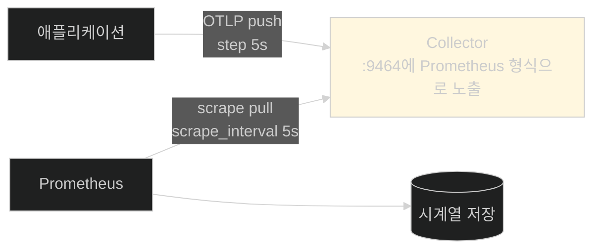
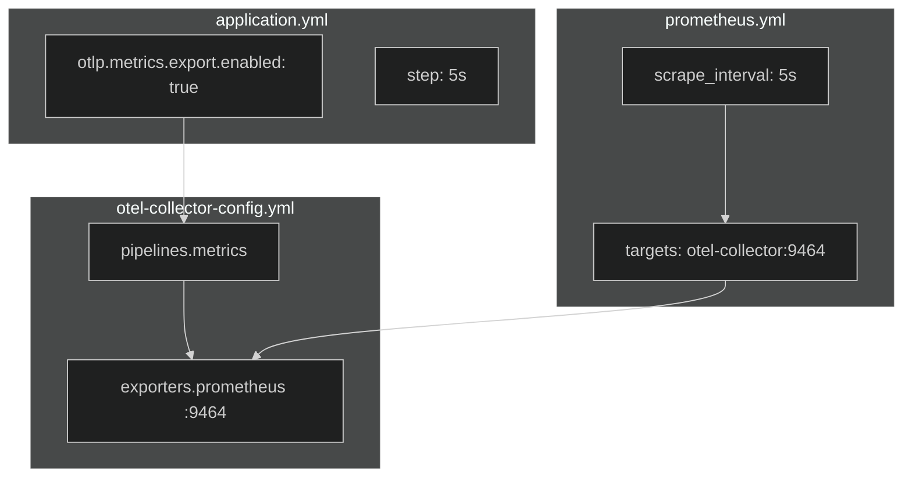

# push가 아니라 pull — Prometheus를 스택에 끼우기

## 한눈에 보기

| 고칠 파일 | 무엇을 더하나 |
|---|---|
| `docker-compose.yml` | prometheus 서비스(9090), `depends_on: otel-collector` |
| `prometheus.yml` (신규) | 5초마다 `otel-collector:9464`를 긁어 오도록 |
| `otel-collector-config.yml` | prometheus **익스포터**(9464) + metrics **파이프라인** |
| `grafana-datasources.yml` | Prometheus 데이터 소스 |
| `application.yml` | OTLP 메트릭 내보내기 **활성화** + metrics 엔드포인트 노출 |

| 질문 | 핵심 답 |
|---|---|
| 데이터가 흐르는 방향 | 앱 → Collector는 **push**, Collector → Prometheus는 **pull** |
| 왜 방향이 바뀌나 | Prometheus가 **스크레이프** 모델이기 때문 |
| 9464 포트는 | Collector가 Prometheus **형식으로** 메트릭을 노출하는 자리 |
| `step: 5s` | 앱이 Collector로 내보내는 주기 |
| `scrape_interval: 5s` | Prometheus가 Collector를 긁는 주기 |

## 1. 왜 이게 필요한가

### 출발 장면: 같은 파이프라인에 신호 하나를 더 얹는다

[[03a-setting-up-the-logging-infrastructure]]에서 세운 스택은 로그만 처리한다. 메트릭을 더하려면 무엇이 필요할까.

[[04-metrics-with-micrometer-prometheus-and-grafana]]에서 본 대로 **뼈대는 그대로**다. 바뀌는 것은 저장소(Loki → **[[Prometheus]]**)와, 그 저장소가 요구하는 데이터 흐름 방식이다.

그런데 여기서 예상 밖의 일이 생긴다. **Prometheus는 데이터를 받지 않는다. 가지러 온다.**

## 2. 어떻게 동작하는가

### 2.1 방향이 한 번 뒤집힌다

로그 파이프라인은 처음부터 끝까지 밀어내기(push)였다.

```text
앱 --push--> Collector --push--> Loki
```

메트릭은 다르다.

```text
앱 --push--> Collector <--pull-- Prometheus
```

**[[스크레이프]]**(= Prometheus가 대상의 메트릭 엔드포인트를 주기적으로 긁어 오는 동작)가 Prometheus의 기본 수집 모델이다. 대상이 보내는 게 아니라 Prometheus가 **가지러 간다.**



Collector가 **번역기 역할**을 한다. 왼쪽에서는 OTLP를 push로 받고, 오른쪽에서는 Prometheus 형식으로 노출해 pull당한다. 두 모델이 만나는 지점이 9464 포트다.

pull 모델을 쓰는 이유가 있다. 수집기가 **대상 목록을 알고 있으므로** 어떤 대상이 응답하지 않는지 곧바로 알 수 있고(대상이 죽었다는 사실 자체가 정보다), 수집 주기를 수집기 쪽에서 일괄 조절할 수 있다.

### 2.2 컨테이너와 스크레이프 설정

```yaml
prometheus:
 image: prom/prometheus:v3.1.0
 container_name: ch13-prometheus
 command: ["--config.file=/etc/prometheus/prometheus.yml"]
 volumes:
    - ./prometheus.yml:/etc/prometheus/prometheus.yml:ro
 ports:
    - "9090:9090"
 depends_on:
    - otel-collector
```

`depends_on: otel-collector`가 로그 때(`depends_on: loki`)와 방향이 같다 — **데이터 출처가 먼저 떠야 한다.** Prometheus에게 Collector는 스크레이프 대상이므로 출처다.

**[[볼륨-마운트]]**로 붙이는 `prometheus.yml`이 새 파일이다.

```yaml
global:
 scrape_interval: 5s

scrape_configs:
 - job_name: otel-collector
   static_configs:
       - targets: ["otel-collector:9464"]
```

| 항목 | 뜻 |
|---|---|
| `global` | 전역 기본값 |
| **[[scrape_interval]]**(= 대상을 얼마나 자주 긁을지) `5s` | 5초마다 |
| `scrape_configs` | 스크레이프 작업 목록 |
| `job_name: otel-collector` | 이 작업의 이름. **메트릭에 `job` 라벨로 붙는다** |
| `static_configs` | 대상을 정적 목록으로 준다(서비스 디스커버리 대신) |
| `targets: ["otel-collector:9464"]` | 컨테이너 이름 + 노출 포트 |

`job_name`이 그냥 이름이 아니라는 점이 [[04c-verifying-metrics-in-prometheus-and-grafana]]에서 드러난다. 질의 결과에 `job="otel-collector"` 라벨이 붙어 나온다.

`5s`는 로컬 예제용으로 짧게 잡은 값이다. 짧을수록 해상도가 높아지지만 저장량과 부하가 늘어난다.

### 2.3 Collector에 출구 하나 더

```yaml
exporters:
   prometheus:
     endpoint: 0.0.0.0:9464

service:
   pipelines:
     metrics:
       receivers: [otlp]
       processors: [resource, batch]
       exporters: [prometheus]
```

여기가 [[03a-setting-up-the-logging-infrastructure]]의 구조가 반복되는 자리다. **[[익스포터]]** 하나와 **[[파이프라인]]** 하나를 더한다.

| 요소 | 로그 때 | 메트릭 |
|---|---|---|
| receivers | `[otlp]` | `[otlp]` — **같다** |
| processors | `[resource, batch]` | `[resource, batch]` — **같다** |
| exporters | `[loki, debug]` | `[prometheus]` |
| 파이프라인 이름 | `logs` | `metrics` |

리시버와 프로세서를 **그대로 재사용**한다는 점이 중요하다. `resource` 프로세서가 붙이는 `service.name`·`deployment.environment`가 **메트릭에도 똑같이 붙는다.** 로그와 메트릭이 같은 메타데이터를 갖게 되고, 그것이 [[06-correlating-logs-metrics-and-traces]]에서 둘을 잇는 열쇠가 된다.

`prometheus` 익스포터만 성격이 다르다. Loki 익스포터는 목적지 URL로 **밀어 보내는데**, Prometheus 익스포터는 포트를 열고 **기다린다.** 이름은 익스포터지만 하는 일은 "노출"이다.

> **원문이 짚지 않는 것.** 9464 포트를 `docker-compose.yml`의 otel-collector 서비스에 노출하는 변경은 제시되지 않는다. Prometheus와 Collector가 같은 Docker 네트워크에 있어 동작하지만, 4317·4318과 달리 **호스트에서는 이 포트를 볼 수 없다.**

### 2.4 Grafana에 데이터 소스 추가

```yaml
apiVersion: 1
datasources:
      - name: Prometheus
        type: prometheus
        access: proxy
        url: http://prometheus:9090
        isDefault: true
        editable: true
```

[[03a-setting-up-the-logging-infrastructure]]의 Loki 설정과 구조가 같다. **[[데이터소스-프로비저닝]]**으로 기동 시 자동 등록된다.

책은 "Loki는 앞 절에서 정의했으므로 여기서는 생략했다"고 밝힌다. 실제 파일에는 둘이 나란히 들어간다.

`isDefault: true`가 Prometheus로 옮겨 간 점이 눈에 띈다. Loki도 `isDefault: true`였으므로 한쪽이 져야 하는데, [[06-correlating-logs-metrics-and-traces]]의 최종 설정에서는 Loki가 `isDefault: false`가 되고 Prometheus가 기본이 된다.

### 2.5 애플리케이션 쪽 스위치

```yaml
management:
   endpoints:
     web:
       exposure:
          include: health, info, metrics
   otlp:
     metrics:
       export:
          enabled: true
          url: http://localhost:4318/v1/metrics
          step: 5s
```

[[03b-instrumenting-the-application-for-logging]]에서 `enabled: false`로 **일부러 꺼 뒀던** 것을 이제 켠다.

| 설정 | 하는 일 |
|---|---|
| `exposure.include`에 `metrics` 추가 | **[[Actuator]]**의 `/actuator/metrics` 엔드포인트를 연다 |
| `otlp.metrics.export.enabled: true` | **[[OTLP]]** 메트릭 내보내기 켜기 |
| `otlp.metrics.export.url` | `/v1/metrics` — 로그의 `/v1/logs`와 경로만 다르다 |
| `step: 5s` | **5초마다** Collector로 내보낸다 |

`step`과 `scrape_interval`이 둘 다 5초인 것은 우연이 아니라 맞춘 것이다. 두 주기가 어긋나면 어떻게 될까.

| 상황 | 결과 |
|---|---|
| `step` < `scrape_interval` | Prometheus가 긁기 전에 값이 여러 번 갱신된다 — **중간값이 사라진다** |
| `step` > `scrape_interval` | Prometheus가 **같은 값을 여러 번** 긁는다 — 저장 낭비 |
| 같음 | 대체로 1:1 대응 |

`/actuator/metrics`를 여는 것과 OTLP 내보내기는 **별개**라는 점도 짚어 둘 만하다. 앞은 사람이나 도구가 직접 조회하는 엔드포인트이고, 뒤는 파이프라인으로 나가는 경로다. 이 예제의 Prometheus는 **Actuator가 아니라 Collector를** 긁는다.

## 3. 그림으로 보기



| 파일 | 로그 때 한 일 | 메트릭에서 더한 일 |
|---|---|---|
| `docker-compose.yml` | loki · otel-collector · grafana | **+ prometheus** |
| `otel-collector-config.yml` | logs 파이프라인 | **+ metrics 파이프라인** |
| `grafana-datasources.yml` | Loki | **+ Prometheus** |
| `application.yml` | 로그 OTLP 켜기 | **메트릭 OTLP 켜기** |
| (신규) | — | **`prometheus.yml`** |

## 4. 이 노트에 나온 용어

| 용어 | 한 줄 뜻 | 정의 위치 |
|---|---|---|
| Prometheus | 메트릭 시계열 저장·질의 시스템 | [[_glossary#Prometheus]] |
| 스크레이프 | 대상의 엔드포인트를 주기적으로 긁어 오는 동작 | [[_glossary#스크레이프]] |
| scrape_interval | 긁는 주기 설정 | [[_glossary#scrape_interval]] |
| 시계열 데이터베이스 | 시각-수치 쌍에 최적화된 저장소 | [[_glossary#시계열-데이터베이스]] |
| 익스포터 | Collector가 데이터를 내보내는 출구 | [[_glossary#익스포터]] |
| 파이프라인 | 리시버·프로세서·익스포터를 이은 경로 | [[_glossary#파이프라인]] |
| 데이터소스 프로비저닝 | 기동 시 데이터 소스 자동 등록 | [[_glossary#데이터소스-프로비저닝]] |
| OTLP | OpenTelemetry의 전송 프로토콜 | [[_glossary#OTLP]] |
| Actuator | 운영용 기능을 모은 Spring Boot 모듈 | [[_glossary#Actuator]] |
| 볼륨 마운트 | 호스트 파일을 컨테이너 경로에 연결 | [[_glossary#볼륨-마운트]] |

## 5. 자주 헷갈리는 것

**"Prometheus가 애플리케이션을 직접 긁는다"** — 이 구성에서는 **Collector를** 긁는다. 애플리케이션은 Collector로 push한다.

**"익스포터니까 어디론가 보낸다"** — Prometheus 익스포터는 **포트를 열고 기다린다.** 이름과 동작이 어긋나는 드문 경우다.

**"`step`과 `scrape_interval`은 아무 값이나 된다"** — 어긋나면 값이 사라지거나 중복 저장된다. 맞추는 것이 기본이다.

**"`/actuator/metrics`를 열어야 Prometheus가 볼 수 있다"** — 이 구성에서는 무관하다. Prometheus는 Collector의 9464를 본다.

**"9464도 호스트에서 열려 있다"** — `docker-compose.yml`에 노출 설정이 없어 컨테이너 네트워크 안에서만 보인다.

## 6. 언제 안 쓰나 / 경계

- **`5s`는 로컬용이다.** 운영에서 이렇게 짧으면 시계열 저장량과 부하가 크다. 보통 15–60초를 쓴다.
- **`static_configs`는 대상이 고정일 때만 쓴다.** 인스턴스가 늘고 주는 환경에서는 서비스 디스커버리가 필요하다.
- **pull 모델은 방화벽을 탄다.** Prometheus가 대상에 접근할 수 있어야 하므로, 네트워크 경계를 넘는 구성에서는 push gateway 같은 우회가 필요하다.
- **비유의 한계.** Collector의 두 얼굴은 "우편함이자 게시판"에 비유할 수 있다. 한쪽에서는 편지를 받고(push), 다른 쪽에서는 붙여 둔 것을 누가 와서 읽어 간다(pull). 다만 이 비유는 **게시판의 내용이 계속 갱신된다**는 점을 흐린다. 실제로 Prometheus가 긁어 가는 것은 "그 순간의 누적값"이고, 긁지 않은 사이의 변화 과정은 남지 않는다. 게시물이 쌓이는 게 아니라 하나가 계속 고쳐 쓰이는 쪽에 가깝다.

## 7. 연결

- [[03a-setting-up-the-logging-infrastructure]] — 같은 세 파일에 항목을 더하는 구조가 그대로 반복된다. `resource` 프로세서를 재사용한다.
- [[04-metrics-with-micrometer-prometheus-and-grafana]] — 그 노트의 5·6·7번 정거장을 이 노트가 세운다.
- [[04b-adding-custom-business-metrics-with-micrometer]] — 파이프라인이 준비됐으니 이제 무엇을 흘려보낼지 정한다.

## 8. 스스로 확인

1. 로그와 달리 메트릭 파이프라인에서 방향이 한 번 뒤집히는 지점은 어디인가?
2. pull 모델이 주는 이점 두 가지를 말할 수 있는가?
3. Collector가 "번역기"라는 것이 무슨 뜻인가?
4. `resource` 프로세서를 재사용하는 것이 나중에 무엇을 가능하게 하는가?
5. Prometheus 익스포터가 다른 익스포터와 동작이 다른 점은?
6. `step`과 `scrape_interval`이 어긋나면 각각 어떤 문제가 생기는가?
7. 이 구성에서 `/actuator/metrics`는 어떤 역할인가?
8. 우편함/게시판 비유가 깨지는 지점은 어디인가?


> 여덟 문항을 스스로 답한 **뒤에** [[_04a-setting-up-prometheus-for-metrics]]에서 모범답안과 대조한다. 먼저 열면 이 문항들은 다시 인출 문제로 쓸 수 없다.

<!-- ==== 아래는 내 영역 · 스킬 수정 금지 ==== -->

## 내 설명 시도


## 막혔던 지점


## 리뷰 이력
