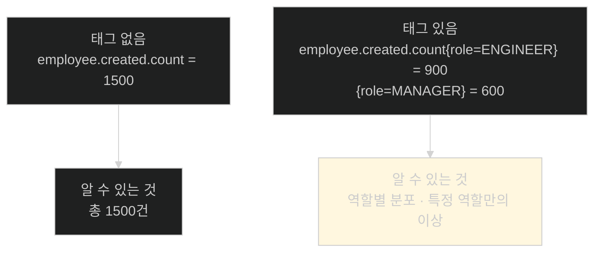
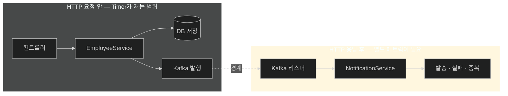
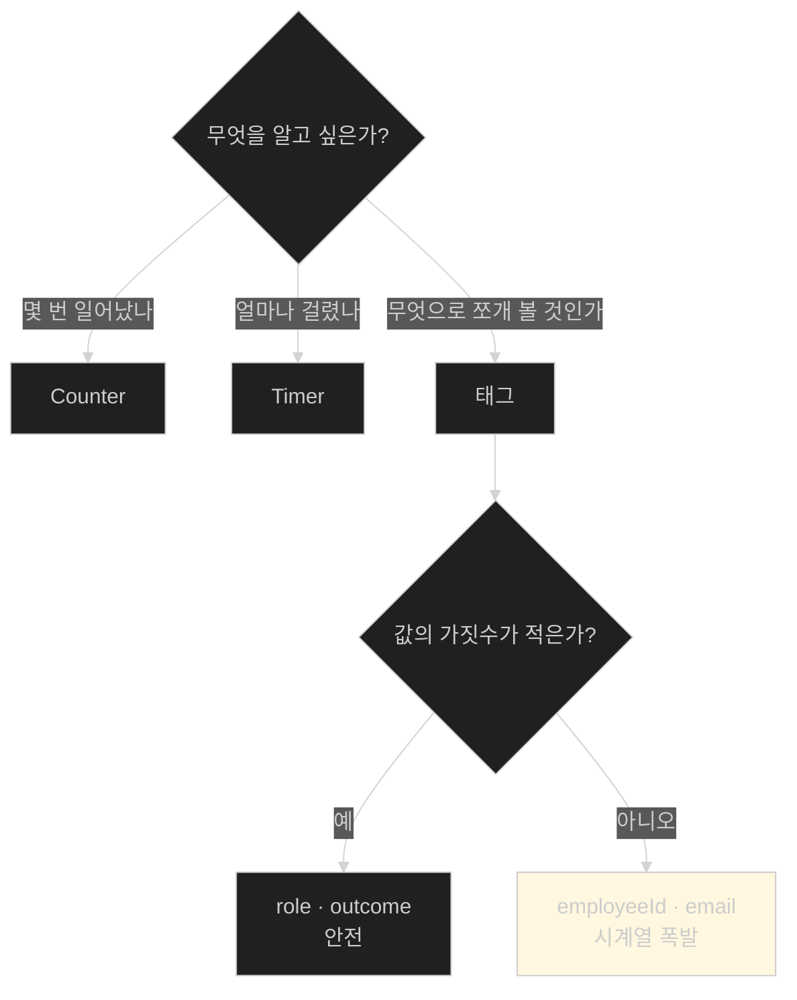

# CPU가 멀쩡한데 장사가 안 될 때 — 비즈니스 메트릭

## 한눈에 보기

| 질문 | 핵심 답 |
|---|---|
| 인프라 메트릭의 한계 | CPU·메모리·요청률이 정상인데 **비즈니스가 망가질 수 있다** |
| 답할 세 질문 | 직원이 몇 명 생성됐나 · 생성에 얼마나 걸리나 · 알림이 몇 건 수신·발송·실패·중복됐나 |
| 도구 | `MeterRegistry`를 주입받아 `Timer`와 `Counter`를 만든다 |
| `Timer` | 얼마나 걸렸나 — `employee.create.time` |
| `Counter` | 몇 번인가 — `employee.created.count`, `employee.notification.count` |
| 태그 | `role`, `outcome` — **질의 가능한 차원**이 된다 |
| 왜 비동기 쪽에도 | 워크플로가 HTTP 응답 뒤에도 이어진다 |
| 원문 오류 | `NotificationService`에 `System.out.println`이 남아 있고, 설명이 언급한 두 호출이 코드에 없다 |

## 1. 왜 이게 필요한가

### 출발 장면: 대시보드가 전부 초록인데 아무도 알림을 못 받는다

[[04a-setting-up-prometheus-for-metrics]]로 메트릭 파이프라인이 섰다. Spring Boot Actuator와 Micrometer가 자동으로 만들어 주는 것만 봐도 꽤 많다.

```text
jvm.memory.used     http.server.requests     process.cpu.usage
system.cpu.usage    jvm.gc.pause             tomcat.threads.busy
```

**[[인프라-메트릭]]**(= 시스템 자원과 기술 계층을 재는 메트릭)이다. 유용하지만 이 상황을 잡아내지 못한다.

> `POST /employees`가 200을 잘 반환한다. CPU 20%, 메모리 여유, 응답 시간 40ms. **그런데 알림이 한 건도 발송되지 않고 있다.**

이유는 알림이 **HTTP 응답 뒤에** 비동기로 처리되기 때문이다. Kafka 컨슈머가 계속 실패해도 HTTP 지표는 완벽하다.

| 무엇이 망가졌나 | 인프라 메트릭에 나타나나 |
|---|---|
| 알림 발송 실패율 90% | **아니오** |
| 중복 이벤트가 절반 | **아니오** |
| 특정 role의 생성만 느림 | 아니오 (평균에 묻힌다) |
| 직원 생성이 0건 | 아니오 (요청이 없으면 정상으로 보인다) |

책의 표현대로 인프라 메트릭도 가치가 있지만, **"생성된 직원 수, 생성 실패, 발송된 알림, 처리된 DLT 이벤트 같은 [[비즈니스-메트릭]](= 도메인 사건을 재는 메트릭)이 관측 가능성을 훨씬 더 유용하게 만든다."**

## 2. 어떻게 동작하는가

### 2.1 무엇을 잴 것인가

책은 세 질문으로 시작한다. **재는 것을 정하기 전에 알고 싶은 것을 먼저 적는다.**

| 질문 | 필요한 메트릭 종류 |
|---|---|
| 직원이 몇 명 생성됐나 | **[[Counter]]**(= 단조 증가만 하는 누적 수치) |
| 직원 생성에 얼마나 걸리나 | **[[Timer]]**(= 작업 소요 시간을 기록하는 메트릭) |
| 알림이 몇 건 수신·발송·실패·중복됐나 | Counter + **태그로 구분** |

### 2.2 동기 구간 — `EmployeeService`

```java
@Service
public class EmployeeService {

    private final MeterRegistry meterRegistry;

    public EmployeeService(..., MeterRegistry meterRegistry) { ... }

    public Employee createEmployee(Employee employee) {

        String role = roleForMetrics(employee);
        return Timer
               .builder("employee.create.time")
               .description("Time taken to create an employee")
               .tag("role", role)
               .register(meterRegistry)
               .record(() -> createEmployeeAndPublishEvent(employee, role));
    }

    private Employee createEmployeeAndPublishEvent(Employee employee,
        String role) {
        Employee saved = employeeRepository.save(employee);
           meterRegistry.counter("employee.created.count",
              "role", role).increment();
           kafkaTemplate.send(...);
        return saved;
    }
}
```

| 요소 | 하는 일 | 없으면 |
|---|---|---|
| **[[MeterRegistry]]**(= 메트릭을 만들고 등록·보관하는 중심 객체) 주입 | 커스텀 메트릭을 만들 창구 | 메트릭을 등록할 곳이 없다 |
| `Timer.builder("employee.create.time")` | 소요 시간 메트릭 선언 | — |
| `.description(...)` | 사람이 읽을 설명 | 메트릭 목록에서 뜻을 모른다 |
| `.tag("role", role)` | **[[메트릭-태그]]**(= 메트릭에 붙이는 key-value 라벨) | role별 비교가 불가능하다 |
| `.register(meterRegistry)` | 레지스트리에 등록 | 파이프라인으로 나가지 않는다 |
| `.record(() -> ...)` | **람다 실행 시간을 잰다** | 시간이 기록되지 않는다 |
| `counter(...).increment()` | 생성 건수 누적 | 처리량을 알 수 없다 |
| `roleForMetrics(...)` | 값이 없으면 `UNKNOWN` | 태그 값이 `null`이 될 수 있다 |

`.record(() -> ...)`가 이 코드의 구조를 정한다. **재려는 작업을 람다로 감싼다.** 시작·종료 시각을 손으로 찍는 대신 감싸면, 예외가 나도 시간이 기록되고 `finally`를 잊을 여지가 없다.

`roleForMetrics`가 `UNKNOWN` 기본값을 주는 이유도 실무적이다. 태그 값이 `null`이면 메트릭 등록이 실패하거나 이상한 라벨이 생긴다. **항상 유효한 값을 보장**하는 것이다.

### 2.3 태그가 하는 일

`.tag("role", role)` 한 줄이 만드는 차이가 크다.



책의 표현대로 태그를 붙이면 **"타이머와 카운터 양쪽을 역할별로 분석할 수 있어, 직원 유형에 따른 활동량이나 지연 시간을 비교**"할 수 있다.

Prometheus에서는 이 태그가 **질의 가능한 차원**이 된다. `sum by (role) (employee_created_count_total)` 같은 질의가 성립하는 근거다([[04c-verifying-metrics-in-prometheus-and-grafana]]).

다만 대가가 있다. **태그 값 조합마다 별개의 시계열이 생긴다.** `role`처럼 값이 몇 개뿐이면 괜찮지만, 직원 ID를 태그로 넣으면 시계열이 직원 수만큼 생긴다. 이 위험이 **[[고-카디널리티]]**(= 값의 가짓수가 거의 무한한 속성) 문제이고, [[05b-enabling-trace-export-and-kafka-propagation]]에서 책이 Note로 정면으로 다룬다.

### 2.4 비동기 구간 — 왜 따로 재야 하나

책이 짚는 전환이 이 절의 핵심 통찰이다.

> 직원 생성 워크플로는 `EmployeeService`가 저장하는 것으로 **끝나지 않는다.** 저장 후 Kafka에 이벤트를 발행하고, 알림 흐름이 비동기로 이어진다. 즉 **비즈니스 프로세스의 일부가 원래 HTTP 요청 밖에서 일어나고, 그 부분에는 자기만의 메트릭이 필요하다.**



`employee.create.time`은 **점선 왼쪽까지만** 잰다. 오른쪽에서 무슨 일이 벌어져도 이 타이머는 정상으로 보인다. 앞서 든 "대시보드는 초록인데 알림이 안 간다"가 정확히 이 구조에서 나온다.

### 2.5 `NotificationService`

```java
@Service
public class NotificationService {

   private static final Logger log =
           LoggerFactory.getLogger(NotificationService.class);

   private final MeterRegistry meterRegistry;
   private final Set<Long> processedEvents =
           ConcurrentHashMap.newKeySet();

   public NotificationService(MeterRegistry meterRegistry) {
        this.meterRegistry = meterRegistry;
    }

   @KafkaListener(topics = "employee-events",
        groupId = "notification-group")
   public void handleEmployeeCreated(EmployeeCreatedEvent event) {
        if (processedEvents.contains(event.employeeId())) {
               System.out.println("Skipping duplicate event. Employee ID: " +
                   event.employeeId());
               return;
           }
           sendNotification(event);
           processedEvents.add(event.employeeId());
    }

   private void sendNotification(EmployeeCreatedEvent event) {
        if (Math.random() < 0.5) {
               recordNotificationMetric("failed");
               log.warn("Simulating temporary notification failure for employee {}",
                   event.employeeId());
               throw new IllegalStateException("Temporary network failure");
       }
       if (event.email() == null || event.email().isBlank()) {
                      recordNotificationMetric("failed");
                      log.warn("Cannot send notification for employee {} because email is missing",
                          event.employeeId());
                      throw new IllegalStateException("Employee email is missing");
       }
       recordNotificationMetric("sent");
       log.info("Sending notification to {}", event.email());
  }

  private void recordNotificationMetric(String outcome) {
       meterRegistry.counter("employee.notification.count", "outcome",
                      outcome).increment();
  }
}
```

핵심은 `recordNotificationMetric(String outcome)` 하나다. **메트릭 이름은 하나이고 태그 값으로 결과를 구분한다.**

| `outcome` 값 | 언제 |
|---|---|
| `received` | 이벤트를 Kafka에서 받았을 때 |
| `duplicate` | 중복 이벤트를 걸렀을 때 |
| `failed` | 발송에 실패했을 때 |
| `sent` | 발송에 성공했을 때 |

메트릭을 넷으로 나누지 않고 태그 하나로 묶은 것이 설계 판단이다. 이렇게 하면 Prometheus에서 `sum by (outcome) (...)` 한 줄로 전체 분포를 볼 수 있고, 새 결과 유형이 생겨도 메트릭을 추가하지 않아도 된다.

`Math.random() < 0.5`로 절반을 일부러 실패시키는 것은 Chapter 12에서 재시도·DLT를 실험하려고 넣은 장치다. 여기서는 **실패 메트릭이 실제로 오르는 것을 보기 위한** 용도가 된다.

> **원문 오류 두 가지.** (1) 중복 이벤트 분기에 **`System.out.println`이 그대로 남아 있다.** [[03b-instrumenting-the-application-for-logging]]의 Note는 모든 `System.out`을 **[[SLF4J]]**로 바꿨다고 말한다. 이 줄은 Logback을 거치지 않으므로 Loki에 도달하지 않는다. (2) 항목 설명은 `recordNotificationMetric("received")`와 `("duplicate")`를 호출한다고 하지만 **인쇄된 코드에는 그 두 호출이 없다.** 그런데 [[04c-verifying-metrics-in-prometheus-and-grafana]]의 대시보드에는 `received 23`, `duplicate 8`이 찍혀 있으므로, 실제 저장소 코드에는 있고 지면에서 빠진 것으로 보인다.

## 3. 그림으로 보기

| 메트릭 | 종류 | 태그 | 답하는 질문 |
|---|---|---|---|
| `employee.create.time` | Timer | `role` | 생성이 얼마나 걸리나, 역할별로 다른가 |
| `employee.created.count` | Counter | `role` | 몇 명이 생성됐나, 역할 분포는 |
| `employee.notification.count` | Counter | `outcome` | 알림이 수신·발송·실패·중복 각각 몇 건인가 |



## 4. 이 노트에 나온 용어

| 용어 | 한 줄 뜻 | 정의 위치 |
|---|---|---|
| 비즈니스 메트릭 | 도메인 사건을 재는 메트릭 | [[_glossary#비즈니스-메트릭]] |
| 인프라 메트릭 | 자원·기술 계층을 재는 메트릭 | [[_glossary#인프라-메트릭]] |
| MeterRegistry | 메트릭을 만들고 등록·보관하는 객체 | [[_glossary#MeterRegistry]] |
| Timer | 작업 소요 시간을 기록하는 메트릭 | [[_glossary#Timer]] |
| Counter | 단조 증가하는 누적 수치 | [[_glossary#Counter]] |
| 메트릭 태그 | 메트릭에 붙는 key-value 라벨 | [[_glossary#메트릭-태그]] |
| Micrometer | 벤더 중립 계측 파사드 | [[_glossary#Micrometer]] |
| 고 카디널리티 | 값의 가짓수가 거의 무한한 속성 | [[_glossary#고-카디널리티]] |
| SLF4J | 로깅 구현체를 감추는 자바 파사드 | [[_glossary#SLF4J]] |

## 5. 자주 헷갈리는 것

**"인프라 메트릭이 정상이면 서비스가 정상이다"** — 이 장의 예제가 반례다. HTTP는 완벽한데 비동기 알림이 전멸할 수 있다.

**"Counter는 감소도 한다"** — 하지 않는다. 단조 증가만 하며, "현재 값"을 표현하려면 Gauge를 쓴다.

**"결과 종류마다 메트릭을 따로 만드는 게 명확하다"** — 태그 하나로 묶는 편이 질의가 쉽고 확장에 유리하다.

**"태그는 많을수록 분석이 잘 된다"** — 조합마다 시계열이 생긴다. 값의 가짓수가 적은 것만 태그로 쓴다.

**"`.record(...)`는 편의 문법이다"** — 예외 상황에서도 시간이 기록되게 보장한다. 손으로 시각을 찍는 것과 동등하지 않다.

## 6. 언제 안 쓰나 / 경계

- **`processedEvents`가 무한히 자란다.** `ConcurrentHashMap.newKeySet()`에 계속 담기기만 하고 비우지 않으므로 장기 실행 시 메모리 누수다. 예제 단순화의 결과다.
- **중복 판정이 인스턴스 로컬이다.** 컨슈머를 두 대로 늘리면 각자 다른 집합을 갖게 되어 중복 제거가 깨진다.
- **비즈니스 메트릭에도 카디널리티 상한이 있다.** `role`이 수백 종이 되면 태그로 부적합해진다.
- **비유의 한계.** 인프라 메트릭과 비즈니스 메트릭의 관계는 "차량 계기판과 매출 장부"에 가깝다. 엔진은 정상인데 배달이 안 되고 있을 수 있다. 다만 이 비유는 **둘이 같은 계측기에서 나온다**는 점을 담지 못한다. 여기서는 `MeterRegistry` 하나가 JVM 메모리도, 생성된 직원 수도 함께 다루고, 같은 파이프라인으로 나가 같은 대시보드에 놓인다. 장부와 계기판이 한 화면에 있는 셈이다.

- **이 `Timer`로는 p99가 나오지 않는다.** 이 장이 동기로 내세운 장면은 [[01-three-pillars-of-observability]]의 *"메트릭이 p99가 어제보다 3배라고 알린다"*였는데, **위 코드가 만드는 것은 평균이다.** Micrometer 문서의 규정이 그 이유다 — *"모든 `Timer` 구현은 **최소한 총 시간과 이벤트 수**를 별도 시계열로 보고하며, 다른 시계열(max·백분위수·히스토그램)은 백엔드가 지원하는 바에 따라 보고될 수 있다."* 기본 `Timer`는 `_sum`과 `_count`를 낼 뿐이고, [[04c-verifying-metrics-in-prometheus-and-grafana]]가 가르치는 `rate(…_sum[1m]) / rate(…_count[1m])`도 그래서 **평균 지연**이다.

  **평균은 p99가 드러내는 것을 정확히 가린다.** 요청 100건 중 99건이 10ms이고 1건이 3초여도 평균은 40ms에 머문다. "느린 소수"를 찾으려고 관측을 붙였는데 평균만 보면 그 소수가 평균에 녹아 사라진다.

  백분위수를 실제로 얻으려면 빌더에 설정을 더해야 하고, **두 방식의 차이가 중요하다.**

  | 방식 | 무엇이 나가나 | 인스턴스 여럿일 때 |
  |---|---|---|
  | `.publishPercentiles(0.95, 0.99)` | 애플리케이션이 **계산해 둔 값** | **합산할 수 없다.** 인스턴스별 p99를 평균 내는 것은 의미 없는 수다 |
  | `.publishPercentileHistogram()` | **히스토그램 버킷** | **합산된다.** Prometheus에서 `histogram_quantile()`로 전체 p99를 구한다 |

  Micrometer 문서가 이 구조를 설명한다 — 히스토그램 버킷은 *"보통 카운터처럼 동작하므로 백엔드에 따라 누적값으로 보고될 수 있다"*(Prometheus가 그 경우다). 반면 클라이언트 측 백분위수는 각 인스턴스가 자기 HDR 히스토그램으로 계산한 결과값이다.

  **인스턴스가 하나면 둘 다 되지만, 늘리는 순간 앞의 것은 못 쓰게 된다.** 스케일 아웃은 흔한 조치이므로 처음부터 `publishPercentileHistogram()`을 쓰는 편이 안전하다. 다만 버킷마다 시계열이 생겨 **카디널리티가 늘어난다** — 이 노트가 §6에서 경계하는 태그 카디널리티와 같은 축의 비용이다.

## 7. 연결

- [[04a-setting-up-prometheus-for-metrics]] — 그 노트가 세운 파이프라인에 이 노트가 실제 데이터를 흘려보낸다.
- [[04c-verifying-metrics-in-prometheus-and-grafana]] — 여기서 만든 `role`·`outcome` 태그가 Prometheus 라벨과 대시보드 패널로 나타난다.
- [[05b-enabling-trace-export-and-kafka-propagation]] — 여기서 만든 `Timer`를 관측으로 한 겹 더 감싸 트레이스에도 나타나게 한다. 카디널리티 주제도 그 노트에서 정면으로 다룬다.

## 8. 스스로 확인

1. 인프라 메트릭만으로는 잡을 수 없는 장애를 이 애플리케이션에서 하나 구성할 수 있는가?
2. "재는 것을 정하기 전에 알고 싶은 것을 적는다"는 순서가 왜 중요한가?
3. `.record(() -> ...)`로 감싸는 방식이 손으로 시각을 찍는 것보다 나은 이유는?
4. `roleForMetrics`가 `UNKNOWN`을 돌려주는 이유는?
5. 태그가 만드는 이득과 대가를 각각 말할 수 있는가?
6. 알림 결과를 메트릭 4개가 아니라 태그 하나로 묶은 판단의 근거는?
7. `employee.create.time`이 재지 **못하는** 구간은 어디이며 왜인가?
8. 계기판/장부 비유가 깨지는 지점은 어디인가?


> 여덟 문항을 스스로 답한 **뒤에** [[_04b-adding-custom-business-metrics-with-micrometer]]에서 모범답안과 대조한다. 먼저 열면 이 문항들은 다시 인출 문제로 쓸 수 없다.

<!-- ==== 아래는 내 영역 · 스킬 수정 금지 ==== -->

## 내 설명 시도


## 막혔던 지점


## 리뷰 이력
