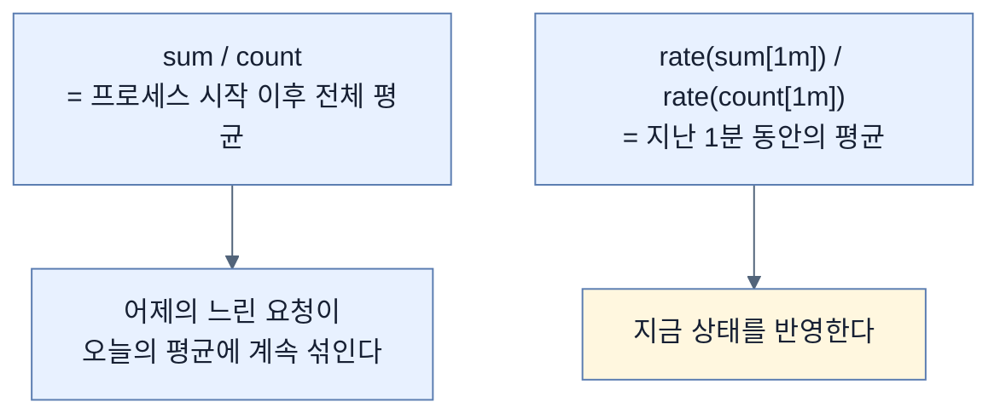
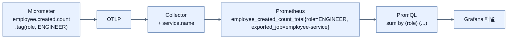

# 태그가 라벨이 되는 순간 — Prometheus 질의와 대시보드

## 한눈에 보기

| 단계 | 동작 |
|---|---|
| 1 | `docker compose down && docker compose up -d` — **완전 재시작** |
| 2 | `./mvnw spring-boot:run` |
| 3 | `curl POST /employees`를 **여러 번** — 데이터가 쌓여야 추세가 보인다 |
| 4 | `localhost:9090`에서 PromQL 질의 |
| 5 | `localhost:3000` → Dashboards → New → Import → JSON 업로드 |

| 질문 | 핵심 답 |
|---|---|
| 자바 이름이 어떻게 바뀌나 | `employee.created.count` → **`employee_created_count_total`** |
| `.tag("role", role)`은 | Prometheus **라벨** `role="ENGINEER"`가 된다 |
| 평균 지연을 어떻게 구하나 | `rate(…_sum[1m]) / rate(…_count[1m])` |
| 왜 `down && up`인가 | 이전 실행의 시계열·설정 잔재를 지우기 위해 |

## 1. 왜 이게 필요한가

### 출발 장면: 코드에 적은 이름이 그대로 나오지 않는다

[[04b-adding-custom-business-metrics-with-micrometer]]에서 `employee.created.count`라는 카운터를 만들었다. Prometheus에서 그 이름으로 검색하면 — **나오지 않는다.**

이유는 **이름 규칙이 다르기 때문**이다. Micrometer는 점으로 계층을 표현하고 Prometheus는 밑줄을 쓴다. 게다가 카운터에는 접미사가 붙는다.

```text
Micrometer:  employee.created.count
Prometheus:  employee_created_count_total
```

이 변환을 모르면 "메트릭이 안 나온다"고 오해한다. 이 절은 **코드에 적은 것이 저쪽에서 어떤 모양이 되는지** 확인하는 절차다.

## 2. 어떻게 동작하는가

### 2.1 데이터를 만든다

```bash
% docker compose down && docker compose up -d
% ./mvnw spring-boot:run
```

`down`을 먼저 하는 이유가 있다. [[04a-setting-up-prometheus-for-metrics]]에서 `docker-compose.yml`과 Collector 설정을 **고쳤기** 때문이다. 기존 컨테이너를 그대로 두면 옛 설정으로 돌고 있는 프로세스가 남는다.

```bash
% curl -X POST http://localhost:8080/employees \
       -H 'Content-Type: application/json' \
       -d '{"name":"Alexander X","email":"alexander@example.com","role":"ENGINEER"}'
```

책은 이 명령을 **여러 번** 실행하라고 한다. 메트릭은 [[04-metrics-with-micrometer-prometheus-and-grafana]]에서 본 대로 **추세**를 보는 신호다. 한 건으로는 그래프가 그려지지 않는다.

### 2.2 이름과 라벨

`localhost:9090`에서 `employee_created_count_total`을 질의하면 이렇게 나온다.

![[_assets/lsb4-p376-fig13-6-custom-business-metric-in-prometheus.png]]

```text
employee_created_count_total{exported_job="employee-service", instance="otel-collector:9464", job="otel-collector", role="ENGINEER"}   15
```

한 줄에 이 절의 결론이 다 들어 있다.

| 부분 | 어디서 왔나 |
|---|---|
| `employee_created_count_total` | 코드의 `employee.created.count` + Prometheus 이름 규칙 |
| **`role="ENGINEER"`** | **`.tag("role", role)`** — [[04b-adding-custom-business-metrics-with-micrometer]] |
| `exported_job="employee-service"` | `resource` 프로세서의 `service.name` |
| `job="otel-collector"` | `prometheus.yml`의 `job_name` |
| `instance="otel-collector:9464"` | 스크레이프 대상 주소 |
| `15` | 지금까지 15명 생성 |

**[[메트릭-태그]]**가 Prometheus **라벨**이 된 것이 핵심이다. 책의 표현대로 `role="ENGINEER"` 라벨은 **"메트릭 태그가 질의 가능한 차원이 되어, 전역 합계로만 세는 대신 비즈니스 속성으로 필터·분석할 수 있음"**을 보여 준다.

`exported_job`이라는 이름도 눈여겨볼 만하다. `job`은 이미 **[[스크레이프]]** 작업 이름(`otel-collector`)이 차지했으므로, 애플리케이션이 붙인 서비스 이름은 `exported_` 접두사가 붙어 밀려났다. 이 이름이 [[06-correlating-logs-metrics-and-traces]]의 `tracesToMetrics` 설정에 `value: exported_job`으로 그대로 등장한다.

### 2.3 다섯 가지 질의

책이 주는 **[[PromQL]]**(= Prometheus의 질의 언어) 예제들이 각각 다른 종류의 질문에 답한다.

| 질의 | 답하는 것 | 문법 요소 |
|---|---|---|
| `employee_created_count_total` | 총 생성 건수 | 원시 조회 |
| `sum by (role) (employee_created_count_total)` | 역할별 합계 | **라벨로 그룹핑** |
| `employee_notification_count_total` | 총 알림 이벤트 | 원시 조회 |
| `sum by (outcome) (employee_notification_count_total)` | 결과별 합계 | 라벨로 그룹핑 |
| `rate(employee_create_time_milliseconds_sum[1m]) / rate(employee_create_time_milliseconds_count[1m])` | **지난 1분 평균 생성 시간** | 아래 참고 |

마지막 질의가 **[[Timer]]**의 구조를 드러낸다. Timer 하나가 Prometheus에서는 **시계열 두 개**가 된다.

| 시계열 | 담는 것 |
|---|---|
| `..._sum` | 모든 실행의 **소요 시간 합계** |
| `..._count` | **실행 횟수** |

평균은 이 둘의 나눗셈이다. 그런데 왜 그냥 `sum / count`가 아니라 **[[rate]]**(= 시계열의 초당 증가율을 계산하는 함수)를 씌울까.



**[[Counter]]** 계열 시계열은 프로세스가 시작한 뒤로 계속 누적되기만 한다. 그대로 나누면 **전 기간 평균**이 나오고, 최근의 변화가 묻힌다. `rate`로 "지난 1분간 얼마나 늘었는가"를 구한 뒤 나누면 그 구간의 평균이 된다.

`_milliseconds`가 이름에 들어간 것도 확인할 수 있다. Micrometer가 단위를 이름에 넣어 내보내기 때문이다.

### 2.4 대시보드로 묶기

질의를 하나씩 던지는 것으로는 부족하다. **[[대시보드]]**(= 여러 질의 결과를 패널로 배치해 한 화면에서 보게 만든 것)가 필요하다. 책의 표현대로 **"대시보드는 추세를 관찰하고 신호를 비교하고 비정상 동작을 한눈에 식별하기 쉽게 만든다."**

Grafana에서 `grafana-dashboard-metrics.json`을 Import하면 이 화면이 나온다.

![[_assets/lsb4-p377-fig13-7-grafana-business-metrics-dashboard.png]]

| 패널 | 어느 메트릭에서 | 무엇을 보여 주나 |
|---|---|---|
| Employees Created | `employee_created_count_total` | 누적 15 |
| Employees by Role | 같은 것 + `role` 그룹핑 | 역할 분포 |
| Employee Creation Rate by Role | `rate(...)` | 시간에 따른 생성 속도 |
| Average Employee Creation Time | `rate(_sum)/rate(_count)` | 평균 지연 |
| Notification Failure Rate | `employee_notification_count_total` | 실패 비율 |
| Notification Outcomes | 같은 것 + `outcome` 그룹핑 | **duplicate 8 · failed 8 · received 23 · sent 7** |
| Notification Rate by Outcome | `rate(...)` + `outcome` | 결과별 추세 |

`Notification Outcomes` 패널이 [[04b-adding-custom-business-metrics-with-micrometer]]의 `outcome` 태그 네 값과 **1:1로 대응**한다. 코드에 적은 문자열이 대시보드 항목 이름이 됐다.

이 화면이 이 절의 목적을 완성한다 — **동기 구간(생성)과 비동기 구간(알림)의 상태가 한 화면에 있다.** [[04b-adding-custom-business-metrics-with-micrometer]]에서 "비동기 부분에는 자기 메트릭이 필요하다"고 한 이유가 여기서 시각적으로 확인된다.

> **주의할 점.** `Notification Failure Rate`가 **0%**인데 `Notification Outcomes`에는 `failed 8`이 있다. 모순이 아니라 **재는 것이 다르다.** 앞은 `rate` 기반이라 "지금 이 순간의 실패 속도"이고(마지막 요청 이후 시간이 지나 0이 됐다), 뒤는 누적 카운트다. 책은 이 차이를 설명하지 않지만, 대시보드를 읽을 때 **순간값과 누적값을 구분해야 한다**는 교훈이 여기 있다.

책은 Note로 대시보드 JSON 구조 설명은 범위 밖이라고 밝히고 Grafana 문서를 가리킨다.

## 3. 그림으로 보기



| 코드에 적은 것 | Prometheus에서 |
|---|---|
| `employee.created.count` | `employee_created_count_total` |
| `employee.create.time` | `employee_create_time_milliseconds_sum` + `..._count` |
| `.tag("role", role)` | 라벨 `role="ENGINEER"` |
| `.tag("outcome", outcome)` | 라벨 `outcome="sent"` |
| `service.name` (리소스 속성) | 라벨 `exported_job` |

## 4. 이 노트에 나온 용어

| 용어 | 한 줄 뜻 | 정의 위치 |
|---|---|---|
| PromQL | Prometheus의 질의 언어 | [[_glossary#PromQL]] |
| 메트릭 태그 | 메트릭에 붙는 key-value 라벨 | [[_glossary#메트릭-태그]] |
| Prometheus | 메트릭 시계열 저장·질의 시스템 | [[_glossary#Prometheus]] |
| rate | 초당 증가율을 계산하는 PromQL 함수 | [[_glossary#rate]] |
| 대시보드 | 여러 질의를 패널로 배치한 화면 | [[_glossary#대시보드]] |
| Timer | 작업 소요 시간을 기록하는 메트릭 | [[_glossary#Timer]] |
| Counter | 단조 증가하는 누적 수치 | [[_glossary#Counter]] |
| Grafana | 통합 탐색·시각화 도구 | [[_glossary#Grafana]] |
| 스크레이프 | 대상 엔드포인트를 주기적으로 긁는 동작 | [[_glossary#스크레이프]] |

## 5. 자주 헷갈리는 것

**"코드에 적은 이름으로 검색하면 된다"** — 점이 밑줄이 되고 카운터에는 `_total`이, 타이머에는 `_sum`/`_count`와 단위가 붙는다.

**"Timer 하나가 시계열 하나다"** — **둘**이다. 합계와 횟수가 따로 저장되고, 평균은 계산해서 얻는다.

**"평균은 `sum / count`면 된다"** — 그러면 **프로세스 시작 이후 전 기간 평균**이다. 최근 상태를 보려면 `rate`를 씌운다.

**"`job` 라벨이 서비스 이름이다"** — 이 구성에서 `job`은 **스크레이프 작업 이름**(`otel-collector`)이고, 서비스 이름은 `exported_job`으로 밀려나 있다.

**"실패율 0%면 실패가 없다"** — 순간 rate가 0일 뿐 누적 실패는 8건이다. **순간값과 누적값을 구분해야 한다.**

## 6. 언제 안 쓰나 / 경계

- **대시보드는 이미 아는 질문만 답한다.** 예상 못 한 문제에는 Explore로 즉석 질의를 던지는 편이 낫다.
- **`rate`의 구간이 짧으면 노이즈가 크고, 길면 변화를 늦게 본다.** `[1m]`은 로컬 예제용이다.
- **메트릭으로는 "그 요청"을 찾을 수 없다.** 실패율이 올랐다는 것까지가 한계이고, 어느 요청이었는지는 [[05-tracing-with-opentelemetry-and-tempo]]의 몫이다.
- **비유의 한계.** 메트릭 이름 변환은 "여권의 로마자 표기"에 가깝다. 원래 이름과 대응하지만 규칙에 따라 모양이 바뀌고, 그 규칙을 모르면 같은 사람인 줄 모른다. 다만 이 비유는 **이름이 하나에서 둘로 늘어난다**는 점을 담지 못한다. Timer는 저쪽에서 `_sum`과 `_count` 두 항목이 되므로, 대응이 1:1이 아니라 1:다이며 원래 값을 되찾으려면 계산이 필요하다.

## 7. 연결

- [[04b-adding-custom-business-metrics-with-micrometer]] — 그 노트의 `.tag("role", role)`이 이 화면의 `role="ENGINEER"` 라벨이 된다.
- [[04a-setting-up-prometheus-for-metrics]] — `job` 라벨의 값이 그 노트의 `job_name` 설정에서 온다.
- [[05-tracing-with-opentelemetry-and-tempo]] — 메트릭이 답하지 못하는 "어느 요청이, 어느 구간에서"로 넘어간다.

## 8. 스스로 확인

1. `employee.created.count`가 Prometheus에서 어떤 이름이 되며, 왜 그런가?
2. 질의 결과 한 줄의 라벨 다섯 개가 각각 어디서 왔는지 말할 수 있는가?
3. `exported_job`이라는 이름이 생긴 이유는?
4. Timer가 시계열 두 개인 이유와, 그것으로 평균을 구하는 방법은?
5. `rate`를 씌우는 것과 안 씌우는 것의 차이를 시간 관점에서 설명할 수 있는가?
6. `Notification Outcomes`의 네 항목이 코드의 무엇과 대응하는가?
7. 실패율 0%와 failed 8이 동시에 참일 수 있는 이유는?
8. 여권 표기 비유가 깨지는 지점은 어디인가?

<!-- ==== 아래는 내 영역 · 스킬 수정 금지 ==== -->

## 내 설명 시도


## 막혔던 지점


## 리뷰 이력
