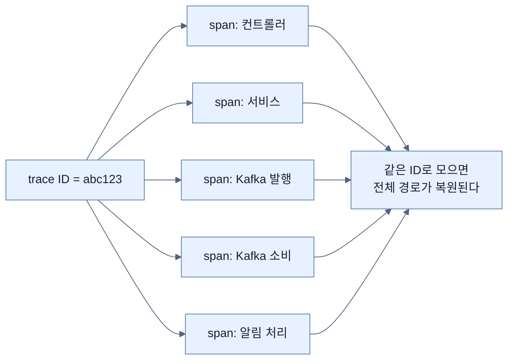
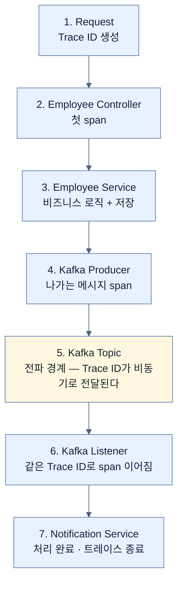
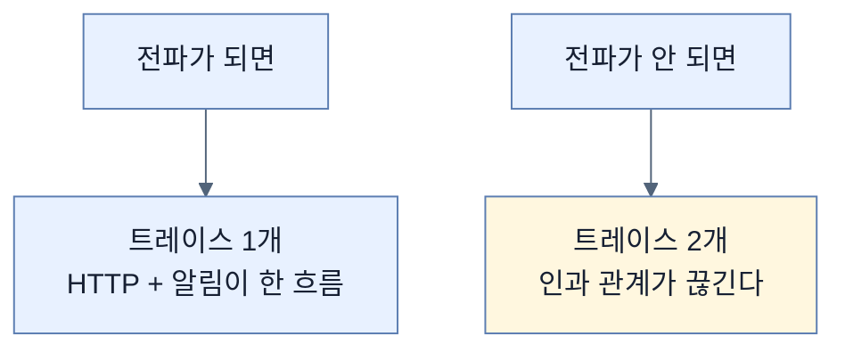

# 요청 하나를 끝까지 따라가기 — trace ID와 전파 경계

## 한눈에 보기

| 질문 | 핵심 답 |
|---|---|
| 트레이스가 답하는 질문 | **요청 하나가 시스템을 어떻게 지나가는가** |
| 로그·메트릭과 다른 점 | 로그는 개별 사건, 메트릭은 시간에 따른 추세, 트레이스는 **하나의 경로** |
| trace ID | 요청이 시작될 때 만들어져 **모든 단계가 공유**한다 |
| span | 작업 단위 하나. 같은 trace ID를 갖는다 |
| 이 앱의 7단계 | Request → Controller → Service → Kafka Producer → **Kafka Topic** → Listener → Notification |
| 5번이 특별한 이유 | **전파 경계** — 프로세스와 요청이 바뀌는 지점 |
| 얻는 것 | 흩어진 조각이 아니라 **하나의 연산**으로 분석 |

## 1. 왜 이게 필요한가

### 출발 장면: 메트릭이 알려 준 뒤에 막힌다

[[04c-verifying-metrics-in-prometheus-and-grafana]]의 대시보드가 알려 준다.

```text
Average Employee Creation Time: 1.2s  (평소 40ms)
```

느려졌다는 것은 알았다. 그런데 다음 질문에서 막힌다.

| 질문 | 메트릭으로 답할 수 있나 |
|---|---|
| 어느 구간이 느린가 | 아니오 — Timer는 전체만 잰다 |
| DB인가 Kafka인가 | 아니오 |
| 느린 요청이 특정 role에만인가 | 태그가 있으면 부분적으로 |
| **어느 요청이 느렸나** | **아니오** — 집계라 개별 요청이 없다 |

**[[로그]]**를 뒤져도 마찬가지다. 요청이 시작·종료한 로그 줄은 있지만 **그 사이에 다른 요청 수백 건의 로그가 섞여 있고**, 어느 줄이 같은 요청의 것인지 표시가 없다.

**[[트레이스]]**(= 요청 하나가 시스템을 지나간 경로)가 정확히 이 빈틈을 메운다. 책의 표현대로 **"연산이 컴포넌트·서비스·비동기 경계를 넘어가는 경로를 포착해, 로그나 메트릭만으로는 이해하기 어려운 지연·의존성·실패를 드러낸다."**

## 2. 어떻게 동작하는가

### 2.1 ID 하나가 모든 것을 잇는다

원리는 간단하다.

1. 요청이 들어오면 **[[traceId]]**(= 요청 하나 전체를 식별하는 값)를 만든다.
2. 요청이 시스템을 지나가는 각 단계마다 **[[span]]**(= 작업 단위 하나)을 만든다.
3. **모든 span이 같은 trace ID를 공유한다.**
4. 나중에 그 ID로 모으면 전체 경로가 재구성된다.



이 단순한 아이디어가 **분산 시스템에서 특히 강력해진다.** 여러 프로세스, 여러 스레드에 흩어진 작업이 ID 하나로 다시 묶이기 때문이다.

### 2.2 이 애플리케이션의 7단계

책의 Figure 13.8을 개념 관계도로 다시 그렸다.



| 단계 | 일어나는 일 | 이 단계가 span인 이유 |
|---|---|---|
| 1 | HTTP 요청 진입, **trace ID 생성** | 이후 전체의 맥락이 여기서 시작된다 |
| 2 | 컨트롤러 도달, 첫 span | 요청 수신 시점을 표시 |
| 3 | 서비스가 로직 실행·저장 | DB 작업이 얼마나 걸렸는지 분리 |
| 4 | Kafka로 이벤트 발행 | **나가는 메시지**를 별도 작업으로 |
| 5 | 토픽에 저장 | **아래 참고** |
| 6 | 이벤트 소비, span 이어짐 | 다른 프로세스·다른 시각의 작업 |
| 7 | 알림 처리, 트레이스 종료 | 워크플로의 실제 끝 |

### 2.3 5번이 특별하다

책이 5번에만 괄호로 이름을 붙였다 — **Kafka Topic (Propagation Boundary)**.

**[[전파-경계]]**(= 트레이스 컨텍스트가 프로세스나 스레드를 넘어가야 하는 지점)에서 무슨 일이 벌어지는지 보자.

| | 1–4번 | 5번 이후 |
|---|---|---|
| 같은 스레드인가 | 예 | **아니오** |
| 같은 프로세스인가 | 예 | 아닐 수 있다 |
| 같은 시각인가 | 예 | **아니다** — 몇 초 뒤일 수도 |
| trace ID를 어떻게 아나 | 스레드 로컬에서 읽는다 | **메시지에 실려 와야 한다** |

동기 호출에서는 trace ID가 스레드에 붙어 다니므로 아무것도 안 해도 이어진다. 그런데 Kafka에 메시지를 넣는 순간 **스레드가 끝나고**, 나중에 **다른 스레드가** 그 메시지를 꺼낸다. 그 사이를 이어 줄 것이 없으면 트레이스가 **거기서 끊긴다.**

그래서 **[[컨텍스트-전파]]**(= 실행 맥락을 호출 경계 너머로 실어 나르는 일)가 필요하다. Kafka 메시지 헤더에 trace ID를 실어 보내고, 소비하는 쪽이 그것을 읽어 이어 붙인다.

이 일을 자동으로 해 주는 스위치가 [[05b-enabling-trace-export-and-kafka-propagation]]의 `spring.kafka.listener.observation-enabled`와 `spring.kafka.template.observation-enabled` 두 줄이다.

전파가 안 되면 어떤 결과가 되는지가 중요하다. **트레이스가 두 개로 쪼개진다.** 하나는 HTTP 요청, 하나는 알림 처리. 그러면 "그 요청 때문에 이 알림이 실패했다"를 알 수 없고, [[04b-adding-custom-business-metrics-with-micrometer]]에서 지적한 "비동기 부분이 안 보이는" 문제가 그대로 돌아온다.

### 2.4 얻는 것

책의 결론이 이 절의 요지다. 이 흐름이 있으면 **전체 요청 생명주기를 흩어진 조각들이 아니라 하나의 연산으로 분석할 수 있다.**

앞의 질문들이 어떻게 답을 얻는지 보자.

| 질문 | 트레이스가 주는 답 |
|---|---|
| 어느 구간이 느린가 | span별 지속 시간을 나란히 본다 |
| DB인가 Kafka인가 | 3번과 4번 span의 길이 비교 |
| 어느 요청이 느렸나 | **trace ID로 개별 요청을 특정** |
| 비동기 쪽은 어떤가 | 6·7번 span이 같은 트레이스에 들어 있다 |

**[[Tempo]]**(= 분산 트레이스 저장·질의 백엔드)가 그 트레이스들을 저장하고, [[05c-verifying-distributed-traces-in-tempo]]에서 waterfall로 보게 된다.

## 3. 그림으로 보기

| 축 | 로그 | 메트릭 | 트레이스 |
|---|---|---|---|
| 단위 | 사건 | 시간 구간 집계 | **요청 하나** |
| 비동기 구간 | 보이지만 **연결이 없다** | 별도 메트릭이 필요 | **같은 트레이스에 들어온다** |
| "어느 요청" | 표시가 없으면 불가 | 불가 | **가능** |
| 데이터 양 | 트래픽 비례 | 작다 | 트래픽 비례(샘플링으로 조절) |
| 이 장의 백엔드 | Loki | Prometheus | Tempo |



## 4. 이 노트에 나온 용어

| 용어 | 한 줄 뜻 | 정의 위치 |
|---|---|---|
| 트레이스 | 요청 하나가 지나간 경로 | [[_glossary#트레이스]] |
| traceId | 요청 전체를 식별하는 값 | [[_glossary#traceId]] |
| span | 트레이스를 이루는 작업 단위 | [[_glossary#span]] |
| 전파 경계 | 트레이스 컨텍스트가 경계를 넘어야 하는 지점 | [[_glossary#전파-경계]] |
| 컨텍스트 전파 | 실행 맥락을 경계 너머로 실어 나르는 일 | [[_glossary#컨텍스트-전파]] |
| Tempo | 분산 트레이스 백엔드 | [[_glossary#Tempo]] |
| 메트릭 | 시간에 따른 수치 측정값 | [[_glossary#메트릭]] |
| 로그 | 사건의 기록 | [[_glossary#로그]] |

## 5. 자주 헷갈리는 것

**"트레이스는 로그를 순서대로 모은 것이다"** — 다르다. 로그는 개별 줄이고 span은 **시작·종료 시각과 부모 관계**를 갖는다. 계층과 지속 시간이 있다는 점이 결정적이다.

**"trace ID만 있으면 알아서 이어진다"** — 동기 구간은 그렇지만 **비동기 경계는 명시적 전파가 필요하다.** 안 하면 조용히 끊긴다.

**"Kafka 토픽 자체가 span이다"** — 토픽은 저장소이고, span은 발행 작업(4번)과 소비 작업(6번)에 붙는다. 5번은 **경계를 표시하는 개념적 단계**다.

**"트레이스가 있으면 메트릭이 필요 없다"** — 트레이스는 보통 샘플링되므로 전체 통계를 대신하지 못한다.

## 6. 언제 안 쓰나 / 경계

- **트레이스는 비싸다.** 요청마다 데이터를 만들므로 전량 수집은 부담이다. [[05b-enabling-trace-export-and-kafka-propagation]]에서 샘플링을 다룬다.
- **전파를 지원하지 않는 경계가 있다.** 직접 만든 스레드 풀이나 외부 시스템을 거치면 컨텍스트가 끊길 수 있다.
- **span이 너무 잘면 읽기 어렵다.** 모든 메서드를 span으로 만들면 waterfall이 수백 줄이 된다.
- **비유의 한계.** 트레이스는 "택배 송장 번호"에 비유된다. 번호 하나로 집하·간선·배송을 전부 조회한다. 다만 이 비유는 **한 요청이 여러 갈래로 나뉜다**는 점을 담지 못한다. 택배는 한 경로를 따라가지만 요청은 DB 호출과 Kafka 발행처럼 **여러 자식 작업으로 갈라지고 일부는 병렬**이다. 그래서 결과가 목록이 아니라 [[_glossary#waterfall|계층을 가진 waterfall]]로 그려진다.

## 7. 연결

- [[01-three-pillars-of-observability]] — 세 기둥 중 마지막으로 넘어오는 지점이다.
- [[04c-verifying-metrics-in-prometheus-and-grafana]] — 그 노트가 남긴 "어느 요청이 느렸나"라는 질문이 이 노트의 출발점이다.
- [[05a-setting-up-grafana-tempo]] — 이 트레이스들을 저장할 백엔드를 세운다.

## 8. 스스로 확인

1. 메트릭이 알려 준 뒤 막히는 네 가지 질문을 말할 수 있는가?
2. trace ID 하나로 경로가 복원되는 원리를 네 단계로 설명할 수 있는가?
3. 7단계 중 5번에만 괄호로 이름이 붙은 이유는?
4. 동기 구간과 비동기 경계에서 trace ID가 전달되는 방식이 어떻게 다른가?
5. 컨텍스트 전파가 실패하면 구체적으로 무엇이 보이게 되는가?
6. span이 로그 줄과 다른 점 두 가지는?
7. 택배 송장 비유가 깨지는 지점은 어디인가?

<!-- ==== 아래는 내 영역 · 스킬 수정 금지 ==== -->

## 내 설명 시도


## 막혔던 지점


## 리뷰 이력
