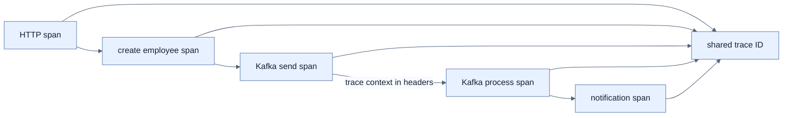
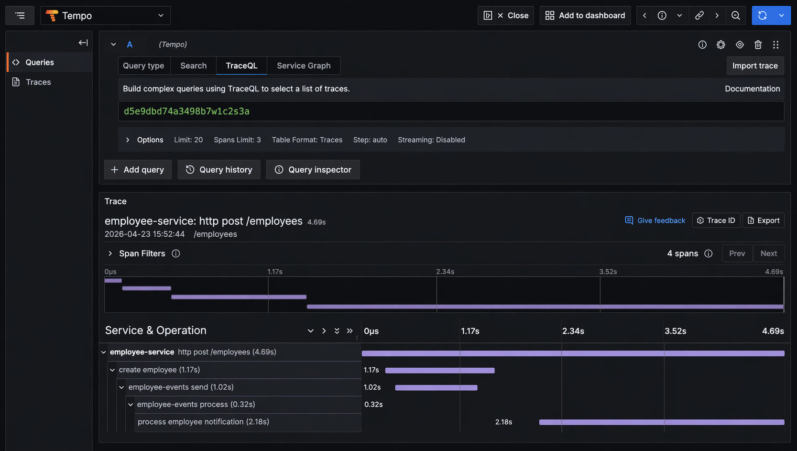

# OpenTelemetry와 Tempo 분산 추적

## 한눈에 보기

한 HTTP 요청에 trace ID를 만들고 controller, business service, Kafka producer·consumer, notification을 span으로 연결한다. Micrometer observation과 Kafka observation이 context를 message 경계 너머로 전파하고, OTLP Collector가 Tempo에 저장해 waterfall로 latency와 인과관계를 보여준다.

## 1. 왜 이게 필요한가

Logs는 사건, metrics는 집계를 보여주지만 한 요청이 4.69초 걸린 이유를 단계별로 나누지 못한다. Async Kafka boundary를 넘으면 thread와 시간이 달라져 단순 call stack도 사라진다. Trace context가 있어야 HTTP와 message 흐름을 하나의 operation으로 복원할 수 있다.

## 2. 어떻게 동작하는가

Local Tempo는 OTLP receiver, WAL·local block storage, 24시간 retention을 구성한다. Collector의 trace pipeline은 OTLP 수신 → resource·batch 처리 → `tempo:4317` export를 수행하고 Grafana가 Tempo의 3200 port를 query한다.

Application은 Kafka listener와 template의 observation을 켜서 message header에 context를 전파하고, trace OTLP endpoint와 sampling probability를 설정한다. 책의 `1.0`은 모든 요청을 보고 싶은 local 학습용이며 production에서는 traffic·비용·진단 요구에 맞춰 낮춘다.

```java
return Observation.createNotStarted("employee.create", observationRegistry)
    .contextualName("create employee")
    .lowCardinalityKeyValue("employee.role", role)
    .observe(() -> createAndRecordMetrics(employee, role));
```

`ObservationRegistry`는 현재 trace에 business span을 연결한다. Role은 제한된 low-cardinality attribute라 집계·index에 적합하지만 user ID·email은 high-cardinality라 metric과 넓은 index에서 피한다. 같은 방식을 Kafka consumer·DLT listener에도 적용하면 technical span 사이에 domain operation이 드러난다.

## 3. 그림으로 보기



책의 Figure 13.10에서는 `process employee notification` span이 가장 긴 구간으로 보인다.



## 4. 이 노트에 나온 용어

- **trace**: 하나의 end-to-end operation에 속한 span 집합.
- **span**: trace 안의 단일 작업과 시작·종료·attribute·status를 나타내는 단위.
- **trace context**: trace ID·parent span 등 downstream에 전달하는 연관 정보.
- **ObservationRegistry**: Micrometer observation을 현재 context에 만들고 handler로 전달하는 registry.
- **sampling**: 전체 request 중 trace를 수집·보존할 대상을 선택하는 정책.

## 7. 연결

- [[02-designing-an-observability-architecture]] — trace가 Collector와 Tempo로 흐르는 전체 구조다.
- [[04-metrics-with-micrometer-prometheus-and-grafana]] — 동일 business observation에서 latency metric도 기록한다.
- [[06-correlating-logs-metrics-and-traces]] — trace span에서 관련 log와 metric으로 이동한다.

## 8. 스스로 확인

- 전체 1차 정리 후: HTTP에서 Kafka consumer까지 trace context가 이어지는 경로와 sampling 1.0의 trade-off를 설명한다.

<!-- ==== 아래는 내 영역 · 스킬 수정 금지 ==== -->

## 내 설명 시도


## 막혔던 지점


## 리뷰 이력


