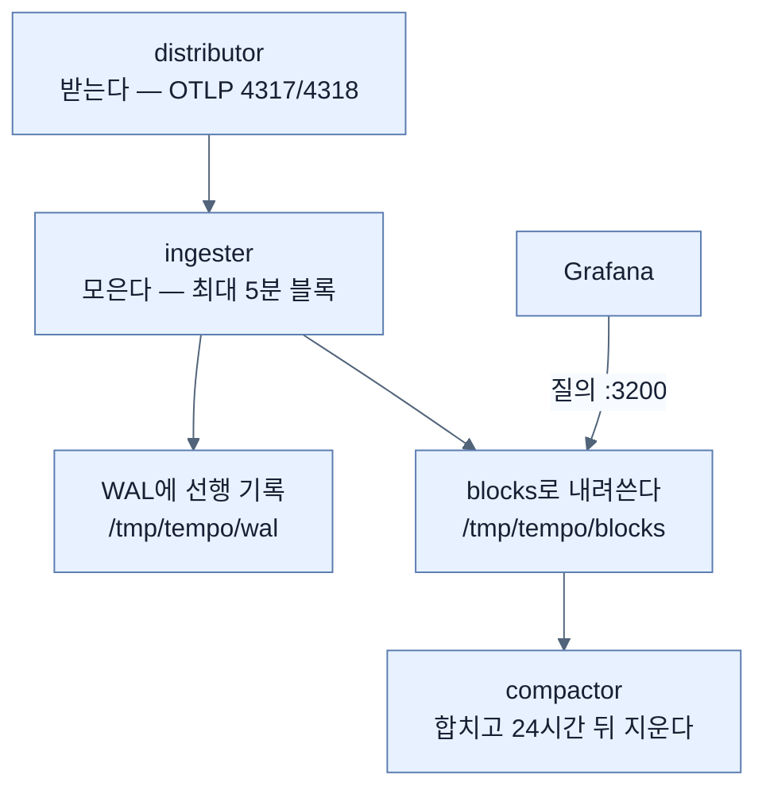
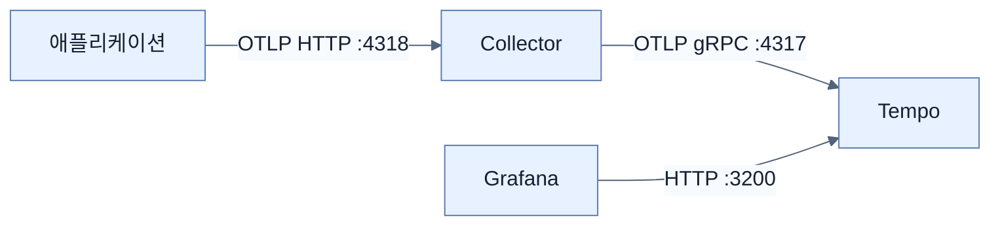

# 받고, 모으고, 합치고, 지운다 — Tempo 세우기

## 한눈에 보기

| 고칠 파일 | 무엇을 더하나 |
|---|---|
| `docker-compose.yml` | tempo 서비스(3200) |
| `tempo.yml` (신규) | 수신(OTLP) · 적재 · 컴팩션 · 저장 · 보존 |
| `otel-collector-config.yml` | `otlp/tempo` 익스포터 + traces 파이프라인 |
| `grafana-datasources.yml` | Tempo 데이터 소스 |

| 질문 | 핵심 답 |
|---|---|
| 3200 포트 | Grafana가 트레이스를 **질의하는** HTTP 포트 |
| 4317/4318 (tempo 안) | Tempo가 트레이스를 **받는** OTLP 포트 |
| `max_block_duration: 5m` | 블록 하나를 5분까지 모았다가 내려쓴다 |
| `block_retention: 24h` | 24시간 뒤 블록 삭제 |
| WAL | 적재 중 죽어도 유실을 막는 선행 기록 |
| `tls.insecure: true` | 로컬 예제용 — 인증서 검증 생략 |
| `metrics_generator.processors: []` | Tempo의 메트릭 생성 기능을 **끈다** |

## 1. 왜 이게 필요한가

### 출발 장면: 트레이스를 어디에 둘 것인가

[[05-tracing-with-opentelemetry-and-tempo]]에서 요청 하나가 span 여러 개를 만든다는 것을 봤다. 그 span들을 어딘가에 모아 두어야 나중에 trace ID로 꺼내 볼 수 있다.

로그도 메트릭도 아니므로 Loki나 Prometheus는 맞지 않는다.

| | 필요한 성질 |
|---|---|
| Loki | 텍스트 스트림용. **계층 구조와 지속 시간**을 다루지 못한다 |
| Prometheus | 시계열용. **개별 요청**을 보관하지 않는다 |
| **[[Tempo]]** | trace ID로 조회, span 계층 보존, 대량 쓰기에 최적화 |

Tempo의 특징은 **색인을 거의 만들지 않는다**는 것이다. trace ID로 찾는 것이 주 용도이므로, 그 하나만 빠르게 찾을 수 있으면 된다. 덕분에 저장 비용이 낮다.

## 2. 어떻게 동작하는가

### 2.1 컨테이너

```yaml
services:
     tempo:
       image: grafana/tempo:2.7.1
       container_name: ch13-tempo
       command: ["-config.file=/etc/tempo.yml"]
       volumes:
          - ./tempo.yml:/etc/tempo.yml:ro
       ports:
          - "3200:3200"
```

[[04a-setting-up-prometheus-for-metrics]]와 같은 패턴이다 — 이미지, 설정 파일 **[[볼륨-마운트]]**, 포트 하나.

3200이 **Grafana가 질의하는** 포트라는 점이 중요하다. 트레이스를 **받는** 포트는 따로 있고, 그것은 `tempo.yml` 안에서 정한다.

### 2.2 `tempo.yml` — 네 단계 생애

```yaml
server:
     http_listen_port: 3200
distributor:
     receivers:
       otlp:
         protocols:
              grpc:
                endpoint: 0.0.0.0:4317
              http:
                endpoint: 0.0.0.0:4318

ingester:
     max_block_duration: 5m

compactor:
     compaction:
       block_retention: 24h

storage:
     trace:
       backend: local
       wal:
         path: /tmp/tempo/wal
       local:
         path: /tmp/tempo/blocks

overrides:
     defaults:
       metrics_generator:
         processors: []
```

이 설정은 **트레이스 하나가 태어나 사라지기까지의 네 단계**를 그대로 반영한다.



| 단계 | 컴포넌트 | 하는 일 | 이 단계가 필요한 이유 |
|---|---|---|---|
| 받기 | `distributor` | OTLP로 들어오는 트레이스 수신 | 입구 |
| 모으기 | `ingester` | 최대 5분까지 블록에 쌓았다가 flush | **span 하나마다 파일을 쓰면 감당이 안 된다** |
| 안전 | **[[WAL]]**(= 최종 저장 전에 먼저 순차 기록해 두는 로그) | 메모리에 있는 동안의 유실 방지 | 5분 사이에 죽으면 그만큼 날아간다 |
| 정리 | `compactor` | 작은 블록 합치기 + 보존 기간 지나면 삭제 | 아래 참고 |

**[[컴팩션]]**(= 작게 흩어진 블록을 모아 큰 블록으로 합치는 작업)이 필요한 이유는 5분마다 블록이 하나씩 생기기 때문이다. 하루면 288개, 한 달이면 8,640개다. 조회할 때마다 그 많은 파일을 열어야 하면 느리다. 합쳐 두면 파일 수가 줄어든다.

**[[보존-기간]]**(= 데이터를 얼마나 두었다가 지울지) 24시간은 로컬 예제라 짧게 잡은 값이다. 트레이스는 양이 많아 실제로도 짧게(며칠) 두는 경우가 흔하다.

`backend: local`은 로컬 파일 시스템에 저장한다는 뜻이다. 운영에서는 보통 객체 저장소(S3·GCS)를 쓴다. `/tmp` 아래라는 점도 눈여겨볼 만하다 — **컨테이너를 지우면 트레이스도 사라진다.**

`overrides.defaults.metrics_generator.processors: []`는 Tempo의 부가 기능을 끈 것이다. Tempo는 트레이스에서 메트릭(서비스 그래프, RED 지표)을 생성할 수 있는데, 이 예제는 메트릭을 Prometheus가 맡으므로 꺼서 **트레이스 저장과 질의에만 집중**시킨다.

### 2.3 Collector에 traces 파이프라인

```yaml
exporters:
     otlp/tempo:
       endpoint: tempo:4317
       tls:
           insecure: true

service:
     pipelines:
       traces:
           receivers: [otlp]
           processors: [resource, batch]
           exporters: [otlp/tempo, debug]
```

세 번째 파이프라인이다. 구조가 앞의 둘과 같다.

| | logs | metrics | traces |
|---|---|---|---|
| receivers | `[otlp]` | `[otlp]` | `[otlp]` |
| processors | `[resource, batch]` | `[resource, batch]` | `[resource, batch]` |
| exporters | `[loki, debug]` | `[prometheus]` | `[otlp/tempo, debug]` |

**`resource` 프로세서를 세 번째로 재사용한다.** `service.name=employee-service`가 로그에도, 메트릭에도, 트레이스에도 붙는다. 이 일관성이 [[06-correlating-logs-metrics-and-traces]]에서 셋을 잇는 근거가 된다.

**[[익스포터]]** 이름의 `otlp/tempo`에서 슬래시 뒤는 **인스턴스 이름**이다. 같은 종류의 익스포터를 여러 개 둘 수 있게 하는 문법이며, 여기서는 "OTLP 익스포터인데 tempo용"이라는 뜻이다.

Collector가 Tempo로 보낼 때 **[[OTLP]]** gRPC(4317)를 쓴다. 애플리케이션이 Collector에 보낼 때는 HTTP(4318)를 썼다. 같은 프로토콜의 두 전송 방식이 구간마다 다르게 쓰인 것이다.

`tls.insecure: true`는 **로컬 예제용**이다. Collector와 Tempo가 같은 Docker 네트워크 안이라 인증서 없이 연결한다. 운영에서는 TLS를 켜야 한다.

### 2.4 Grafana 데이터 소스

```yaml
- name: Tempo
     type: tempo
     access: proxy
     url: http://tempo:3200
     editable: true
```

세 번째 **[[데이터소스-프로비저닝]]** 항목이다. Loki·Prometheus와 구조가 같고, `isDefault`가 없다는 점만 다르다 — Prometheus가 기본이므로.

`url`이 3200이라는 것이 앞의 포트 구분을 다시 확인해 준다. **Grafana는 3200으로 묻고, Collector는 4317로 보낸다.**

이 설정이 들어가면 Grafana의 Explore에서 Tempo를 고를 수 있게 되고, [[05c-verifying-distributed-traces-in-tempo]]에서 실제로 쓴다.

## 3. 그림으로 보기



| 파일 | 세 신호 모두 끝난 뒤의 모습 |
|---|---|
| `docker-compose.yml` | loki · otel-collector · grafana · prometheus · **tempo** |
| `otel-collector-config.yml` | 파이프라인 **3개** (logs · metrics · traces), 리시버·프로세서는 공유 |
| `grafana-datasources.yml` | 데이터 소스 **3개** |
| 신규 파일 | `prometheus.yml` · **`tempo.yml`** |

## 4. 이 노트에 나온 용어

| 용어 | 한 줄 뜻 | 정의 위치 |
|---|---|---|
| Tempo | 분산 트레이스 저장·질의 백엔드 | [[_glossary#Tempo]] |
| WAL | 최종 저장 전 순차 기록해 두는 로그 | [[_glossary#WAL]] |
| 컴팩션 | 작은 블록을 합치는 작업 | [[_glossary#컴팩션]] |
| 보존 기간 | 데이터를 두었다가 지우는 기간 | [[_glossary#보존-기간]] |
| OTLP | OpenTelemetry의 전송 프로토콜 | [[_glossary#OTLP]] |
| 익스포터 | Collector가 데이터를 내보내는 출구 | [[_glossary#익스포터]] |
| 파이프라인 | 리시버·프로세서·익스포터를 이은 경로 | [[_glossary#파이프라인]] |
| 데이터소스 프로비저닝 | 기동 시 데이터 소스 자동 등록 | [[_glossary#데이터소스-프로비저닝]] |
| 볼륨 마운트 | 호스트 파일을 컨테이너 경로에 연결 | [[_glossary#볼륨-마운트]] |

## 5. 자주 헷갈리는 것

**"3200이 트레이스를 받는 포트다"** — 받는 것은 4317/4318이고 3200은 **Grafana가 질의하는** 포트다.

**"`otlp/tempo`의 슬래시는 경로다"** — **인스턴스 이름**이다. 같은 종류 익스포터를 여러 개 둘 때 구분하는 문법이다.

**"WAL이 있으면 데이터가 안전하다"** — 적재 중 프로세스 사망을 막아 줄 뿐, `/tmp` 아래 저장이라 컨테이너를 지우면 다 사라진다.

**"`block_retention`을 늘리면 다 보관된다"** — 저장 공간이 그만큼 필요하다. 트레이스는 양이 많아 무한 보관이 현실적이지 않다.

**"`metrics_generator`를 끈 건 실수다"** — 의도적이다. 메트릭은 Prometheus가 맡으므로 중복을 피한다.

## 6. 언제 안 쓰나 / 경계

- **`backend: local`과 `/tmp` 경로는 운영용이 아니다.** 컨테이너 재생성으로 데이터가 사라지고, 여러 인스턴스가 공유할 수 없다.
- **`tls.insecure: true`는 로컬 전용이다.** 네트워크 경계를 넘는 구성에서는 반드시 TLS를 켠다.
- **`max_block_duration`을 늘리면 유실 위험 구간이 커진다.** WAL이 있어도 flush 전 데이터는 복구 절차가 필요하다.
- **비유의 한계.** Tempo의 네 단계는 "우편 집하장"에 가깝다 — 접수(distributor), 자루에 모으기(ingester), 자루 합치기(compactor), 보관 기간 후 폐기(retention). 다만 이 비유는 **조회가 언제든 들어온다**는 점을 담지 못한다. 우편은 배달하면 끝이지만 트레이스는 저장된 뒤에도 24시간 내내 조회 대상이고, 그래서 컴팩션이 조회 성능을 위한 작업이기도 하다.

## 7. 연결

- [[05-tracing-with-opentelemetry-and-tempo]] — 그 노트가 설명한 span들을 이 노트가 저장할 곳을 만든다.
- [[04a-setting-up-prometheus-for-metrics]] — 같은 세 파일에 항목을 더하는 구조가 세 번째로 반복된다.
- [[05b-enabling-trace-export-and-kafka-propagation]] — 백엔드가 준비됐으니 애플리케이션이 트레이스를 내보내게 켠다.

## 8. 스스로 확인

1. 트레이스를 Loki나 Prometheus에 넣을 수 없는 이유를 각각 말할 수 있는가?
2. Tempo가 색인을 거의 만들지 않는 이유는?
3. `tempo.yml`의 네 부분이 트레이스의 어느 생애 단계에 대응하는가?
4. `ingester`가 5분까지 모으는 이유와, 그 때문에 WAL이 필요한 이유는?
5. 컴팩션이 없으면 무엇이 나빠지는가?
6. 3200·4317·4318 세 포트의 역할을 구분할 수 있는가?
7. `resource` 프로세서를 세 파이프라인이 공유하는 것이 나중에 무엇을 가능하게 하는가?
8. 우편 집하장 비유가 깨지는 지점은 어디인가?

<!-- ==== 아래는 내 영역 · 스킬 수정 금지 ==== -->

## 내 설명 시도


## 막혔던 지점


## 리뷰 이력
