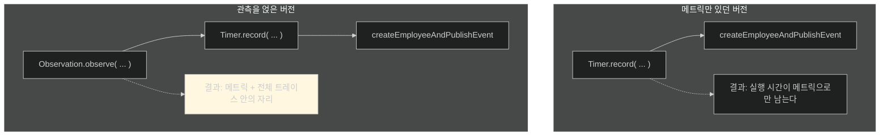
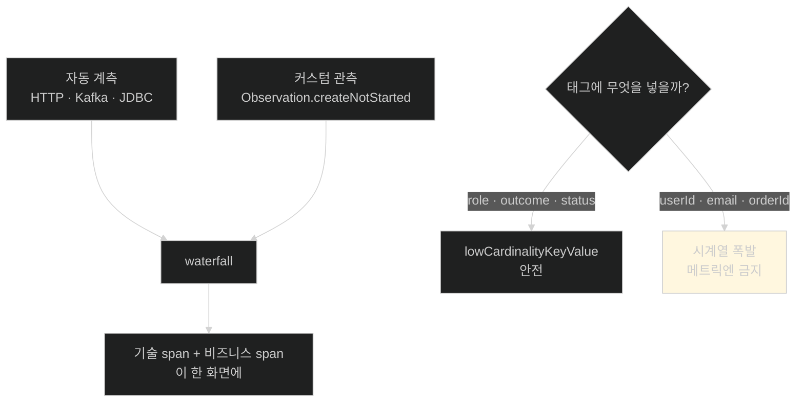

# 기술 span 위에 비즈니스 span 얹기 — 그리고 카디널리티의 함정

## 한눈에 보기

| 설정 | 하는 일 |
|---|---|
| `spring.kafka.listener.observation-enabled: true` | **소비자 쪽** 컨텍스트 전파 |
| `spring.kafka.template.observation-enabled: true` | **생산자 쪽** span 생성과 전파 |
| `management.tracing.export.enabled: true` | 트레이스 내보내기 켜기 ([[03b-instrumenting-the-application-for-logging]]에서 꺼 뒀던 것) |
| `management.tracing.sampling.probability: 1.0` | **전부** 기록 — 로컬 예제라서 |
| `...tracing.export.otlp.endpoint` | `/v1/traces` |

| 질문 | 핵심 답 |
|---|---|
| 기본 트레이스의 한계 | **기술적 연산**만 보인다 — 컨트롤러, Kafka |
| 그래서 더하는 것 | `Observation`으로 감싼 **비즈니스 span** |
| 코드 구조 변화 | Timer가 가장 바깥이었는데 → **Observation이 Timer를 감싼다** |
| 저 카디널리티 | 값 가짓수가 적은 것. 집계·색인에 안전 |
| 고 카디널리티 | 값 가짓수가 많은 것. 디버깅엔 유용, 남용하면 폭발 |
| 기본 방침 | **낮은 카디널리티를 기본으로, 높은 것은 선택적으로** |

## 1. 왜 이게 필요한가

### 출발 장면: 트레이스는 뜨는데 읽어도 모르겠다

[[05a-setting-up-grafana-tempo]]까지 하고 트레이싱을 켜면 waterfall이 나온다. 그런데 이런 모양이다.

```text
http post /employees          1.2s
  └ EmployeeRepository.save   0.03s
  └ employee-events send      1.1s
```

기술적으로는 정확하지만 **도메인 언어가 없다.** "직원을 생성하는 일"이 어디인지, "알림을 보내는 일"이 어디인지 span 이름만 봐서는 모른다.

책의 표현대로 **"이 트레이스들은 처음에는 기술적 연산만 반영한다. 더 의미 있게 만들려면 핵심 도메인 행위를 나타내는 비즈니스 수준 span으로 강화할 수 있다."**

## 2. 어떻게 동작하는가

### 2.1 스위치 다섯 개

```yaml
spring:
     kafka:
       listener:
                      observation-enabled: true
       template:
                      observation-enabled: true

management:
   tracing:
     export:
                      enabled: true
     sampling:
                      probability: 1.0

   opentelemetry:
     tracing:
                      export:
                        otlp:
                          endpoint: http://localhost:4318/v1/traces
```

| 설정 | 하는 일 | 없으면 |
|---|---|---|
| `kafka.listener.observation-enabled` | 소비자 연산이 관측에 참여하고 **[[컨텍스트-전파]]**를 받는다 | 소비 쪽이 별개 트레이스가 된다 |
| `kafka.template.observation-enabled` | 생산자가 span을 만들고 **메시지에 컨텍스트를 싣는다** | 실을 것이 없어 전파가 시작되지 않는다 |
| `tracing.export.enabled: true` | 트레이스 내보내기 | 만들어도 나가지 않는다 |
| `tracing.sampling.probability: 1.0` | **[[샘플링-확률]]**(= 요청 하나가 기록될 확률) | 기본값에 따라 일부만 기록 |
| `opentelemetry.tracing.export.otlp.endpoint` | **[[OTLP]]** 트레이스 주소 | 어디로 보낼지 모른다 |

앞의 두 줄이 [[05-tracing-with-opentelemetry-and-tempo]]가 말한 **[[전파-경계]]** 문제의 답이다. 둘 다 켜야 한다는 점이 중요하다 — 생산자가 실어 보내야 하고, 소비자가 읽어야 한다. **한쪽만 켜면 여전히 끊긴다.**

### 2.2 샘플링 — 지금은 1.0이지만

**[[샘플링]]**(= 모든 요청이 아니라 일부만 트레이스로 남기는 것)이 왜 필요한지는 비용 구조에서 나온다.

| 신호 | 요청 1건이 만드는 데이터 |
|---|---|
| 메트릭 | **0** (기존 카운터에 +1) |
| 로그 | 몇 줄 |
| 트레이스 | **span 여러 개 + 속성 전부** |

트레이스만 요청 수에 정비례해 데이터가 늘어난다. 초당 1만 요청이면 초당 span 5만 개다.

| 값 | 뜻 | 언제 |
|---|---|---|
| `0.0` | 기록 안 함 | 트레이싱 끄기 |
| `0.1` | 약 10% | 트래픽 많은 운영 |
| `1.0` | **전부** | 로컬·개발 |

책이 명시한다 — 로컬 예제라 `1.0`을 쓰고 모든 요청을 Grafana Tempo에서 볼 수 있게 하지만, **운영에서는 트래픽 양·비용·관측 필요에 맞춰 낮은 샘플링 비율을 쓰라.**

샘플링의 함정도 알아 둘 만하다. 10%만 기록하면 **문제가 된 그 요청이 기록되지 않았을 확률이 90%**다. 그래서 실무에서는 "오류가 난 요청은 항상 기록" 같은 규칙 기반 샘플링을 쓰기도 한다.

### 2.3 비즈니스 span 얹기

```java
@Service
public class EmployeeService {
    private final ObservationRegistry observationRegistry;

    public Employee createEmployee(Employee employee) {
                      String role = roleForMetrics(employee);

                          return Observation
                                           .createNotStarted("employee.create", observationRegistry)
                                           .contextualName("create employee")
                                           .lowCardinalityKeyValue("employee.role", role)
                                           .observe(() -> Timer
                                                   .builder("employee.create.time")
                                                   .tag("role", role)
                                                   .register(meterRegistry)
                                                   .record(() -> createEmployeeAndPublishEvent(
                                                       employee, role)));
    }

    private String roleForMetrics(Employee employee) {
                      if (employee.getRole() == null || employee.getRole().isBlank()) {
                          return "UNKNOWN";
                      }
                      return employee.getRole().toUpperCase();
    }
}
```

| 요소 | 하는 일 |
|---|---|
| **[[ObservationRegistry]]**(= 관측을 만들고 관리하는 레지스트리) 주입 | 관측을 만들 창구 |
| `Observation.createNotStarted("employee.create", ...)` | 커스텀 **[[span]]** 선언(아직 시작 안 함) |
| **[[contextualName]]**(= 사람이 읽기 좋은 이름) `"create employee"` | 트레이싱 백엔드의 span 이름이 된다 |
| `.lowCardinalityKeyValue("employee.role", role)` | 안전하게 집계 가능한 메타데이터 부착 |
| `.observe(() -> ...)` | **시작 → 실행 → 종료**를 한 번에 |

### 2.4 감싸는 순서가 바뀌었다

책이 "이 버전의 핵심 트레이싱 변경"이라고 짚는 부분이다. [[04b-adding-custom-business-metrics-with-micrometer]]와 비교해 보자.



**Timer가 가장 바깥이었는데 이제 Observation이 그것을 감싼다.** 책의 설명대로 **"타이머는 여전히 얼마나 걸렸는지 재지만, 감싸는 관측이 그 연산에 end-to-end 트레이스 안에서의 자리를 준다."**

이 변화가 만드는 차이가 크다.

| | Timer만 | Observation + Timer |
|---|---|---|
| 얼마나 걸렸나 | 안다 | 안다 |
| 전체 요청의 몇 %인가 | **모른다** | 안다 |
| 앞뒤에 무엇이 있었나 | 모른다 | **안다** |
| waterfall에 보이나 | 아니오 | **예** — `create employee`로 |

[[05c-verifying-distributed-traces-in-tempo]]의 화면에서 `create employee (1.17s)`라는 줄이 바로 이 코드의 산물이다.

### 2.5 카디널리티 — 이 절의 진짜 교훈

`.lowCardinalityKeyValue(...)`라는 메서드 이름이 이미 경고를 담고 있다. 책은 Note로 이 주제를 정면으로 다룬다.

| | **[[저-카디널리티]]** | **[[고-카디널리티]]** |
|---|---|---|
| 값의 가짓수 | 작고 정해져 있다 | 거의 무한 |
| 예 | `status=SUCCESS\|FAILED`, `role=ADMIN\|USER` | `userId`, `email`, `orderId` |
| 집계 | **안전** | 위험 |
| 색인 | 안전 | 시계열·라벨 폭발 |
| 쓸모 | 메트릭·span 태그 | **특정 요청 디버깅** |

왜 위험한지는 산술이다. 메트릭에 `userId`를 태그로 넣으면, 사용자가 10만 명일 때 **시계열이 10만 개** 생긴다. 메트릭이 5개면 50만 개다. Prometheus 메모리가 감당하지 못한다.

책의 지침이 명확하다 — **기본은 낮은 카디널리티. 높은 카디널리티는 선택적으로 쓰고, 메트릭이나 널리 색인되는 필드에는 넣지 마라.**

`employee.role`을 고른 것이 그래서 좋은 예다. 값이 `ENGINEER`, `MANAGER`, `UNKNOWN` 정도로 제한된다. 반면 `employee.id`를 넣었다면 직원 수만큼 값이 생긴다.

이 원칙이 [[04b-adding-custom-business-metrics-with-micrometer]]의 **[[메트릭-태그]]** 선택(`role`, `outcome`)과 정확히 같은 판단이라는 점을 짚어 둘 만하다. 메트릭이든 span이든 **같은 규칙**이 적용된다.

책은 `NotificationService`의 Kafka 컨슈머 흐름과 DLT 리스너에도 같은 방식으로 관측을 감쌌다고 밝힌다. 그래서 알림 처리와 실패도 같은 분산 트레이스 안의 비즈니스 span으로 나타난다.

## 3. 그림으로 보기



| 이 절에서 켠 것 | 어느 문제를 푸나 |
|---|---|
| Kafka observation 2개 | 전파 경계에서 트레이스가 끊기는 문제 |
| `tracing.export.enabled` | [[03b-instrumenting-the-application-for-logging]]에서 꺼 뒀던 것 |
| `sampling.probability: 1.0` | 예제에서 모든 요청을 보기 위해 |
| `Observation` 감싸기 | 기술 span만으로는 도메인이 안 보이는 문제 |

## 4. 이 노트에 나온 용어

| 용어 | 한 줄 뜻 | 정의 위치 |
|---|---|---|
| 컨텍스트 전파 | 실행 맥락을 경계 너머로 실어 나르는 일 | [[_glossary#컨텍스트-전파]] |
| 전파 경계 | 컨텍스트가 경계를 넘어야 하는 지점 | [[_glossary#전파-경계]] |
| 샘플링 | 일부 요청만 트레이스로 남기는 것 | [[_glossary#샘플링]] |
| 샘플링 확률 | 요청이 기록될 확률 | [[_glossary#샘플링-확률]] |
| ObservationRegistry | 관측을 만들고 관리하는 레지스트리 | [[_glossary#ObservationRegistry]] |
| Observation API | 작업 단위 하나를 나타내는 추상 | [[_glossary#Observation-API]] |
| contextualName | 사람이 읽기 좋은 span 이름 | [[_glossary#contextualName]] |
| 저 카디널리티 | 값 가짓수가 작고 정해진 속성 | [[_glossary#저-카디널리티]] |
| 고 카디널리티 | 값 가짓수가 거의 무한한 속성 | [[_glossary#고-카디널리티]] |
| Timer | 작업 소요 시간을 기록하는 메트릭 | [[_glossary#Timer]] |
| span | 트레이스를 이루는 작업 단위 | [[_glossary#span]] |
| OTLP | OpenTelemetry의 전송 프로토콜 | [[_glossary#OTLP]] |
| 메트릭 태그 | 메트릭에 붙는 key-value 라벨 | [[_glossary#메트릭-태그]] |

## 5. 자주 헷갈리는 것

**"Kafka observation은 한쪽만 켜도 된다"** — 생산자가 실어 보내고 소비자가 읽어야 한다. 한쪽만 켜면 **여전히 끊긴다.**

**"`sampling.probability: 1.0`이 안전한 기본값이다"** — 로컬에서만 그렇다. 운영에서 그대로 두면 트레이스 양이 트래픽에 정비례해 폭증한다.

**"Observation이 Timer를 대체한다"** — 감싼다. 둘 다 살아 있고, 메트릭과 트레이스를 동시에 얻는다.

**"카디널리티는 메트릭만의 문제다"** — span 속성에도 적용된다. 그래서 API 이름이 `lowCardinalityKeyValue`다.

**"고 카디널리티는 무조건 나쁘다"** — 특정 요청을 추적할 때는 유용하다. **메트릭이나 색인 필드에 넣지 말라**는 것이 지침이다.

## 6. 언제 안 쓰나 / 경계

- **샘플링을 낮추면 그 요청이 없을 수 있다.** 10%면 문제 요청이 기록되지 않았을 확률이 90%다.
- **모든 메서드를 관측으로 감싸면 안 된다.** span이 수백 개가 되면 waterfall이 읽히지 않고 오버헤드도 커진다. **도메인상 의미 있는 단위**만 감싼다.
- **전파는 프레임워크가 지원하는 경계에서만 자동이다.** 직접 만든 스레드 풀이나 미지원 클라이언트를 거치면 수동 전파가 필요하다.
- **비유의 한계.** 비즈니스 span을 얹는 것은 "기계 부품 목록 위에 작업 공정 이름을 덧붙이는 것"에 가깝다. "볼트 조임 3초"만 있던 자리에 "조립 공정 12초"가 생긴다. 다만 이 비유는 **공정과 부품이 같은 시간을 두 번 센다**는 오해를 준다. 실제로는 부모 span이 자식 span들을 **포함하는** 구조이며, 시간이 중복 계산되지 않고 계층으로 표현된다.

## 7. 연결

- [[05a-setting-up-grafana-tempo]] — 그 노트가 세운 백엔드로 이 노트의 트레이스가 나간다.
- [[04b-adding-custom-business-metrics-with-micrometer]] — 그 노트의 `Timer`를 이 노트가 관측으로 감싼다. 태그 카디널리티 판단도 같은 규칙이다.
- [[05c-verifying-distributed-traces-in-tempo]] — 여기서 만든 `create employee` span이 실제 waterfall에 나타나는 것을 확인한다.

## 8. 스스로 확인

1. Kafka observation 설정을 **둘 다** 켜야 하는 이유는?
2. 트레이스만 요청 수에 정비례해 데이터가 늘어나는 이유는?
3. 샘플링을 10%로 낮췄을 때 생기는 실무적 문제는?
4. 자동 계측만으로 얻는 트레이스의 한계는 무엇인가?
5. Timer와 Observation의 감싸는 순서가 바뀐 것이 만드는 차이 네 가지는?
6. `employee.role`이 저 카디널리티인 이유와, `employee.id`였다면 무엇이 문제인가?
7. 고 카디널리티 속성이 유용한 경우는 언제인가?
8. 작업 공정 비유가 깨지는 지점은 어디인가?


> 여덟 문항을 스스로 답한 **뒤에** [[_05b-enabling-trace-export-and-kafka-propagation]]에서 모범답안과 대조한다. 먼저 열면 이 문항들은 다시 인출 문제로 쓸 수 없다.

<!-- ==== 아래는 내 영역 · 스킬 수정 금지 ==== -->

## 내 설명 시도


## 막혔던 지점


## 리뷰 이력
