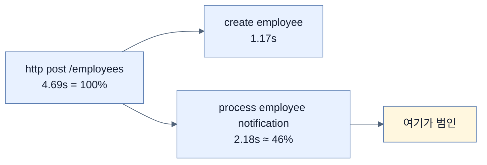
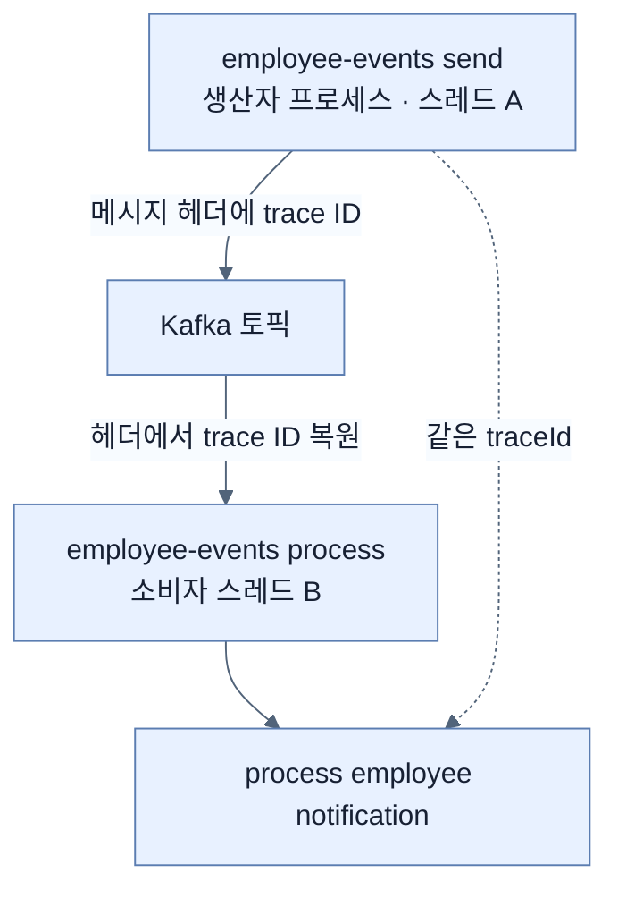
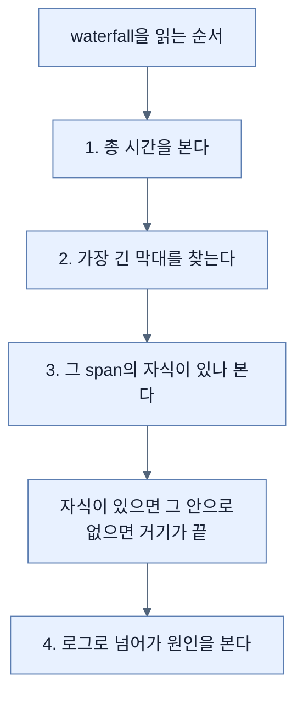

# 막대 길이가 범인을 가리킨다 — waterfall 읽기

## 한눈에 보기

| 단계 | 동작 |
|---|---|
| 1 | `docker compose down && docker compose up -d` |
| 2 | `./mvnw spring-boot:run` |
| 3 | `curl POST /employees` |
| 4 | `localhost:3000` → Explore → **Tempo** → Query Type **Search** → Run query |

| 질문 | 핵심 답 |
|---|---|
| 검색 결과가 주는 것 | trace ID · 시작 시각 · 서비스 · operation · **총 지속 시간** |
| waterfall이 주는 것 | span 계층 + **각 구간의 시간 배분** |
| 이 예제의 총 시간 | 4.69초 |
| 범인 | **`process employee notification` (2.18초)** — 전체의 약 46% |
| 확인되는 사실 | 트레이스 컨텍스트가 **Kafka를 가로질러 보존**됐다 |

## 1. 왜 이게 필요한가

### 출발 장면: 전파가 정말 됐는지 확인할 방법

[[05b-enabling-trace-export-and-kafka-propagation]]에서 스위치 다섯 개를 켰다. 그중 두 개(`kafka.listener.observation-enabled`, `kafka.template.observation-enabled`)는 **트레이스가 Kafka를 넘어 이어지게** 하는 것이었다.

그런데 이게 정말 됐는지 어떻게 알까. 안 됐을 때의 증상이 미묘하다.

| 상태 | Tempo에 보이는 것 |
|---|---|
| 전파 성공 | 트레이스 **1개**, 안에 HTTP + Kafka + 알림 span |
| 전파 실패 | 트레이스 **2개**, 각자 그럴듯하게 보인다 |

**둘 다 "트레이스가 뜬다."** 개수를 세거나 span 계층을 봐야 구분된다. 이 절이 그 확인 절차다.

## 2. 어떻게 동작하는가

### 2.1 검색 결과가 주는 정보

Grafana의 **[[Explore]]**에서 **[[Tempo]]**를 고르고 Query Type을 **Search**로 두고 실행하면 트레이스 목록이 나온다.

책이 예로 드는 한 줄에 다섯 가지가 들어 있다.

| 항목 | 값 | 뜻 |
|---|---|---|
| Trace ID | `d5e9dbd74a3498b7c…` | 이 요청의 식별자 |
| Start time | `2026-04-23 15:52:44` | 언제 시작했나 |
| Service | `employee-service` | 어느 서비스가 만들었나 |
| Operation | `http post/employees` | 루트 span의 이름 |
| Duration | **`4.69s`** | 전체가 얼마나 걸렸나 |

`Service`가 `employee-service`인 것은 [[03b-instrumenting-the-application-for-logging]]에서 정한 `service.name`이 [[05a-setting-up-grafana-tempo]]의 `resource` 프로세서를 거쳐 여기까지 온 결과다. **로그·메트릭·트레이스가 같은 이름을 쓴다**는 사실이 여기서도 확인된다.

4.69초는 이 애플리케이션의 정상 응답 시간에 비하면 이상하게 길다. 어디서 쓰였는지는 이 목록으로는 알 수 없다. **트레이스를 열어야 한다.**

### 2.2 waterfall

![[_assets/lsb4-p389-fig13-10-distributed-trace-waterfall-in-tempo.png]]

**[[waterfall]]**(= span들을 시작 시각과 지속 시간에 맞춰 가로 막대로 늘어놓은 화면)이 이 절의 결론이다.

Service & Operation 패널에 span이 계층으로 놓인다.

```text
employee-service  http post /employees (4.69s)
  └ create employee (1.17s)
      └ employee-events send (1.02s)
          └ employee-events process (0.32s)
              └ process employee notification (2.18s)
```

| span | 출처 |
|---|---|
| `http post /employees` | Spring MVC 자동 계측 |
| **`create employee`** | [[05b-enabling-trace-export-and-kafka-propagation]]의 `.contextualName("create employee")` |
| `employee-events send` | `kafka.template.observation-enabled` |
| `employee-events process` | `kafka.listener.observation-enabled` |
| **`process employee notification`** | `NotificationService`에 감싼 커스텀 관측 |

**[[contextualName]]**(= 사람이 읽기 좋은 span 이름)이 그대로 화면 이름이 됐다는 점이 눈에 띈다. 코드에 적은 문자열이 조사 화면의 라벨이 되므로, **도메인 언어로 짓는 것이 곧 조사 편의**가 된다.

### 2.3 범인이 막대 길이로 드러난다

오른쪽 막대들을 보면 답이 즉시 나온다.



책의 결론 그대로다 — **"이 예에서 `process employee notification` span이 트레이스 지속 시간의 가장 큰 몫을 차지하며, 지연의 주된 기여자다."**

메트릭이나 로그로는 이 결론에 이렇게 빨리 도달할 수 없다.

| 신호 | 이 결론까지의 거리 |
|---|---|
| 메트릭 | "평균이 올랐다"까지. 어느 구간인지 모른다 |
| 로그 | 시각 차를 손으로 계산해야 한다 |
| **트레이스** | **막대 길이를 눈으로 본다** |

### 2.4 Kafka를 넘었다는 증거

이 화면에서 확인되는 두 번째 사실이 더 중요할 수도 있다.

`employee-events send`(생산자)와 `employee-events process`(소비자)가 **같은 트레이스 안에** 있다. 즉 **[[컨텍스트-전파]]**가 성공했다.



이 두 span은 **다른 스레드**에서, **다른 시각**에 실행됐다. 그런데 같은 **[[traceId]]**를 갖는다. [[05-tracing-with-opentelemetry-and-tempo]]에서 말한 **[[전파-경계]]**를 실제로 넘은 것이다.

책의 표현대로 **"이 뷰는 트레이스 컨텍스트가 Kafka를 가로질러 보존되어, 생산자와 소비자 span이 하나의 end-to-end 트레이스를 이룬다는 것을 확인해 준다. 동기·비동기 단계를 모두 포함한 전체 워크플로를 하나의 연산으로 분석할 수 있다."**

앞서 든 "전파 실패 시 트레이스가 2개"라는 증상이, 이 화면에서 **span 5개가 한 트레이스에 있음**으로 반증된다.

> **원문 표기 문제 세 가지.** (1) Trace ID가 Figure 13.9 설명에서는 `d5e9dbd74a3498b7c…`, Figure 13.10 설명에서는 `d5e9dbd74a3498b7w1c2s3`으로 다르게 인쇄됐고, 후자에는 **16진수가 아닌 `w`·`s`**가 섞여 있다. 실제 화면의 값은 `d5e9dbd74a3498b7w1c2s3a`다. (2) 화면의 Span Filters 영역은 "4 spans"라 하지만 Service & Operation 패널에는 루트를 포함해 **5개 행**이 있다. (3) 본문은 span 목록을 `create employee` / `employee-events send` / `employee-events process` / `process employee notification` 넷으로 나열하는데, 화면에는 루트인 `http post /employees`가 더 있다.

## 3. 그림으로 보기

| 확인 항목 | 무엇을 증명하나 | 어긋나면 |
|---|---|---|
| 트레이스가 뜬다 | export가 켜졌다 | `tracing.export.enabled` 확인 |
| span이 5개다 | 자동·커스텀 계측이 다 동작 | 빠진 계층을 역추적 |
| `create employee`가 보인다 | 커스텀 `Observation`이 먹었다 | `contextualName` 확인 |
| **send와 process가 한 트레이스에** | **Kafka 전파 성공** | Kafka observation 두 설정 확인 |
| 막대 길이가 다르다 | 시간 배분이 보인다 | — |



4번이 [[06-correlating-logs-metrics-and-traces]]의 주제다. 지금은 그 이동을 손으로 해야 한다.

## 4. 이 노트에 나온 용어

| 용어 | 한 줄 뜻 | 정의 위치 |
|---|---|---|
| waterfall | span을 시각·지속 시간에 맞춰 늘어놓은 화면 | [[_glossary#waterfall]] |
| span | 트레이스를 이루는 작업 단위 | [[_glossary#span]] |
| traceId | 요청 전체를 식별하는 값 | [[_glossary#traceId]] |
| Tempo | 분산 트레이스 백엔드 | [[_glossary#Tempo]] |
| Explore | Grafana의 즉석 질의 화면 | [[_glossary#Explore]] |
| contextualName | 사람이 읽기 좋은 span 이름 | [[_glossary#contextualName]] |
| 전파 경계 | 컨텍스트가 경계를 넘어야 하는 지점 | [[_glossary#전파-경계]] |
| 컨텍스트 전파 | 실행 맥락을 경계 너머로 실어 나르는 일 | [[_glossary#컨텍스트-전파]] |

## 5. 자주 헷갈리는 것

**"트레이스가 뜨면 전파가 성공한 것이다"** — 실패해도 트레이스는 뜬다. **두 개로 나뉠** 뿐이다. span 계층을 봐야 안다.

**"span 시간을 다 더하면 총 시간이 된다"** — 되지 않는다. 부모가 자식을 **포함**하고 일부는 병렬일 수 있다.

**"가장 긴 span이 항상 범인이다"** — 그 span이 자식들의 합이라면 진짜 범인은 자식 중에 있다. **잎(leaf)까지 내려가야** 한다.

**"Search로만 트레이스를 찾을 수 있다"** — trace ID를 알면 TraceQL로 직접 조회할 수 있고, 그것이 [[06-correlating-logs-metrics-and-traces]]에서 로그로부터 넘어오는 방식이다.

## 6. 언제 안 쓰나 / 경계

- **샘플링이 낮으면 그 요청이 없다.** 여기서는 `1.0`이라 전부 있지만 운영에서는 다르다.
- **Search는 시간 범위와 조건에 의존한다.** 오래된 트레이스는 [[05a-setting-up-grafana-tempo]]의 24시간 보존 기간이 지나면 사라진다.
- **waterfall만으로는 원인을 모른다.** "여기가 느리다"까지이고 "왜"는 로그에 있다.
- **비유의 한계.** waterfall은 "공정별 소요 시간 막대그래프"에 가깝다. 어느 공정이 병목인지 길이로 보인다. 다만 이 비유는 **막대가 중첩된다**는 점을 담지 못한다. 부모 span의 막대 안에 자식 막대들이 들어 있어서, 단순 막대그래프처럼 길이를 합산하면 총합이 실제보다 훨씬 커진다. 읽을 때는 **계층을 따라 내려가며** 봐야 한다.

## 7. 연결

- [[05b-enabling-trace-export-and-kafka-propagation]] — 그 노트의 `contextualName`과 Kafka observation 설정이 이 화면의 span 이름과 계층으로 나타난다.
- [[05a-setting-up-grafana-tempo]] — 이 트레이스가 그 노트가 세운 Tempo에 저장돼 있다.
- [[06-correlating-logs-metrics-and-traces]] — waterfall이 지목한 구간에서 로그로 넘어가는 이동을 자동화한다.

## 8. 스스로 확인

1. 전파가 실패했을 때의 증상이 왜 미묘한가?
2. 검색 결과 한 줄의 다섯 항목이 각각 어디서 왔는지 말할 수 있는가?
3. `create employee`라는 span 이름의 출처는?
4. 4.69초 중 범인을 찾는 과정을 설명할 수 있는가?
5. `send`와 `process`가 한 트레이스에 있다는 것이 왜 중요한 증거인가?
6. span 시간을 단순 합산하면 안 되는 이유는?
7. 가장 긴 span이 범인이 아닐 수 있는 경우는?
8. 막대그래프 비유가 깨지는 지점은 어디인가?

<!-- ==== 아래는 내 영역 · 스킬 수정 금지 ==== -->

## 내 설명 시도


## 막혔던 지점


## 리뷰 이력
