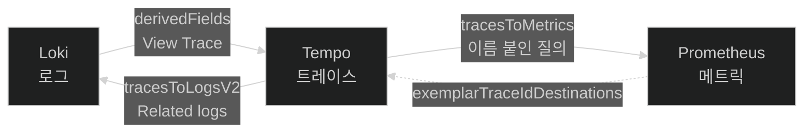
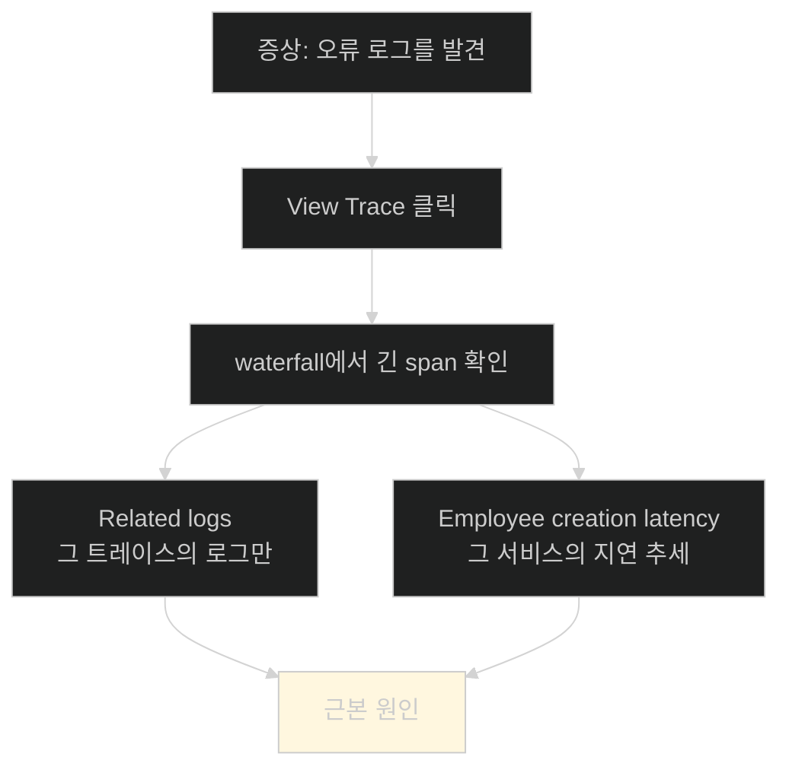

# 관련돼 있는 것과 오갈 수 있는 것 — 세 신호 잇기

## 한눈에 보기

| 질문 | 핵심 답 |
|---|---|
| 지금 상태 | 세 신호가 **관련돼(related) 있다.** traceId가 이미 로그에 있다 |
| 부족한 것 | **오갈 수(correlated) 없다.** 뷰를 옮기고 ID를 손으로 복사해야 한다 |
| 애플리케이션 코드 변경 | **없다.** Grafana 설정만 고친다 |
| Log → Trace | Loki의 `derivedFields` — 정규식으로 traceId를 뽑아 링크 생성 |
| Trace → Log | Tempo의 `tracesToLogsV2` |
| Trace → Metric | Tempo의 `tracesToMetrics` — **질의를 이름 붙여 미리 등록** |
| 데이터 소스를 잇는 열쇠 | `uid` |
| 얻는 것 | **증상에서 근본 원인까지의 거리 단축** |

## 1. 왜 이게 필요한가

### 출발 장면: 데이터는 다 있는데 손이 많이 간다

여기까지 오면 애플리케이션은 세 신호를 모두 만들고 있다.

| 신호 | 어디에 | 확인한 노트 |
|---|---|---|
| 구조화 로그 | Loki | [[03c-verifying-logs-in-grafana]] |
| 메트릭 | Prometheus | [[04c-verifying-metrics-in-prometheus-and-grafana]] |
| 트레이스 | Tempo | [[05c-verifying-distributed-traces-in-tempo]] |

게다가 Kafka를 가로질러 컨텍스트가 전파되고, 로그 항목에는 **[[traceId]]**와 spanId가 들어 있다.

책의 정확한 표현이 여기서 나온다 — **"즉 텔레메트리는 이미 관련돼(related) 있다. 그러나 사용자 관점에서는 아직 완전히 상관돼(correlated) 있지 않다."**

차이가 무엇인가. 실제 조사를 해 보면 드러난다.

| 단계 | 지금 해야 하는 일 |
|---|---|
| 1 | Loki Explore에서 오류 로그를 찾는다 |
| 2 | 로그 JSON에서 `traceId` 값을 **눈으로 찾아 복사한다** |
| 3 | 데이터 소스를 Tempo로 **바꾼다** |
| 4 | 복사한 ID를 **붙여넣는다** |
| 5 | waterfall에서 느린 span을 찾는다 |
| 6 | 그 span의 메트릭을 보려면 Prometheus로 **또 바꾸고** 질의를 **손으로 쓴다** |

데이터는 다 있다. 그런데 **사람이 접착제 노릇을 한다.** 책의 표현대로 "여전히 Grafana 뷰를 옮겨 다니고, 트레이스 ID를 수동으로 복사하고, 요청 흐름을 스스로 재구성해야 한다."

**[[상관관계]]**(= 서로 다른 신호를 같은 요청으로 이어 붙여 한 흐름으로 오갈 수 있게 만드는 것)가 이 수작업을 없앤다.

### 애플리케이션은 손대지 않는다

이 절의 중요한 성질 하나. 책이 명시한다 — **"애플리케이션이 이미 필요한 데이터를 내보내고 있으므로 애플리케이션 로직 변경은 필요 없다."**

바꿀 것은 `grafana-datasources.yml` 하나뿐이다. 앞의 세 절이 **재료를 다 준비해 뒀기** 때문에 가능한 일이다.

## 2. 어떻게 동작하는가

### 2.1 세 방향의 이동



| 방향 | 설정 | 어디에 |
|---|---|---|
| Log → Trace | **[[derivedFields]]**(= 로그 본문을 정규식으로 훑어 링크를 만드는 기능) | Loki 데이터 소스 |
| Trace → Log | **[[tracesToLogsV2]]** | Tempo 데이터 소스 |
| Trace → Metric | **[[tracesToMetrics]]** | Tempo 데이터 소스 |
| Metric → Trace | **[[exemplar]]**(= 메트릭 데이터 포인트에 붙는 대표 트레이스 식별자) | Prometheus 데이터 소스 |

### 2.2 데이터 소스를 잇는 열쇠 — `uid`

설정을 읽기 전에 알아야 할 것이 하나 있다. 이번 설정에서 각 데이터 소스에 **[[uid]]**(= Grafana 데이터 소스의 고유 식별자)가 새로 붙었다.

```yaml
- name: Loki
   uid: loki
- name: Prometheus
   uid: prometheus
- name: Tempo
   uid: tempo
```

왜 필요한가. **한 데이터 소스가 다른 데이터 소스를 가리켜야 하기 때문**이다. Loki 설정 안에서 "여기서 Tempo로 가라"고 쓰려면 Tempo를 부를 이름이 있어야 한다. 이름(`name`)은 사람이 바꿀 수 있으니 안정적인 식별자가 따로 필요하다.

앞의 세 절에서는 각 데이터 소스가 독립적이라 `uid`가 없어도 됐다. **서로를 참조하기 시작하는 순간** 필요해진다.

### 2.3 Log → Trace

```yaml
- name: Loki
   type: loki
   uid: loki
   access: proxy
   url: http://loki:3100
   isDefault: false
   editable: true
   jsonData:
        maxLines: 1000
        derivedFields:
          - datasourceUid: tempo
            matcherRegex: '"traceId":"([A-Fa-f0-9]+)"'
            name: TraceID
            url: '$${__value.raw}'
            urlDisplayLabel: View Trace
```

| 항목 | 하는 일 |
|---|---|
| `datasourceUid: tempo` | 어디로 갈지 |
| `matcherRegex` | 로그 본문에서 **traceId를 뽑는 정규식** |
| `name: TraceID` | 뽑은 값에 붙일 필드 이름 |
| `url: '$${__value.raw}'` | 뽑은 값을 그대로 Tempo 질의로 |
| `urlDisplayLabel: View Trace` | 화면에 보일 링크 문구 |

`matcherRegex`가 이 설정의 핵심이다. `'"traceId":"([A-Fa-f0-9]+)"'`는 로그 JSON에서 `"traceId":"..."` 패턴을 찾아 괄호 안(16진수 문자열)을 캡처한다.

이것이 동작하려면 **로그가 JSON이고 그 안에 traceId가 있어야 한다.** [[03b-instrumenting-the-application-for-logging]]에서 `logging.structured.format.console: logstash`와 `<captureMdcAttributes>traceId,spanId</captureMdcAttributes>`를 해 둔 것이 여기서 회수된다.

`isDefault`가 `false`로 바뀐 것도 눈에 띈다. Prometheus가 기본이 됐다.

![[_assets/lsb4-p393-fig13-11-log-with-view-trace-link-in-loki.png]]

화면에서 확인되는 것이 셋이다.

**첫째, `Fields` 영역.** `deployment_environment`, `detected_level`, `exporter`, `job`, `level`, `service_name`이 나열된다. [[03a-setting-up-the-logging-infrastructure]]에서 승격한 라벨들이다.

**둘째, `Links` 영역.** `TraceID  5c356ba4d27c985c9dc19459e91090df`와 파란 **View Trace** 버튼. 이 버튼이 `derivedFields` 설정의 산물이다.

**셋째, 로그 본문의 미묘한 점.** 같은 줄에 두 표기가 있다.

```json
{"body":"...","traceid":"5c356ba4...","spanid":"3f254cd160cafa72", ... ,"attributes":{"spanId":"3f254cd160cafa72","traceId":"5c356ba4..."}, ...}
```

**최상위는 소문자 `traceid`, `attributes` 안은 camelCase `traceId`**다. 정규식이 `"traceId"`(대문자 I)를 찾으므로 **`attributes` 안의 것을 잡는다.** 만약 최상위 소문자 키만 있었다면 이 설정은 조용히 실패했을 것이다.

정규식 기반 추출의 취약함이 여기 드러난다. **로그 형식이 조금만 바뀌어도 링크가 사라진다.**

### 2.4 Trace → Log

```yaml
- name: Tempo
   type: tempo
   uid: tempo
   jsonData:
     tracesToLogsV2:
       datasourceUid: loki
       spanStartTimeShift: -2m
       spanEndTimeShift: 2m
       tags:
         - key: service.name
           value: service_name
       filterByTraceID: false
       filterBySpanID: false
       customQuery: true
       query: '{${__tags}} | json | traceId="${__trace.traceId}"'
```

| 항목 | 하는 일 | 왜 |
|---|---|---|
| `datasourceUid: loki` | 목적지 | — |
| `spanStartTimeShift: -2m` / `spanEndTimeShift: 2m` | 시간 창을 앞뒤로 2분씩 넓힌다 | **시계 오차와 배칭 지연**을 흡수한다 |
| `tags` | span의 `service.name`을 Loki 라벨 `service_name`으로 **번역** | 두 시스템의 이름 규칙이 다르다 |
| `customQuery: true` + `query` | 직접 쓴 LogQL을 쓴다 | 기본 질의로는 traceId 필터가 안 된다 |

`query`를 뜯어보면 [[03c-verifying-logs-in-grafana]]에서 배운 LogQL 구조 그대로다.

```text
{${__tags}}                      ← 라벨 선택자 (service_name으로 좁힌다)
| json                           ← 본문을 JSON으로 파싱
| traceId="${__trace.traceId}"   ← 파싱된 필드로 필터
```

`tags` 매핑이 필요한 이유가 중요하다. 트레이스 쪽에서는 `service.name`(점), Loki 쪽에서는 `service_name`(밑줄)이다. [[03c-verifying-logs-in-grafana]]에서 본 그 변환을 여기서 **명시적으로 이어 준다.**

시간 창을 넓히는 이유도 실무적이다. 로그는 배칭돼 나가고 컨테이너마다 시계가 미세하게 다르다. span 구간에 딱 맞추면 **경계의 로그를 놓친다.**

### 2.5 Trace → Metric

```yaml
     tracesToMetrics:
       datasourceUid: prometheus
       spanStartTimeShift: -2m
       spanEndTimeShift: 2m
       tags:
         - key: service.name
           value: exported_job
       queries:
         - name: Employee creations
           query: 'sum by (role) (increase(employee_created_count_total{$__tags}[5m]))'
         - name: Employee creation latency
           query: 'sum(rate(employee_create_time_milliseconds_sum{$__tags}[5m])) / clamp_min(sum(rate(employee_create_time_milliseconds_count{$__tags}[5m])), 1)'
         - name: Notification outcomes
           query: 'sum by (outcome) (increase(employee_notification_count_total{$__tags}[5m]))'
```

여기서 `tags` 매핑이 `exported_job`이다. [[04c-verifying-metrics-in-prometheus-and-grafana]]에서 확인한 그 라벨 — `job`이 스크레이프 작업 이름에 밀려 서비스 이름이 `exported_job`으로 간 결과다. **그 화면을 봐 두지 않았다면 이 값을 알 수 없다.**

`queries`가 목록이라는 점이 이 기능의 성격을 정한다. **질의를 미리 이름 붙여 등록해 둔다.** 조사하는 사람이 PromQL을 쓸 필요가 없어진다.

세 질의가 [[04b-adding-custom-business-metrics-with-micrometer]]에서 만든 메트릭 셋과 정확히 대응한다.

| 이름 | 메트릭 | 태그 |
|---|---|---|
| Employee creations | `employee_created_count_total` | `role` |
| Employee creation latency | `employee_create_time_milliseconds_*` | — |
| Notification outcomes | `employee_notification_count_total` | `outcome` |

`clamp_min(..., 1)`이 두 번째 질의에 있다. 분모가 0이 되는 것을 막는다 — 그 구간에 요청이 없으면 `_count`의 rate가 0이 되어 나눗셈이 깨지기 때문이다.

`increase(...[5m])`는 [[04c-verifying-metrics-in-prometheus-and-grafana]]의 `rate`와 사촌이다. `rate`가 초당 증가율이라면 `increase`는 **구간 전체의 증가량**이다. "지난 5분간 몇 건"에는 이쪽이 읽기 쉽다.

### 2.6 실제 화면

![[_assets/lsb4-p394-fig13-13-span-to-metrics-and-logs-menu.png]]

waterfall의 span 옆 링크 아이콘을 누르면 메뉴가 뜬다.

```text
Employee creation latency
Employee creations
Notification outcomes
Related logs
```

**앞의 셋은 `tracesToMetrics`의 `queries`에 적은 이름 그대로**이고, 마지막은 `tracesToLogsV2`가 만든 것이다. 설정 파일의 문자열이 조사 화면의 메뉴 항목이 됐다.

여기서 `Employee creation latency`를 고르면 Prometheus Explore가 열리며 **질의가 자동으로 채워진다.** 책의 표현대로 "span 하나에서 출발해 질의를 손으로 만들지 않고 곧바로 해당 메트릭을 탐색할 수 있다."

`Related logs`를 고르면 Loki로 가서 **traceId로 필터된 로그**만 보인다.

### 2.7 그래서 무엇이 달라졌나

이 절 처음의 6단계 조사가 이렇게 줄어든다.

| 이전 | 이후 |
|---|---|
| 1. 로그를 찾는다 | 1. 로그를 찾는다 |
| 2. traceId를 복사한다 | — |
| 3. 데이터 소스를 바꾼다 | — |
| 4. ID를 붙여넣는다 | **2. View Trace를 누른다** |
| 5. 느린 span을 찾는다 | 3. 느린 span을 찾는다 |
| 6. 질의를 손으로 쓴다 | **4. 메뉴에서 고른다** |

책의 결론이 그것이다 — **"이는 컨텍스트 전환을 줄이고 증상에서 근본 원인까지의 경로를 짧게 만든다."** 그리고 마지막 문장 — **"로그로 시작해 트레이스를 열고 관련 메트릭을 살펴볼 수 있다. 이것이 시스템 동작에 대한 명확하고 완전한 시야를 준다."**

## 3. 그림으로 보기



| 앞 절이 준비해 둔 것 | 이 절에서 쓰이는 곳 |
|---|---|
| 구조화 JSON 로그 ([[03b-instrumenting-the-application-for-logging]]) | `matcherRegex`가 파싱할 대상 |
| MDC의 traceId 포착 (같은 노트) | 정규식이 찾을 값 |
| `service_name` 라벨 승격 ([[03a-setting-up-the-logging-infrastructure]]) | `tracesToLogsV2`의 `tags` |
| `exported_job` 라벨 ([[04c-verifying-metrics-in-prometheus-and-grafana]]) | `tracesToMetrics`의 `tags` |
| `role`·`outcome` 태그 ([[04b-adding-custom-business-metrics-with-micrometer]]) | 등록된 질의의 `sum by (...)` |
| Kafka 컨텍스트 전파 ([[05b-enabling-trace-export-and-kafka-propagation]]) | 비동기 구간까지 한 트레이스로 |

## 4. 이 노트에 나온 용어

| 용어 | 한 줄 뜻 | 정의 위치 |
|---|---|---|
| 상관관계 | 신호를 이어 붙여 오갈 수 있게 만드는 것 | [[_glossary#상관관계]] |
| derivedFields | 로그 본문을 정규식으로 훑어 링크를 만드는 기능 | [[_glossary#derivedFields]] |
| tracesToLogsV2 | span에서 관련 로그로 가는 링크 설정 | [[_glossary#tracesToLogsV2]] |
| tracesToMetrics | span에서 관련 메트릭으로 가는 링크 설정 | [[_glossary#tracesToMetrics]] |
| exemplar | 메트릭 포인트에 붙는 대표 트레이스 식별자 | [[_glossary#exemplar]] |
| uid | Grafana 데이터 소스의 고유 식별자 | [[_glossary#uid]] |
| traceId | 요청 전체를 식별하는 값 | [[_glossary#traceId]] |
| Grafana | 통합 탐색·시각화 도구 | [[_glossary#Grafana]] |
| Loki | 라벨만 색인하는 로그 저장 시스템 | [[_glossary#Loki]] |
| Prometheus | 메트릭 시계열 저장·질의 시스템 | [[_glossary#Prometheus]] |
| Tempo | 분산 트레이스 백엔드 | [[_glossary#Tempo]] |
| 저 카디널리티 | 값 가짓수가 작고 정해진 속성 | [[_glossary#저-카디널리티]] |

## 5. 자주 헷갈리는 것

**"상관관계를 켜려면 애플리케이션을 고쳐야 한다"** — 고치지 않는다. **앞 세 절이 이미 재료를 다 만들어 뒀다.**

**"related와 correlated는 같은 말이다"** — 책이 구분한다. 데이터가 **관련돼 있는 것**과 사용자가 **오갈 수 있는 것**은 다르다.

**"`uid`는 없어도 된다"** — 데이터 소스끼리 참조하기 시작하면 필요하다.

**"정규식이 최상위 `traceid`를 잡는다"** — 대소문자가 달라 **`attributes` 안의 `traceId`**를 잡는다.

**"시간 창을 넓히는 건 대충 한 것이다"** — 배칭 지연과 시계 오차를 흡수하는 실무적 조치다. 좁히면 경계의 로그를 놓친다.

## 6. 언제 안 쓰나 / 경계

- **정규식 기반 추출은 깨지기 쉽다.** 로그 형식이 바뀌면 `matcherRegex`가 조용히 실패하고 링크만 사라진다.
- **`tracesToMetrics`의 질의는 미리 정한 것뿐이다.** 예상 밖의 각도로 보려면 결국 손으로 쓴다.
- **`tags` 매핑이 틀리면 빈 결과가 나온다.** `service_name`인지 `exported_job`인지는 각 백엔드의 실제 라벨을 봐야 안다.
- **exemplar는 별도 준비가 필요하다.** `exemplarTraceIdDestinations`를 적어도, 메트릭에 exemplar가 실제로 붙어 있어야 동작한다.
- **비유의 한계.** 상관관계 설정은 "도서관의 상호 참조 색인"에 가깝다. 각 책에 "관련 항목은 몇 권 몇 쪽" 하는 표시를 붙여 두는 일이다. 다만 이 비유는 **참조가 값에 의해 계산된다**는 점을 담지 못한다. 색인은 사람이 미리 적어 두지만, 여기서는 traceId라는 **런타임 값**으로 링크가 그때그때 만들어진다. 그래서 새 요청이 들어와도 설정을 고칠 필요가 없고, 반대로 그 값이 로그에 없으면 링크 자체가 생기지 않는다.

## 7. 연결

- [[05c-verifying-distributed-traces-in-tempo]] — 그 노트의 waterfall에서 로그·메트릭으로 넘어가는 이동이 여기서 자동화된다.
- [[03c-verifying-logs-in-grafana]] — 그 노트가 확인한 구조화 JSON 로그가 `matcherRegex`의 파싱 대상이다.
- [[04c-verifying-metrics-in-prometheus-and-grafana]] — 그 노트에서 본 `exported_job` 라벨이 `tracesToMetrics`의 `tags` 값이 된다.

## 8. 스스로 확인

1. "관련돼 있다"와 "상관돼 있다"의 차이를 조사 6단계로 설명할 수 있는가?
2. 애플리케이션 코드를 고치지 않아도 되는 이유는? 앞 절들이 무엇을 준비해 뒀나?
3. `uid`가 이번 설정에서 새로 필요해진 이유는?
4. `matcherRegex`가 로그의 어느 필드를 잡는지, 왜 그런지 말할 수 있는가?
5. `tracesToLogsV2`의 `tags` 매핑이 필요한 이유는?
6. 시간 창을 앞뒤 2분씩 넓히는 실무적 이유 두 가지는?
7. `tracesToMetrics`의 `tags`가 `exported_job`인 근거를 어느 화면에서 확인할 수 있는가?
8. `clamp_min(..., 1)`이 막는 문제는?
9. 상호 참조 색인 비유가 깨지는 지점은 어디인가?


> 아홉 문항을 스스로 답한 **뒤에** [[_06-correlating-logs-metrics-and-traces]]에서 모범답안과 대조한다. 먼저 열면 이 문항들은 다시 인출 문제로 쓸 수 없다.

<!-- ==== 아래는 내 영역 · 스킬 수정 금지 ==== -->

## 내 설명 시도


## 막혔던 지점


## 리뷰 이력
