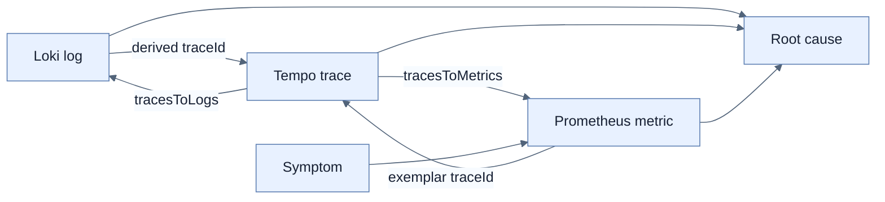

# Logs·Metrics·Traces 상관관계 연결

## 한눈에 보기

Signal을 모두 수집해도 서로 이동할 수 없으면 사람이 trace ID와 시간 범위를 복사해야 한다. Grafana data source correlation은 Loki log → Tempo trace, Tempo span → Loki logs, Tempo span → Prometheus metrics를 link로 연결해 symptom에서 root cause까지의 탐색 시간을 줄인다.

## 1. 왜 이게 필요한가

한 error log가 어느 end-to-end request에 속하는지, 느린 span이 그 시간대 전체 사용자에게 영향을 줬는지, 같은 trace의 다른 service log는 무엇인지가 진단의 핵심이다. 상관관계가 없으면 세 저장소가 각자 정확해도 조사자가 수동으로 합쳐야 한다.

## 2. 어떻게 동작하는가

- **Log → Trace**: Loki `derivedFields.matcherRegex`가 JSON의 `traceId`를 추출해 Tempo data source의 `View Trace` link를 만든다.
- **Trace → Log**: Tempo `tracesToLogsV2`가 `service.name`을 Loki의 `service_name` label로 mapping하고 trace ID와 span 앞뒤 time shift를 넣은 LogQL query를 생성한다.
- **Trace → Metric**: `tracesToMetrics`가 span의 service tag를 Prometheus label에 mapping하고 생성 수·latency·notification outcome PromQL을 실행한다.
- **Metric → Trace**: Prometheus exemplar에 trace ID가 있을 때 해당 시점의 대표 trace로 이동할 수 있다.

Correlation은 naming convention과 context propagation이 정확해야 작동한다. Application `service.name`, Collector resource label, Loki field name, Grafana regex가 서로 어긋나면 link가 사라진다. 또한 trace와 log retention, clock skew, time window를 맞춰야 한다.

## 3. 그림으로 보기

## 4. 이 노트에 나온 용어

- **derived field**: log field를 regex 등으로 추출해 다른 data source link로 변환한 Grafana field.
- **exemplar**: 집계 metric sample에 연결된 대표 trace 같은 고-cardinality 관측 예시.
- **tracesToLogs**: Tempo trace/span context로 Loki log query를 만드는 Grafana data source 기능.
- **tracesToMetrics**: Tempo span tag와 시간 범위로 Prometheus query를 만드는 Grafana 기능.

## 7. 연결

- [[03-structured-logging-with-loki-and-grafana]] — log JSON에 trace ID가 있어야 한다.
- [[04-metrics-with-micrometer-prometheus-and-grafana]] — 추세·alert에서 이상 범위를 찾는다.
- [[05-tracing-with-opentelemetry-and-tempo]] — 개별 요청의 causal path를 연다.

## 8. 스스로 확인

- 전체 1차 정리 후: error-rate alert에서 시작해 느린 notification code까지 가는 signal navigation 경로를 설명한다.

<!-- ==== 아래는 내 영역 · 스킬 수정 금지 ==== -->

## 내 설명 시도

## 막혔던 지점

## 리뷰 이력

