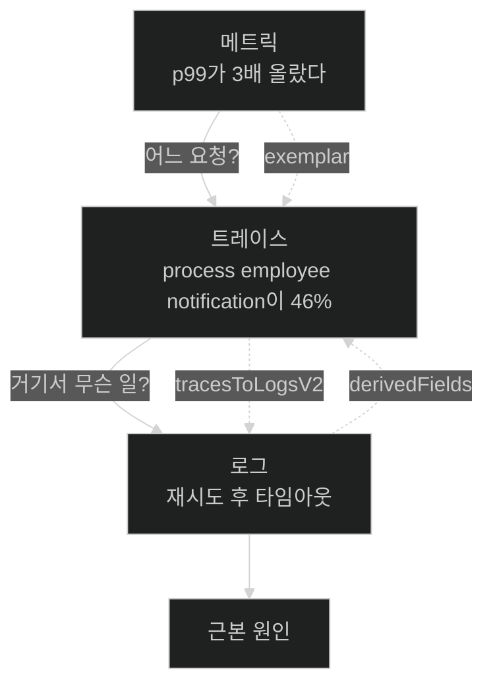

# Chapter 13 개념 지도 — Observability with Spring Boot 4

> 책 pp. 347–397 / PDF pp. 372–422. 노트 15개, 용어 74개, 책 이미지 6개.
> 원문 커버리지는 [[_coverage]], 용어 정의는 [[_glossary]]에 있다.

이 장은 **"떠 있는가"에서 "왜 느린가"로** 질문을 바꾸는 방법을 다룬다. 51쪽 내내 하나의 애플리케이션(Chapter 12의 Employee)에 세 신호를 차례로 붙이고, 마지막에 그 셋을 서로 잇는다.

---

## 축 1 — 신호 하나가 켜지는 네 박자

세 신호가 **정확히 같은 리듬**으로 붙는다. 이 반복을 알아채면 나머지 두 벌은 빠르게 읽힌다.

| 박자 | 로그 | 메트릭 | 트레이스 |
|---|---|---|---|
| ① 흐름 | [[03-structured-logging-with-loki-and-grafana]] | [[04-metrics-with-micrometer-prometheus-and-grafana]] | [[05-tracing-with-opentelemetry-and-tempo]] |
| ② 인프라 | [[03a-setting-up-the-logging-infrastructure]] | [[04a-setting-up-prometheus-for-metrics]] | [[05a-setting-up-grafana-tempo]] |
| ③ 계측 | [[03b-instrumenting-the-application-for-logging]] | [[04b-adding-custom-business-metrics-with-micrometer]] | [[05b-enabling-trace-export-and-kafka-propagation]] |
| ④ 검증 | [[03c-verifying-logs-in-grafana]] | [[04c-verifying-metrics-in-prometheus-and-grafana]] | [[05c-verifying-distributed-traces-in-tempo]] |
| 저장소 | Loki | Prometheus | Tempo |

앞의 [[01-three-pillars-of-observability]]와 [[02-designing-an-observability-architecture]]가 이 세 벌의 **공통 전제**를 깔고, 마지막 [[06-correlating-logs-metrics-and-traces]]가 셋을 **다시 묶는다.**

---

## 축 2 — 같은 세 파일이 세 번 자란다

②의 "인프라 세우기"는 매번 **같은 파일에 항목을 더하는** 작업이다. 파일별로 보면 장 전체의 구조가 한눈에 보인다.

| 파일 | 로그 절에서 | 메트릭 절에서 | 트레이스 절에서 |
|---|---|---|---|
| `docker-compose.yml` | loki · otel-collector · grafana | **+ prometheus** | **+ tempo** |
| `otel-collector-config.yml` | receivers · processors · `logs` 파이프라인 | **+ `metrics` 파이프라인** | **+ `traces` 파이프라인** |
| `grafana-datasources.yml` | Loki | **+ Prometheus** | **+ Tempo**, 그리고 [[06-correlating-logs-metrics-and-traces]]에서 **전면 재작성** |
| `application.yml` | 로그 OTLP 켜기, 트레이싱·메트릭 **끄기** | 메트릭 OTLP **켜기** | 트레이싱 **켜기** + Kafka 전파 |
| 신규 파일 | — | `prometheus.yml` | `tempo.yml` |

**`receivers`와 `processors`는 세 파이프라인이 공유한다.** 그래서 `resource` 프로세서가 붙이는 `service.name`이 세 신호에 모두 실리고, 그 일관성이 [[06-correlating-logs-metrics-and-traces]]에서 셋을 잇는 근거가 된다.

---

## 축 3 — 조사 하나가 세 신호를 지나가는 길

이 장의 목적은 개별 기능이 아니라 **이 이동 경로**다.

| 이동 | 실선(개념) | 점선(설정) |
|---|---|---|
| 메트릭 → 트레이스 | [[01-three-pillars-of-observability]]의 조사 흐름 | `exemplarTraceIdDestinations` |
| 트레이스 → 로그 | [[05c-verifying-distributed-traces-in-tempo]]가 지목한 구간 | `tracesToLogsV2` |
| 로그 → 트레이스 | 오류 로그에서 출발 | `derivedFields` |

**개념은 1절에 있었고 설정은 6절에 있다.** 그 사이 네 절이 재료를 만든다.

---

## 축 4 — 비동기 경계가 만드는 반복 주제

이 애플리케이션의 워크플로는 HTTP 응답 뒤에도 이어진다. 그 사실이 세 신호 모두에서 **각각 다른 문제**로 나타난다.

| 신호 | 비동기가 만드는 문제 | 이 장의 답 |
|---|---|---|
| 메트릭 | HTTP 지표는 정상인데 알림이 전멸할 수 있다 | `employee.notification.count`의 `outcome` 태그 ([[04b-adding-custom-business-metrics-with-micrometer]]) |
| 트레이스 | Kafka에서 **컨텍스트가 끊긴다** | `kafka.listener/template.observation-enabled` ([[05b-enabling-trace-export-and-kafka-propagation]]) |
| 로그 | 소비자 로그가 어느 요청의 것인지 모른다 | traceId를 MDC에서 실어 보낸다 ([[03b-instrumenting-the-application-for-logging]]) |

[[05-tracing-with-opentelemetry-and-tempo]]가 **전파 경계**라는 이름으로 이 주제를 정면에서 다루고, [[05c-verifying-distributed-traces-in-tempo]]의 waterfall이 그것이 성공했음을 눈으로 증명한다.

---

## 축 5 — 카디널리티라는 관통 제약

세 신호 모두 "무엇을 태그·라벨로 올릴 것인가"에서 같은 함정을 만난다.

| 위치 | 결정 | 잘못하면 |
|---|---|---|
| Loki 라벨 승격 ([[03a-setting-up-the-logging-infrastructure]]) | `loki.resource.labels`에 둘만 | 스트림 폭발 |
| 메트릭 태그 ([[04b-adding-custom-business-metrics-with-micrometer]]) | `role`, `outcome` | 시계열 폭발 |
| span 속성 ([[05b-enabling-trace-export-and-kafka-propagation]]) | `lowCardinalityKeyValue` | 색인 폭발 |

**API 이름이 `lowCardinalityKeyValue`인 것 자체가 경고**다. 책은 [[05b-enabling-trace-export-and-kafka-propagation]]에서 Note로 이 원칙을 명시한다 — 낮은 카디널리티를 기본으로, 높은 것은 선택적으로, 메트릭이나 널리 색인되는 필드에는 넣지 말 것.

---

## 축 6 — 이 장이 남긴 원문의 오류

전체 표는 [[_coverage]] 5절에 있다. 대표적인 것만 옮긴다.

| 위치 | 문제 | 노트 |
|---|---|---|
| p.357 vs Figure 13.4·13.11 | 설정은 `com.learningspringboot4`, 화면 로그는 **`com.springbootlearning4`** | [[03b-instrumenting-the-application-for-logging]] |
| p.374 | "모든 `System.out`을 SLF4J로 바꿨다"는 Note와 달리 **`System.out.println`이 남아 있다** | [[04b-adding-custom-business-metrics-with-micrometer]] |
| p.374 vs p.375 | 설명이 언급한 `recordNotificationMetric("received")`·`("duplicate")` 호출이 인쇄된 코드에 없다 | [[04b-adding-custom-business-metrics-with-micrometer]] |
| pp.388–389 | Trace ID가 두 곳에서 다르게 인쇄되고 16진수가 아닌 문자가 섞여 있다 | [[05c-verifying-distributed-traces-in-tempo]] |
| p.377 vs Figure 13.7 | `Notification Failure Rate` 0%와 `failed 8`이 동시에 표시된다(순간 rate vs 누적 count) | [[04c-verifying-metrics-in-prometheus-and-grafana]] |
| p.368 | Prometheus가 긁을 9464 포트를 Collector 서비스에 노출하는 변경이 없다 | [[04a-setting-up-prometheus-for-metrics]] |

---

## 앞뒤 Chapter와의 연결

- **← Chapter 12** — 이 장의 Employee 애플리케이션(Kafka 이벤트, DLT, 멱등 처리)이 그 장의 산물이다. `Math.random() < 0.5`로 절반을 실패시키는 장치도 거기서 왔다.
- **← Chapter 5** — [[../../part-2-creating-an-application-with-spring-boot/chapter-5-testing-with-spring-boot/01-junit-6-and-focused-test-starters|Testing with Spring Boot]]: `spring-boot-starter-actuator-test`·`-opentelemetry-test`가 그 장의 집중형 test starter 전략을 따른다.
- **← Chapter 7** — [[../../part-3-releasing-an-application-with-spring-boot/chapter-7-releasing-an-application-with-spring-boot/_map|Releasing an Application]]: 배포한 인스턴스를 여러 대로 늘리면 이 장의 상관관계가 없이는 조사가 성립하지 않는다.
- **→ Chapter 14** — [[../../part-6-building-intelligent-applications-with-spring-ai/chapter-14-building-intelligent-applications-with-spring-ai/_map|Spring AI]]: LLM 호출도 지연과 실패가 잦은 외부 연동이라 같은 계측이 필요하다.

특히 **Chapter 12와의 짝**이 결정적이다. 이 장의 세 신호가 각각 다루는 어려움(비동기 구간의 메트릭, Kafka 전파 경계, 소비자 로그의 소속)이 전부 **그 장이 만든 이벤트 기반 구조**에서 나온다. 동기 CRUD 애플리케이션이었다면 이 장의 절반은 필요 없었을 것이다.
