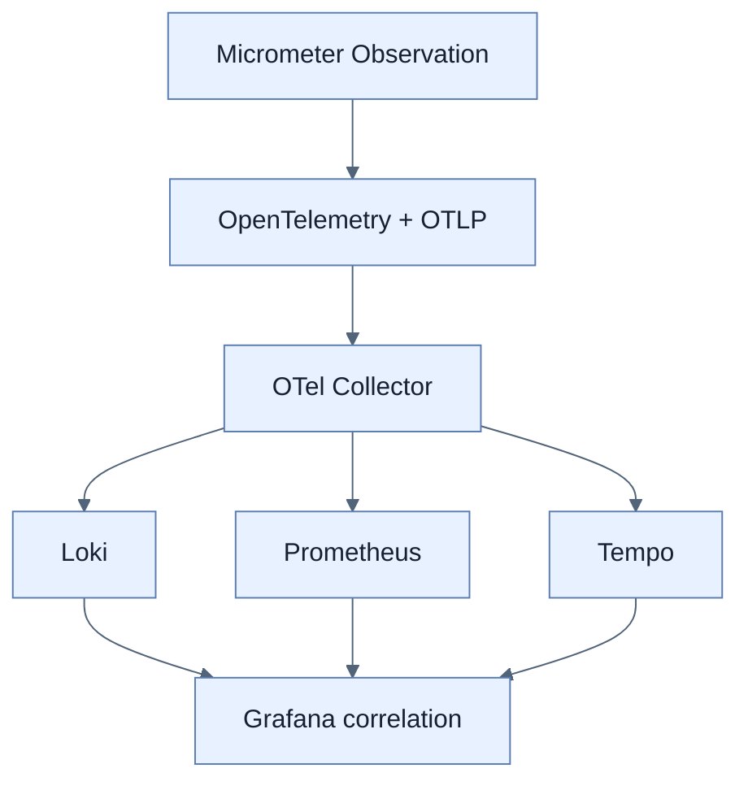

# Chapter 13 — Observability with Spring Boot 4

## 학습 경로

1. [[01-three-pillars-of-observability|Logs·metrics·traces]]
2. [[02-designing-an-observability-architecture|관측성 pipeline]]
3. [[03-structured-logging-with-loki-and-grafana|Structured logging]]
4. [[04-metrics-with-micrometer-prometheus-and-grafana|Business metrics]]
5. [[05-tracing-with-opentelemetry-and-tempo|Distributed tracing]]
6. [[06-correlating-logs-metrics-and-traces|Signal correlation]]

## 책의 범위

- 본문: pp. 347–397
- PDF: pp. 372–422
- 실습 stack: Spring Boot 4 + Micrometer/OTel + Collector + Loki/Prometheus/Tempo + Grafana

