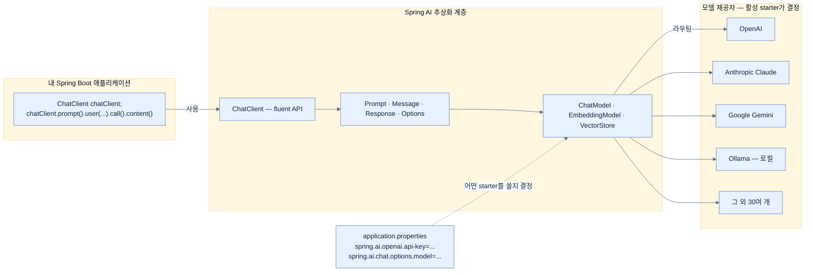

# LLM이 못 하는 일과 Spring AI가 놓는 추상화 계층

## 한눈에 보기

| 항목 | 내용 |
|---|---|
| 문제 | LLM은 우리 DB·API·오늘 날짜를 모르는데, provider SDK에 직접 붙으면 그 무지를 메우는 코드가 vendor에 못 박힌다 |
| 해결 | `ChatModel`·`EmbeddingModel`·`VectorStore`·`ChatClient`라는 공통 interface를 두고, provider마다 starter가 그 뒤를 구현한다 |
| 대가 | provider마다 지원 capability가 완전히 같지는 않다 — 추상화는 코드를 지켜 주지만 기능 차이까지 지워 주지는 않는다 |
| 다음 | `ChatClient`로 첫 호출을 만든다 → [[02-building-llm-integrations-with-chatclient]] |

## 1. 왜 이게 필요한가

사내 쇼핑몰에 "AI 고객 상담"을 붙이라는 요구가 들어왔다고 하자. 첫 질문부터 막힌다.

> "spring-book 지금 얼마예요?"

model은 이 질문에 **자신 있게 틀린 답**을 한다. 가격표는 우리 DB의 `PRICES` 테이블에 있고, model은 그 테이블을 본 적이 없기 때문이다. 두 번째 질문도 마찬가지다.

> "지금 몇 시죠?"

model은 시계를 갖고 있지 않다. 세 번째 질문은 더 나쁘다.

> "환불 정책이 어떻게 되나요?"

이번엔 **그럴듯한 답이 나온다.** "보통 30일 이내 환불 가능합니다" 같은. 우리 회사 정책은 14일인데도. 이게 셋 중 가장 위험하다 — 틀렸다는 신호가 응답 어디에도 없다.

세 실패의 원인은 하나다. **[[LLM]]**(= 방대한 text로 언어의 통계 패턴을 학습한 model)은 학습 때 익힌 패턴으로 다음에 올 **[[토큰]]**(= 단어·단어 조각·구두점 단위)을 예측할 뿐, 우리 시스템에 살아 있는 연결을 갖고 있지 않다. DB를 조회하지 못하고, API를 부르지 못하고, 실시간 정보를 가져오지 못한다. 그래서 최근 사건·현재 business state·사용자별 record·운영 데이터를 모른다.

이 간극을 메우는 것이 RAG·tool calling·prompt engineering이고, 이 장 전체가 그 세 가지를 Spring 방식으로 붙이는 이야기다.

그런데 Java 개발자에게는 **문제가 하나 더** 있다. Spring AI 이전에는 LLM을 붙이려면 vendor SDK를 고르고, 그 SDK의 request/response 형식을 익히고, HTTP 호출을 손으로 배선해야 했다. 그러면 application이 특정 provider에 강하게 묶인다. vendor를 바꾸거나 여러 model을 동시에 쓰기가 어려워진다. 아직 model 시장이 몇 달 단위로 뒤집히는데 말이다.

Spring AI가 푸는 것은 **이 두 번째 문제**다. 첫 번째(model이 우리 데이터를 모른다)는 여전히 우리가 RAG와 tool calling으로 풀어야 하지만, 그 해법을 **provider 중립적으로** 쓸 수 있게 만든다.

## 2. 어떻게 동작하는가

### 2.1 먼저, model의 세 가지 물리적 제약

RAG든 tool calling이든 결국 "prompt에 뭘 얼마나 넣을까"의 문제로 귀결되므로, 예산의 단위를 먼저 알아야 한다.

**[[컨텍스트-윈도]]**(= 한 상호작용에서 다룰 수 있는 최대 text량)가 첫 번째다. 여기서 놓치기 쉬운 점은 **prompt와 생성될 응답이 같은 예산을 나눠 쓴다**는 것이다. 대화 이력 20턴을 넣으면 그만큼 답이 짧아진다. 이 창이 넓어야 chat memory와 RAG가 성립하지만, 넓힌 만큼 token 소비와 비용도 커진다.

**[[temperature]]**(= 출력 token 선택의 무작위성 조절 parameter)가 두 번째다. 낮으면 같은 질문에 같은 답이 나오기 쉽고, 높으면 다양하지만 **[[환각]]**(= 그럴듯하지만 사실과 다르거나 근거 없는 응답)의 가능성이 커진다.

**[[토큰-사용량]]**(= 한 요청이 소비한 입력·출력 token 수)이 세 번째다. provider가 보통 token 단위로 과금하므로, 이 수치 하나가 비용·성능·확장성을 동시에 대변한다. [[07b-ai-and-observability]]에서 이걸 metric으로 뽑는 이유가 여기 있다.

### 2.2 Spring AI가 놓는 계층

Spring AI는 provider들 앞에 **[[추상화-계층]]**(= application과 여러 구현 사이의 공통 interface 층)을 놓는다. 네 개의 이름만 알면 된다.

| 추상 | 맡는 일 | 이 장에서 쓰이는 곳 |
|---|---|---|
| **[[ChatModel]]**(= provider 중립 저수준 chat abstraction) | 한 번의 model 호출 | starter가 구현, 직접 쓸 일은 적다 |
| **[[EmbeddingModel]]**(= text를 벡터로 바꾸는 model의 추상) | 의미의 수치화 | RAG 색인·질의 → [[05a-embeddings-and-vector-stores]] |
| **[[VectorStore]]**(= 벡터 저장과 유사도 검색의 추상) | 의미 기반 검색 | pgvector 뒤에 숨는다 |
| **[[ChatClient]]**(= fluent 고수준 client) | prompt 조립 → 실행 → 응답 소비 | 우리가 실제로 만지는 것 |

동작 순서는 auto-configuration의 익숙한 순서 그대로다.

1. classpath에 **[[Spring-AI-starter]]**(= provider별 구현과 auto-configuration을 담은 의존성)가 있는지 본다. 이 단계가 필요한 이유는, 어떤 provider를 쓸지가 **의존성으로 선언**되어야 코드가 provider 이름을 몰라도 되기 때문이다.
2. `spring.ai.<provider>.*` property를 읽는다. key·model 이름·temperature가 코드 밖에 남는 이유다.
3. 그 provider용 `ChatModel` bean을 만든다.
4. 그 위에 `ChatClient.Builder`를 올려 주입 가능한 상태로 만든다.

배선 코드는 한 줄도 우리가 쓰지 않는다.

### 2.3 이미 아는 패턴이다

책이 드는 비유가 정확하다. `DataSource`를 H2에서 PostgreSQL로 바꿔도 repository 코드는 그대로고, `JpaRepository` 구현이 바뀌어도 service 코드는 그대로다. Spring AI의 provider 교체도 같은 자리에 있다.

**비유가 깨지는 지점**: `DataSource`는 뒤에 무엇이 있든 `SELECT`가 같은 결과를 준다. model provider는 그렇지 않다. 같은 prompt를 OpenAI와 Anthropic에 보내면 **다른 문장이 나온다.** tool calling 지원 여부, structured output의 정확도, 지원하는 modality도 provider마다 다르다. 즉 Spring AI가 지켜 주는 것은 **코드의 모양**이지 **응답의 동등성**이 아니다. provider를 바꾸면 prompt와 평가를 다시 돌려야 한다([[07a-evaluating-llm-response-quality]]가 필요한 또 하나의 이유다).

### 2.4 이름의 유래

`ChatClient`가 `ChatModel`이 아니라 **Client**인 것은 `WebClient`·`RestClient`와 같은 자리를 노렸기 때문이다. "요청을 fluent하게 조립해서 원격 시스템에 보내고 응답을 꺼낸다"는 역할이 같다. 그래서 `prompt().user(...).call().content()`가 `get().uri(...).retrieve().body(...)`처럼 읽힌다. 반대로 `ChatModel`은 "model 한 번 호출"이라는 더 낮은 층이라 `Model`이라는 이름을 쓴다.

### 2.5 Spring AI가 제공하는 것들

책이 나열하는 15개 capability는 결국 세 갈래다.

- **model과 말하기**: chat 상호작용, 구조화 응답, 스트리밍, multimodal, audio, moderation
- **model에 맥락 주기**: tool calling, advisor 합성, RAG, 벡터 DB 통합, ETL pipeline, 대화 메모리
- **운영하기**: Micrometer observability, LLM 평가, 30+ provider 지원, Testcontainers 통합

RAG와 tool calling이 **경쟁이 아니라 분업**이라는 점은 이 장에서 반복해서 나온다. tool calling은 가격·재고·현재 시각 같은 **구조화된 실시간 데이터**, RAG는 문서·계약·정책 같은 **대량의 비정형 지식**을 맡는다.

## 3. 그림으로 보기

Figure 14.1(책 p.404)의 재현이다. 왼쪽이 우리 코드, 가운데가 Spring AI, 오른쪽이 provider다. 설정 파일이 **가운데 층으로 들어가는** 화살표가 핵심이다 — provider 선택이 코드가 아니라 설정에서 일어난다는 뜻이다.

## 4. 이 노트에 나온 용어

- **[[LLM]]**: 언어의 통계 패턴을 학습해 token sequence를 생성하는 model.
- **[[토큰]]**: model이 입출력을 계산하는 최소 text 단위.
- **[[컨텍스트-윈도]]**: prompt와 응답이 함께 나눠 쓰는 최대 text 예산.
- **[[temperature]]**: 출력의 무작위성을 조절하는 parameter.
- **[[환각]]**: 근거 없이 사실처럼 제시되는 잘못된 응답.
- **[[토큰-사용량]]**: 요청이 소비한 입력·출력 token 수. 비용의 단위.
- **[[추상화-계층]]**: application과 provider 구현 사이의 공통 interface 층.
- **[[ChatModel]]**: provider 중립 저수준 chat abstraction.
- **[[EmbeddingModel]]**: text를 벡터로 바꾸는 model의 추상.
- **[[VectorStore]]**: 벡터 저장·유사도 검색의 추상.
- **[[ChatClient]]**: prompt 조립부터 응답 소비까지의 fluent 고수준 client.
- **[[Spring-AI-starter]]**: provider 구현과 auto-configuration을 담은 의존성.

## 5. 자주 헷갈리는 것

**"컨텍스트 윈도가 크면 RAG가 필요 없다"** — 넣을 수 있는 양과 넣어야 할 양은 다르다. 사내 문서가 수천 쪽이면 아무리 창이 넓어도 전부는 못 넣고, 넣을 수 있다 해도 매 요청 수천 쪽 분량의 token을 지불하게 된다. RAG는 "관련된 몇 조각만" 넣기 위한 것이다.

**"temperature를 0으로 하면 항상 같은 답"** — 결정적에 가까워질 뿐 provider·infra 사정으로 완전히 같다는 보장은 없다. 그래서 [[07a-evaluating-llm-response-quality]]가 문자열 비교가 아닌 의미 평가를 쓴다.

**`ChatModel` vs `ChatClient`** — 층이 다르다. `ChatModel`은 "한 번 호출", `ChatClient`는 "prompt 조립 + advisor 체인 + 응답 변환"까지 포함한다. 이 장의 코드는 거의 전부 `ChatClient`를 쓰고, `ChatModel`은 [[07a-evaluating-llm-response-quality]]의 test에서 evaluator를 직접 만들 때만 등장한다.

## 6. 언제 안 쓰나 / 경계

- **결정적 정답이 있는 일**에 LLM을 끼우지 않는다. 세금 계산, 재고 차감, 권한 판정은 확률적 생성이 아니라 코드가 해야 한다. model은 그 결과를 **말로 옮기는** 자리에 둔다.
- **provider 중립성이 요구사항이 아니라면** 추상화가 늘 이득인 것은 아니다. 다만 Spring AI는 provider 고유 옵션도 `spring.ai.<provider>.*`로 열어 두므로 손해가 크지 않다.
- **추상화가 응답 품질을 옮겨 주지는 않는다.** provider를 바꾸면 prompt·평가·비용 계산을 다시 해야 한다.

## 7. 연결

- [[02-building-llm-integrations-with-chatclient]] — 여기서 설명한 추상을 실제 프로젝트 설정과 첫 endpoint로 옮긴다.
- [[04b-tool-calling]] — "model이 우리 DB를 모른다" 문제를 구조화된 실시간 데이터 쪽에서 푼다.
- [[05-implementing-rag-with-vector-stores-and-advisors]] — 같은 문제를 대량 비정형 문서 쪽에서 푼다.
- [[07-operating-llm-applications]] — 확률적 시스템을 production에서 운영할 때 생기는 네 가지 질문.

## 8. 스스로 확인

- "model이 우리 가격표를 모른다"는 문제를 tool calling과 RAG 중 어느 쪽으로 풀어야 하고, 그 판단 기준은 무엇인가?
- 컨텍스트 윈도를 두 배로 늘리면 무엇이 좋아지고 무엇이 나빠지는가? 숫자로 설명해 보라.
- `DataSource` 교체와 model provider 교체의 비유는 어디에서 깨지는가?
- `ChatClient`가 `ChatModel`이 아니라 `Client`라는 이름을 갖게 된 이유는?

<!-- ==== 아래는 내 영역 · 스킬 수정 금지 ==== -->

## 내 설명 시도

## 막혔던 지점

## 리뷰 이력
