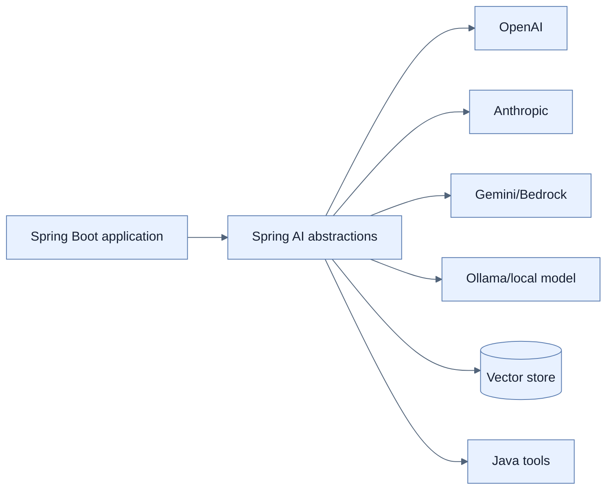

# LLM과 Spring AI 소개

## 한눈에 보기

LLM은 prompt 다음에 올 token sequence의 확률을 예측해 text를 생성한다. Spring AI는 provider별 SDK 위에 `ChatModel`, `EmbeddingModel`, `VectorStore`, `ChatClient` 같은 공통 abstraction을 두어 Spring Boot application이 provider 세부 형식보다 domain workflow에 집중하게 한다.

## 1. 왜 이게 필요한가

LLM 자체는 application DB, 최신 가격, private document, 실시간 API에 접근하지 않는다. Training pattern만으로 그럴듯하지만 틀린 답을 만들 수 있다. Enterprise integration은 prompt뿐 아니라 live tool, retrieval, memory, observability, security를 orchestration해야 한다.

Provider SDK에 직접 묶이면 request/response shape와 인증, streaming 방식이 business code에 스며든다. Spring AI starter가 provider adapter와 model bean을 구성하면 공통 API로 provider 교체와 여러 model 조합의 비용을 낮춘다. 다만 provider마다 지원 capability와 behavior가 완전히 같아지는 것은 아니다.

## 2. 어떻게 동작하는가

- **Context window**는 input prompt, history, retrieved context, output이 함께 차지하는 최대 token 범위다.
- **Temperature**가 낮으면 더 결정적이고, 높으면 다양하지만 hallucination 위험이 커질 수 있다.
- **Token usage**는 latency·context budget·provider 비용의 공통 단위다.

Spring AI는 chat·structured output·streaming·tool calling·advisor composition·RAG·vector store·ETL·chat memory·multimodal·moderation·Micrometer observation·evaluation을 Spring 방식으로 엮는다. RAG는 비정형 private knowledge를, tool calling은 live structured operation을 연결하므로 상호 보완적이다.

## 3. 그림으로 보기

## 4. 이 노트에 나온 용어

- **large language model**: 대규모 corpus에서 언어의 통계 패턴을 학습해 token sequence를 생성하는 model.
- **token**: model이 입력·출력을 계산하는 word, word piece, punctuation 등의 text 단위.
- **context window**: 한 interaction에서 model이 처리할 수 있는 전체 token 범위.
- **temperature**: output token 선택의 무작위성과 다양성을 조절하는 parameter.
- **hallucination**: 근거 없이 사실처럼 들리는 잘못된 내용을 model이 생성하는 현상.

## 7. 연결

- [[02-building-llm-integrations-with-chatclient]] — 공통 abstraction으로 첫 model call을 만든다.
- [[05-implementing-rag-with-vector-stores-and-advisors]] — private document로 답을 grounding한다.
- [[07-operating-llm-applications]] — 확률적 system의 품질·비용·보안을 운영한다.

## 8. 스스로 확인

- 전체 1차 정리 후: context window·temperature·token usage가 품질·비용에 주는 영향을 설명한다.

<!-- ==== 아래는 내 영역 · 스킬 수정 금지 ==== -->

## 내 설명 시도

## 막혔던 지점

## 리뷰 이력

