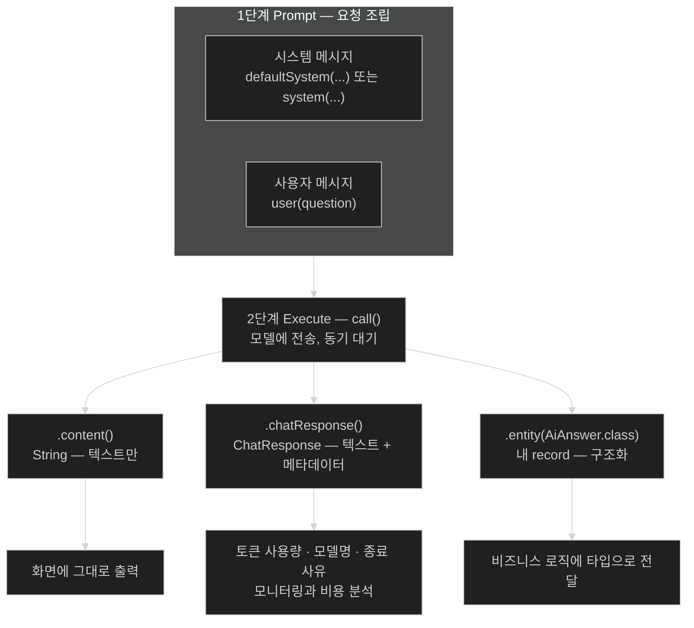

# ChatClient로 첫 LLM 호출 만들기 — 세 가지 응답 형태

## 한눈에 보기

| 응답 형태 | 호출 | 반환 | 쓰는 자리 |
|---|---|---|---|
| text | `.call().content()` | `String` | 화면에 그대로 뿌리는 챗 응답 |
| 전체 응답 | `.call().chatResponse()` | `ChatResponse` | token 사용량·model 이름·종료 사유가 필요할 때 |
| 구조화 | `.call().entity(AiAnswer.class)` | 내 record | 응답을 business logic에 넘길 때 |

의존성 두 개(`Spring Web`, `Open AI`)와 property 세 줄이면 여기까지 온다. 배선 코드는 없다.

## 1. 왜 이게 필요한가

`curl` 한 줄로 OpenAI API를 직접 부르는 것과 무엇이 다른지부터 보자. 직접 부르면 이런 코드를 쓰게 된다.

```text
POST https://api.openai.com/v1/chat/completions
Authorization: Bearer sk-...
{"model":"gpt-4o-mini","messages":[{"role":"system","content":"..."},
                                   {"role":"user","content":"..."}],
 "temperature":0.2}
```

그리고 응답 JSON에서 `choices[0].message.content`를 꺼낸다. 여기에 이미 네 가지가 코드에 못 박힌다 — endpoint URL, 인증 헤더 형식, `messages` 배열의 role 문자열, 응답의 필드 경로다. provider를 바꾸면 넷 다 바뀐다.

Spring AI는 이 넷을 전부 starter 뒤로 밀어 넣고, 우리에게 **[[fluent-API]]**(= 메서드를 이어 붙여 요청을 조립하는 API 양식) 하나만 남긴다.

```java
chatClient.prompt().user(question).call().content()
```

`RestClient`의 `get().uri(...).retrieve().body(String.class)`와 리듬이 같다. 의도적으로 같게 만든 것이다.

## 2. 어떻게 동작하는가

### 2.1 프로젝트 만들기

start.spring.io에서 Maven / Java 25 / Spring Boot 4.1.x를 고르고 group `com.learningspringboot4`, artifact `ch14`로 만든다. 의존성은 **두 개뿐**이다.

- **Spring Web** → `spring-boot-starter-webmvc`. Servlet 기반 웹 스택.
- **Open AI** → `spring-ai-starter-model-openai`. Spring AI ↔ OpenAI 통합을 auto-configure하고 `ChatClient`가 쓸 model bean을 만든다.

test 쪽으로 `spring-boot-starter-webmvc-test`가 따라온다. AI 전용 설정 클래스나 HTTP client 코드는 없다.

### 2.2 설정 세 줄

```properties
spring.ai.openai.api-key=${OPENAI_API_KEY}
spring.ai.openai.chat.options.model=gpt-4o-mini
spring.ai.openai.chat.options.temperature=0.2
```

- `api-key=${OPENAI_API_KEY}`: 시작 시 환경 변수에서 읽는다. 값이 파일에 남지 않는다.
- `model=gpt-4o-mini`: 어떤 model을 쓸지. 이름만 바꾸면 model이 바뀐다.
- `temperature=0.2`: **[[temperature]]**(= 출력의 무작위성 조절 parameter). Java·Spring 기술 assistant처럼 **재현 가능한 정확한 답**이 필요한 용도에는 0.2–0.3이 낫고, 브레인스토밍·아이디에이션·창작에는 높은 값이 낫다.

`openai` 자리를 다른 provider 이름으로 바꾸면 그 provider 설정이 된다 — `spring.ai.anthropic.api-key`, `spring.ai.vertex.ai.gemini.api-key`가 같은 패턴이다.

key는 환경 변수로 내보낸다.

```bash
export OPENAI_API_KEY=sk-...your-key-here...   # macOS / Linux
$env:OPENAI_API_KEY = "sk-...your-key-here..." # Windows PowerShell
echo $OPENAI_API_KEY                            # 셸에 보이는지 확인
```

책이 여기에서 못을 박는다 — **API key를 소스 파일에 절대 하드코딩하지 않는다.** 환경 변수, 버전 관리에서 제외한 `.env`, 또는 AWS Secrets Manager·HashiCorp Vault 같은 **[[시크릿-매니저]]**(= 자격 증명을 코드 밖에서 암호화 보관·통제하는 전용 시스템)를 쓴다. 이 주제는 [[07d-security-best-practices-for-ai-applications]]에서 rotation·환경별 분리까지 이어진다.

> OpenAI 계정과 API key가 필요하고 유료 계정이어야 한다. 이 장의 예제를 전부 돌리는 데 $5면 충분하다. **automatic recharge를 끄고 usage limit을 설정**해 두면 예상 밖 과금을 막을 수 있다.

### 2.3 시작 시 실제로 벌어지는 일

1. auto-configuration이 classpath에서 provider starter를 감지한다.
2. `spring.ai.openai.*` property를 읽는다.
3. 해당 `ChatModel` bean을 만든다.
4. 주입 가능한 `ChatClient.Builder`를 노출한다.

이 순서가 중요한 이유는, **3번까지가 전부 설정으로 결정**되기 때문이다. 우리 코드가 등장하는 것은 4번의 builder를 받아 기본 행동을 얹는 순간부터다.

### 2.4 상호작용의 세 단계

책은 모든 `ChatClient` 상호작용을 세 단계로 정리한다.

- **Prompt**: 지시·context·사용자 입력을 합쳐 요청을 구성한다. **[[시스템-메시지]]**(= model의 역할·톤·행동을 정하는 메시지)가 역할을, **[[사용자-메시지]]**(= 실제 요청이나 질문)가 내용을 담는다.
- **Execute**: 구성된 prompt를 model에 보낸다. 동기 또는 비동기.
- **Respond**: 결과를 필요한 형태로 꺼낸다. 여기가 세 갈래로 갈린다.

### 2.5 기본 행동을 한 번만 정한다

```java
@Configuration
public class AiConfig {

    @Bean
    ChatClient chatClient(ChatClient.Builder builder) {
        return builder
                .defaultSystem("""
                    You are a helpful technical specialist, Java and Spring
                    Boot assistant for Java developers.
                    Keep answers focused and practical.
                    """)
                .build();
    }
}
```

핵심은 `defaultSystem(...)` 한 줄이다. 여기 넣은 시스템 메시지가 **이 `ChatClient`로 나가는 모든 요청에 자동으로 붙는다.** controller마다 "너는 Java 전문가야"를 반복해 쓰지 않아도 되고, 문구를 고칠 때 한 곳만 고치면 된다. persona가 코드에 흩어지지 않는다는 것이 요점이다.

### 2.6 형태 1 — text

```java
@RestController
public class AiController {

    private final ChatClient chatClient;

    public AiController(ChatClient chatClient) {
        this.chatClient = chatClient;
    }

    @GetMapping("/api/ai/text-response/java-assistant/ask")
    public String askReturnText(@RequestParam String question) {
        return chatClient.prompt()
                .user(question)
                .call()
                .content();
    }
}
```

네 개의 호출이 각각 한 가지 일만 한다.

| 호출 | 하는 일 |
|---|---|
| `prompt()` | prompt 조립 시작 |
| `.user(question)` | 사용자 메시지 추가 (시스템 메시지는 `defaultSystem`이 이미 붙였다) |
| `.call()` | model에 보내고 **동기적으로 기다린다** |
| `.content()` | 생성된 text만 `String`으로 꺼낸다 |

`curl`로 "What is Spring Boot, and why should I use it?"을 던지면 마크다운이 섞인 긴 설명이 그대로 문자열로 돌아온다. 화면에 뿌리기엔 충분하지만, **이 응답이 얼마짜리였는지는 알 수 없다.**

### 2.7 형태 2 — 전체 ChatResponse

```java
@GetMapping("/api/ai/chat-response/java-assistant/ask")
public ChatResponse ask(@RequestParam String question) {
    return chatClient.prompt()
            .user(question)
            .call()
            .chatResponse();
}
```

`.content()` 대신 `.chatResponse()`를 부르면 **[[ChatResponse]]**(= 생성 text와 metadata를 함께 담은 완전한 결과 객체)가 통째로 나온다. 응답의 뼈대는 두 갈래다.

```json
{
  "metadata": {
    "id": "chatcmpl-DanbklBraVdjfuBfFXUQH8PywewYd",
    "model": "gpt-4o-mini-2024-07-18",
    "rateLimit": { },
    "usage": {
      "promptTokens": 46,
      "completionTokens": 438,
      "totalTokens": 484,
      "cacheReadInputTokens": 0
    }
  },
  "result": {
    "metadata": { "finishReason": "STOP" },
    "output": {
      "messageType": "ASSISTANT",
      "text": "Spring Boot is an open-source framework ...",
      "toolCalls": []
    }
  }
}
```

- `metadata`는 **요청 실행에 관한 사실** — 어떤 model이 응답했는지, 요청 id가 무엇인지, **[[토큰-사용량]]**(= 소비한 입력·출력 token 수)이 얼마인지. 모니터링과 비용 통제의 원천이다.
- `result`는 **생성된 내용**. 실제 답은 `result.output.text`에 있다.

`toolCalls`가 빈 배열인 것에 주목할 만하다. [[04b-tool-calling]]에서 도구를 붙이면 여기가 채워진다. `cacheReadInputTokens`도 마찬가지로 [[07c-reducing-api-costs]]의 prompt caching과 이어진다.

> 위 JSON은 가독성을 위해 일부 필드를 생략했다. provider와 설정에 따라 필드가 더 있을 수 있다.

### 2.8 형태 3 — 구조화 응답

`ChatResponse`를 그대로 client에 내보내면 client가 알 필요 없는 내부 정보까지 나간다. 더 흔한 방식은 **필요한 필드만 담은 내 타입으로 받는 것**이다.

```java
public record AiAnswer(
        String title,
        String explanation,
        String example
) {}
```

```java
@GetMapping("/api/ai/structured-response/java-assistant/ask")
public AiAnswer askStructureResponse(@RequestParam String question) {
    return chatClient.prompt()
            .system("""
                You are a Java and Spring Boot expert.
                Answer the question and return the result as JSON
                with the following fields:
                - title
                - explanation
                - example
                """)
            .user(question)
            .call()
            .entity(AiAnswer.class);
}
```

두 곳이 달라졌다.

- `.system(...)`: 이 호출에 한해 시스템 메시지를 지정하고, **응답 형식까지 지시**한다. 필드 이름을 record와 맞춰 적는다.
- `.entity(AiAnswer.class)`: 생성된 JSON을 `AiAnswer`로 매핑한다. 이것이 **[[구조화-응답]]**(= model 출력을 곧바로 Java 타입으로 받는 방식)이다.

응답은 이렇게 나온다.

```json
{
  "title": "Spring Boot",
  "explanation": "Spring Boot is an extension of the Spring framework that ...",
  "example": "A typical use case of Spring Boot is creating RESTful web services ..."
}
```

수동 파싱이 사라지고, 필드가 빠지면 매핑 단계에서 드러난다.

`List<AiAnswer>`처럼 제네릭이 필요하면 `.entity(...)`에 **[[ParameterizedTypeReference]]**(= 제네릭 타입 정보를 런타임까지 보존하는 타입 토큰)를 넘긴다. `List.class`만으로는 원소 타입을 알릴 수 없기 때문이다 — 제네릭 소거 때문에 `List<AiAnswer>`와 `List<String>`이 런타임에 같은 `List.class`다. 더 복잡한 중첩 구조·검증·custom 매핑이 필요하면 **[[StructuredOutputConverter]]**(= 응답 형식과 파싱을 세밀히 제어하는 구성 요소)를 쓴다.

### 2.9 비유와 그 한계

세 형태를 식당 주문에 빗대면 — `.content()`는 접시만 받는 것, `.chatResponse()`는 접시와 영수증을 함께 받는 것, `.entity(...)`는 "재료별로 따로 담아 주세요"라고 미리 말해 두는 것이다.

**깨지는 지점**: 식당은 주문한 대로 안 나오면 눈에 띈다. `.entity(...)`는 **model이 형식을 지킬 것이라는 기대**에 기대고 있다. Spring AI가 형식 지시를 prompt에 넣고 파싱을 도와주지만, model이 필드를 빠뜨리거나 JSON을 어기면 그때 실패한다. 즉 구조화 응답은 **타입 안전 파싱**이지 **타입 안전 생성**이 아니다. 그래서 [[07a-evaluating-llm-response-quality]]가 별도로 필요하다.

## 3. 그림으로 보기



## 4. 이 노트에 나온 용어

- **[[ChatClient]]**: prompt 조립부터 응답 소비까지의 fluent 고수준 client.
- **[[fluent-API]]**: 메서드를 이어 붙여 요청을 조립하는 API 양식.
- **[[시스템-메시지]]**: model의 역할·톤·행동을 정하는 메시지.
- **[[사용자-메시지]]**: 실제 요청이나 질문을 담는 메시지.
- **[[ChatResponse]]**: 생성 text와 metadata를 함께 담은 완전한 결과 객체.
- **[[구조화-응답]]**: model 출력을 곧바로 Java 타입으로 매핑해 받는 방식.
- **[[StructuredOutputConverter]]**: 응답 형식과 파싱을 세밀하게 제어하는 구성 요소.
- **[[ParameterizedTypeReference]]**: 제네릭 타입 정보를 런타임까지 보존하는 타입 토큰.
- **[[시크릿-매니저]]**: 자격 증명을 코드 밖에서 암호화 보관·통제하는 전용 시스템.
- **[[토큰-사용량]]**: 요청이 소비한 입력·출력 token 수.
- **[[temperature]]**: 출력의 무작위성을 조절하는 parameter.

## 5. 자주 헷갈리는 것

**`defaultSystem(...)` vs `system(...)`** — 전자는 builder에 걸어 **모든 요청**에 붙고, 후자는 그 호출에만 붙는다. 둘 다 있으면 호출 단위 `system(...)`이 그 요청의 시스템 메시지가 된다. 공통 persona는 `defaultSystem`에, 형식 지시처럼 endpoint별로 다른 것은 `system`에 둔다.

**`.content()`가 `null`일 수 있다** — model이 도구 호출만 요청하고 text를 만들지 않는 중간 단계가 있을 수 있다. `.call()`은 그 왕복을 끝낸 뒤 최종 응답을 주므로 보통 문제되지 않지만, `ChatResponse`를 직접 다룰 때는 `result.output.text`가 비고 `toolCalls`만 찬 상태를 볼 수 있다.

**property 이름의 층** — `spring.ai.openai.api-key`는 **인증**, `spring.ai.openai.chat.options.*`는 **model 호출 옵션**이다. `chat.options` 아래 것들은 요청마다 코드에서 덮어쓸 수도 있다.

## 6. 언제 안 쓰나 / 경계

- **긴 응답에 `.call()`을 쓰지 않는다.** 문서 분석·코드 생성처럼 몇 초 이상 걸리는 응답은 전부 완성될 때까지 사용자가 빈 화면을 본다. [[03-reactive-streaming-with-chatclient]]가 이 경우를 다룬다.
- **`ChatResponse`를 그대로 REST 응답으로 내보내지 않는다.** provider 내부 필드·rate limit 정보가 client에 새어 나간다. 서버에서 metadata를 소비하고 client에는 필요한 것만 준다.
- **`.entity(...)`를 신뢰 경계로 삼지 않는다.** 매핑이 성공했다는 것이 값이 맞다는 뜻은 아니다. 숫자·식별자 같은 값은 매핑 후 검증한다.

## 7. 연결

- [[01-introducing-llms-and-spring-ai]] — 여기서 쓰는 `ChatClient`·`ChatModel` 추상이 어디에서 왔는지.
- [[03-reactive-streaming-with-chatclient]] — 같은 fluent API에서 `.call()` 대신 `.stream()`을 쓰면 어떻게 달라지는지.
- [[04a-prompt-engineering-in-spring-ai]] — `.user(question)` 자리에 동적 값과 외부 template을 넣는 방법.
- [[07c-reducing-api-costs]] — 여기서 본 `usage`·`cacheReadInputTokens`가 비용 관리로 이어진다.

## 8. 스스로 확인

- `.content()`·`.chatResponse()`·`.entity(...)` 중 하나를 골라야 하는 상황을 각각 하나씩 만들어 보라.
- `defaultSystem(...)`에 넣을 문장과 `system(...)`에 넣을 문장을 나누는 기준은?
- `entity(List.class)`가 왜 안 되고 `ParameterizedTypeReference`가 필요한가?
- API key를 `application.properties`에 직접 적으면 정확히 무엇이 위험해지는가?


> 네 문항을 스스로 답한 **뒤에** [[_02-building-llm-integrations-with-chatclient]]에서 모범답안과 대조한다. 먼저 열면 이 문항들은 다시 인출 문제로 쓸 수 없다.

<!-- ==== 아래는 내 영역 · 스킬 수정 금지 ==== -->

## 내 설명 시도


## 막혔던 지점


## 리뷰 이력
