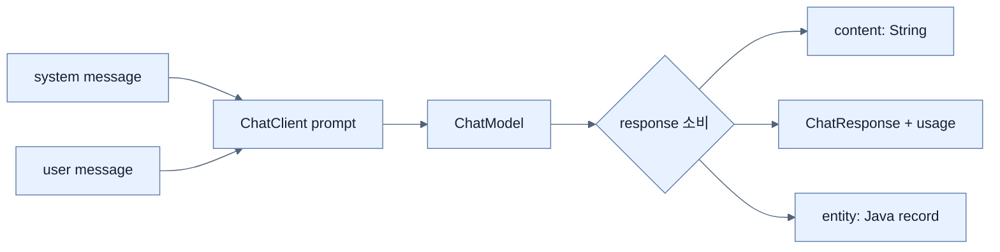

# ChatClient로 LLM 통합 만들기

## 한눈에 보기

`ChatClient`의 기본 흐름은 prompt 구성 → model 실행 → response 소비다. `.content()`는 text만, `.chatResponse()`는 model·token metadata까지, `.entity(Type.class)`는 application Java type으로 mapping한 구조화 결과를 돌려준다.

## 1. 왜 이게 필요한가

같은 model output도 UI chat에는 text, cost monitoring에는 usage metadata, business logic에는 typed record가 필요하다. Response contract를 call site 의도에 맞게 좁혀야 provider의 내부 응답을 API client에 그대로 노출하지 않고 parsing boilerplate를 줄일 수 있다.

## 2. 어떻게 동작하는가

책은 Web MVC와 OpenAI model starter를 추가하고 API key는 `${OPENAI_API_KEY}` 환경 변수로 주입한다. Model name과 temperature property는 provider·시점에 따라 바뀌는 예시이므로 실제 프로젝트 dependency version의 reference와 account model availability를 확인해야 한다.

```java
@Bean
ChatClient chatClient(ChatClient.Builder builder) {
    return builder.defaultSystem("""
        You are a Java and Spring Boot specialist.
        Keep answers focused and practical.
        """).build();
}
```

```java
String text = chatClient.prompt().user(question).call().content();
ChatResponse full = chatClient.prompt().user(question).call().chatResponse();
AiAnswer typed = chatClient.prompt()
    .system("Return title, explanation, and example.")
    .user(question).call().entity(AiAnswer.class);
```

`ChatResponse.metadata.usage`는 prompt·completion·total token을, result는 assistant content와 finish reason을 제공한다. Structured response는 Java type으로 바뀌었다고 자동으로 사실성·업무 validation이 보장되는 것은 아니므로 bean validation과 domain rule을 별도로 적용한다. Spring AI 2.0 계열은 provider의 native structured output을 advisor로 활성화하는 방식도 있으므로 dependency version에 맞춘다.

## 3. 그림으로 보기



## 4. 이 노트에 나온 용어

- **ChatClient**: prompt 작성·호출·응답 변환을 fluent API로 제공하는 Spring AI high-level client.
- **ChatModel**: provider별 chat model 실행을 공통화한 lower-level abstraction.
- **system message**: model의 역할·범위·행동 규칙을 정의하는 상위 instruction.
- **ChatResponse**: 생성 결과와 model·token usage 등 metadata를 포함한 전체 응답.
- **structured output**: model 결과를 schema에 맞춘 JSON과 Java type 등 예측 가능한 구조로 받는 방식.

## 7. 연결

- [[01-introducing-llms-and-spring-ai]] — ChatClient가 감싸는 model abstraction이다.
- [[03-reactive-streaming-with-chatclient]] — 완성된 응답 대신 chunk를 점진적으로 받는다.
- [[04-designing-prompts-and-tool-calling]] — prompt를 유지보수하고 live operation을 연결한다.

## 8. 스스로 확인

- 전체 1차 정리 후: `.content()`, `.chatResponse()`, `.entity()`의 사용 목적을 각각 설명한다.

<!-- ==== 아래는 내 영역 · 스킬 수정 금지 ==== -->

## 내 설명 시도


## 막혔던 지점


## 리뷰 이력


