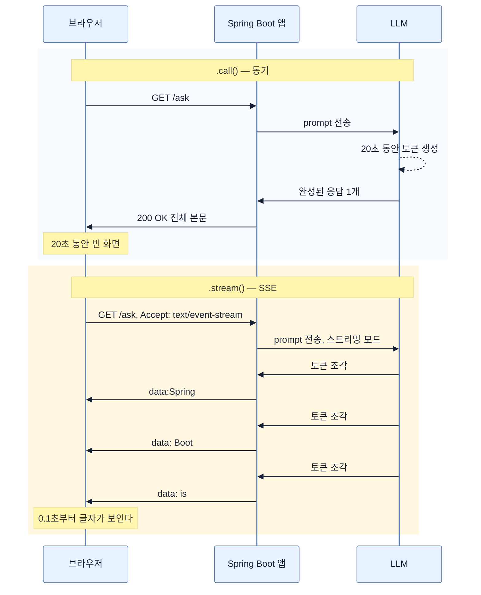

# 스트리밍 응답 — `.call()` 대신 `.stream()`을 쓰는 순간

## 한눈에 보기

| | `.call()` | `.stream()` |
|---|---|---|
| 반환 | `String` 하나 | `Flux<String>` — 조각의 흐름 |
| 첫 글자가 보이는 시점 | 응답 **완성 후** | 생성 **시작 직후** |
| 전송 형식 | 일반 HTTP 응답 | `text/event-stream` (SSE) |
| 필요한 의존성 | `spring-boot-starter-webmvc` | `spring-boot-starter-webflux` |
| 총 소요 시간 | 같다 | 같다 — 바뀌는 것은 **체감** |

## 1. 왜 이게 필요한가

`.call()`로 만든 assistant에 이런 질문을 던져 보면 문제가 바로 드러난다.

> "이 500줄짜리 컨트롤러를 리뷰해 줘."

model이 20초 동안 답을 만든다. 그 20초 내내 브라우저에는 **아무것도 없다.** 스피너가 돌 뿐이다. 사용자는 8초쯤에 "멈췄나?" 하고 새로고침을 누르고, 그러면 20초가 처음부터 다시 시작된다.

`.call()`이 하는 일이 정확히 그것이기 때문이다 — 응답이 **전부 완성될 때까지 동기적으로 기다렸다가** 통째로 넘긴다. 문서 분석, story 생성, 코드 합성처럼 출력이 긴 작업에서 이 방식은 실제 성능과 무관하게 **체감 성능**을 망친다.

핵심은 model이 애초에 통째로 답을 만들지 않는다는 데 있다. model은 token을 **하나씩 순서대로** 생성한다. 첫 token은 100밀리초 만에 나와 있는데, `.call()`이 그것을 20초 동안 붙들고 있는 것이다. **[[스트리밍-응답]]**(= 생성되는 대로 부분 결과를 먼저 흘려보내는 방식)은 붙들지 않고 그때그때 내보낸다.

## 2. 어떻게 동작하는가

### 2.1 의존성 추가

start.spring.io에서 **Spring Reactive Web**을 고르거나, pom에 직접 넣는다.

```xml
<dependency>
    <groupId>org.springframework.boot</groupId>
    <artifactId>spring-boot-starter-webflux</artifactId>
</dependency>
<dependency>
    <groupId>org.springframework.boot</groupId>
    <artifactId>spring-boot-starter-webflux-test</artifactId>
    <scope>test</scope>
</dependency>
```

- `spring-boot-starter-webflux`: Project Reactor 위에 얹힌 Spring의 reactive 웹 프레임워크. **논블로킹·streaming HTTP endpoint**를 만들 수 있게 한다. 스트리밍 응답에 이것이 필요한 이유는, 응답 하나가 열린 채 오래 유지되는 동안 스레드를 붙잡고 있으면 안 되기 때문이다.
- `spring-boot-starter-webflux-test`: 비동기·스트리밍 동작을 검증하는 테스트 도구.

### 2.2 endpoint

```java
@GetMapping(value = "/api/ai/text-response-flux/java-assistant/ask",
        produces = MediaType.TEXT_EVENT_STREAM_VALUE)
public Flux<String> askReturnTextFlux(@RequestParam String question) {
    return chatClient.prompt()
            .user(question)
            .stream()
            .content();
}
```

[[02-building-llm-integrations-with-chatclient]]의 `askReturnText`와 비교하면 **딱 세 곳**이 다르다.

| 위치 | 동기 버전 | 스트리밍 버전 | 왜 필요한가 |
|---|---|---|---|
| `produces` | 기본값 | `TEXT_EVENT_STREAM_VALUE` | client에게 "이 응답은 조각으로 온다"고 알린다. 이게 없으면 브라우저가 연결이 끝날 때까지 버퍼링한다 |
| 반환형 | `String` | `Flux<String>` | 값 하나가 아니라 **시간에 걸쳐 방출되는 흐름**을 표현해야 한다 |
| 실행 | `.call()` | `.stream()` | model을 streaming 모드로 부른다 |

**[[Flux]]**(= Project Reactor에서 0개 이상의 값을 시간에 걸쳐 방출하는 reactive 타입)를 반환한다는 것은, controller가 값을 반환할 때 아직 **내용이 하나도 없다**는 뜻이다. 반환되는 것은 "앞으로 여기로 조각이 흐를 것"이라는 약속이고, 실제 조각은 그 뒤에 하나씩 흘러든다.

`.content()`는 동기 버전과 이름이 같지만 하는 일이 다르다 — 완성된 text를 꺼내는 게 아니라, 스트림에서 오는 각 조각의 text 부분만 뽑아 흘려보낸다.

### 2.3 전송은 SSE로

`text/event-stream`은 **[[SSE]]**(= 서버가 하나의 HTTP 연결 위에서 client로 데이터를 조각조각 밀어 주는 단방향 streaming 메커니즘) 형식이다. `curl`로 보면 실제 전송이 이렇게 생겼다.

```bash
curl --no-buffer \
    -H "Accept: text/event-stream" \
    --location 'http://localhost:8080/api/ai/text-response-flux/java-assistant/ask?question=What+is+Spring+Boot'
```

```text
data:Spring
data: Boot
data: is
data: an
data: open
data:-source
data: framework
data: designed
…
```

각 줄이 하나의 SSE 이벤트다. `data:` 접두가 붙는 것이 SSE 규약이고, client는 그 접두를 떼고 뒤를 이어 붙이면 된다. `--no-buffer`가 필요한 이유는 `curl`이 기본적으로 출력을 버퍼링해서, 그게 없으면 우리가 만든 streaming을 터미널이 다시 통째로 만들어 버리기 때문이다.

`-source`가 별도 조각으로 온 것에 주목할 만하다. model이 나누는 단위는 단어가 아니라 **token**이라서 `open` + `-source`처럼 쪼개진다.

### 2.4 비유와 그 한계

수도꼭지 비유가 흔히 쓰인다. `.call()`은 양동이에 물을 다 받아서 한 번에 건네주는 것, `.stream()`은 수도꼭지를 열어 두고 흐르게 두는 것이다.

**깨지는 지점 둘.** 첫째, **총량과 총 시간은 똑같다.** 스트리밍은 응답을 빨리 만들지 않는다. 첫 조각이 빨리 도착할 뿐이다. 20초짜리 응답은 여전히 20초 걸린다. 둘째, **되돌릴 수 없다.** 양동이라면 내용을 보고 "이건 못 주겠다"며 버릴 수 있지만, 스트리밍은 이미 보낸 조각을 회수할 방법이 없다. 응답 후처리(필터링, 마스킹, [[07d-security-best-practices-for-ai-applications]]의 `SafeGuardAdvisor` 같은 검사)를 하려면 전체를 봐야 하는데, 스트리밍은 그 기회를 없앤다. 이것이 두 방식의 진짜 트레이드오프다.

## 3. 그림으로 보기



## 4. 이 노트에 나온 용어

- **[[스트리밍-응답]]**: 생성되는 대로 부분 결과를 먼저 흘려보내는 응답 방식.
- **[[Flux]]**: 시간에 걸쳐 0개 이상의 값을 방출하는 Reactor 타입.
- **[[SSE]]**: 하나의 HTTP 연결로 서버가 client에 데이터를 밀어 주는 단방향 streaming.
- **[[ChatClient]]**: prompt 조립부터 응답 소비까지의 fluent 고수준 client.
- **[[fluent-API]]**: 메서드를 이어 붙여 요청을 조립하는 API 양식.

## 5. 자주 헷갈리는 것

**원문 표기 오류** — 책 p.418의 항목 설명은 이 호출을 `.Stream()`으로, 대문자 S로 적는다. 같은 쪽 코드 블록에는 소문자 `.stream()`으로 정확히 쓰여 있으므로 **설명 항목만의 오타**다. 실제 API는 `.stream()`이다. 같은 종류의 오타가 [[04b-tool-calling]]의 `.Call()`, [[05c-building-the-rag-pipeline-with-advisors]]의 `.User(...)`에도 나온다.

**"스트리밍이 더 빠르다"** — 총 지연은 같다. 바뀌는 것은 **첫 바이트까지의 시간**이다. 처리량이나 비용은 개선되지 않는다.

**WebFlux를 넣으면 앱 전체가 reactive가 되는가** — 아니다. `spring-boot-starter-webmvc`와 `spring-boot-starter-webflux`가 함께 있으면 Spring Boot는 기본적으로 MVC(Servlet) 스택으로 뜨고, `Flux`를 반환하는 handler만 그 자리에서 스트리밍으로 동작한다. 나머지 endpoint는 그대로다.

## 6. 언제 안 쓰나 / 경계

- **응답이 짧으면 이득이 없다.** 한두 문장짜리 분류·의도 판정 응답에 SSE 배관을 얹으면 client 코드만 복잡해진다.
- **응답 전체를 검사해야 하면 못 쓴다.** 마스킹·차단·후처리가 필요한 응답은 스트리밍하는 순간 이미 나간 조각을 되돌릴 수 없다.
- **구조화 응답과 잘 맞지 않는다.** `.entity(...)`는 완성된 JSON이 있어야 매핑한다. 반쯤 온 JSON은 파싱할 수 없다.
- **중간 프록시가 버퍼링할 수 있다.** nginx 같은 리버스 프록시가 응답을 모아 보내면 서버가 아무리 흘려도 client는 통째로 받는다. SSE 경로는 프록시 버퍼링을 꺼야 한다.

## 7. 연결

- [[02-building-llm-integrations-with-chatclient]] — `.call()` 기반 세 가지 응답 형태. 여기서 바뀌는 것은 실행 단계 하나뿐이다.
- [[07d-security-best-practices-for-ai-applications]] — 응답을 검사해 차단하는 방어가 스트리밍과 충돌하는 이유.
- [[04-designing-prompts-and-tool-calling]] — 응답을 어떻게 받을지 정한 다음, 요청 자체를 어떻게 설계할지로 넘어간다.

## 8. 스스로 확인

- 스트리밍이 총 응답 시간을 줄이지 못하는데도 도입할 가치가 있는 이유를 숫자로 설명해 보라.
- `produces = TEXT_EVENT_STREAM_VALUE`를 빼면 실제로 무엇이 달라지는가?
- 응답에 신용카드 번호가 섞여 나올 수 있는 endpoint에 스트리밍을 쓸 수 있는가? 왜인가?
- `Flux<String>`을 반환하는 시점에 응답 본문은 얼마나 만들어져 있는가?

<!-- ==== 아래는 내 영역 · 스킬 수정 금지 ==== -->

## 내 설명 시도


## 막혔던 지점


## 리뷰 이력
