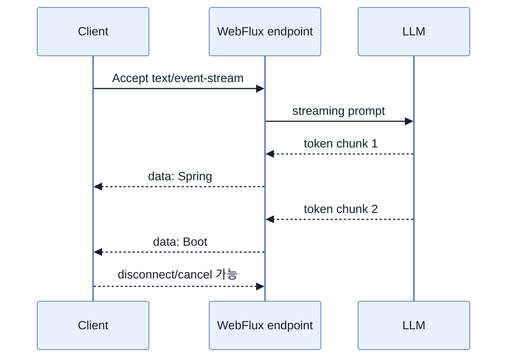

# ChatClient Reactive Streaming

## 한눈에 보기

`chatClient.prompt().user(question).stream().content()`는 model이 생성하는 text chunk를 `Flux<String>`으로 내보낸다. Controller가 `text/event-stream`을 생산하면 browser/client는 전체 답을 기다리지 않고 SSE `data:` event를 순차 표시할 수 있다.

## 1. 왜 이게 필요한가

문서 분석·story·code generation처럼 output이 길면 전체 completion까지 기다리는 synchronous response는 사용자가 멈춘 것으로 느낀다. Streaming은 총 생성 시간을 반드시 줄이지 않아도 time to first token과 체감 latency를 개선한다.

## 2. 어떻게 동작하는가

```java
@GetMapping(value = "/ask", produces = MediaType.TEXT_EVENT_STREAM_VALUE)
Flux<String> ask(@RequestParam String question) {
    return chatClient.prompt()
        .user(question)
        .stream()
        .content();
}
```

WebFlux starter가 reactive HTTP infrastructure를 제공하고, `Flux`의 각 emission이 SSE event가 된다. Client는 `curl --no-buffer`처럼 buffering을 꺼야 점진적 출력이 보인다. Network proxy가 response를 buffer하거나 client가 connection을 끊는 경우 cancel propagation, timeout, partial response UI도 고려해야 한다.

Streaming text chunk는 의미 단위나 JSON object 경계가 아니다. Structured output을 stream으로 조립할 때는 완성 전 parsing하지 않고 framing·buffer limit·오류 시 partial state를 설계한다. Provider가 진짜 streaming을 지원하는지도 확인해야 한다.

## 3. 그림으로 보기



## 4. 이 노트에 나온 용어

- **reactive streaming**: 결과를 asynchronous Publisher signal로 점진 전달하는 방식.
- **Flux**: 0개 이상 asynchronous item을 표현하는 Project Reactor Publisher.
- **server-sent events**: 하나의 HTTP connection에서 server가 text event를 client로 계속 보내는 표준.
- **time to first token**: 요청 후 첫 생성 token이 사용자에게 도착하기까지의 시간.

## 7. 연결

- [[02-building-llm-integrations-with-chatclient]] — synchronous completion과 응답 방식을 비교한다.
- [[chapter-9-writing-reactive-web-controllers/01-reactive-programming-and-backpressure|Reactive programming]] — Flux와 cancellation의 기반이다.
- [[07-operating-llm-applications]] — streaming latency·token cost·prompt content를 관측한다.

## 8. 스스로 확인

- 전체 1차 정리 후: streaming이 총 latency와 체감 latency에 주는 효과를 구분하고 SSE 흐름을 설명한다.

<!-- ==== 아래는 내 영역 · 스킬 수정 금지 ==== -->

## 내 설명 시도


## 막혔던 지점


## 리뷰 이력


