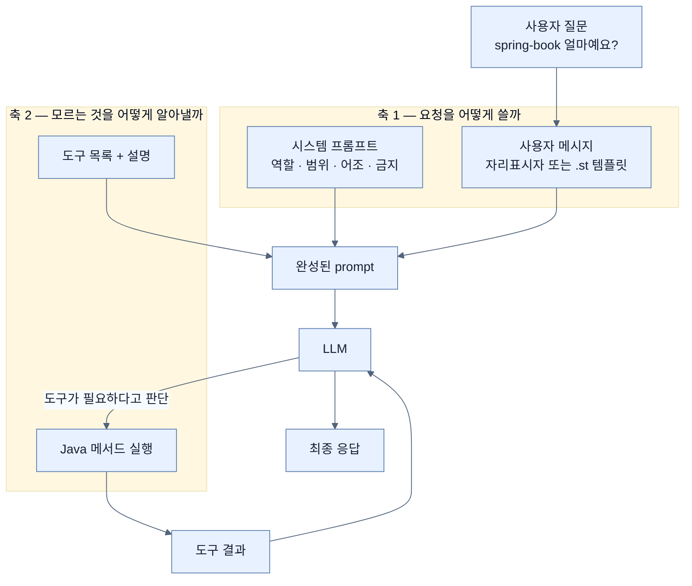

# 정적 prompt의 한계 — 동적 값과 살아 있는 데이터, 두 축

## 한눈에 보기

| 부족한 것 | 해결 축 | 다루는 노트 |
|---|---|---|
| prompt 문구에 **값**을 끼워 넣어야 한다 (언어·개수·주제·코드 조각) | 프롬프트 엔지니어링 | [[04a-prompt-engineering-in-spring-ai]] |
| model이 **우리 시스템에 물어봐야** 답할 수 있다 (가격·재고·현재 시각) | 툴 콜링 | [[04b-tool-calling]] |

둘은 대체재가 아니다. 전자는 **요청을 어떻게 쓸까**, 후자는 **모르는 것을 어떻게 알아낼까**의 문제다.

## 1. 왜 이게 필요한가

[[02-building-llm-integrations-with-chatclient]]까지의 코드에는 감춰진 가정이 하나 있다.

```java
chatClient.prompt()
        .user(question)     // 사용자가 던진 문자열, 그대로
        .call()
        .content();
```

**사용자가 보낸 문자열이 곧 완전한 요청**이라는 가정이다. 시스템 메시지는 `defaultSystem(...)`에 고정되어 있고, 그 사이에 우리가 끼워 넣는 것은 없다.

이 가정은 두 방향에서 깨진다.

**첫째, 요청의 일부가 사용자 문장이 아니라 애플리케이션의 상태다.** 코드 리뷰 기능을 만든다고 하자. 필요한 것은 `question` 하나가 아니라 "언어는 Java, 검사 항목은 버그·보안·성능 세 가지, 검사 대상 코드는 이것"이다. 이걸 문자열 연결로 만들기 시작하면 곧 이런 코드가 된다.

```java
String prompt = "You are a senior " + language + " developer performing a code review.\n"
              + "Review the following code and identify:\n1. Potential bugs\n..."
              + "\n\nCode:\n" + code;
```

문구를 고치려면 Java 파일을 열어야 하고, 문구를 검토할 사람(기획·법무·도메인 전문가)이 소스를 읽어야 하고, 큰따옴표와 줄바꿈 이스케이프가 문구보다 눈에 띈다.

**둘째, 답이 우리 데이터베이스에 있다.** "spring-book 얼마예요?"에 model이 답하려면 `PRICES` 맵을 봐야 한다. 아무리 prompt를 잘 써도 없는 정보가 생기지는 않는다. 이건 문구의 문제가 아니라 **접근의 문제**다.

책이 이 절을 두 하위 제목으로 쪼개는 이유가 여기 있다. 같은 "동적"이라는 말이지만 **동적 값**과 **동적 지식**은 다른 기계가 필요하다.

## 2. 어떻게 동작하는가

### 2.1 축 1 — 요청을 조립하는 문제

**[[프롬프트-엔지니어링]]**(= model이 일관되고 정확한 출력을 내도록 입력을 설계하는 실천)이 다루는 영역이다. 여기서 prompt는 "질문"이 아니라 **지시 + context + 제약 + 사용자 입력**이 합쳐진 하나의 요청이고, 응답 품질이 그 구조에 직접 좌우된다.

Spring AI는 이 층을 두 개로 나눠 놓았다.

- **[[시스템-프롬프트]]**(= 역할·범위·금지 사항을 정하는 prompt 층): 중앙에서 한 번 정하고 모든 요청에 자동으로 적용한다. 그래야 응답이 일관된다.
- **[[사용자-메시지]]**(= 호출마다 달라지는 실제 요청): 언어·개수·주제 같은 parameter가 여기 들어간다.

그리고 사용자 메시지를 만드는 방법도 다시 둘로 나뉜다 — 코드 안 자리표시자냐, 별도 template 파일이냐. 짧은 것과 긴 것의 유지보수 비용이 다르기 때문이다.

### 2.2 축 2 — 모르는 것을 알아내는 문제

**[[툴-콜링]]**(= model이 답을 만드는 대신 application의 method 실행을 요청하는 방식)이 다루는 영역이다. 요점은 **model이 스스로 판단해서 호출을 요청한다**는 데 있다. 우리가 "가격 질문이면 `getProductPrice`를 불러라"라고 분기하는 게 아니라, 도구 목록과 설명을 넘겨주면 model이 필요할 때 스스로 고른다.

### 2.3 두 축을 섞으면

실제 assistant는 둘을 동시에 쓴다. 시스템 프롬프트가 "너는 TechStore 상담원이고 TechStore 관련 질문에만 답한다"고 범위를 잡고, 도구가 실제 가격을 물어다 준다. 하나가 빠지면 각각 이렇게 무너진다.

| 빠진 것 | 증상 |
|---|---|
| 프롬프트 설계 | 도구는 있는데 model이 엉뚱한 어조로, 형식 없이, 범위 밖 질문까지 답한다 |
| 툴 콜링 | 말투는 완벽한데 가격을 지어낸다 |

### 2.4 비유와 그 한계

새 직원 교육에 빗댈 수 있다. 프롬프트 엔지니어링은 **업무 지침서**를 주는 일이고, 툴 콜링은 **사내 시스템 계정**을 주는 일이다. 지침서만 주면 성실하지만 아무것도 조회하지 못하고, 계정만 주면 조회는 하는데 응대 규칙을 모른다.

**깨지는 지점**: 사람은 지침서를 읽고 **기억한다.** model은 매 요청 지침서를 처음부터 다시 받는다 — 시스템 메시지를 매번 붙여 보내는 이유가 그것이다. 그리고 사람은 지침서와 상충하는 요청을 받으면 의심하지만, model은 그럴듯한 지시면 따라갈 수 있다. 그 취약점이 [[07d-security-best-practices-for-ai-applications]]의 프롬프트 인젝션이다.

## 3. 그림으로 보기



## 4. 이 노트에 나온 용어

- **[[프롬프트-엔지니어링]]**: 일관되고 정확한 출력을 얻도록 입력을 설계하는 실천.
- **[[툴-콜링]]**: model이 application method 실행을 요청하고 결과를 답에 반영하는 방식.
- **[[시스템-프롬프트]]**: 역할·범위·금지 사항을 정하는 prompt 층.
- **[[사용자-메시지]]**: 호출마다 달라지는 실제 요청 부분.

## 5. 자주 헷갈리는 것

**"prompt를 잘 쓰면 도구 없이도 된다"** — 없는 정보는 문장력으로 만들어지지 않는다. 반대로 **"도구만 잘 붙이면 prompt는 대충"**도 틀렸다. 도구 설명 자체가 prompt의 일부이고, model은 그 설명을 읽고 도구를 고른다. 설명이 모호하면 도구를 안 부르거나 엉뚱한 것을 부른다.

**RAG는 어느 축인가** — 축 2에 가깝지만 결이 다르다. 툴 콜링은 **구조화된 실시간 값**(가격·재고·시각)을, RAG는 **대량의 비정형 지식**(문서·정책·계약)을 가져온다. [[05-implementing-rag-with-vector-stores-and-advisors]]에서 이 구분을 다룬다.

## 7. 연결

- [[04a-prompt-engineering-in-spring-ai]] — 축 1. 자리표시자와 `.st` 템플릿으로 요청을 조립한다.
- [[04b-tool-calling]] — 축 2. `@Tool`로 Java 메서드를 model에 노출한다.
- [[02-building-llm-integrations-with-chatclient]] — 두 축이 붙기 전의 기본 호출 형태.
- [[05-implementing-rag-with-vector-stores-and-advisors]] — 축 2의 다른 갈래. 비정형 지식을 다룬다.

## 8. 스스로 확인

- "이 코드 리뷰해 줘"와 "지금 재고 몇 개야"는 각각 어느 축의 문제인가? 이유는?
- 시스템 프롬프트가 매 요청 다시 전송되는 이유는 무엇인가?
- 도구 설명(`description`)이 prompt 설계의 일부인 이유를 한 문장으로 설명해 보라.

<!-- ==== 아래는 내 영역 · 스킬 수정 금지 ==== -->

## 내 설명 시도


## 막혔던 지점


## 리뷰 이력
