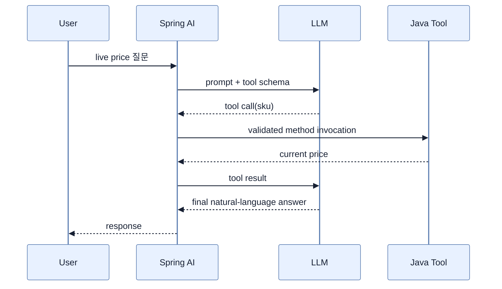

# Prompt 설계와 Tool Calling

## 한눈에 보기

Prompt engineering은 system instruction, context, constraint, user input을 예측 가능한 입력으로 설계하는 일이다. Tool calling은 model이 답을 지어내지 않고 필요한 Java method 호출의 이름·argument를 요청하게 하며, Spring AI가 method 결과를 다시 model에 주어 최종 답을 생성한다.

## 1. 왜 이게 필요한가

Prompt가 커지면 Java string 안에서 versioning·review·협업하기 어렵다. 또한 model은 현재 시각·상품 가격·database state를 스스로 알지 못한다. Prompt template은 입력의 재사용성을, tool은 승인된 live capability와 business logic 접근을 제공한다.

## 2. 어떻게 동작하는가

단순 prompt는 `.text("List {count} ... {topic}").param(...)`으로 inline parameterization한다. 긴 shared prompt는 `src/main/resources/prompts/*.st`에 두고 `PromptTemplate(resource).create(Map)`로 채운다. User value를 instruction과 무분별하게 합치지 말고 system·user·retrieved context의 신뢰 경계를 유지한다.

```java
@Tool(description = "Returns the current product price by SKU.")
String getProductPrice(String sku) { ... }

String answer = chatClient.prompt()
    .user(question)
    .tools(productTools)
    .call()
    .content();
```

흐름은 tool schema 전송 → model의 tool-call name/arguments 응답 → Spring AI의 Java method 실행 → tool result를 model context에 추가 → final response다. Description과 좁은 parameter schema가 tool 선택 정확도를 좌우한다. Tool이 결제·삭제처럼 side effect를 만들면 authorization, argument validation, timeout, rate limit, idempotency, human approval을 method 바깥의 security boundary로 둬야 한다.

책은 1.x의 `FunctionCallback`에서 2.x의 `ToolCallback`, `functions(...)`에서 `tools(...)`로의 migration을 짚는다. `@Tool`은 선언형 기본값이고 dynamic/conditional 등록은 `ToolCallback`을 쓴다.

## 3. 그림으로 보기



## 4. 이 노트에 나온 용어

- **prompt engineering**: model의 behavior와 output 품질을 위해 instruction·context·constraint·input을 설계하는 활동.
- **PromptTemplate**: placeholder가 있는 reusable prompt resource를 runtime 값으로 구체화하는 Spring AI 객체.
- **tool calling**: model이 application capability 실행을 구조화된 요청으로 선택하는 orchestration 방식.
- **Tool annotation**: Java method를 model에 제공할 tool로 선언하는 Spring AI annotation `@Tool`.
- **ToolCallback**: programmatic tool metadata와 execution을 표현하는 Spring AI interface.

## 7. 연결

- [[02-building-llm-integrations-with-chatclient]] — prompt와 tool을 등록하는 client API다.
- [[05-implementing-rag-with-vector-stores-and-advisors]] — 비정형 knowledge retrieval이라는 보완 방식이다.
- [[06-building-chatbots-and-mcp-integration]] — local tool을 remote interoperable capability로 확장한다.

## 8. 스스로 확인

- 전체 1차 정리 후: tool call 8단계와 `@Tool` method에 일반 method보다 더 필요한 방어책을 설명한다.

<!-- ==== 아래는 내 영역 · 스킬 수정 금지 ==== -->

## 내 설명 시도


## 막혔던 지점


## 리뷰 이력


