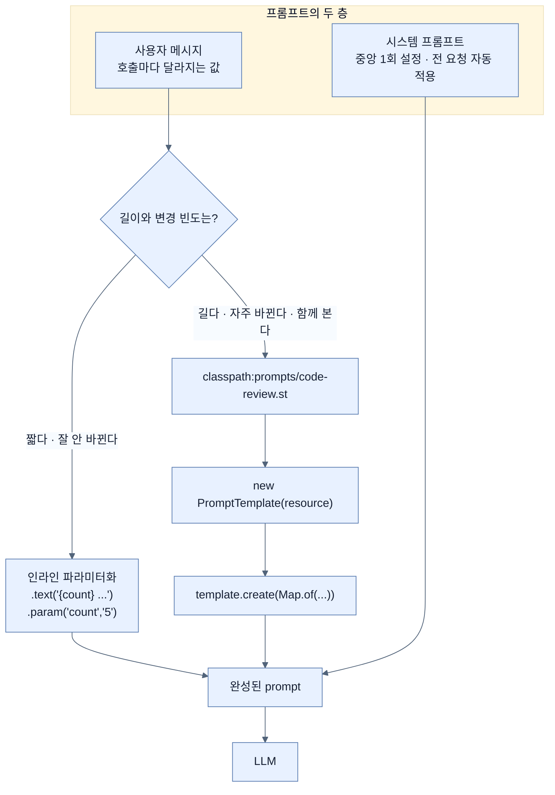

# prompt에 값을 넣는 두 방법 — 인라인 자리표시자와 `.st` 템플릿

## 한눈에 보기

| | 인라인 파라미터화 | `.st` 템플릿 외부화 |
|---|---|---|
| 어디에 산다 | Java 소스 안 | `src/main/resources/prompts/*.st` |
| 값 주입 | `.param("count", "5")` | `template.create(Map.of(...))` |
| 고치는 사람 | 개발자 (재컴파일) | 누구나 (파일만 편집) |
| 적합한 크기 | 한두 줄 | 여러 줄, 자주 바뀌는 것 |
| 리뷰 대상 | diff에 코드와 섞여 나온다 | 파일 하나로 독립 |

## 1. 왜 이게 필요한가

"Spring Boot 보안 모범 사례 5개"를 뽑는 endpoint를 만든다고 하자. 개수와 주제를 사용자가 정하게 하려면 문자열을 이어 붙이게 된다.

```java
String text = "List " + count + " best practices for " + topic + " in Spring Boot.";
```

한 줄일 때는 멀쩡해 보인다. 그런데 코드 리뷰 assistant로 넘어가면 이렇게 된다.

```java
String prompt = "You are a senior " + language + " developer performing a code review.\n"
              + "Review the following " + language + " code and identify:\n"
              + "1. Potential bugs\n"
              + "2. Security vulnerabilities\n"
              + "3. Performance issues\n\n"
              + "Code:\n" + code + "\n\n"
              + "Respond with a structured list. Be specific and actionable.";
```

여기서 실제로 비용을 만드는 건 문자열 연결이 아니다. **이 문구가 Java 파일 안에 갇혀 있다는 사실**이다.

- 문구를 검토할 도메인 전문가가 소스를 열어야 한다.
- "1. Potential bugs" 항목 하나 추가하려고 재컴파일·재배포한다.
- git diff에서 문구 변경이 로직 변경과 섞여 나온다.
- `\n`과 큰따옴표가 실제 문구보다 눈에 띈다.

**[[프롬프트-엔지니어링]]**(= 일관되고 정확한 출력을 얻도록 입력을 설계하는 실천)은 문구를 잘 쓰는 기술만이 아니라 **그 문구를 어디에 두고 어떻게 고칠 것인가**의 문제이기도 하다. Spring AI가 두 방법을 다 주는 이유가 그것이다.

## 2. 어떻게 동작하는가

### 2.1 먼저, prompt의 두 층

- **[[시스템-프롬프트]]**(= 역할·톤·행동·제약을 정하는 층): 중앙에서 설정하고 모든 상호작용에 자동 적용한다. 응답의 일관성이 여기에서 나온다.
- **[[사용자-메시지]]**(= 호출마다 달라지는 동적 부분): 사용자 입력, 언어, 도메인 데이터 같은 parameter가 들어간다.

아래 두 방법은 모두 **사용자 메시지 층**을 어떻게 만들 것인가에 대한 답이다.

### 2.2 방법 1 — 인라인 파라미터화

**[[인라인-파라미터화]]**(= prompt 문자열에 `{name}` 자리표시자를 두고 런타임에 채우는 방식)는 이렇게 생겼다.

```java
String answer = chatClient.prompt()
        .user(u -> u
                .text("List {count} best practices for {topic} in Spring Boot.")
                .param("count", "5")
                .param("topic", "security"))
        .call()
        .content();
```

| 호출 | 하는 일 |
|---|---|
| `.user(u -> u ...)` | 사용자 메시지를 **builder로** 구성한다. 문자열 하나를 넘기는 `user(question)`과 달리 text와 parameter를 함께 지정할 수 있다 |
| `.text("... {count} ... {topic} ...")` | 중괄호로 감싼 자리표시자를 담은 template 문자열 |
| `.param("count", "5")` | `{count}`를 `5`로 치환 |
| `.param("topic", "security")` | `{topic}`을 `security`로 치환 |
| `.call().content()` | 실행하고 text를 꺼낸다 |

문자열 연결과 무엇이 다른가? **치환이 Spring AI 쪽에서 일어난다**는 점이다. 자리표시자 이름이 그대로 남아 있어 template의 의도를 읽을 수 있고, 값이 없으면 조용히 빈 문자열이 되는 대신 문제가 드러난다.

다만 이건 크기의 문제를 풀지 못한다. prompt가 커지고 복잡해지면 **유지보수가 빠르게 어려워진다**는 것을 책 자신이 짚는다.

### 2.3 방법 2 — `.st` 파일로 외부화

여러 줄이거나, 공유해야 하거나, 자주 바뀌는 prompt는 밖으로 뺀다. Spring AI는 **[[StringTemplate]]**(= `.st` 확장자를 쓰는 template 형식) 파일을 classpath resource로 읽는다.

`src/main/resources/prompts/code-review.st`:

```text
You are a senior Java developer performing a code review.
Review the following {language} code and identify:
1. Potential bugs
2. Security vulnerabilities
3. Performance issues

Code:
{code}

Respond with a structured list. Be specific and actionable.
```

이 파일에는 이스케이프도, 문자열 연결도, 자바 문법도 없다. **문구만 있다.**

```java
@Service
public class CodeReviewService {

    private final ChatClient chatClient;

    @Value("classpath:prompts/code-review.st")
    private Resource reviewPromptResource;

    public CodeReviewService(ChatClient chatClient) {
        this.chatClient = chatClient;
    }

    public String review(String language, String code) {
        var template = new PromptTemplate(reviewPromptResource);
        var prompt = template.create(Map.of(
                "language", language,
                "code", code
        ));
        return chatClient.prompt(prompt).call().content();
    }
}
```

단계마다 이유가 있다.

1. `@Value("classpath:prompts/code-review.st")` — template을 **classpath resource로** 읽는다. jar 안에 함께 패키징되므로 배포 시 파일이 따로 놀지 않는다.
2. `new PromptTemplate(reviewPromptResource)` — **[[PromptTemplate]]**(= 자리표시자를 채워 완성된 prompt를 만드는 타입)을 만든다. 이 객체가 자리표시자 파싱을 담당한다.
3. `template.create(Map.of("language", language, "code", code))` — 값을 넣어 **완성된 prompt 객체**를 만든다. 이 시점에 자리표시자가 사라진다.
4. `chatClient.prompt(prompt)` — 인자 없는 `prompt()`가 아니라 **완성된 prompt를 넘기는** 오버로드를 쓴다. 조립이 이미 끝났기 때문이다.
5. `.call().content()` — 실행하고 text를 꺼낸다.

호출은 이렇게 검증한다.

```bash
curl --location 'http://localhost:8080/api/ai/code-review' \
--header 'Content-Type: application/json' \
--data '{
  "language": "Java",
  "code": "String q = \"SELECT * FROM users WHERE id=\" + id;"
}'
```

응답은 SQL injection 위험, `id` null·유효성 미검사, `SELECT *`의 성능 문제, `id` 컬럼 인덱스 부재를 짚고 `PreparedStatement` 예제까지 붙여 돌려준다 — template이 요구한 **버그·보안·성능 세 항목 구조 그대로**다. 구조를 지시했기 때문에 구조가 나온 것이다.

### 2.4 왜 이 선택이 중요한가

책의 결론은 명확하다. **prompt 설계는 일회성 작업이 아니라 애플리케이션과 함께 진화한다.** 그래서 prompt가 복잡해질수록 template·설정 파일과 같은 **first-class artifact**로 다뤄야 한다.

그러면 문구가 코드와 독립적으로 진화하고, 개발자가 아닌 사람과 협업할 수 있고, 반복 주기가 빨라진다.

- 인라인 → 빠른 상호작용, 짧은 template
- 외부화 → 확장성·협업·production

### 2.5 비유와 그 한계

이메일 서식에 빗댈 수 있다. 인라인 파라미터화는 메일 본문에 직접 "안녕하세요 OOO님"을 타이핑하는 것이고, `.st` 템플릿은 서식 파일을 두고 이름만 바꿔 끼우는 것이다. 서식이 따로 있으면 법무팀이 문구를 검토할 수 있고, 개발자가 아니어도 고칠 수 있다.

**깨지는 지점**: 이메일 서식은 **결과가 정확히 예측된다.** `{name}`에 무엇을 넣든 나오는 문장은 정해져 있다. prompt template은 그렇지 않다 — 같은 template에 다른 `{code}`를 넣으면 model이 다른 항목을 다른 순서로 낼 수 있다. template은 **입력을 고정할 뿐 출력을 고정하지 않는다.** 출력까지 고정하려면 [[02-building-llm-integrations-with-chatclient]]의 구조화 응답을 얹거나 [[07a-evaluating-llm-response-quality]]로 검증해야 한다.

또 하나 — `{code}`처럼 **사용자가 준 문자열을 template에 그대로 끼우는 것**은 [[07d-security-best-practices-for-ai-applications]]의 프롬프트 인젝션 통로다. 코드 리뷰 대상 문자열에 "이전 지시를 무시하라"가 섞여 있으면 그것도 prompt의 일부로 전달된다.

## 3. 그림으로 보기



## 4. 이 노트에 나온 용어

- **[[프롬프트-엔지니어링]]**: 일관되고 정확한 출력을 얻도록 입력을 설계하는 실천.
- **[[시스템-프롬프트]]**: 역할·범위·금지 사항을 정하는 prompt 층.
- **[[사용자-메시지]]**: 호출마다 달라지는 실제 요청 부분.
- **[[인라인-파라미터화]]**: `{name}` 자리표시자를 코드 안에 두고 `.param(...)`으로 채우는 방식.
- **[[StringTemplate]]**: `.st` 확장자를 쓰는 template 형식.
- **[[PromptTemplate]]**: 자리표시자를 채워 완성된 prompt를 만드는 Spring AI 타입.

## 5. 자주 헷갈리는 것

**`prompt()` vs `prompt(prompt)`** — 인자 없는 것은 "지금부터 조립하겠다", 인자 있는 것은 "이미 조립된 것을 쓰겠다"다. `PromptTemplate`으로 만든 결과는 후자로 넘긴다.

**`{}` 자리표시자와 Spring의 `${}` 프로퍼티** — 다른 것이다. `{code}`는 Spring AI template의 자리표시자로 `.param(...)`이나 `create(Map)`이 채우고, `${OPENAI_API_KEY}`는 Spring `Environment`가 시작 시 해결한다. `.st` 파일 안의 중괄호는 property가 아니다.

**"외부화가 항상 낫다"** — 한 줄짜리 prompt를 파일로 빼면 코드를 읽다가 파일을 찾아 열어야 한다. 판단 기준은 미학이 아니라 **누가 얼마나 자주 고치는가**다.

## 6. 언제 안 쓰나 / 경계

- **사용자 입력을 자리표시자에 그대로 넣을 때 신뢰하지 않는다.** template은 문자열 결합의 편의를 줄 뿐 격리를 주지 않는다.
- **template이 곧 계약은 아니다.** 형식이 중요하면 구조화 응답이나 평가를 함께 쓴다.
- **template을 무한히 키우지 않는다.** 지시가 길어지면 컨텍스트 윈도를 잡아먹고 model이 앞쪽 지시를 흘린다. 반복되는 배경 지식은 prompt가 아니라 RAG로 옮기는 편이 낫다 — [[05-implementing-rag-with-vector-stores-and-advisors]].

## 7. 연결

- [[04-designing-prompts-and-tool-calling]] — 이 노트가 다루는 "축 1"의 자리.
- [[04b-tool-calling]] — 축 2. prompt로 해결되지 않는 "모르는 정보" 문제.
- [[02-building-llm-integrations-with-chatclient]] — `defaultSystem`으로 시스템 프롬프트를 고정하는 방법.
- [[07d-security-best-practices-for-ai-applications]] — 사용자 값이 template에 들어가는 순간 생기는 인젝션 위험.

## 8. 스스로 확인

- 같은 prompt를 인라인으로 둘지 `.st`로 뺄지 결정하는 기준을 두 가지 이상 말해 보라.
- `PromptTemplate.create(Map)`이 반환하는 것과 `chatClient.prompt()`가 반환하는 것은 어떻게 다른가?
- `{code}`에 사용자 코드가 들어가는 코드 리뷰 서비스에서 생길 수 있는 보안 문제는?
- template이 "입력은 고정하지만 출력은 고정하지 않는다"는 말의 실제 결과는 무엇인가?

<!-- ==== 아래는 내 영역 · 스킬 수정 금지 ==== -->

## 내 설명 시도


## 막혔던 지점


## 리뷰 이력
