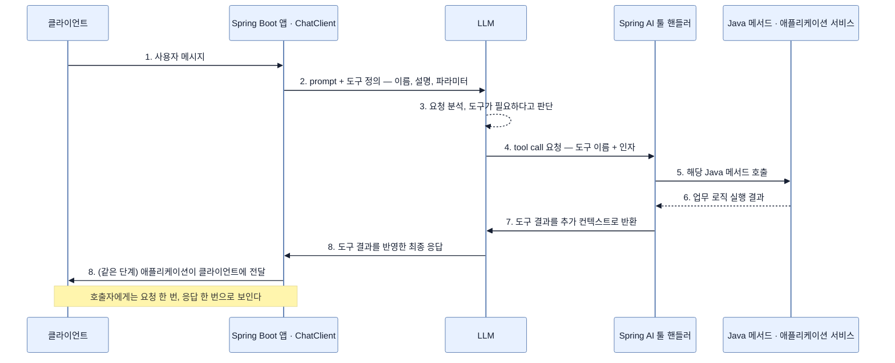

# 툴 콜링 — model이 우리 Java 메서드를 호출하게 하기

## 한눈에 보기

| | 내용 |
|---|---|
| 문제 | LLM은 static knowledge로만 동작한다 — 우리 DB·업무 로직·실시간 데이터·외부 시스템에 접근하지 못한다 |
| 해법 | 답의 일부를 **application에 위임**한다. model이 "이 메서드를 이 인자로 불러 달라"고 요청하고, Spring AI가 실행해 결과를 되돌려 준다 |
| 우리가 쓰는 코드 | `@Tool(description = "...")` 한 줄 + `.tools(bean)` 한 줄 |
| 우리가 안 쓰는 코드 | 어떤 질문에 어떤 메서드를 부를지 정하는 분기. **model이 고른다** |

## 1. 왜 이게 필요한가

`ProductTools` 없이 assistant에 이렇게 물어보자.

> "spring-book 지금 얼마예요?"

model은 `PRICES` 맵을 본 적이 없다. 그래서 나오는 답은 셋 중 하나다 — "가격 정보를 갖고 있지 않습니다"(그나마 정직), "$29.99입니다"(지어냄), "일반적으로 기술 서적은 $30–50 정도입니다"(회피). 세 번째가 가장 흔하고, 두 번째가 가장 위험하다.

"지금 몇 시죠?"도 마찬가지다. model의 학습 데이터에 **오늘**은 없다.

원인은 [[01-introducing-llms-and-spring-ai]]에서 본 그대로다. model은 학습 중 익힌 패턴으로 생성할 뿐 우리 시스템에 살아 있는 연결이 없다.

**[[툴-콜링]]**(= model이 답을 직접 만드는 대신 application method 실행을 요청하는 방식)이 이 한계를 정면으로 푼다. 요점은 방향이다 — 우리가 model에게 데이터를 밀어 넣는 게 아니라, **model이 필요할 때 스스로 요청한다.**

## 2. 어떻게 동작하는가

### 2.1 8단계 왕복

책 Figure 14.2가 그리는 흐름이다. 각 단계에 "왜 이 단계가 있는가"를 붙여 읽어야 이해가 남는다.

| # | 일어나는 일 | 왜 필요한가 |
|---:|---|---|
| 1 | client가 애플리케이션에 요청을 보낸다 | 평범한 HTTP 요청. 여기까지는 특별할 게 없다 |
| 2 | 애플리케이션이 prompt와 **사용 가능한 도구 목록·설명**을 함께 model에 보낸다 | model은 존재를 모르는 도구를 부를 수 없다. 목록이 매 요청 전달되는 이유 |
| 3 | model이 요청을 분석하고 도구가 필요하다고 **판단한다** | 분기 로직이 우리 코드가 아니라 model 안에 있다는 뜻 |
| 4 | model이 최종 응답 대신 **도구 이름과 인자**를 담은 tool-call 요청을 돌려준다 | model은 실행 권한이 없다. 요청만 할 수 있다 |
| 5 | Spring AI가 그 요청을 가로채 해당 Java 메서드를 호출한다 | 실행 권한은 우리 프로세스에 있다. 이 경계가 안전장치다 |
| 6 | Java 메서드가 업무 로직을 실행하고 결과를 돌려준다 | 실제 데이터가 여기서 나온다 |
| 7 | Spring AI가 그 결과를 **추가 context로** model에 다시 보낸다 | model이 결과를 문장으로 옮기려면 결과를 봐야 한다 |
| 8 | model이 결과를 반영한 최종 응답을 만들고, 애플리케이션이 client에 돌려준다 | 사용자에게는 한 번의 요청·응답으로 보인다 |

호출자에게 이 왕복은 **완전히 투명하다.** 우리 코드는 `.call().content()` 한 줄만 부르고 중간 단계를 보지 못한다. 추가 orchestration 코드는 없다.

### 2.2 도구를 선언하는 두 방법

- **`@Tool` annotation** — 선언적. 대부분의 경우 이걸로 충분하다.
- **`ToolCallback` API** — 프로그래밍 방식. 도구 목록이 런타임에 결정되거나 조건부일 때.

책은 annotation 쪽에 집중하고, **[[ToolCallback]]**(= 도구 하나를 프로그래밍 방식으로 표현하는 타입)은 [[06b-consuming-mcp-tools-as-a-client]]에서 원격 도구를 등록할 때 다시 등장한다.

### 2.3 `@Tool` — description이 전부다

```java
@Component
public class DateTimeTools {

    @Tool(description = "Returns the current date and time in ISO-8601 format.")
    public String getCurrentDateTime() {
        return LocalDateTime.now().toString();
    }
}
```

평범한 Spring bean에 메서드 하나. **[[@Tool]]**(= Java method를 model이 호출 가능한 도구로 노출하는 annotation)이 붙는 순간 이 메서드가 model의 선택지가 된다.

`description`이 결정적인 이유는, **model이 이 문장만 보고 도구를 고르기** 때문이다. 메서드 본문도, 반환 타입의 의미도 model은 모른다. 설명이 모호하면 필요할 때 안 부르거나 엉뚱할 때 부른다. 그래서 명확하고 구체적이며 메서드가 실제로 하는 일과 일치해야 한다.

`name` 속성도 있다. 생략하면 **Java 메서드 이름**이 그대로 도구 이름이 된다. 보통은 충분하지만 `get`·`find`처럼 일반적인 이름이면 model이 목적을 짐작하기 어려우니 명시적인 이름을 주는 편이 낫다. 같은 원칙이 [[06a-exposing-application-tools-as-an-mcp-server]]의 `@McpTool`에도 그대로 적용된다.

### 2.4 도구를 요청에 등록하기

```java
@RestController
@RequestMapping("/api/ai")
public class AssistantController {

    private final ChatClient chatClient;
    private final DateTimeTools dateTimeTools;

    public AssistantController(ChatClient chatClient, DateTimeTools dateTimeTools) {
        this.chatClient = chatClient;
        this.dateTimeTools = dateTimeTools;
    }

    record AssistantAnswer(String reply) {}

    @GetMapping("/assistant")
    public AssistantAnswer assist(@RequestParam String question) {
        String reply = chatClient.prompt()
                .user(question)
                .tools(dateTimeTools)
                .call()
                .content();
        return new AssistantAnswer(reply);
    }
}
```

새로 등장한 것은 `.tools(dateTimeTools)` 한 줄뿐이다. 이 호출이 하는 일은 **bean을 통째로 넘기는 것**이다 — Spring AI가 그 안에서 `@Tool`이 붙은 메서드를 전부 찾아 model에 노출한다. 메서드를 하나하나 등록하지 않는다.

`.call().content()`는 8단계 왕복 **전체**를 끝낸 뒤 최종 문장만 준다. 중간의 tool-call 요청과 결과는 우리 코드에 보이지 않는다.

```bash
curl -s "http://localhost:8080/api/ai/assistant?question=What+time+is+it+now"
```

```json
{ "reply": "The current date and time is 2026-05-02T10:35:22." }
```

`LocalDateTime.now().toString()`이 낸 값을 model이 자연어 문장으로 감쌌다. 시각과 문장 표현은 실행할 때마다 달라진다.

### 2.5 도구 여러 개

```java
@Component
public class ProductTools {

    private static final Map<String, Double> PRICES = Map.of(
            "spring-book",   49.99,
            "java-guide",    39.99,
            "docker-manual", 29.99
    );

    @Tool(description = "Returns the current price of a product given its SKU identifier.")
    public String getProductPrice(String sku) {
        Double price = PRICES.get(sku.toLowerCase());
        return price == null ? "Product not found" : "Price: $" + price;
    }
}
```

두 도구를 같이 등록한다.

```java
@GetMapping("/product-assistant")
public AssistantAnswer productAssist(@RequestParam String question) {
    String reply = chatClient.prompt()
            .user(question)
            .tools(dateTimeTools, productTools)
            .call()
            .content();
    return new AssistantAnswer(reply);
}
```

그리고 **한 질문에 두 도구가 다 필요한** 요청을 던진다.

```bash
curl -s "http://localhost:8080/api/ai/product-assistant?question=What+is+the+price+of+spring-book+and+what+time+is+it+now"
```

```json
{ "reply": "The price of the spring book is $49.99. The current time is 2026-05-02T18:55:11." }
```

model이 **두 번의 tool call**을 한 상호작용 안에서 발행했다 — `getProductPrice()`와 `getCurrentDateTime()`. 그리고 두 결과를 하나의 문장으로 합쳤다.

여기서 우리가 쓰지 않은 코드가 중요하다. "질문에 price가 들어 있으면 A를 부르고 time이 들어 있으면 B를 부른다" 같은 분기가 **한 줄도 없다.** model이 질문을 읽고, 필요한 도구를 고르고, 인자(`"spring-book"`)를 만들어 냈다. 다중 도구 orchestration을 위해 애플리케이션 코드를 바꾼 것이 없다.

### 2.6 비유와 그 한계

전화 상담원과 사내 조회 시스템에 빗댈 수 있다. 상담원(model)은 고객 질문을 듣고 필요하면 조회 시스템(`@Tool` 메서드)에 사번과 조건을 넣어 검색을 요청한다. 시스템이 결과를 주면 상담원이 그걸 고객 말투로 옮긴다.

**깨지는 지점 둘.** 첫째, 상담원은 조회 시스템이 **무엇을 할 수 있는지 훈련으로 안다.** model은 매 요청 `description` 문장만 읽고 판단한다 — 그래서 설명 문구가 곧 성능이다. 둘째, 상담원은 이상한 요청("전 고객 개인정보 조회해 줘")을 의심하지만, model은 그럴듯한 지시를 받으면 도구를 부를 수 있다. **도구는 model에 준 실행 권한**이므로, 그 권한의 범위를 메서드 자체가 제한해야 한다. `getProductPrice(String sku)`가 SKU 하나만 조회하도록 좁게 설계된 것은 우연이 아니다.

### 2.7 Spring AI 1.x에서 올라온다면

옛 `FunctionCallback` API는 `ToolCallback` API로 대체됐다. **[[FunctionCallback]]**(= 1.x의 옛 도구 등록 API)을 쓰던 코드는 이렇게 옮긴다.

| 1.x | 현재 |
|---|---|
| `functions(...)` | `tools(...)` |
| `defaultFunctions(...)` | `defaultTools(...)` |
| `FunctionCallback` / `FunctionCallbackWrapper` | `FunctionToolCallback` · `MethodToolCallback` · `ToolCallback` |

선언형은 이 절에서 본 `@Tool`을 쓰면 된다.

## 3. 그림으로 보기

Figure 14.2(책 p.425)의 8단계 재현이다.



## 4. 이 노트에 나온 용어

- **[[툴-콜링]]**: model이 application method 실행을 요청하고 결과를 답에 반영하는 방식.
- **[[@Tool]]**: Java method를 model이 호출 가능한 도구로 노출하는 annotation.
- **[[ToolCallback]]**: 도구 하나를 프로그래밍 방식으로 표현하는 타입.
- **[[FunctionCallback]]**: Spring AI 1.x의 옛 도구 등록 API. 현재는 `ToolCallback` 계열로 대체됐다.
- **[[시스템-메시지]]**: model의 역할·톤·행동을 정하는 메시지.

## 5. 자주 헷갈리는 것

**원문 표기 오류** — 책 p.430의 항목 설명은 `.Call().content()`로, 대문자 C로 적는다. 바로 위 코드 블록에는 소문자 `.call()`로 정확히 쓰여 있으므로 **설명 항목만의 오타**다. 같은 종류가 [[03-reactive-streaming-with-chatclient]]의 `.Stream()`, [[05c-building-the-rag-pipeline-with-advisors]]의 `.User(...)`에도 있다.

**"내가 도구를 고른다"** — 아니다. 우리는 **후보 목록**을 준다. 선택은 model이 한다. 그래서 도구가 안 불렸을 때 고칠 곳은 분기 코드가 아니라 `description`이다.

**`.tools(bean)`은 그 요청에만 적용된다** — 모든 요청에 붙이려면 builder에서 `defaultTools(...)`를 쓴다. [[05d-conversation-memory-with-chat-memory-advisor]]에서 advisor에도 같은 `default...` 패턴이 나온다.

**도구 결과 문자열이 곧 응답은 아니다** — `getProductPrice`가 `"Price: $49.99"`를 반환해도 사용자가 보는 문장은 model이 다시 쓴 것이다. 정확한 값이 그대로 보이길 원하면 그 값을 응답에서 따로 꺼내 쓰거나 구조화 응답을 쓴다.

## 6. 언제 안 쓰나 / 경계

- **대량의 비정형 지식에는 맞지 않는다.** 정책 문서 200쪽을 도구로 반환할 수는 없다. 그건 RAG의 일이다 — [[05-implementing-rag-with-vector-stores-and-advisors]].
- **부수효과가 큰 작업을 그대로 노출하지 않는다.** 조회는 안전하지만 `deleteOrder(id)` 같은 도구는 model의 판단 하나로 실행된다. 확인 절차나 권한 검사를 메서드 안에 두거나 아예 노출하지 않는다.
- **도구가 많아지면 선택 정확도가 떨어진다.** 설명이 비슷한 도구를 여럿 두면 model이 헷갈린다. 이름과 설명을 서로 구별되게 쓴다.
- **프로세스 밖에서는 못 쓴다.** `@Tool`은 현재 Spring AI 프로세스 안에서만 유효하다. 다른 AI 애플리케이션과 공유하려면 [[06-building-chatbots-and-mcp-integration]]의 MCP가 필요하다.

## 7. 연결

- [[04-designing-prompts-and-tool-calling]] — 이 노트가 다루는 "축 2"의 자리.
- [[04a-prompt-engineering-in-spring-ai]] — 축 1. 도구가 있어도 prompt 설계가 여전히 필요한 이유.
- [[05-implementing-rag-with-vector-stores-and-advisors]] — 툴 콜링과 분업하는 다른 갈래.
- [[06a-exposing-application-tools-as-an-mcp-server]] — 같은 도구를 프로세스 밖으로 노출하는 방법.
- [[07b-ai-and-observability]] — `spring.ai.tool_call` metric으로 어떤 도구가 얼마나 불리는지 본다.

## 8. 스스로 확인

- 8단계 중 "model이 실행하지 않고 요청만 한다"는 사실이 드러나는 단계는 몇 번이며, 그 설계가 왜 중요한가?
- `description`을 "Gets data."로 바꾸면 어떤 증상이 생기는가?
- 한 질문에 두 도구가 불린 예제에서, 우리가 작성하지 **않은** 코드는 무엇인가?
- `deleteOrder(Long id)`를 `@Tool`로 노출하기 전에 확인해야 할 것을 두 가지 이상 말해 보라.

<!-- ==== 아래는 내 영역 · 스킬 수정 금지 ==== -->

## 내 설명 시도


## 막혔던 지점


## 리뷰 이력
