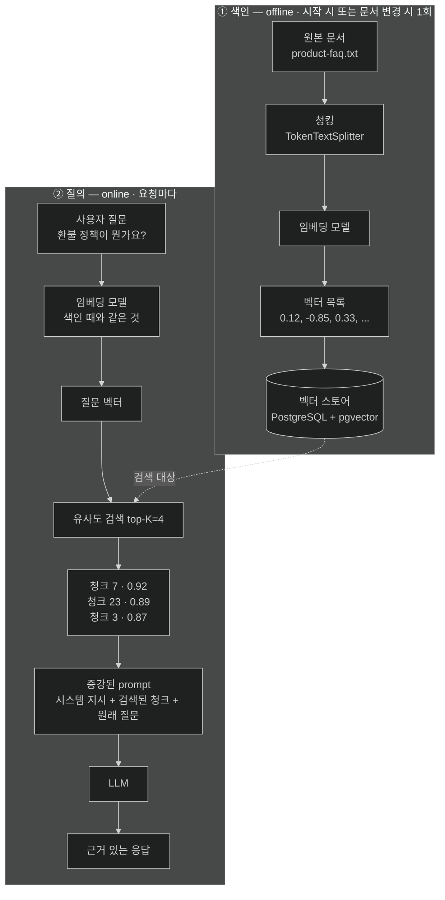

# RAG — 재학습 대신 질의 시점에 근거를 붙이는 패턴

## 한눈에 보기

| 단계 | 하는 일 | 이 장에서 담당하는 것 |
|---|---|---|
| Retrieval | 질문을 임베딩으로 바꿔 벡터 스토어에서 top-K 조각을 찾는다 | `VectorStoreDocumentRetriever` |
| Augmentation | 찾은 조각을 prompt에 끼워 넣는다 | `RetrievalAugmentationAdvisor` |
| Generation | model이 **주어진 근거**로 답을 만든다 | 평소의 `ChatClient` 호출 |

model을 재학습하지 않는다. **prompt를 바꿀 뿐이다.**

## 1. 왜 이게 필요한가

[[04b-tool-calling]]로 가격 질문은 풀렸다. 그런데 다음 질문에서 다시 막힌다.

> "환불 정책이 어떻게 되나요?"

도구로 풀 수 있을까? `getReturnPolicy()`를 만들어 문자열을 반환하면 된다 — 정책이 한 문장일 때는. 실제 사내 지식은 그렇지 않다.

- 제품 FAQ 40개 항목
- 배송·보증·결제·학생 할인 정책
- 고객지원 SLA 문서
- 계약서 조항, 내부 규정

`getFaqDocument()`가 40개 항목 전문을 반환하면 어떻게 될까. 매 요청 그 전체가 prompt로 들어간다. 컨텍스트 윈도의 대부분을 잡아먹고, [[01-introducing-llms-and-spring-ai]]에서 본 대로 **[[토큰-사용량]]**만큼 돈이 나가며, 정작 필요한 두 문장이 39개의 무관한 항목 속에 파묻힌다. 문서가 200쪽이면 아예 들어가지도 않는다.

"그럼 이 문서로 model을 학습시키면?" — 재학습(fine-tuning)은 비싸고 오래 걸리며, 정책이 바뀔 때마다 다시 해야 한다.

**[[RAG]]**(= 질의 시점에 외부 지식에서 관련 조각을 찾아 prompt에 넣는 아키텍처 패턴)가 이 셋 사이를 지나간다. model을 건드리지 않고, 문서 전체를 넣지도 않고, **이번 질문에 관련된 몇 조각만** 찾아 넣는다.

이름 그대로다 — Retrieval(검색)로 **Augmented**(증강)된 **Generation**(생성).

## 2. 어떻게 동작하는가

### 2.1 세 단계

**[[검색-단계]]**(= 질문을 임베딩으로 바꿔 유사한 조각을 찾는 단계). 사용자 질문을 **[[임베딩]]**(= text의 의미를 담은 고정 길이 실수 배열)으로 바꾸고, 미리 임베딩해 저장해 둔 문서 **[[청크]]**(= 검색 단위로 잘라 놓은 문서 조각)들과 비교한다. 의미적으로 가장 가까운 **[[top-K]]**(= 유사도 검색이 돌려줄 상위 결과 개수)개를 가져온다. 이 단계가 필요한 이유는 명백하다 — 넣을 수 있는 양이 유한하므로 **골라야** 한다.

**[[증강-단계]]**(= 찾아온 조각을 prompt에 끼워 넣는 단계). 가져온 조각을 시스템 메시지나 사용자 메시지의 일부로 원래 질문과 함께 붙인다. 이 단계가 필요한 이유는, model이 볼 수 있는 것은 오직 prompt뿐이기 때문이다. 벡터 스토어에 있다는 사실만으로는 model이 알 수 없다.

**[[생성-단계]]**(= 증강된 prompt로 답을 만드는 단계). model이 학습 지식이 아니라 **주어진 근거**에 기대어 답한다. 이것이 **[[그라운딩]]**(= 응답이 주어진 근거 문서에 실제로 기반하게 만드는 것)이다.

### 2.2 두 개의 시간대

Figure 14.3이 강조하는 것은 RAG가 **서로 다른 시점의 두 흐름**이라는 점이다.

**색인 단계 — offline.** 애플리케이션이 뜰 때(또는 문서가 바뀔 때) 한 번 돈다. 원본 문서를 조각내고, 임베딩 model로 벡터를 만들고, **[[벡터-스토어]]**(= 임베딩을 저장하고 유사도로 검색하는 데이터베이스)에 넣는다. 사용자는 이 흐름을 보지 못한다. → [[05b-ingesting-documents-with-the-etl-pipeline]]

**질의 단계 — online.** 요청마다 돈다. 질문을 임베딩으로 바꾸고, 검색하고, prompt에 넣고, 생성한다. → [[05c-building-the-rag-pipeline-with-advisors]]

이 분리가 성능의 핵심이다. 임베딩 생성은 비싼 연산인데, 문서 쪽은 **한 번만** 하고 질의 쪽만 매번 한다.

### 2.3 RAG는 툴 콜링을 대체하지 않는다

책이 Note로 못 박는 지점이다. 둘은 보완적이다.

| | 툴 콜링 | RAG |
|---|---|---|
| 데이터 성격 | 구조화·실시간 | 비정형·대량 |
| 예 | 가격, 재고, 현재 시각, 주문 상태 | 문서, 계약, 정책, 지원 문서 |
| 정확성의 근원 | 메서드가 정확한 값을 반환한다 | 검색이 맞는 조각을 찾아야 한다 |
| 최신성 | 호출 시점의 값 | 마지막 색인 시점의 문서 |

실무 AI 애플리케이션은 대개 **둘 다** 쓴다. [[05d-conversation-memory-with-chat-memory-advisor]]의 챗봇이 그 형태다.

"가격을 문서에 적어 두고 RAG로 찾으면?"이 왜 나쁜 생각인지도 이 표에서 보인다 — 가격이 바뀌면 문서를 다시 색인해야 하고, 그 사이 model은 낡은 값을 **근거 있게** 답한다. 최신성이 중요한 값은 도구로 가져와야 한다.

### 2.4 비유와 그 한계

시험을 오픈북으로 바꾸는 것에 빗댈 수 있다. 학생(model)을 다시 가르치는(fine-tuning) 대신, 문제에 해당하는 **교재 몇 쪽을 찾아 책상에 올려 준다**(retrieval + augmentation). 학생은 그걸 보고 답을 쓴다(generation).

**깨지는 지점 셋.** 첫째, 학생은 필요하면 **책을 더 넘겨 본다.** model은 넘겨 볼 수 없다 — 우리가 올려 준 top-K 조각이 전부다. 잘못된 조각을 올려 주면 model은 그 조각으로 답한다. 둘째, 학생은 "이 자료로는 답할 수 없다"고 말할 줄 안다. model은 자료가 부족해도 **그럴듯하게 채워 넣을** 수 있다 — 그래서 [[07a-evaluating-llm-response-quality]]가 필요하다. 셋째, 책상에 올린 자료가 **오염되어 있으면** 학생은 그걸 지시로 읽을 수도 있다. 그게 [[07d-security-best-practices-for-ai-applications]]의 간접 프롬프트 인젝션이다.

## 3. 그림으로 보기

Figure 14.3(책 p.432)의 재현이다. 위가 offline 색인, 아래가 online 질의다.

## 4. 이 노트에 나온 용어

- **[[RAG]]**: 질의 시점에 외부 지식을 찾아 prompt에 넣어 답을 근거 있게 만드는 패턴.
- **[[검색-단계]]**: 질문을 임베딩으로 바꿔 유사한 조각을 찾는 단계.
- **[[증강-단계]]**: 찾아온 조각을 prompt에 끼워 넣는 단계.
- **[[생성-단계]]**: 증강된 prompt로 답을 만드는 단계.
- **[[그라운딩]]**: 응답이 주어진 근거 문서에 실제로 기반하게 만드는 것.
- **[[top-K]]**: 유사도 검색이 돌려줄 상위 결과의 개수.
- **[[임베딩]]**: text의 의미를 담은 고정 길이 실수 배열.
- **[[벡터-스토어]]**: 임베딩을 저장하고 유사도로 검색하는 데이터베이스.
- **[[청크]]**: 검색 단위가 되도록 잘라 놓은 문서 조각.

## 5. 자주 헷갈리는 것

**"RAG는 model을 학습시킨다"** — 아니다. model 가중치는 손대지 않는다. 바뀌는 것은 **prompt의 내용**뿐이다. 그래서 문서를 고치면 다음 요청부터 바로 반영되고(재색인 후), model 교체와도 독립적이다.

**"RAG를 쓰면 환각이 사라진다"** — 줄어들 뿐이다. 검색이 엉뚱한 조각을 가져오면 model은 그 조각을 근거로 **자신 있게 틀린 답**을 한다. 게다가 근거가 붙어 있어 더 믿음직해 보인다. 검색 품질이 곧 답변 품질이다.

**top-K를 키우면 항상 좋은가** — 아니다. context가 풍부해지지만 prompt 크기와 token 비용이 같이 커지고, 무관한 조각이 섞여 들어와 model의 주의를 흩뜨린다.

## 6. 언제 안 쓰나 / 경계

- **자주 바뀌는 구조화 값**(가격·재고·잔액)에는 쓰지 않는다. 도구로 조회한다.
- **문서가 몇 문단뿐이라면** 그냥 시스템 프롬프트에 넣는 편이 단순하다. 벡터 DB 운영 비용이 이득을 넘는다.
- **정확한 인용이 법적으로 요구되는 곳**에서는 생성 응답을 그대로 쓰지 않는다. 검색된 원문을 함께 보여 주고 model 요약은 보조로 둔다.
- **오염 가능한 출처를 무검증 색인하지 않는다.** 벡터 스토어에 들어간 문장은 언젠가 prompt가 된다.

## 7. 연결

- [[05a-embeddings-and-vector-stores]] — "의미가 가깝다"를 계산 가능한 수로 만드는 기계.
- [[05b-ingesting-documents-with-the-etl-pipeline]] — 색인 단계(offline)의 구현.
- [[05c-building-the-rag-pipeline-with-advisors]] — 질의 단계(online)의 구현.
- [[04b-tool-calling]] — RAG와 분업하는 다른 갈래. 구조화·실시간 데이터를 맡는다.
- [[07a-evaluating-llm-response-quality]] — 검색이 맞는 조각을 가져왔는지 검증하는 방법.

## 8. 스스로 확인

- FAQ 문서 전체를 시스템 프롬프트에 넣는 것과 RAG의 차이를 비용·정확도 두 측면에서 설명해 보라.
- 색인이 offline이고 질의가 online인 분리가 없다면 무엇이 느려지는가?
- "이 제품 지금 재고 있나요?"를 RAG로 답하게 만들면 어떤 사고가 생길 수 있는가?
- RAG를 붙였는데도 환각이 나오는 경우, 먼저 의심할 곳은 어디인가?

> 네 문항을 스스로 답한 **뒤에** [[_05-implementing-rag-with-vector-stores-and-advisors]]에서 모범답안과 대조한다. 먼저 열면 이 문항들은 다시 인출 문제로 쓸 수 없다.

<!-- ==== 아래는 내 영역 · 스킬 수정 금지 ==== -->

## 내 설명 시도

## 막혔던 지점

## 리뷰 이력
