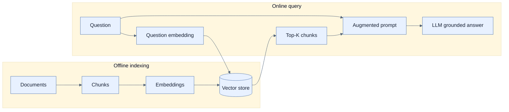

# Vector Store와 Advisor로 RAG 구현

## 한눈에 보기

RAG는 offline에 document를 chunk·embedding해 vector store에 저장하고, online에 question embedding과 가까운 top-K chunk를 찾아 prompt에 넣어 답을 grounding한다. Spring AI의 ETL abstraction과 `RetrievalAugmentationAdvisor`가 ingestion과 query-time augmentation을 구성한다.

## 1. 왜 이게 필요한가

사내 policy·manual·contract는 model training에 없거나 계속 변한다. Fine-tuning 없이 query마다 관련 excerpt를 제공하면 private·최신 knowledge에 근거한 답을 만들고 generic hallucination을 줄일 수 있다. 단, retrieval이 잘못되면 generation도 잘못되므로 RAG는 “정답 보장 장치”가 아니라 별도 평가가 필요한 pipeline이다.

## 2. 어떻게 동작하는가

Embedding model은 text를 semantic meaning을 담은 fixed-length vector로 바꾼다. 같은 단어가 없어도 의미가 가까우면 vector distance가 작다. 책은 PostgreSQL 17 + pgvector, HNSW index, cosine distance, 1536 dimension embedding example을 사용한다. Embedding output dimension과 DB vector column dimension은 반드시 일치해야 한다.

Ingestion은 classic ETL이다.

1. `DocumentReader`가 text/PDF/Markdown/JSON 등을 `Document`로 읽는다.
2. `TokenTextSplitter`가 context와 retrieval precision의 균형을 맞춘 chunk로 변환한다.
3. `VectorStore.accept(chunks)`가 embedding을 생성해 저장한다.

Query에서는 `VectorStoreDocumentRetriever.builder().vectorStore(vectorStore).topK(4)`가 question을 embedding하고 top-K 유사 chunk를 찾는다. `RetrievalAugmentationAdvisor`가 이를 prompt에 삽입한 뒤 `ChatClient` call을 계속한다. K가 크면 recall과 context가 늘지만 token cost와 noise도 증가한다.

`MessageChatMemoryAdvisor`와 `MessageWindowChatMemory`를 함께 쓰면 conversation ID별 최근 message를 넣고 RAG context도 추가한다. In-memory repository는 restart·multi-instance에 약하므로 production은 persistent store와 retention·privacy policy가 필요하다. Builder method와 RAG module dependency는 Spring AI version에 민감하므로 책 예제를 사용할 때 해당 reference를 대조한다.

## 3. 그림으로 보기

## 4. 이 노트에 나온 용어

- **retrieval-augmented generation**: 외부에서 찾은 context를 inference prompt에 넣어 답을 생성하는 architecture.
- **embedding**: text 등의 semantic features를 나타내는 fixed-length numeric vector.
- **vector store**: embedding 저장과 nearest-neighbor similarity search에 최적화된 storage.
- **ETL pipeline**: source document를 read·transform·load하는 ingestion 흐름.
- **RetrievalAugmentationAdvisor**: ChatClient request 전에 관련 document를 검색해 prompt를 보강하는 advisor.

## 7. 연결

- [[04-designing-prompts-and-tool-calling]] — live structured data에는 tool, 큰 비정형 지식에는 RAG를 쓴다.
- [[06-building-chatbots-and-mcp-integration]] — memory를 넣은 stateful chatbot과 remote capability로 확장한다.
- [[07-operating-llm-applications]] — retrieval relevance와 grounding을 evaluator로 검사한다.

## 8. 스스로 확인

- 전체 1차 정리 후: offline indexing과 online query를 나누고 chunk size·top-K·dimension의 trade-off를 설명한다.

<!-- ==== 아래는 내 영역 · 스킬 수정 금지 ==== -->

## 내 설명 시도

## 막혔던 지점

## 리뷰 이력

