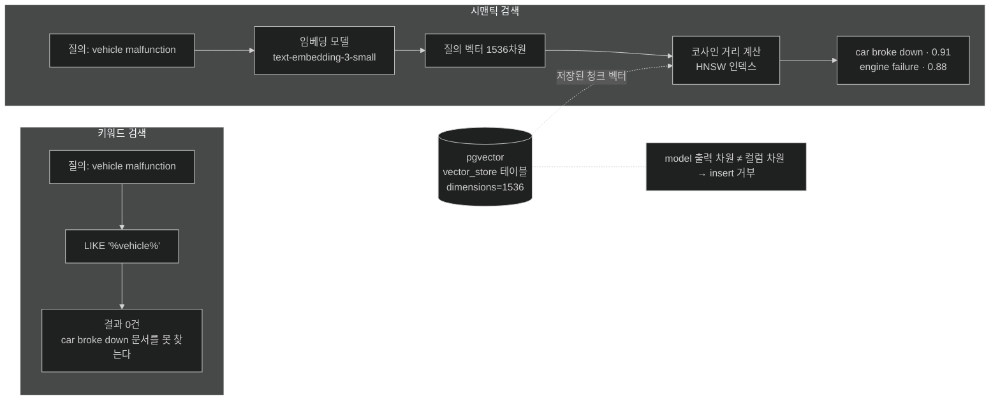

# 임베딩과 벡터 스토어 — 의미를 좌표로 바꿔 검색하기

## 한눈에 보기

| 개념 | 한 줄 |
|---|---|
| 임베딩 | text 조각 → 1536개의 실수. 의미가 가까우면 좌표도 가깝다 |
| 벡터 스토어 | 그 좌표들을 저장하고 "가장 가까운 것 K개"를 빠르게 돌려주는 DB |
| 시맨틱 검색 | 단어가 안 겹쳐도 의미로 찾는 검색. keyword 검색이 못 하는 일 |
| pgvector | PostgreSQL에 벡터 타입과 인덱스를 더하는 확장. 별도 벡터 DB 없이 시작할 수 있다 |
| 함정 | 임베딩 model의 출력 차원과 DB 컬럼 차원이 다르면 **insert 자체가 거부**된다 |

## 1. 왜 이게 필요한가

[[05-implementing-rag-with-vector-stores-and-advisors]]의 검색 단계는 "의미적으로 가장 가까운 조각을 찾는다"고 했다. 그 한 문장에 기계가 숨어 있다.

전통적인 방식으로 해 보자. 사용자가 이렇게 묻는다.

> "차가 고장 났어요" (`vehicle malfunction`)

FAQ에는 이런 항목이 있다.

> "car broke down"

`LIKE '%vehicle%'`도, 전문 검색 인덱스도 이 둘을 잇지 못한다. **글자가 하나도 안 겹치기 때문이다.** 그런데 사람은 둘이 같은 얘기라는 걸 안다.

동의어 사전을 만들면 될까? `vehicle`↔`car`, `malfunction`↔`broke down`… 언어의 모든 표현 쌍을 손으로 등록해야 하고, "환불되나요"와 "돈 돌려받을 수 있어요?"와 "반품하면 결제 취소돼요?"는 여전히 안 잡힌다.

**[[임베딩]]**(= text의 의미를 담은 고정 길이 실수 배열)이 이 문제를 다른 각도에서 푼다. 단어를 비교하는 대신 **의미를 좌표로 바꿔 거리를 잰다.**

## 2. 어떻게 동작하는가

### 2.1 임베딩 — 의미의 좌표화

**[[EmbeddingModel]]**(= text를 벡터로 바꾸는 model의 추상)이 문장·문단·문서 조각을 받아 고정 길이 실수 배열을 낸다.

```text
"What is the return policy?"  →  [0.36, -0.21, 0.78, 0.05, ... ]   (1536개)
"환불 정책이 어떻게 되나요?"      →  [0.34, -0.19, 0.81, 0.07, ... ]   (가까움)
"배송비는 얼마인가요?"           →  [-0.55, 0.62, -0.11, 0.44, ...]  (멂)
```

이 숫자들은 **의미를 수학적 공간에 배치한 좌표**다. 의미가 비슷한 두 text는 같은 단어를 쓰지 않아도 가까운 벡터가 된다. 왜 그렇게 되느냐면, 임베딩 model이 "비슷한 맥락에서 쓰이는 표현은 비슷한 좌표를 갖도록" 학습됐기 때문이다.

### 2.2 벡터 스토어와 유사도 검색

**[[벡터-스토어]]**(= 벡터 저장과 검색에 최적화된 데이터베이스)는 이 좌표들을 담아 두고, 질의 벡터가 오면 **[[유사도-검색]]**(= 질의 벡터와 저장된 벡터의 거리를 계산해 가까운 것을 돌려주는 연산)을 수행한다.

전체 흐름은 이렇다.

1. 질문이 온다.
2. **색인 때 쓴 것과 같은** 임베딩 model이 질문을 벡터로 바꾼다. 같은 model이어야 하는 이유는, 다른 model은 다른 좌표계를 쓰기 때문이다 — 같은 문장도 다른 위치에 놓인다.
3. 벡터 스토어가 거리 순으로 정렬해 가까운 조각을 돌려준다.

이것이 **[[시맨틱-검색]]**(= 단어 일치가 아니라 의미 근접성으로 찾는 검색)이다. `vehicle malfunction`으로 `car broke down`을 찾아내는 이유가 여기 있다.

### 2.3 pgvector — PostgreSQL로 시작하기

이 장은 전용 벡터 DB 대신 **[[pgvector]]**(= PostgreSQL에 벡터 컬럼 타입과 유사도 연산·인덱스를 더하는 확장)를 쓴다. 이미 PostgreSQL을 쓰고 있다면 인프라를 하나 더 늘리지 않아도 된다는 것이 이유다.

pgvector는 두 종류의 인덱스를 제공한다.

| 인덱스 | 원리 | 언제 |
|---|---|---|
| **[[HNSW]]**(= 그래프 기반 근사 최근접 이웃 인덱스) | 계층 그래프를 타고 내려가며 가까운 이웃을 좁혀 간다 | 고속 근사 검색. 이 장의 선택 |
| **[[IVFFlat]]**(= 벡터를 클러스터로 나눈 인덱스) | 벡터를 군집으로 나누고 질의와 가까운 군집만 뒤진다 | 대규모 유사도 질의 가속 |

둘 다 **근사**다. 전수 비교보다 훨씬 빠른 대신 아주 드물게 진짜 최근접을 놓칠 수 있다 — RAG에서는 top-K를 넉넉히 잡아 흡수한다.

### 2.4 컨테이너 띄우기

```yaml
services:
  pgvector:
    image: pgvector/pgvector:pg17
    container_name: ch14-pgvector
    environment:
      POSTGRES_USER: postgres
      POSTGRES_PASSWORD: postgres
      POSTGRES_DB: ragdb
    ports:
      - "5432:5432"
```

- `pgvector/pgvector:pg17`: PostgreSQL 17에 pgvector 확장이 **미리 설치된** 공식 이미지. 확장을 직접 컴파일·설치하지 않아도 된다.
- `POSTGRES_USER`·`POSTGRES_PASSWORD`·`POSTGRES_DB`: 사용자·비밀번호·DB 이름(`ragdb`).

```bash
docker compose up -d
```

> 자동 테스트에는 `@ServiceConnection`을 붙인 PostgreSQL Testcontainer를 쓴다. 같은 pgvector 인프라를 테스트 친화적으로 얻고 Spring Boot의 통합 테스트 지원과 깔끔하게 맞물린다.

### 2.5 의존성

start.spring.io에서 **PGvector Vector Database**, **JDBC API**, **PostgreSQL Driver**를 고르면 pom에 이렇게 들어간다.

```xml
<dependency>
    <groupId>org.springframework.boot</groupId>
    <artifactId>spring-boot-starter-jdbc</artifactId>
</dependency>
<dependency>
    <groupId>org.springframework.ai</groupId>
    <artifactId>spring-ai-starter-vector-store-pgvector</artifactId>
</dependency>
<dependency>
    <groupId>org.postgresql</groupId>
    <artifactId>postgresql</artifactId>
    <scope>runtime</scope>
</dependency>
<dependency>
    <groupId>org.springframework.boot</groupId>
    <artifactId>spring-boot-starter-jdbc-test</artifactId>
    <scope>test</scope>
</dependency>
```

- `spring-ai-starter-vector-store-pgvector`: **[[VectorStore]]**(= 벡터 저장·유사도 검색의 추상) 구현을 auto-configure한다.
- `spring-boot-starter-jdbc`: JDBC auto-configuration·커넥션 풀·트랜잭션·`JdbcTemplate`. pgvector 벡터 스토어 auto-configuration이 **`JdbcTemplate`을 요구**하므로 필수다.
- `postgresql`: JDBC 드라이버. 런타임에만 필요하다.
- `spring-boot-starter-jdbc-test`: JDBC 통합 테스트 지원.

하나가 더 필요한데 **Initializr 목록에 없어 손으로 넣어야 한다.**

```xml
<dependency>
    <artifactId>spring-ai-rag</artifactId>
    <groupId>org.springframework.ai</groupId>
</dependency>
```

`spring-ai-rag`가 `RetrievalAugmentationAdvisor`와 `VectorStoreDocumentRetriever`를 제공한다 — [[05c-building-the-rag-pipeline-with-advisors]]에서 쓰는 것들이다.

### 2.6 설정 — 차원이 맞아야 한다

```properties
spring.datasource.url=jdbc:postgresql://localhost:5432/ragdb
spring.datasource.username=postgres
spring.datasource.password=postgres

spring.ai.vectorstore.pgvector.initialize-schema=true
spring.ai.vectorstore.pgvector.index-type=HNSW
spring.ai.vectorstore.pgvector.distance-type=COSINE_DISTANCE
spring.ai.openai.embedding.options.model=text-embedding-3-small
spring.ai.vectorstore.pgvector.dimensions=1536
```

| property | 하는 일 | 왜 |
|---|---|---|
| `initialize-schema=true` | 시작 시 `vector_store` 테이블을 만들고 `pgvector`·`hstore`·`uuid-ossp` 확장을 설치한다 | DDL을 손으로 안 써도 된다 |
| `index-type=HNSW` | 그래프 기반 근사 최근접 인덱스 | 검색 속도 |
| `distance-type=COSINE_DISTANCE` | **[[코사인-거리]]**(= 두 벡터가 이루는 각도로 유사도를 재는 척도) | 벡터의 크기가 아니라 **방향**만 비교한다. 문장 길이에 덜 휘둘린다 |
| `embedding.options.model=text-embedding-3-small` | **[[text-embedding-3-small]]**(= 기본 1536차원을 내는 OpenAI 임베딩 model) | 구형 `text-embedding-ada-002`보다 권장된다 |
| `dimensions=1536` | 벡터 컬럼의 **[[임베딩-차원]]**(= 벡터의 길이) | **model의 출력 차원과 반드시 같아야 한다** |

마지막 줄이 실전에서 가장 많이 물리는 곳이다. 임베딩 model이 1536개를 내는데 컬럼이 768차원이면, PostgreSQL이 **런타임에 insert를 거부한다.** 애플리케이션이 뜨고 나서 첫 색인 때 터지므로 원인을 찾기까지 시간이 걸린다. model을 바꾸면 이 값도 같이 바꿔야 하고, **기존 벡터는 좌표계가 달라 재색인해야 한다.**

### 2.7 색인할 지식

`src/main/resources/documents/product-faq.txt`가 이 애플리케이션의 private 지식 베이스다. 실제 파일에는 아홉 개 Q&A가 들어 있다.

```text
=== TechStore Product FAQ ===

Q: What is the return policy?
A: Customers may return any item within 30 days of purchase for a full
   refund. Items must be in their original packaging and unused condition.
   Digital downloads are non-refundable once accessed.

Q: What are the shipping options?
A: Standard (5-7 business days): free on orders over $50, otherwise $4.99.
   Express (2-3 business days): $9.99.  Overnight: $24.99.
   Orders placed before 2 PM EST ship the same day.

… 보증(SpringBook Pro 2년 + TechCare $49/년), Java 25 호환·NPU 추론 성능,
   기술 사양, 고객지원 채널·SLA, 학생 15% 할인, 결제 수단, 주문 추적 …
```

이 문서의 성격이 요점이다. **model이 학습 중에 알 수 없었던 회사 고유 정보**다 — "SpringBook Pro"라는 제품도, TechCare 가격도, 2시 EST 마감도 세상에 없는 사실이다. RAG pipeline이 이 지식을 런타임에 질의 가능하게 만든다.

### 2.8 비유와 그 한계

도서관 서가 배치에 빗댈 수 있다. 임베딩은 **주제별로 책을 꽂는 좌표**를 정하는 일이다. 제목의 글자가 달라도 주제가 비슷하면 옆자리에 꽂힌다. 질문이 오면 그 질문의 자리로 가서 **주변 책 네 권**을 뽑아 온다.

**깨지는 지점 셋.** 첫째, 도서관은 **한 책이 한 자리**에 있지만 임베딩 공간은 1536차원이라 "옆자리"라는 직관이 성립하지 않는다 — 고차원에서는 거의 모든 점이 서로 비슷하게 멀어지고(차원의 저주), 그래서 코사인 거리 같은 척도와 근사 인덱스가 필요하다. 둘째, 사서는 "이 주제는 3층에도 있어요"라고 말해 주지만 벡터 검색은 **top-K 밖의 것을 알려 주지 않는다.** 셋째, 서가는 사람이 훑어볼 수 있지만 임베딩 좌표는 **사람이 읽을 수 없다.** 왜 이 조각이 뽑혔는지 벡터만 봐서는 알 수 없어, 디버깅할 때 [[05b-ingesting-documents-with-the-etl-pipeline]]의 메타데이터와 [[05c-building-the-rag-pipeline-with-advisors]]의 로깅이 필요해진다.

## 3. 그림으로 보기



## 4. 이 노트에 나온 용어

- **[[임베딩]]**: text의 의미를 담은 고정 길이 실수 배열.
- **[[벡터-스토어]]**: 벡터 저장과 유사도 검색에 최적화된 데이터베이스.
- **[[유사도-검색]]**: 질의 벡터와 저장 벡터의 거리로 가까운 것을 찾는 연산.
- **[[시맨틱-검색]]**: 단어 일치가 아니라 의미 근접성으로 찾는 검색.
- **[[pgvector]]**: PostgreSQL에 벡터 타입과 유사도 인덱스를 더하는 확장.
- **[[HNSW]]**: 그래프 기반 근사 최근접 이웃 인덱스.
- **[[IVFFlat]]**: 벡터를 클러스터로 나눠 검색을 가속하는 인덱스.
- **[[코사인-거리]]**: 두 벡터의 각도로 유사도를 재는 척도.
- **[[임베딩-차원]]**: 벡터의 길이. 컬럼 차원과 model 출력 차원이 같아야 한다.
- **[[text-embedding-3-small]]**: 기본 1536차원을 내는 OpenAI 임베딩 model.
- **[[EmbeddingModel]]**: text를 벡터로 바꾸는 model의 추상.
- **[[VectorStore]]**: 벡터 저장·유사도 검색의 추상.

## 5. 자주 헷갈리는 것

**원문 표기 문제** — 책 p.436의 `spring-ai-rag` 의존성 블록은 `<artifactId>`를 `<groupId>`보다 먼저 쓴다. Maven이 순서를 강제하지 않아 동작은 하지만, 책의 다른 모든 의존성 블록과 순서가 다르다.

**임베딩 model ≠ chat model** — 다른 것이다. `spring.ai.openai.chat.options.model`이 답을 만들고, `spring.ai.openai.embedding.options.model`이 벡터를 만든다. chat model을 바꿔도 벡터는 그대로지만, **임베딩 model을 바꾸면 전부 재색인**해야 한다.

**코사인 거리 vs 유클리드 거리** — 코사인은 방향만, 유클리드는 방향과 크기를 함께 본다. 문서 길이가 제각각인 text 검색에서는 코사인이 일반적이다.

**`initialize-schema=true`는 개발용 편의다** — production에서는 스키마를 마이그레이션 도구로 관리하고 이 값을 끄는 편이 안전하다. 애플리케이션이 DDL 권한을 갖지 않아도 되기 때문이다.

## 6. 언제 안 쓰나 / 경계

- **정확한 문자열·ID 조회에는 부적합하다.** 주문번호 `A-2026-0417`을 시맨틱 검색으로 찾지 않는다. 그건 `WHERE`의 일이다.
- **소량 문서에는 과하다.** 열 문단짜리 정책은 시스템 프롬프트에 넣는 편이 단순하고 정확하다.
- **초대형·고QPS 환경에서는** 전용 벡터 DB(Pinecone·Qdrant 등)를 검토한다. pgvector는 "이미 있는 PostgreSQL을 재사용한다"는 장점으로 선택하는 것이다.
- **차원·model·거리 척도는 한 세트다.** 셋 중 하나를 바꾸면 재색인을 계획에 넣는다.

## 7. 연결

- [[05-implementing-rag-with-vector-stores-and-advisors]] — 이 기계가 쓰이는 큰 그림.
- [[05b-ingesting-documents-with-the-etl-pipeline]] — 여기 설정한 벡터 스토어에 실제로 문서를 넣는 과정.
- [[05c-building-the-rag-pipeline-with-advisors]] — 저장된 벡터를 질의 시점에 꺼내 쓰는 과정.
- [[01-introducing-llms-and-spring-ai]] — `EmbeddingModel`·`VectorStore`가 Spring AI 추상 계층에서 차지하는 자리.

## 8. 스스로 확인

- `vehicle malfunction`으로 `car broke down`을 찾을 수 있는 이유를 벡터 관점에서 설명해 보라.
- 임베딩 model을 `text-embedding-3-large`로 바꾸면 무엇을 함께 바꿔야 하고, 기존 데이터는 어떻게 되는가?
- HNSW가 "근사"인데도 RAG에서 문제가 되지 않는 이유는?
- `initialize-schema=true`를 production에서 끄는 이유는 무엇인가?


> 네 문항을 스스로 답한 **뒤에** [[_05a-embeddings-and-vector-stores]]에서 모범답안과 대조한다. 먼저 열면 이 문항들은 다시 인출 문제로 쓸 수 없다.

<!-- ==== 아래는 내 영역 · 스킬 수정 금지 ==== -->

## 내 설명 시도


## 막혔던 지점


## 리뷰 이력
