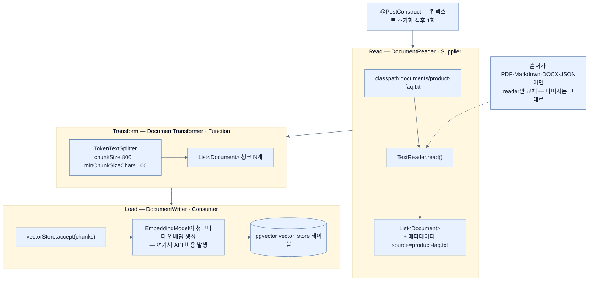

# ETL 파이프라인 — 문서를 읽고 쪼개서 벡터로 심기

## 한눈에 보기

| 단계 | Spring AI 타입 | Java 함수형 패턴 | 이 예제의 구현 |
|---|---|---|---|
| Read | `DocumentReader` | `Supplier<List<Document>>` | `TextReader` |
| Transform | `DocumentTransformer` | `Function<List<Document>, List<Document>>` | `TokenTextSplitter` |
| Load | `DocumentWriter` | `Consumer<List<Document>>` | `VectorStore` 자신 |

`vectorStore.accept(chunks)` 한 줄에서 임베딩 생성과 저장이 함께 일어난다.

## 1. 왜 이게 필요한가

[[05a-embeddings-and-vector-stores]]에서 pgvector 컨테이너를 띄우고 `vector_store` 테이블까지 만들었다. 그런데 테이블은 비어 있다. 질문을 던지면 검색 결과가 0건이고, model은 RAG를 붙이기 전과 똑같이 답한다.

문서를 넣어야 하는데, 그냥 파일 통째로 한 행에 넣으면 안 된다. 이유가 두 가지다.

**첫째, 임베딩은 조각 단위여야 검색이 쓸모 있다.** `product-faq.txt` 전체를 벡터 하나로 만들면 그 벡터는 "환불·배송·보증·사양·결제가 전부 섞인 무언가"의 좌표가 된다. "환불 정책이 뭔가요?"의 벡터와 별로 가깝지 않다. 그리고 검색에 걸려도 돌려주는 것은 **문서 전체**라, top-K로 걸러 낸 의미가 없어진다.

**둘째, 컨텍스트 윈도에 안 들어간다.** 검색 결과가 곧 prompt에 붙는데, 200쪽 문서 한 덩어리는 붙일 수가 없다.

그래서 **읽고 → 쪼개고 → 저장하는** 세 단계가 필요하다. 데이터 엔지니어링에서 오래 쓰인 Read → Transform → Load, 즉 **[[ETL-파이프라인]]**(= 문서를 읽고 가공해 저장하는 데이터 처리 경로)이 그대로 들어온다.

## 2. 어떻게 동작하는가

### 2.1 세 개의 인터페이스

Spring AI는 각 단계를 **Java 함수형 인터페이스에 대응시켜** 설계했다. 이름을 외우기보다 그 대응을 보면 역할이 바로 읽힌다.

- **[[DocumentReader]]**(= 원본을 읽어 `Document` 목록으로 바꾸는 첫 단계). 내부적으로 `Supplier` 패턴 — **입력 없이 값을 만들어 낸다.** text 파일, PDF, Markdown, JSON, HTML 등 출처가 무엇이든 `Document` 객체로 통일한다.
- **[[DocumentTransformer]]**(= 저장 전에 문서를 가공하는 중간 단계). 내부적으로 `Function` 패턴 — **문서 목록을 받아 문서 목록을 낸다.** 대표적인 것이 큰 문서를 쪼개는 splitter다.
- **[[DocumentWriter]]**(= 가공된 문서를 목적지에 쓰는 마지막 단계). 내부적으로 `Consumer` 패턴 — **받아서 소비하고 끝난다.** 여기서 중요한 사실 하나: **[[VectorStore]]**(= 벡터 저장·유사도 검색의 추상)가 `DocumentWriter`를 구현한다. 그래서 별도 어댑터 없이 pipeline의 종착점이 될 수 있다.

### 2.2 실제 서비스

```java
@Service
public class DocumentIngestionService {

    private final VectorStore vectorStore;

    @Value("classpath:documents/product-faq.txt")
    private Resource faqResource;

    public DocumentIngestionService(VectorStore vectorStore) {
        this.vectorStore = vectorStore;
    }

    @PostConstruct
    public void ingest() {

        TextReader reader = new TextReader(faqResource);
        reader.getCustomMetadata().put("source", "product-faq.txt");
        List<Document> documents = reader.read();

        TokenTextSplitter splitter = TokenTextSplitter.builder()
                .withChunkSize(800)
                .withMinChunkSizeChars(100)
                .build();
        List<Document> chunks = splitter.apply(documents);

        vectorStore.accept(chunks);

        System.out.println(">>> Ingested " + chunks.size() +
           " document chunks into the vector store.");
    }
}
```

단계마다 그 단계가 있는 이유를 붙여 읽는다.

| 요소 | 하는 일 | 왜 필요한가 |
|---|---|---|
| `VectorStore` 주입 | 처리된 청크의 목적지 | 내부적으로 `EmbeddingModel`이 임베딩을 만든 뒤 pgvector에 넣는다 |
| `@Value("classpath:documents/product-faq.txt")` | FAQ를 classpath resource로 로드 | jar에 함께 패키징되어 배포 시 경로가 어긋나지 않는다 |
| `@PostConstruct` | Spring context 초기화 **직후** 실행 | 첫 요청이 오기 전에 벡터 스토어가 채워져 있어야 검색이 성립한다 |
| `TextReader` | **read 단계**. 평문 파일 → `Document` 목록 | 출처 형식과 무관하게 이후 단계를 통일하기 위해 |
| `reader.getCustomMetadata().put("source", ...)` | 각 문서에 **[[문서-메타데이터]]**(= 각 `Document`에 붙는 key-value 정보) 부착 | 나중에 필터링·출처 추적·디버깅에 쓴다. "이 답의 근거가 어느 파일이었나"를 되짚을 유일한 실마리다 |
| `TokenTextSplitter` | **transform 단계**. 큰 문서를 청크로 분할 | 임베딩 model의 컨텍스트에 맞추고 검색 정확도를 올린다 |
| `withChunkSize(800)` | 청크 하나의 대략적 token 크기 | **작으면 검색 정밀도, 크면 문맥 보존.** 이 값이 RAG 품질의 조절 손잡이다 |
| `withMinChunkSizeChars(100)` | 최소 청크 문자 수 | 의미 없는 파편이 독립 청크로 남는 것을 막는다 |
| `vectorStore.accept(chunks)` | **load 단계** | 각 청크의 **[[임베딩]]**(= 의미를 담은 실수 배열)을 만들고 벡터 DB에 저장한다 |

`vectorStore.accept(chunks)` 한 줄에 두 가지 일이 압축돼 있다는 점이 중요하다 — **임베딩 생성**(OpenAI API 호출, 비용 발생)과 **DB 저장**이다. 청크가 100개면 임베딩 API를 그만큼 부른다. 그래서 이 단계가 offline인 것이다.

### 2.3 청크 크기라는 손잡이

`withChunkSize`가 왜 조절 손잡이인지 구체적으로 보자.

| 청크 크기 | 장점 | 단점 |
|---|---|---|
| 작다 (예: 200) | 검색이 정확한 문장을 집는다 | 문맥이 잘려 "그것은 30일입니다"처럼 주어가 없는 조각이 나온다 |
| 크다 (예: 2000) | 문맥이 온전하다 | 무관한 내용이 함께 딸려 와 prompt를 채우고 model의 주의를 흩뜨린다 |

이 예제의 800은 "FAQ 한두 항목"에 해당하는 크기다. 문서 구조에 따라 달라져야 하는 값이고, 정답은 실험으로 찾는다 — [[07a-evaluating-llm-response-quality]]가 그 실험의 채점 도구다.

### 2.4 출처가 바뀌면 reader만 바꾼다

**[[TextReader]]**(= 평문 파일용 `DocumentReader` 구현) 자리에 다른 구현을 넣으면 된다.

| reader | 대상 |
|---|---|
| `TextReader` | 평문 |
| `PagePdfDocumentReader` | PDF |
| `MarkdownDocumentReader` | Markdown |
| `TikaDocumentReader` | DOCX, PPTX, HTML |
| `JsonReader` | JSON |

**어떤 reader를 쓰든 나머지 pipeline은 그대로다.** 이것이 세 단계를 인터페이스로 나눠 둔 이유다 — 출처가 바뀌어도 transform·load 코드를 고치지 않는다.

### 2.5 비유와 그 한계

책을 스캔해 색인 카드를 만드는 작업에 빗댈 수 있다. `DocumentReader`가 책을 펴서 글자를 읽고, `DocumentTransformer`가 항목별로 카드를 나누고, `DocumentWriter`가 카드를 주제별 서랍에 넣는다.

**깨지는 지점 둘.** 첫째, 사서는 **문맥을 보고** 카드를 나눈다 — "이 문단은 앞 문단과 이어지니 같이 두자". `TokenTextSplitter`는 token 개수로 자를 뿐이라, 한 답변이 두 청크로 갈라져 어느 쪽도 완전하지 않게 될 수 있다. 둘째, 카드는 나중에 사람이 읽고 고칠 수 있지만, 저장된 것은 **벡터**라 사람이 읽을 수 없다. 그래서 `source` 메타데이터를 붙여 원본으로 되짚을 길을 남겨 두는 것이다.

## 3. 그림으로 보기



## 4. 이 노트에 나온 용어

- **[[ETL-파이프라인]]**: Read → Transform → Load 흐름으로 문서를 읽고 가공해 저장하는 경로.
- **[[DocumentReader]]**: 원본을 `Document` 목록으로 바꾸는 첫 단계. `Supplier` 패턴.
- **[[DocumentTransformer]]**: 저장 전 문서를 가공하는 중간 단계. `Function` 패턴.
- **[[DocumentWriter]]**: 가공된 문서를 목적지에 쓰는 마지막 단계. `Consumer` 패턴.
- **[[TokenTextSplitter]]**: 문서를 지정 token 크기 근처로 쪼개는 `DocumentTransformer` 구현.
- **[[청크]]**: 임베딩·검색의 단위가 되도록 잘라 놓은 문서 조각.
- **[[TextReader]]**: 평문 파일용 `DocumentReader` 구현.
- **[[문서-메타데이터]]**: 각 `Document`에 붙는 key-value 정보.
- **[[VectorStore]]**: 벡터 저장·유사도 검색의 추상. `DocumentWriter`도 구현한다.
- **[[임베딩]]**: text의 의미를 담은 고정 길이 실수 배열.

## 5. 자주 헷갈리는 것

**원문의 구버전 API** — 책 코드는 `TokenTextSplitter.builder().withChunkSize(800).withMinChunkSizeChars(100)`을 쓰는데, **책 자신이 바로 다음 쪽에서** 최신 Spring AI는 `with` 접두를 뗀 `chunkSize(...)`·`minChunkSizeChars(...)` 스타일이라고 경고한다. 즉 예제 코드가 이미 구버전 API다. 쓰는 버전의 API 문서를 확인해야 한다.

**`accept()`가 왜 저장 메서드인가** — `VectorStore`가 `Consumer`인 `DocumentWriter`를 구현하기 때문이다. `Consumer.accept(T)`가 그 인터페이스의 메서드 이름이라 `save`나 `write`가 아니라 `accept`가 됐다.

**`@PostConstruct` 색인의 함정** — 애플리케이션이 뜰 때마다 다시 색인한다. 인스턴스를 여러 개 띄우면 같은 문서가 중복 색인되고, 재시작할 때마다 임베딩 API 비용이 또 든다. 시연·학습용 구성이며, production에서는 별도 색인 작업이나 중복 확인이 필요하다.

**청크가 몇 개 나올지 예측하기 어렵다** — `chunkSize`는 정확한 크기가 아니라 **대략적 목표**다. 그래서 예제가 마지막에 `chunks.size()`를 출력한다.

## 6. 언제 안 쓰나 / 경계

- **자주 바뀌는 데이터를 색인하지 않는다.** 재색인 비용과 지연 때문에 낡은 답이 나온다. 그런 값은 [[04b-tool-calling]]로 조회한다.
- **신뢰할 수 없는 출처를 그대로 넣지 않는다.** 색인된 문장은 언젠가 prompt가 되므로, [[07d-security-best-practices-for-ai-applications]]의 간접 프롬프트 인젝션 통로가 된다. ingest 전에 정제·필터링한다.
- **개인정보가 든 문서를 무분별하게 넣지 않는다.** 벡터 스토어의 내용은 검색되어 prompt에 실리고, 관측 설정에 따라 로그·trace에도 남을 수 있다.
- **한 번에 대량을 색인할 때 rate limit을 고려한다.** 청크마다 임베딩 API 호출이 나가므로 수천 개를 한꺼번에 밀면 제한에 걸린다.

## 7. 연결

- [[05a-embeddings-and-vector-stores]] — 여기서 저장하는 벡터가 무엇이고 어디에 들어가는지.
- [[05c-building-the-rag-pipeline-with-advisors]] — 심어 놓은 청크를 질의 시점에 꺼내 쓰는 쪽.
- [[05-implementing-rag-with-vector-stores-and-advisors]] — 색인(offline)과 질의(online)의 분리라는 큰 그림.
- [[07a-evaluating-llm-response-quality]] — 청크 크기를 바꿨을 때 좋아졌는지 채점하는 방법.

## 8. 스스로 확인

- 문서 전체를 청크로 나누지 않고 통째로 임베딩하면 검색 단계에서 정확히 무엇이 무너지는가?
- `DocumentReader`·`DocumentTransformer`·`DocumentWriter`를 각각 `Supplier`·`Function`·`Consumer`에 대응시키면 무엇이 명확해지는가?
- `vectorStore.accept(chunks)` 한 줄이 실제로 하는 두 가지 일은?
- `@PostConstruct` 색인을 production 3-인스턴스 환경에 그대로 두면 무슨 일이 생기는가?

<!-- ==== 아래는 내 영역 · 스킬 수정 금지 ==== -->

## 내 설명 시도


## 막혔던 지점


## 리뷰 이력
