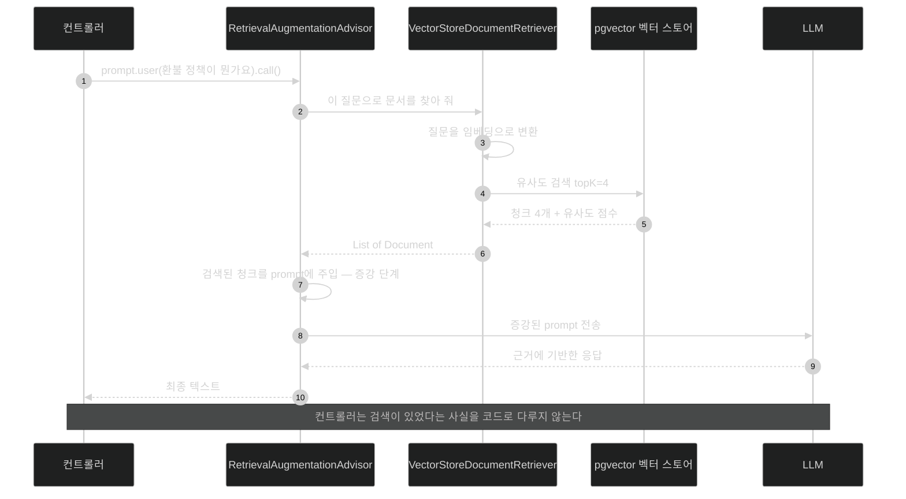

# `RetrievalAugmentationAdvisor` — 요청 사이에 검색을 끼워 넣기

## 한눈에 보기

```java
chatClient.prompt()
        .user(question)
        .advisors(RetrievalAugmentationAdvisor.builder()
                .documentRetriever(VectorStoreDocumentRetriever.builder()
                        .vectorStore(vectorStore)
                        .topK(4)
                        .build())
                .build())
        .call()
        .content();
```

`.advisors(...)` 한 블록이 추가됐을 뿐인데, 이 요청은 이제 우리 FAQ에 근거해 답한다. 검색·주입 코드는 한 줄도 없다.

## 1. 왜 이게 필요한가

[[05b-ingesting-documents-with-the-etl-pipeline]]까지 하면 벡터 스토어에 청크가 들어 있다. 이제 질의 시점에 그걸 꺼내 써야 한다. 직접 짜면 이렇게 된다.

```java
// 1. 질문을 임베딩으로
var qv = embeddingModel.embed(question);
// 2. 유사도 검색
var docs = vectorStore.similaritySearch(SearchRequest.query(question).withTopK(4));
// 3. 문자열로 이어 붙이기
var context = docs.stream().map(Document::getText).collect(joining("\n---\n"));
// 4. prompt 조립
return chatClient.prompt()
        .system("Use the following context to answer:\n" + context)
        .user(question)
        .call().content();
```

동작은 한다. 문제는 **이 네 단계가 controller마다 복사된다**는 것이다. 챗봇 endpoint, 검색 endpoint, 요약 endpoint에 같은 코드가 세 벌 생긴다. top-K를 바꾸려면 세 곳을 고치고, context를 시스템 메시지에 넣을지 사용자 메시지에 넣을지 실험하려면 또 세 곳을 고친다.

이건 익숙한 문제다. 요청마다 반복되는 관심사를 요청 경로 **바깥**으로 빼는 것 — servlet filter, `HandlerInterceptor`, AOP가 하는 일이다.

Spring AI에서 그 자리를 맡는 것이 **[[어드바이저]]**(= `ChatClient` 요청·응답 주위를 감싸 횡단 관심사를 끼워 넣는 구성 요소)다.

## 2. 어떻게 동작하는가

### 2.1 컨트롤러

```java
@RestController
@RequestMapping("/api/ai")
public class RagController {

    private final ChatClient chatClient;
    private final VectorStore vectorStore;

    public RagController(ChatClient chatClient, VectorStore vectorStore) {
        this.chatClient = chatClient;
        this.vectorStore = vectorStore;
    }

    @GetMapping("/rag")
    public String rag(@RequestParam String question) {
        String reply = chatClient.prompt()
                .user(question)
                .advisors(RetrievalAugmentationAdvisor.builder()
                        .documentRetriever(
                            VectorStoreDocumentRetriever.builder()
                                .vectorStore(vectorStore)
                                .topK(4)
                                .build())
                        .build())
                .call()
                .content();
        return reply;
    }
}
```

요소별로 본다.

| 요소 | 하는 일 | 왜 여기 있는가 |
|---|---|---|
| `ChatClient` | LLM 진입점 | advisor가 붙어도 우리가 부르는 API는 그대로다 |
| `VectorStore` | 시맨틱 검색 엔진 | [[05b-ingesting-documents-with-the-etl-pipeline]]가 채워 놓은 그 스토어 |
| `.user(question)` | 원래 질문 | 검색 단계에서 이 문장이 임베딩으로 변환된다 |
| **[[RetrievalAugmentationAdvisor]]**(= RAG 증강 단계를 담당하는 advisor) | 요청이 model에 닿기 **전에** 가로채 문서를 주입 | **[[증강-단계]]**의 구현체 |
| **[[VectorStoreDocumentRetriever]]**(= RAG 검색 단계 구현) | 질문 → 임베딩 → 유사도 검색 → 상위 청크 | **[[검색-단계]]**의 구현체 |
| `.vectorStore(vectorStore)` | 검색 대상 지정 | pgvector 뒤의 스토어를 쓴다 |
| `.topK(4)` | **[[top-K]]**(= 돌려받을 상위 결과 개수)를 4로 | 늘리면 context가 풍부해지지만 token과 prompt 크기가 커진다 |
| `.call().content()` | 증강된 요청 실행 | 우리 코드는 최종 문장만 본다 |

두 builder가 중첩된 구조가 눈에 띌 텐데, 층이 다르기 때문이다. **retriever는 "무엇을 어떻게 찾을까", advisor는 "찾은 것을 요청에 어떻게 끼울까"**를 맡는다. 그래서 retriever를 바꾸면(예: 웹 검색 기반) advisor는 그대로 쓸 수 있다.

### 2.2 실행 순서

`.call()`을 부르면 이런 순서로 진행된다.

1. advisor 체인이 요청을 가로챈다.
2. `RetrievalAugmentationAdvisor`가 retriever에 질문을 넘긴다.
3. retriever가 질문을 임베딩으로 바꾸고 벡터 스토어에 유사도 검색을 건다.
4. 상위 4개 청크를 받는다.
5. advisor가 그 청크를 prompt에 주입한다.
6. **그제서야** 요청이 model로 나간다.
7. 응답이 돌아오며 advisor 체인을 역순으로 통과한다.

6번이 핵심이다 — model은 증강된 prompt만 본다. 벡터 스토어의 존재도, 검색이 있었다는 사실도 모른다.

### 2.3 검증

```bash
curl -s "http://localhost:8080/api/ai/rag?question=What+is+the+return+policy"
```

```text
Customers may return any item within 30 days of purchase for a full refund.
Items must be in their original packaging and unused condition.
Digital downloads are non-refundable.
```

`product-faq.txt`에 적힌 내용 그대로다. 이것이 **[[그라운딩]]**(= 응답이 주어진 근거 문서에 실제로 기반하게 만드는 것)이 성공한 모습이다.

RAG가 없었다면 같은 질문에 **일반적인 전자상거래 정책**이 나왔을 것이다 — 그럴듯하고, 우리 정책과 다르고, 틀렸다는 신호가 없는 답. 그 차이가 이 절 전체의 이유다.

### 2.4 advisor라는 자리

책이 Note로 정리하듯, advisor는 interceptor·middleware처럼 동작한다. 그래서 다음 것들이 **같은 자리에 같은 방식으로** 붙는다.

| advisor | 하는 일 |
|---|---|
| `RetrievalAugmentationAdvisor` | RAG 검색·주입 |
| `MessageChatMemoryAdvisor` | 대화 이력 주입 → [[05d-conversation-memory-with-chat-memory-advisor]] |
| `SimpleLoggerAdvisor` | prompt·응답 로깅 |
| `SafeGuardAdvisor` | 안전 필터링 → [[07d-security-best-practices-for-ai-applications]] |

이 통일성이 설계의 이득이다. 새 관심사를 붙일 때 `ChatClient` 호출 코드를 고치지 않고 advisor 하나를 추가한다.

### 2.5 비유와 그 한계

시험장에 들어가는 학생에게 문 앞에서 **참고 자료를 손에 쥐여 주는 감독관**에 빗댈 수 있다. 학생(model)은 감독관이 있었다는 것도 모르고, 그냥 손에 든 자료를 보고 답한다. 감독관은 문제를 읽고 관련 자료 네 장을 골라 준다.

**깨지는 지점 셋.** 첫째, 감독관은 자료가 문제와 안 맞으면 **다시 찾아본다.** 이 advisor는 한 번 검색하고 끝이다 — 검색이 빗나가면 그대로 빗나간 자료로 답한다. 둘째, 학생은 "자료에 없는데요"라고 말할 수 있지만 model은 그럴듯하게 채워 넣을 수 있다. 셋째, 감독관이 **엉뚱한 지시가 적힌 종이**를 골라 주면 학생이 그 지시를 따를 수도 있다 — 간접 프롬프트 인젝션이 정확히 그 구조다.

## 3. 그림으로 보기



## 4. 이 노트에 나온 용어

- **[[어드바이저]]**: `ChatClient` 요청·응답 주위에 횡단 관심사를 끼워 넣는 구성 요소.
- **[[RetrievalAugmentationAdvisor]]**: RAG 증강 단계를 담당하는 advisor.
- **[[VectorStoreDocumentRetriever]]**: 질문을 임베딩으로 바꿔 유사도 검색을 수행하는 검색 단계 구현.
- **[[top-K]]**: 유사도 검색이 돌려줄 상위 결과 개수.
- **[[그라운딩]]**: 응답이 주어진 근거 문서에 실제로 기반하게 만드는 것.
- **[[검색-단계]]**: 질문을 임베딩으로 바꿔 유사한 조각을 찾는 RAG 단계.
- **[[증강-단계]]**: 찾아온 조각을 prompt에 끼워 넣는 RAG 단계.

## 5. 자주 헷갈리는 것

**원문 표기 오류 두 가지.** 첫째, 책 p.442의 항목 설명은 `.User(question)`으로 대문자 U를 쓴다. 코드 블록에는 소문자 `.user(question)`으로 정확히 쓰여 있으니 **설명 항목만의 오타**다 — [[03-reactive-streaming-with-chatclient]]의 `.Stream()`, [[04b-tool-calling]]의 `.Call()`과 같은 종류다.

둘째, 책 p.443은 응답 예시를 `{"reply": "Customers may return..."}` 형태의 **JSON**으로 보여 준다. 그런데 바로 위 `rag(...)` 메서드의 반환형은 `String`이다. `String`을 반환하는 `@RestController` 메서드는 그 문자열을 **본문에 그대로** 쓰므로 실제 응답은 평문이다. `{"reply": ...}`는 record로 감싼 [[04b-tool-calling]]·[[06b-consuming-mcp-tools-as-a-client]] 예제의 형태다.

**advisor가 붙는 위치** — 여기서는 요청마다 `.advisors(...)`로 붙였다. 모든 요청에 붙이려면 builder에서 `defaultAdvisors(...)`를 쓴다. 요청별로 검색 대상이 달라야 하면 전자, 애플리케이션 전체가 같은 지식 베이스를 쓰면 후자다.

**advisor 순서가 의미를 갖는다** — 여러 advisor를 걸면 요청은 등록 순서대로, 응답은 역순으로 통과한다. 메모리 주입과 RAG 주입이 같이 있을 때 어느 쪽이 먼저 prompt를 만지는지가 결과에 영향을 준다.

## 6. 언제 안 쓰나 / 경계

- **벡터 스토어가 비어 있으면 무의미하다.** 검색 결과 0건이면 advisor는 아무것도 주입하지 못하고, model은 RAG 없는 상태로 답한다 — 그런데 **에러는 나지 않는다.** 색인이 실패했는데 조용히 일반 답변이 나가는 상황을 조심해야 한다.
- **top-K를 무작정 키우지 않는다.** prompt가 커져 비용이 오르고, 무관한 청크가 model의 주의를 흩뜨린다.
- **검색 근거를 사용자에게 보여야 하는 서비스라면** advisor가 주입한 문서를 따로 꺼내야 한다. 응답 metadata의 `DOCUMENT_CONTEXT` key에 담겨 있다 — [[07a-evaluating-llm-response-quality]]가 그 값을 쓴다.
- **스트리밍과 함께 쓸 때 주의한다.** 검색은 응답 시작 전에 끝나야 하므로 첫 바이트까지의 시간에 검색 지연이 그대로 더해진다.

## 7. 연결

- [[05b-ingesting-documents-with-the-etl-pipeline]] — 이 advisor가 검색할 청크를 미리 심어 두는 쪽.
- [[05d-conversation-memory-with-chat-memory-advisor]] — 같은 advisor 자리에 대화 메모리를 함께 얹는다.
- [[05-implementing-rag-with-vector-stores-and-advisors]] — 검색·증강·생성 3단계의 큰 그림.
- [[07a-evaluating-llm-response-quality]] — 이 pipeline이 맞는 청크를 가져왔는지 채점한다.

## 8. 스스로 확인

- advisor 없이 손으로 짠 네 단계 코드와 비교해, advisor가 실제로 없애 주는 중복은 무엇인가?
- `RetrievalAugmentationAdvisor`와 `VectorStoreDocumentRetriever`를 두 층으로 나눈 설계의 이득은?
- 색인이 실패해 벡터 스토어가 비었을 때 이 endpoint는 어떻게 동작하는가? 그게 왜 위험한가?
- `topK(4)`를 `topK(20)`으로 바꾸면 비용·정확도·지연에 각각 무슨 일이 생기는가?


> 네 문항을 스스로 답한 **뒤에** [[_05c-building-the-rag-pipeline-with-advisors]]에서 모범답안과 대조한다. 먼저 열면 이 문항들은 다시 인출 문제로 쓸 수 없다.

<!-- ==== 아래는 내 영역 · 스킬 수정 금지 ==== -->

## 내 설명 시도


## 막혔던 지점


## 리뷰 이력
