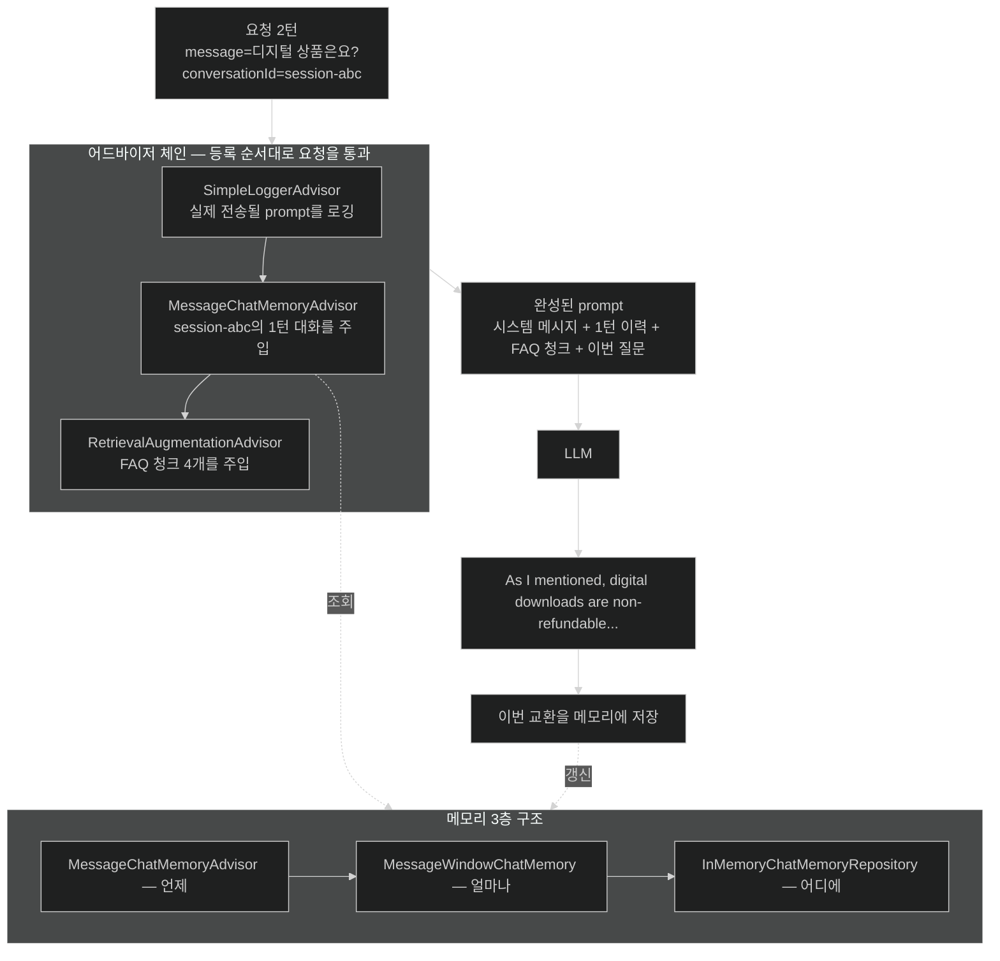

# 대화 메모리 — stateless한 model에 이전 turn을 다시 들려주기

## 한눈에 보기

| 역할 | 담당 | 질문에 답한다 |
|---|---|---|
| `MessageChatMemoryAdvisor` | 요청마다 조율 | **언제** 꺼내고 언제 저장하나 |
| `MessageWindowChatMemory` | 보존 정책 | **얼마나** 남기나 |
| `InMemoryChatMemoryRepository` | 저장소 | **어디에** 두나 |
| `conversationId` | 세션 식별 | **누구의** 이력인가 |

세 층으로 나눈 이유: 저장소만 DB로 바꾸고 나머지는 그대로 두기 위해서다.

## 1. 왜 이게 필요한가

[[05c-building-the-rag-pipeline-with-advisors]]의 RAG endpoint에 두 번 물어보자.

```text
1턴  "환불 정책이 뭔가요?"
     → "30일 이내 원래 포장 상태로 반품 가능합니다..."

2턴  "디지털 상품은요?"
     → "어떤 디지털 상품에 대해 말씀하시는 건가요?"
```

2턴에서 무너진다. model은 1턴에서 환불 얘기를 했다는 사실을 **모른다.** 방금 한 대화인데도.

기본적으로 `ChatClient` 상호작용은 **[[스테이트리스]]**(= 각 요청이 이전 요청을 기억하지 않는 성질)다. model은 이번 요청에 담긴 것만 본다. HTTP가 stateless한 것과 같은 이유이며, 해법도 비슷하다 — **상태를 애플리케이션이 들고 있다가 매번 다시 실어 보낸다.**

그게 **[[대화-메모리]]**(= 이전 turn의 메시지를 보관했다가 다음 요청 prompt에 다시 넣는 장치)다.

## 2. 어떻게 동작하는가

### 2.1 세 층으로 나뉜 이유

**[[MessageChatMemoryAdvisor]]**(= `ChatClient`와 대화 메모리를 잇는 advisor)가 요청마다 세 가지를 한다.

1. 설정된 메모리에서 **이전 메시지를 꺼낸다.**
2. 그것을 **prompt에 주입한다.**
3. 이번 교환으로 **이력을 갱신한다.**

그런데 "얼마나 보관할지"와 "어디에 보관할지"는 다른 결정이다. 그래서 Spring AI는 이걸 갈라 놓았다.

- **[[MessageWindowChatMemory]]**(= 최근 메시지만 남기는 슬라이딩 윈도 방식 구현)가 **보존 정책**을 맡는다. 전체 이력을 무한히 쌓지 않는 이유는 **[[컨텍스트-윈도]]** 때문이다 — 30턴짜리 대화를 통째로 실으면 그것만으로 예산이 다 찬다.
- **[[InMemoryChatMemoryRepository]]**(= 실행 중 프로세스 메모리에 이력을 담는 저장소 구현)가 **저장 위치**를 맡는다. production에서는 이 자리만 DB 기반 구현으로 바꾼다.

한 문장으로: **advisor는 요청마다 조율하고, `MessageWindowChatMemory`는 얼마나 남길지 정하고, repository는 어디에 둘지 정한다.**

### 2.2 설정

```java
@Configuration
public class AiConfig {

    @Bean
    ChatClient chatClient(ChatClient.Builder builder) {
        return builder
                .defaultSystem("""
                        You are a helpful technical assistant for
                        TechStore.
                        Keep answers focused and accurate.
                        """)
                .build();
    }

    @Bean
    MessageWindowChatMemory chatMemory() {
        return MessageWindowChatMemory.builder()
                .chatMemoryRepository(new InMemoryChatMemoryRepository())
                .build();
    }
}
```

`defaultSystem`이 [[02-building-llm-integrations-with-chatclient]]의 "Java 전문가"에서 "TechStore 상담원"으로 바뀐 것에 주목할 만하다 — 이 애플리케이션의 persona가 이 한 곳에서 정해진다.

메모리는 **별도 bean**이다. 그래야 컨트롤러가 주입받아 advisor에 넘길 수 있고, 저장소 구현을 바꿀 때 여기만 고치면 된다.

### 2.3 advisor 체인을 엮은 컨트롤러

```java
@RestController
@RequestMapping("/api/ai")
public class RagChatbotController {

    private final ChatClient chatClient;
    private final VectorStore vectorStore;
    private final MessageWindowChatMemory chatMemory;

    record ChatbotAnswer(String reply, String conversationId) {}

    @GetMapping("/chat")
    public ChatbotAnswer chat(
            @RequestParam String message,
            @RequestParam(defaultValue = "default-session") String conversationId) {

        String reply = chatClient.prompt()
                .user(message)
                .advisors(advisor -> advisor
                        .advisors(new SimpleLoggerAdvisor(),
                                  MessageChatMemoryAdvisor.builder(chatMemory).build(),
                                  RetrievalAugmentationAdvisor.builder()
                                          .documentRetriever(
                                              VectorStoreDocumentRetriever.builder()
                                                  .vectorStore(vectorStore)
                                                  .topK(4)
                                                  .build())
                                          .build())
                        .param(ChatMemory.CONVERSATION_ID, conversationId))
                .call()
                .content();
        return new ChatbotAnswer(reply, conversationId);
    }
}
```

여기서 세 개의 **[[어드바이저]]**(= 요청·응답 주위에 횡단 관심사를 끼워 넣는 구성 요소)가 한 체인에 들어간다.

| advisor | 하는 일 | 없으면 |
|---|---|---|
| **[[SimpleLoggerAdvisor]]**(= prompt와 응답을 로그로 남기는 advisor) | 실제로 나간 prompt를 로그로 본다 | 메모리와 RAG가 무엇을 주입했는지 확인할 방법이 없다 |
| `MessageChatMemoryAdvisor` | 이전 대화를 주입 | 매 turn 처음 만난 사이가 된다 |
| **[[RetrievalAugmentationAdvisor]]**(= RAG 증강 단계 advisor) | FAQ 청크를 주입 | 말투는 맞는데 정책을 지어낸다 |

`.advisors(advisor -> advisor.advisors(...).param(...))` 형태의 람다가 낯설 수 있는데, advisor를 등록하면서 **advisor용 parameter도 함께 넘겨야** 하기 때문이다. 그 parameter가 다음 줄이다.

`.param(ChatMemory.CONVERSATION_ID, conversationId)` — **[[conversationId]]**(= 대화 세션을 식별하는 키)를 지정한다. 이게 없으면 메모리 advisor는 어느 이력을 꺼내야 할지 모른다. 요청 파라미터에서 받고 기본값은 `default-session`이다.

`.call().content()`는 **체인 전체**를 실행한다 — 메모리 조회, 문서 검색, 로깅, model 호출, 그리고 응답 경로의 역순 통과까지.

### 2.4 두 턴으로 확인하기

```bash
curl -s "http://localhost:8080/api/ai/chat?message=What+is+your+return+policy&conversationId=session-abc"
```

```json
{ "reply": "Our return policy allows returns within 30 days of purchase...",
  "conversationId": "session-abc" }
```

같은 `conversationId`로 두 번째 질문을 던진다.

```bash
curl -s "http://localhost:8080/api/ai/chat?message=What+about+digital+products&conversationId=session-abc"
```

```json
{ "reply": "As I mentioned, digital downloads are non-refundable...",
  "conversationId": "session-abc" }
```

**"As I mentioned"** 이 세 단어가 증거다. model은 1턴을 실제로 보고 있다 — `MessageChatMemoryAdvisor`가 이전 교환을 prompt에 다시 실어 보냈기 때문이다.

동시에 "digital downloads are non-refundable"은 FAQ 문서의 문장이다. 즉 이 한 응답 안에서 **대화 메모리와 RAG 검색이 함께** 작동했다. 하나는 "무슨 얘기를 하고 있었나"를, 다른 하나는 "사실이 무엇인가"를 채운다.

### 2.5 세션 격리

각 `conversationId`는 **독립된 이력**을 갖는다. 실제 애플리케이션에서는 사용자 세션이나 채팅 스레드마다 client 쪽에서 UUID를 만들어 쓴다. 그러지 않으면 A 사용자의 대화가 B 사용자의 prompt에 섞여 들어간다 — 기능 결함이 아니라 정보 유출이다.

영속화하려면 `InMemoryChatMemoryRepository`를 DB 기반 구현으로 바꾼다. 그러면 재시작해도 이력이 남고, 여러 인스턴스가 같은 이력을 공유한다.

### 2.6 비유와 그 한계

회의록에 빗댈 수 있다. model은 회의 때마다 **기억을 잃고 들어오는 참석자**다. 그래서 매번 지난 회의록(메모리)과 관련 자료(RAG)를 앞에 놓아 준다. `conversationId`는 어느 프로젝트의 회의록인지 가리키는 이름표고, 슬라이딩 윈도는 "최근 다섯 번 회의록만 가져온다"는 규칙이다.

**깨지는 지점 셋.** 첫째, 사람은 오래된 회의를 **요약해서** 기억한다. 슬라이딩 윈도는 요약하지 않고 **잘라 버린다** — 20턴 전의 중요한 결정이 창 밖으로 밀려나면 그냥 없어진다. 둘째, 회의록은 사람이 "이건 틀렸다"고 정정할 수 있지만, 메모리에 들어간 잘못된 응답은 그대로 다음 turn의 근거가 된다 — **오류가 대화 내내 따라다닌다.** 셋째, 회의록이 길어질수록 참석자가 읽을 시간이 늘듯, 이력이 길수록 매 요청의 token 비용이 늘어난다. [[07c-reducing-api-costs]]가 이 비용을 보는 자리다.

## 3. 그림으로 보기



## 4. 이 노트에 나온 용어

- **[[스테이트리스]]**: 각 요청이 이전 요청을 기억하지 않는 성질. `ChatClient`의 기본값.
- **[[대화-메모리]]**: 이전 turn의 메시지를 보관했다가 다시 주입하는 장치.
- **[[MessageChatMemoryAdvisor]]**: `ChatClient`와 대화 메모리를 잇는 advisor.
- **[[MessageWindowChatMemory]]**: 최근 메시지만 남기는 슬라이딩 윈도 메모리 구현.
- **[[InMemoryChatMemoryRepository]]**: 이력을 프로세스 메모리에 담는 저장소 구현.
- **[[conversationId]]**: 대화 세션을 식별하는 키.
- **[[SimpleLoggerAdvisor]]**: 주고받은 prompt와 응답을 로그로 남기는 advisor.
- **[[어드바이저]]**: 요청·응답 주위에 횡단 관심사를 끼워 넣는 구성 요소.
- **[[RetrievalAugmentationAdvisor]]**: RAG 증강 단계를 담당하는 advisor.
- **[[컨텍스트-윈도]]**: prompt와 응답이 함께 나눠 쓰는 최대 text 예산.

## 5. 자주 헷갈리는 것

**"메모리를 켜면 model이 기억한다"** — model은 여전히 아무것도 기억하지 않는다. 애플리케이션이 이력을 들고 있다가 **매 요청 다시 실어 보내는 것**이다. 그래서 5턴째 요청은 1턴째보다 token을 더 쓴다.

**메모리 advisor를 어디에 등록할까** — 이 예제는 컨트롤러에서 요청마다 붙였다. 그러면 이 endpoint에만 메모리가 붙는다. `ChatClient` 설정에서 `defaultAdvisors(...)`로 한 번 등록하면 그 client의 **모든 호출**에 자동 적용된다. 검색 endpoint처럼 메모리가 없어야 하는 경로가 섞여 있으면 전자, 애플리케이션 전체가 챗봇이면 후자다.

**`conversationId` 기본값의 위험** — `default-session`을 그대로 쓰면 **모든 사용자가 한 대화를 공유한다.** 시연에서는 편하지만 실제 서비스에서는 절대 안 된다.

**메모리 ≠ RAG** — 메모리는 "우리가 방금 나눈 말", RAG는 "회사가 가진 문서"다. 둘 다 prompt에 텍스트를 주입하지만 출처와 수명이 다르다.

## 6. 언제 안 쓰나 / 경계

- **단발 질의에는 붙이지 않는다.** 분류·요약처럼 이전 맥락이 무의미한 endpoint에 메모리를 붙이면 관련 없는 이력이 답을 오염시킨다.
- **`InMemoryChatMemoryRepository`를 production에 두지 않는다.** 재시작하면 대화가 사라지고, 인스턴스가 둘이면 사용자가 어느 인스턴스에 붙느냐에 따라 기억이 달라진다.
- **민감한 대화를 무기한 보관하지 않는다.** 이력은 개인정보가 될 수 있고, [[07d-security-best-practices-for-ai-applications]]의 로그·trace 노출 문제와 곧장 이어진다.
- **창 크기가 비용이다.** 이력이 길수록 매 요청의 token이 늘어난다. 무한 보존이 아니라 슬라이딩 윈도인 이유다.

## 7. 연결

- [[05c-building-the-rag-pipeline-with-advisors]] — 같은 advisor 자리에 먼저 들어간 RAG. 여기서 둘을 한 체인에 엮는다.
- [[02-building-llm-integrations-with-chatclient]] — `defaultSystem`으로 persona를 고정하는 자리.
- [[06-building-chatbots-and-mcp-integration]] — 메모리와 RAG를 갖춘 챗봇을 프로세스 밖으로 열어 주는 다음 단계.
- [[07c-reducing-api-costs]] — 매 요청 이력을 다시 보내는 비용을 prompt caching으로 줄이는 방법.

## 8. 스스로 확인

- model이 "As I mentioned"라고 말할 수 있었던 기술적 이유를 한 문장으로 설명해 보라.
- advisor·`MessageWindowChatMemory`·repository 세 층으로 나눈 설계가 production 전환에서 어떤 이득을 주는가?
- `conversationId`를 기본값 그대로 두고 서비스하면 정확히 무슨 일이 생기는가?
- 대화가 30턴 이어지면 매 요청의 비용은 어떻게 변하고, 그 완화책은?


> 네 문항을 스스로 답한 **뒤에** [[_05d-conversation-memory-with-chat-memory-advisor]]에서 모범답안과 대조한다. 먼저 열면 이 문항들은 다시 인출 문제로 쓸 수 없다.

<!-- ==== 아래는 내 영역 · 스킬 수정 금지 ==== -->

## 내 설명 시도


## 막혔던 지점


## 리뷰 이력
