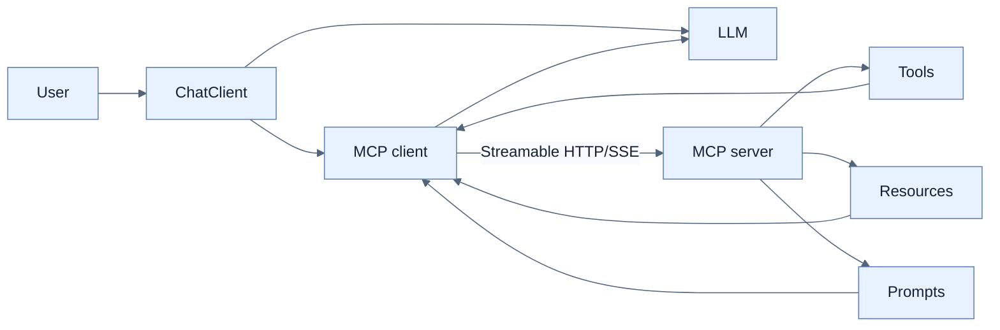

# Chatbot과 MCP 통합

## 한눈에 보기

`@Tool`은 현재 Spring AI process 내부 capability다. Model Context Protocol(MCP)은 tool·resource·prompt의 discovery와 invocation을 vendor-neutral protocol로 표준화해 여러 AI application이 remote capability를 공유하게 한다. Spring AI application은 MCP server와 client 역할을 동시에 할 수 있다.

## 1. 왜 이게 필요한가

각 assistant가 filesystem, product price, policy tool을 provider SDK 방식으로 다시 구현하면 중복과 coupling이 커진다. MCP server가 capability contract를 제공하면 다른 language·framework·model의 client도 내부 REST 구현을 몰라도 발견하고 호출한다.

## 2. 어떻게 동작하는가

MCP의 세 capability는 executable **tools**, URI 기반 read-only **resources**, reusable **prompts**다. `McpSession`은 capability negotiation, message coordination, state, error lifecycle을 관리하며 STDIO, SSE, Streamable HTTP transport를 사용할 수 있다. 책은 호환성을 위해 SSE example을 보이지만 새 remote server에는 specification 방향에 맞춘 Streamable HTTP를 고려하라고 적는다.

Server는 MCP WebMVC starter와 annotation scanner를 켜고 method에 `@McpTool(description=...)`을 붙인다. Client는 connection을 구성하고 `SyncMcpToolCallbackProvider`가 remote tool을 `ToolCallback`으로 바꾼다.

```java
String reply = chatClient.prompt()
    .user(question)
    .toolCallbacks(toolCallbackProvider.getToolCallbacks())
    .call()
    .content();
```

새 remote tool을 protocol로 discover할 수 있어 client code의 direct integration은 줄지만, production에서는 server authentication·authorization, user identity propagation, tool allowlist, argument validation, timeout, audit, network trust를 반드시 설계한다. MCP 자체가 model의 tool 선택을 안전하게 만들지는 않는다.

## 3. 그림으로 보기



## 4. 이 노트에 나온 용어

- **model context protocol**: AI host와 외부 capability 사이 discovery·invocation을 표준화한 protocol.
- **MCP server**: tool·resource·prompt capability를 protocol로 노출하는 process.
- **MCP client**: server와 session을 맺고 capability를 발견·호출하는 component.
- **MCP tool**: remote에서 discover하고 실행할 수 있도록 MCP contract로 공개된 function.
- **streamable HTTP**: MCP request와 streaming response를 HTTP에서 운반하는 remote transport.

## 7. 연결

- [[04-designing-prompts-and-tool-calling]] — process-local tool calling과 비교한다.
- [[05-implementing-rag-with-vector-stores-and-advisors]] — chatbot에 private knowledge context를 공급한다.
- [[07-operating-llm-applications]] — remote tool authorization과 telemetry가 더 중요해진다.

## 8. 스스로 확인

- 전체 1차 정리 후: `@Tool`과 MCP tool의 scope 차이, server/client discovery 흐름, 필요한 security boundary를 설명한다.

<!-- ==== 아래는 내 영역 · 스킬 수정 금지 ==== -->

## 내 설명 시도


## 막혔던 지점


## 리뷰 이력


