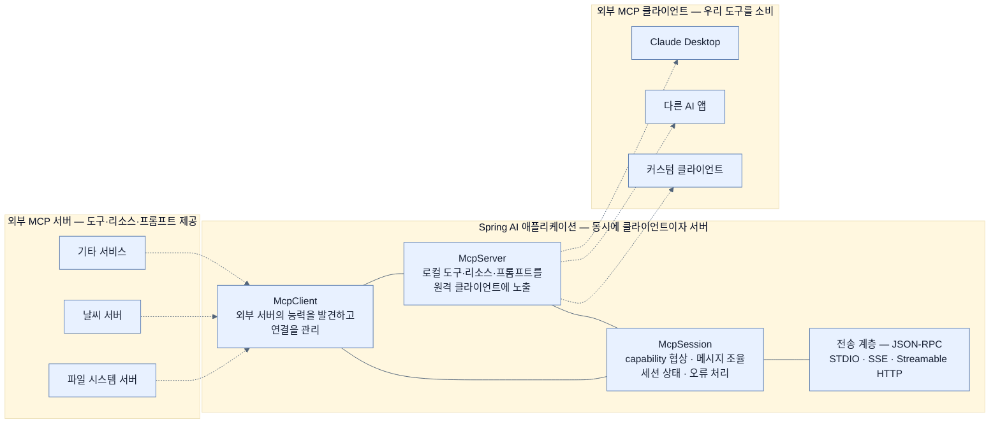

# MCP — 도구를 프로세스 밖으로 꺼내는 표준 프로토콜

## 한눈에 보기

| | `@Tool` | MCP |
|---|---|---|
| 노출 범위 | **현재 Spring AI 프로세스 안** | 네트워크 너머의 아무 MCP client |
| 소비자 | 이 애플리케이션의 `ChatClient` | Claude Desktop, 다른 AI 앱, 커스텀 client |
| 결합도 | 애플리케이션 내부 로직에 밀착 | vendor·언어·프레임워크 중립 |
| 적합한 것 | 내부 업무 로직 | 여러 AI 애플리케이션이 공유할 능력 |

둘은 대체재가 아니라 **범위가 다른 도구**다.

## 1. 왜 이게 필요한가

[[04b-tool-calling]]에서 만든 `ProductTools.getProductPrice(sku)`를 생각해 보자. 잘 동작한다 — **이 애플리케이션 안에서는.**

그런데 회사에 AI 진입점이 여럿 생긴다.

- 고객용 웹 챗봇 (이 Spring Boot 앱)
- 사내 직원이 쓰는 Claude Desktop
- 파트너사가 만든 Python 기반 어시스턴트
- 슬랙 봇

넷 다 "spring-book 가격"을 물어볼 수 있어야 한다. `@Tool`로는 이게 안 된다. `@Tool`은 **현재 Spring AI 프로세스 안에서만** 유효하기 때문이다. 그래서 나머지 셋은 각자 가격 조회를 다시 구현한다 — 같은 로직 네 벌, 정책이 바뀌면 네 곳 수정, 그중 하나는 빠뜨린다.

REST API를 하나 열면 되지 않나? 절반만 맞다. API는 있는데 **AI가 그 API의 존재와 사용법을 어떻게 아느냐**가 남는다. 각 client마다 "이 URL로 이런 파라미터를 보내면 가격이 나온다"를 사람이 설정해 줘야 하고, 도구가 추가될 때마다 그 작업을 반복한다.

**[[MCP]]**(= AI application이 외부 능력을 발견하고 호출하는 방식을 표준화한 vendor 중립 프로토콜)가 그 "발견"까지 규약으로 만든다. client가 server에 붙으면 **어떤 도구가 있는지, 인자가 무엇인지, 무엇에 쓰는지를 프로토콜로 물어본다.**

## 2. 어떻게 동작하는가

### 2.1 MCP가 정의하는 세 가지

| capability | 무엇인가 | Spring AI 대응 |
|---|---|---|
| **Tools** | model이 런타임에 호출할 수 있는 실행 가능한 함수 | `@Tool`과 같은 개념을 프로토콜로 노출 |
| **[[MCP-리소스]]**(= URI로 접근하는 읽기 전용 context) | 파일, DB record, API 응답 — **실행이 아니라 조회** | RAG 문서와 성격이 비슷하다 |
| **[[MCP-프롬프트]]**(= 재사용 가능한 prompt template) | server가 공개하고 client가 목록을 조회해 쓰는 template | [[04a-prompt-engineering-in-spring-ai]]의 `.st` 파일을 공유 가능하게 만든 형태 |

셋을 나눈 이유는 **부수효과의 유무**에 있다. Tools는 실행하면 뭔가 일어난다. Resources는 읽기만 한다. Prompts는 문구일 뿐이다. client가 각각을 다르게 다룰 수 있어야 한다.

### 2.2 한 애플리케이션이 양쪽 다 될 수 있다

Figure 14.4가 보여 주는 구조다. 하나의 Spring AI 애플리케이션이 **동시에** client이자 server가 된다.

- **[[McpClient]]**(= 원격 server의 능력을 발견하고 연결을 관리하는 쪽): 파일 시스템 server, 날씨 server, 다른 AI 시스템의 도구를 **가져다 쓴다**.
- **[[McpServer]]**(= 자기 능력을 원격 client에 노출하는 쪽): 우리 TechStore 도구를 Claude Desktop이나 파트너 앱에 **내준다**.
- **[[McpSession]]**(= MCP 상호작용의 생명주기를 관리하는 층): capability 협상, 메시지 조율, 세션 상태, 오류 처리를 맡는다. client와 server 양쪽이 이 층을 공유한다.

이 대칭이 MCP를 흥미롭게 만든다. 우리 앱이 소비자이면서 공급자이므로, 능력이 조합될 수 있다 — 파일 시스템 server에서 문서를 읽어 우리 지식으로 만들고, 그 지식을 다시 우리 도구로 노출하는 식이다.

### 2.3 전송 계층

MCP 메시지는 JSON-RPC이고, 그것을 **무엇으로 실어 나를지**는 별개다.

| transport | 방식 | 언제 |
|---|---|---|
| **[[STDIO]]**(= 프로세스 표준 입출력을 통신로로 쓰는 transport) | 프로세스 파이프 | CLI로 띄우는 **로컬** server. Claude Desktop이 로컬 도구를 부를 때 |
| **[[SSE]]**(= HTTP 연결 위 단방향 streaming) | HTTP streaming | 웹 server. 이 장의 예제가 쓰는 방식 |
| **[[Streamable-HTTP]]**(= 요청/응답 의미를 유지하며 HTTP streaming을 쓰는 transport) | HTTP | 사양이 원격 server의 **권장 transport**로 옮겨 간 방식 |

전송을 분리해 둔 이유는, 같은 도구를 로컬 프로세스로도 원격 HTTP로도 노출할 수 있어야 하기 때문이다. 도구 코드는 그대로 두고 transport만 바꾼다.

### 2.4 그래서 언제 무엇을 쓰나

책이 Note로 정리한다. 둘은 보완적이다.

- **툴 콜링**: 현재 Spring Boot 애플리케이션에 밀착된 내부 로직. 배포 단위가 같고 노출할 이유가 없는 것.
- **MCP**: 상호운용성이 목적인 것. 같은 도구를 여러 AI 애플리케이션·프레임워크·생태계가 나눠 쓸 때.

판단 기준을 한 문장으로 줄이면 — **"이 도구를 우리 앱 말고 누가 쓸 것인가?"** 아무도 없으면 `@Tool`, 있으면 MCP다.

### 2.5 비유와 그 한계

USB에 빗대는 설명이 흔하다. 예전엔 기기마다 전용 케이블이 필요했지만, 표준 포트가 생기자 아무 기기나 아무 컴퓨터에 꽂히게 됐다. MCP는 AI 애플리케이션과 능력 사이의 그 포트다.

**깨지는 지점 둘.** 첫째, USB는 **꽂으면 동작한다.** MCP는 client에게 도구 목록과 설명을 넘겨줄 뿐, 그 도구를 부를지는 여전히 model의 판단이다 — 설명이 나쁘면 꽂혀 있어도 안 쓴다. 둘째, USB 기기는 대체로 안전하지만 MCP 도구는 **실행 권한**이다. 신뢰하지 않는 MCP server에 붙는 것은 신뢰하지 않는 코드를 실행 경로에 넣는 것과 같고, 그 server가 돌려주는 내용은 [[07d-security-best-practices-for-ai-applications]]의 간접 프롬프트 인젝션 통로가 될 수 있다.

## 3. 그림으로 보기

Figure 14.4(책 p.450)의 재현이다.

## 4. 이 노트에 나온 용어

- **[[MCP]]**: AI application이 외부 능력을 발견·호출하는 방식을 표준화한 프로토콜.
- **[[McpClient]]**: 원격 server의 능력을 발견하고 연결을 관리하는 쪽.
- **[[McpServer]]**: 자기 능력을 원격 client에 노출하는 쪽.
- **[[McpSession]]**: MCP 상호작용의 생명주기를 관리하는 층.
- **[[MCP-리소스]]**: URI로 접근하는 읽기 전용 context.
- **[[MCP-프롬프트]]**: server가 공개하는 재사용 가능한 prompt template.
- **[[STDIO]]**: 프로세스 표준 입출력을 통신로로 쓰는 transport.
- **[[SSE]]**: 하나의 HTTP 연결로 서버가 client에 데이터를 밀어 주는 단방향 streaming.
- **[[Streamable-HTTP]]**: 요청/응답 의미를 유지하며 HTTP streaming을 쓰는 transport.
- **[[@Tool]]**: Java method를 model이 호출 가능한 도구로 노출하는 annotation.

## 5. 자주 헷갈리는 것

**"MCP가 툴 콜링을 대체한다"** — 아니다. MCP client가 발견한 원격 도구도 결국 `ToolCallback`으로 변환되어 **툴 콜링 메커니즘을 타고** 실행된다. MCP는 도구를 **어디서 가져올지**를 바꿀 뿐, model이 도구를 고르고 인자를 만들어 부르는 8단계 흐름은 [[04b-tool-calling]]과 똑같다.

**"MCP server를 만들면 REST API가 필요 없다"** — 다른 소비자를 위한 것이다. MCP는 AI client가 능력을 **발견**하기 위한 규약이고, 사람이 쓰는 프런트엔드나 배치 작업은 여전히 평범한 API가 낫다.

**SSE와 Streamable HTTP** — 둘 다 HTTP 기반이지만 사양의 권장이 후자로 옮겨 갔다. 기존 client 호환이 필요하면 SSE, 새로 만들면 Streamable HTTP다 — [[06a-exposing-application-tools-as-an-mcp-server]]에서 설정으로 고른다.

## 6. 언제 안 쓰나 / 경계

- **소비자가 우리 앱 하나뿐이면** MCP는 배관만 늘린다. `@Tool`로 충분하다.
- **신뢰하지 않는 server에 붙지 않는다.** 원격 도구는 실행 경로이고, 원격 응답은 prompt에 들어간다.
- **부수효과가 큰 도구를 함부로 노출하지 않는다.** MCP server에 올린 도구는 우리가 모르는 client가 부를 수 있다. `@Tool`보다 더 좁게 설계해야 한다.
- **네트워크 실패를 계산에 넣는다.** 프로세스 안 메서드 호출과 달리 원격 도구는 지연되고 끊긴다.

## 7. 연결

- [[04b-tool-calling]] — MCP가 표준화하는 그 "도구 호출"의 원형.
- [[06a-exposing-application-tools-as-an-mcp-server]] — 우리 도구를 server로 노출하는 구현.
- [[06b-consuming-mcp-tools-as-a-client]] — 원격 도구를 client로 가져다 쓰는 구현.
- [[07d-security-best-practices-for-ai-applications]] — 원격 도구와 원격 응답이 만드는 새로운 공격면.

## 8. 스스로 확인

- `@Tool`과 `@McpTool` 중 무엇을 쓸지 정하는 한 문장짜리 기준을 말해 보라.
- MCP가 정의하는 Tools·Resources·Prompts를 나눈 기준은 무엇인가?
- 한 애플리케이션이 client이자 server가 될 수 있다는 사실이 실제로 무엇을 가능하게 하는가?
- 전송 계층을 프로토콜에서 분리한 이득은?

<!-- ==== 아래는 내 영역 · 스킬 수정 금지 ==== -->

## 내 설명 시도

## 막혔던 지점

## 리뷰 이력
