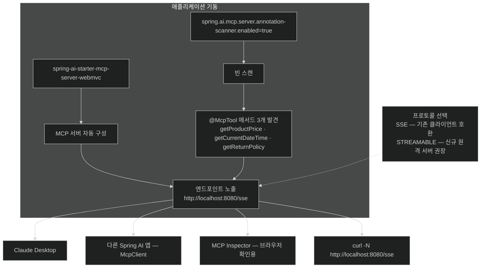

# MCP 서버 만들기 — `@McpTool`로 도구를 밖에 내주기

## 한눈에 보기

의존성 하나 + property 세 줄 + `@McpTool` 세 개.

```properties
spring.ai.mcp.server.type=SYNC
spring.ai.mcp.server.protocol=SSE
spring.ai.mcp.server.annotation-scanner.enabled=true
```

애플리케이션을 띄우면 `http://localhost:8080/sse`에서 MCP 서버가 응답한다. 별도 컨트롤러도, 엔드포인트 매핑도 쓰지 않는다.

## 1. 왜 이게 필요한가

[[06-building-chatbots-and-mcp-integration]]에서 본 문제를 코드로 옮긴다. TechStore의 가격 조회·시각 조회·환불 정책 조회 세 가지를 **Claude Desktop, 파트너사 어시스턴트, 우리 웹 챗봇이 모두** 쓸 수 있게 하려고 한다.

`@Tool`로는 안 된다. 프로세스 밖에서 보이지 않기 때문이다. 그래서 같은 메서드를 **[[MCP]]**(= 외부 능력 발견·호출을 표준화한 프로토콜)로 내보내야 하는데, 여기서 Spring Boot의 익숙한 패턴이 다시 나온다 — **starter를 넣고, property를 적고, annotation을 붙인다.**

## 2. 어떻게 동작하는가

### 2.1 의존성

집필 시점 기준으로 Initializr 목록에 아직 없어 손으로 넣는다.

```xml
<dependency>
    <groupId>org.springframework.ai</groupId>
    <artifactId>spring-ai-starter-mcp-server-webmvc</artifactId>
</dependency>
```

이 starter가 하는 일은 **Spring MVC와 통합된 MCP 서버 지원**이다. HTTP 기반 transport(SSE·Streamable HTTP)로 도구·리소스·prompt를 웹 endpoint로 노출해, 원격 MCP client와 AI 시스템이 소비할 수 있게 한다.

이름의 `-webmvc`가 중요하다. Servlet 스택 위에 얹힌다는 뜻이고, 그래서 `type=SYNC`와 짝이 된다.

### 2.2 설정 세 줄

```properties
spring.ai.mcp.server.type=SYNC
spring.ai.mcp.server.protocol=SSE
spring.ai.mcp.server.annotation-scanner.enabled=true
```

| property | 하는 일 | 왜 |
|---|---|---|
| `type=SYNC` | 동기 실행. Servlet 스택 사용 | 도구 메서드가 블로킹이어도 된다 |
| `protocol=SSE` | **[[SSE]]**(= HTTP 연결 위 단방향 streaming)로 MCP endpoint 노출 | 기존 MCP client와의 호환 |
| `annotation-scanner.enabled=true` | Spring bean에서 MCP annotation을 자동 스캔 | 도구를 수동 등록하지 않아도 된다 |

`protocol`에 대해 책이 붙이는 단서가 실무에서 중요하다. **SSE는 여전히 지원되지만, MCP 사양은 원격 서버의 권장 transport를 [[Streamable-HTTP]]**(= 요청/응답 의미를 유지하며 HTTP streaming을 쓰는 transport)로 옮겼다. 새로 만드는 원격 MCP 서버라면 `spring.ai.mcp.server.protocol=STREAMABLE`을 고려한다. 이 예제가 SSE를 쓰는 것은 **기존 client 호환** 때문이다.

`annotation-scanner`를 켜야 하는 이유는 세 번째 줄이 없으면 `@McpTool`이 붙은 메서드를 찾아 노출하는 단계 자체가 돌지 않기 때문이다.

### 2.3 도구 컴포넌트

```java
@Component
public class TechStoreMcpServer {

    private static final Map<String, Double> PRICES = Map.of(
            "spring-book",   49.99,
            "java-guide",    39.99,
            "docker-manual", 29.99
    );

    @McpTool(description = "Returns the current price of a TechStore product by SKU.")
    public String getProductPrice(String sku) {
        Double price = PRICES.get(sku.toLowerCase());
        return price == null ? "Product not found" : "Price: $" + price;
    }

    @McpTool(description = "Returns the current date and time in ISO-8601 format.")
    public String getCurrentDateTime() {
        return LocalDateTime.now().toString();
    }

    @McpTool(description = "Returns the TechStore return policy.")
    public String getReturnPolicy() {
        return "Items may be returned within 30 days in original condition. "
             + "Digital downloads are non-refundable.";
    }
}
```

[[04b-tool-calling]]의 `ProductTools`와 나란히 놓으면 **문법이 거의 같다.** 평범한 `@Component`, 평범한 메서드, 그리고 annotation 하나.

- **[[@McpTool]]**(= Java method를 MCP 프로토콜로 노출되는 도구로 만드는 annotation): `@Tool`이 프로세스 안에서 하던 일을 **프로토콜 너머**로 확장한다.
- `description`: 도구의 목적을 알려 주는 의미 정보. AI model이 언제 어떻게 쓸지 판단하는 근거다. [[04b-tool-calling]]에서 본 원칙이 그대로 적용된다 — **모호한 설명은 안 불리거나 잘못 불린다.** `name`을 생략하면 메서드 이름이 도구 이름이 되는 것도 같다.

`@Tool`과 `@McpTool`의 차이는 문법이 아니라 **누가 볼 수 있는가**다. 앞의 것은 이 `ChatClient`만, 뒤의 것은 프로토콜에 연결한 아무 client나.

### 2.4 확인

애플리케이션을 띄우면 MCP 서버가 여기에 뜬다.

```text
http://localhost:8080/sse
```

```bash
curl -N http://localhost:8080/sse
```

`-N`(= `--no-buffer`)이 필요한 이유는 [[03-reactive-streaming-with-chatclient]]와 같다 — SSE는 연결을 열어 둔 채 이벤트를 흘리므로, curl이 버퍼링하면 아무것도 안 보인다.

> 더 편한 확인 방법은 **MCP Inspector**다. 브라우저 UI로 서버에 붙어 도구 목록을 발견하고, 인자를 넣어 직접 호출해 볼 수 있다. `@modelcontextprotocol/inspector` npm 패키지로 제공된다.

### 2.5 비유와 그 한계

사내 시스템에 **외부 파트너용 창구**를 여는 일에 빗댈 수 있다. 원래 직원(우리 `ChatClient`)만 쓰던 조회 기능을, 창구를 통해 파트너사도 쓸 수 있게 만든 것이다. 창구에는 "여기서 무엇을 할 수 있는지" 안내판(`description`)이 붙어 있어 처음 온 사람도 물어보고 쓸 수 있다.

**깨지는 지점 둘.** 첫째, 실제 창구에는 **신분 확인이 있다.** 이 예제의 MCP 서버에는 인증이 없다 — `curl -N`으로 아무나 붙는다. 학습용 구성이고, 실제로는 인증·인가·rate limit을 앞에 세워야 한다. 둘째, 창구 직원은 "그건 곤란합니다"라고 거절하지만, 노출된 도구는 **호출되면 그냥 실행된다.** 그래서 MCP로 내보내는 도구는 `@Tool`보다 더 좁게 설계해야 한다 — 이 예제의 셋이 전부 **읽기 전용**인 것은 우연이 아니다.

## 3. 그림으로 보기



## 4. 이 노트에 나온 용어

- **[[@McpTool]]**: Java method를 MCP 프로토콜로 노출되는 도구로 만드는 annotation.
- **[[McpServer]]**: 자기 도구·리소스·prompt를 원격 client에 노출하는 쪽.
- **[[SSE]]**: 하나의 HTTP 연결로 서버가 client에 데이터를 밀어 주는 단방향 streaming.
- **[[Streamable-HTTP]]**: 요청/응답 의미를 유지하며 HTTP streaming을 쓰는 transport.
- **[[MCP]]**: 외부 능력 발견·호출을 표준화한 vendor 중립 프로토콜.
- **[[@Tool]]**: Java method를 model이 호출 가능한 도구로 노출하는 annotation. 프로세스 안에서만 유효하다.

## 5. 자주 헷갈리는 것

**`@Tool`과 `@McpTool`을 둘 다 붙일 수 있나** — 개념상 가능하다. 같은 메서드를 내부 `ChatClient`에도 노출하고 원격 client에도 열어 주는 셈이다. 다만 그 순간 **노출 범위가 넓어진다**는 사실을 의식해야 한다. 이 장의 예제는 도구 클래스를 따로 두어 범위를 명시적으로 갈랐다.

**`/sse`가 도구 목록 endpoint가 아니다** — MCP는 JSON-RPC 프로토콜이고 `/sse`는 그 메시지가 흐르는 통로다. `curl -N`으로 보이는 것은 연결이 살아 있다는 신호이지 사람이 읽으라고 만든 목록이 아니다. 그래서 MCP Inspector가 유용하다.

**`type=SYNC`와 `protocol=SSE`는 다른 축이다** — 전자는 서버 내부 실행 모델(동기/비동기), 후자는 네트워크 전송 방식이다. 헷갈리기 쉬운데 둘 다 `spring.ai.mcp.server.*` 아래 있어서 더 그렇다.

## 6. 언제 안 쓰나 / 경계

- **인증 없이 공개망에 열지 않는다.** 이 구성에는 접근 제어가 없다.
- **부수효과가 있는 도구를 신중히 고른다.** 조회는 노출하되 `deleteOrder`·`refundPayment` 같은 것은 다시 생각한다. 노출된 도구는 우리가 모르는 client가 부른다.
- **도구 이름·설명을 계약처럼 다룬다.** 외부 client의 model이 그 설명을 근거로 도구를 고르므로, 설명을 바꾸면 **호출 패턴이 바뀐다.** API 시그니처를 바꾸는 것과 같은 무게로 다뤄야 한다.
- **신규 원격 서버라면 SSE 대신 STREAMABLE을 검토한다.** 사양의 방향이 그쪽이다.

## 7. 연결

- [[06-building-chatbots-and-mcp-integration]] — 왜 도구를 프로세스 밖으로 꺼내는가.
- [[06b-consuming-mcp-tools-as-a-client]] — 여기 만든 서버에 실제로 붙어 도구를 쓰는 반대편.
- [[04b-tool-calling]] — `@Tool`과 `@McpTool`이 공유하는 설계 원칙, 특히 `description`의 무게.
- [[07d-security-best-practices-for-ai-applications]] — 노출된 도구가 만드는 공격면.

## 8. 스스로 확인

- `@Tool`이 붙은 메서드와 `@McpTool`이 붙은 메서드의 차이를 "누가 볼 수 있는가"로 설명해 보라.
- `annotation-scanner.enabled=false`로 두면 무슨 일이 생기는가?
- 이 예제의 도구 셋이 전부 읽기 전용인 것이 왜 의도적인 설계인가?
- 도구의 `description` 문구를 바꾸는 것이 왜 API 변경에 준하는 일인가?


> 네 문항을 스스로 답한 **뒤에** [[_06a-exposing-application-tools-as-an-mcp-server]]에서 모범답안과 대조한다. 먼저 열면 이 문항들은 다시 인출 문제로 쓸 수 없다.

<!-- ==== 아래는 내 영역 · 스킬 수정 금지 ==== -->

## 내 설명 시도


## 막혔던 지점


## 리뷰 이력
