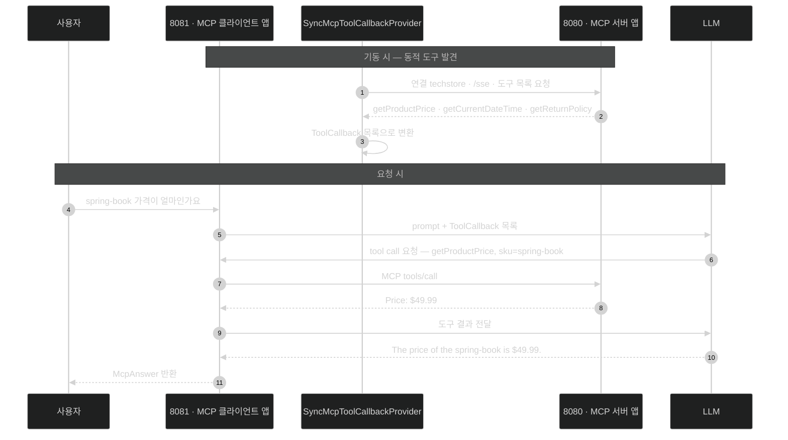

# MCP 클라이언트 — 원격 도구를 로컬 도구처럼 쓰기

## 한눈에 보기

```java
.toolCallbacks(toolCallbackProvider.getToolCallbacks())
```

[[04b-tool-calling]]의 `.tools(productTools)`가 **로컬 bean**을 넘겼다면, 이 한 줄은 **원격 서버에서 발견한 도구 목록**을 넘긴다. 그 뒤의 8단계 왕복은 완전히 같다.

## 1. 왜 이게 필요한가

[[06a-exposing-application-tools-as-an-mcp-server]]에서 TechStore 도구 세 개를 `http://localhost:8080/sse`에 노출했다. 이제 다른 애플리케이션이 그걸 써야 한다.

직접 짜면 이런 일을 해야 한다.

1. `/sse`에 붙어 세션을 연다.
2. JSON-RPC로 `tools/list`를 보내 도구 목록을 받는다.
3. 각 도구의 이름·설명·파라미터 스키마를 파싱한다.
4. 그걸 Spring AI가 이해하는 도구 표현으로 변환한다.
5. model이 도구를 부르겠다고 하면 다시 JSON-RPC `tools/call`을 보낸다.
6. 결과를 받아 model에 되돌려 준다.

여섯 단계 전부 프로토콜 배관이다. 업무 로직은 하나도 없다.

Spring AI의 MCP client starter가 이 여섯을 다 맡고, 우리에게는 **[[ToolCallback]]**(= 도구 하나를 프로그래밍 방식으로 표현하는 타입) 목록만 넘긴다. 그 목록은 로컬 `@Tool`에서 만든 것과 **구분되지 않는다** — model 입장에서는 그냥 도구다.

## 2. 어떻게 동작하는가

### 2.1 의존성

start.spring.io에서 **Model Context Protocol Client**를 고른다.

```xml
<dependency>
    <groupId>org.springframework.ai</groupId>
    <artifactId>spring-ai-starter-mcp-client</artifactId>
</dependency>
<dependency>
    <groupId>org.springframework.boot</groupId>
    <artifactId>spring-boot-starter-test</artifactId>
    <scope>test</scope>
</dependency>
```

- `spring-ai-starter-mcp-client`: **[[McpClient]]**(= 원격 server의 능력을 발견하고 연결을 관리하는 쪽) 역할에 필요한 인프라. MCP 서버에 연결하고, 도구·리소스·prompt를 발견하고, 표준 프로토콜로 호출한다.
- `spring-boot-starter-test`: JUnit·Mockito·assertion·test auto-configuration. MCP client 상호작용과 AI 컴포넌트의 단위·통합 테스트에 쓴다.

### 2.2 프로파일 설정

`application-mcp-client.properties`를 따로 만든다. 파일 이름이 프로파일과 묶인다는 점이 뒤에서 실행 방식과 연결된다.

```properties
spring.ai.mcp.client.enabled=true
spring.ai.mcp.client.type=SYNC
spring.ai.mcp.client.toolcallback.enabled=true
spring.ai.mcp.client.sse.connections.techstore.url=http://localhost:8080
spring.ai.mcp.client.sse.connections.techstore.sse-endpoint=/sse
```

| property | 하는 일 |
|---|---|
| `enabled=true` | MCP client auto-configuration을 켠다 |
| `type=SYNC` | 동기 통신. 응답이 올 때까지 블로킹 |
| `toolcallback.enabled=true` | **발견한 MCP 도구를 자동으로 `ToolCallback`으로 노출**한다. 이 줄이 있어야 model이 원격 도구를 투명하게 부를 수 있다 |
| `sse.connections.techstore.url` | `techstore`라는 이름의 연결이 가리키는 base URL |
| `sse.connections.techstore.sse-endpoint` | 그 서버의 **[[SSE]]** endpoint 경로 |

`techstore`가 **우리가 지은 연결 이름**이라는 점이 중요하다. `connections.` 뒤의 이름을 바꿔 가며 서버를 여럿 등록할 수 있다 — `connections.weather.url`, `connections.filesystem.url` 식이다.

`toolcallback.enabled=true`가 이 절의 핵심 스위치다. 이게 없으면 MCP 연결은 맺어지지만 도구가 model의 선택지로 올라가지 않는다.

### 2.3 컨트롤러

```java
@RestController
@RequestMapping("/api/ai")
public class McpClientController {

    private final ChatClient chatClient;
    private final SyncMcpToolCallbackProvider toolCallbackProvider;

    public McpClientController(ChatClient chatClient,
                               SyncMcpToolCallbackProvider toolCallbackProvider) {
        this.chatClient = chatClient;
        this.toolCallbackProvider = toolCallbackProvider;
    }

    record McpAnswer(String reply) {}

    @GetMapping("/mcp-agent")
    public McpAnswer mcpAgent(@RequestParam String question) {
        String reply = chatClient.prompt()
                .user(question)
                .toolCallbacks(toolCallbackProvider.getToolCallbacks())
                .call()
                .content();
        return new McpAnswer(reply);
    }
}
```

두 요소만 새롭다.

- **[[SyncMcpToolCallbackProvider]]**(= 설정된 MCP server의 도구를 발견해 `ToolCallback` 목록으로 바꿔 주는 bean): 설정에 적힌 모든 연결에 붙어 도구를 모아 온다. 우리가 주입만 받으면 된다.
- `.toolCallbacks(provider.getToolCallbacks())`: 그 목록을 **이번 요청에** 등록한다. 로컬 도구를 넘기는 `.tools(bean)`과 자리가 같다.

그다음은 [[04b-tool-calling]]과 완전히 같다. model이 질문을 읽고, 도구가 필요하면 이름과 인자를 담아 요청하고, Spring AI가 — 이번에는 로컬 메서드가 아니라 **원격 MCP 호출로** — 실행하고, 결과를 model에 되돌린다. **[[툴-콜링]]** 메커니즘은 그대로고 실행 경로만 네트워크를 탄다.

### 2.4 두 번 띄워서 확인하기

같은 애플리케이션을 서버 역할과 client 역할로 각각 띄운다.

```bash
# 터미널 1 — 기본 포트 8080, MCP 서버 역할
./mvnw spring-boot:run

# 터미널 2 — 포트 8081, mcp-client 프로파일로 client 역할
./mvnw spring-boot:run -Dspring-boot.run.profiles=mcp-client \
                       -Dspring-boot.run.arguments="--server.port=8081"
```

`-Dspring-boot.run.profiles=mcp-client`가 앞에서 만든 `application-mcp-client.properties`를 활성화한다. 그래서 이 인스턴스만 MCP client 설정을 갖는다.

```bash
curl "http://localhost:8081/api/ai/mcp-agent?question=What%20is%20the%20price%20of%20spring-book%3F"
```

```json
{"reply":"The price of the spring-book is $49.99."}
```

8081의 model이 8080의 `getProductPrice` 도구를 **프로토콜을 통해** 불렀다. 8081 쪽 코드에는 가격표가 없다.

### 2.5 동적 도구 발견

이 구조의 가장 큰 이득은 실행 결과가 아니라 **운영 성질**에 있다.

**[[동적-도구-발견]]**(= server에 도구가 추가되면 client 재배포 없이 곧바로 쓸 수 있게 되는 성질) — 8080 서버에 `@McpTool` 메서드를 하나 더 추가하고 서버만 재시작하면, 8081 client는 **코드 변경도 재배포도 없이** 그 도구를 쓴다. 목록을 프로토콜로 물어보기 때문이다.

REST API로 같은 걸 하려면 client에 새 호출 코드를 넣고 배포해야 한다. 그 차이가 MCP를 도입할 이유다.

### 2.6 비유와 그 한계

프린터 드라이버에 빗댈 수 있다. 예전에는 프린터마다 드라이버를 설치해야 했지만, 네트워크 프린터 검색을 켜면 **어떤 프린터가 있고 무엇을 지원하는지** 컴퓨터가 물어봐서 알아낸다. 새 프린터가 생겨도 설정을 다시 하지 않는다.

**깨지는 지점 셋.** 첫째, 프린터는 **없으면 목록에서 사라질 뿐**이다. MCP 서버가 죽으면 도구 호출이 실패하고, model은 그 실패를 답에 반영해야 한다 — 원격 도구는 네트워크 실패를 계산에 넣어야 한다. 둘째, 프린터 목록은 **사람이 확인하고 고른다.** MCP 도구 목록은 model이 보고 고르므로, 신뢰하지 않는 서버가 목록에 끼면 model이 그 도구를 부를 수 있다. 셋째, 프린터는 출력만 하지만 MCP 도구가 돌려주는 **문자열은 prompt에 들어간다** — 그 안에 지시가 섞여 있으면 [[07d-security-best-practices-for-ai-applications]]의 간접 프롬프트 인젝션이 된다.

## 3. 그림으로 보기



## 4. 이 노트에 나온 용어

- **[[McpClient]]**: 원격 server의 능력을 발견하고 연결을 관리하는 쪽.
- **[[SyncMcpToolCallbackProvider]]**: MCP server의 도구를 발견해 `ToolCallback` 목록으로 바꿔 주는 bean.
- **[[ToolCallback]]**: 도구 하나를 프로그래밍 방식으로 표현하는 타입.
- **[[동적-도구-발견]]**: server에 도구가 추가되면 client 재배포 없이 쓸 수 있게 되는 성질.
- **[[MCP]]**: 외부 능력 발견·호출을 표준화한 프로토콜.
- **[[SSE]]**: 하나의 HTTP 연결로 서버가 client에 데이터를 밀어 주는 단방향 streaming.
- **[[툴-콜링]]**: model이 application method 실행을 요청하고 결과를 답에 반영하는 방식.

## 5. 자주 헷갈리는 것

**원문 코드 오류** — 책 p.455의 `McpClientController` 코드 블록에는 **클래스를 닫는 `}`가 없다.** 그대로 복사하면 컴파일되지 않는다.

**`.tools(...)` vs `.toolCallbacks(...)`** — 전자는 `@Tool`이 붙은 **bean**을 넘기고 Spring AI가 그 안에서 메서드를 찾는다. 후자는 **이미 만들어진 `ToolCallback` 목록**을 넘긴다. MCP로 발견한 도구는 bean이 아니라 원격 정의라서 후자를 쓴다.

**`toolcallback.enabled`를 빠뜨리는 실수** — 연결은 되고 오류도 없는데 model이 원격 도구를 절대 안 부르는 증상이 나온다. 도구가 `ToolCallback`으로 노출되지 않아 model의 선택지에 없기 때문이다.

**로컬 도구와 원격 도구를 섞으려면** 두 등록을 함께 쓴다. model은 출처를 구분하지 않고 설명만 보고 고른다.

## 6. 언제 안 쓰나 / 경계

- **서버가 하나뿐이고 우리가 만든 것이면** MCP를 거칠 이유가 약하다. 같은 프로세스라면 `@Tool`이 더 빠르고 단순하다.
- **신뢰하지 않는 MCP 서버를 연결 목록에 넣지 않는다.** 도구 호출은 실행이고, 도구 응답은 prompt다.
- **네트워크 실패를 설계에 넣는다.** 원격 도구는 타임아웃·재시도·부분 실패를 만든다. 프로세스 안 메서드 호출과 같은 신뢰도를 가정하면 안 된다.
- **도구 목록이 커지면 선택 정확도가 떨어진다.** 여러 서버를 연결할수록 model이 고를 후보가 늘어난다. 필요한 연결만 켠다.

## 7. 연결

- [[06a-exposing-application-tools-as-an-mcp-server]] — 이 client가 붙는 반대편 서버.
- [[06-building-chatbots-and-mcp-integration]] — client와 server가 한 애플리케이션 안에 공존하는 그림.
- [[04b-tool-calling]] — 원격이든 로컬이든 동일하게 도는 8단계 도구 호출 흐름.
- [[07b-ai-and-observability]] — 원격 도구 호출도 `spring.ai.tool_call` metric에 잡힌다.

## 8. 스스로 확인

- `.tools(bean)`과 `.toolCallbacks(list)`를 나눠 쓰는 이유는 무엇인가?
- `toolcallback.enabled=false`일 때 나타나는 증상과, 그 증상을 오진하기 쉬운 이유는?
- 서버에 도구를 하나 추가했을 때 REST API 방식과 MCP 방식에서 각각 무엇을 배포해야 하는가?
- 원격 도구가 돌려준 문자열이 왜 신뢰 경계 밖의 데이터인가?


> 네 문항을 스스로 답한 **뒤에** [[_06b-consuming-mcp-tools-as-a-client]]에서 모범답안과 대조한다. 먼저 열면 이 문항들은 다시 인출 문제로 쓸 수 없다.

<!-- ==== 아래는 내 영역 · 스킬 수정 금지 ==== -->

## 내 설명 시도


## 막혔던 지점


## 리뷰 이력
