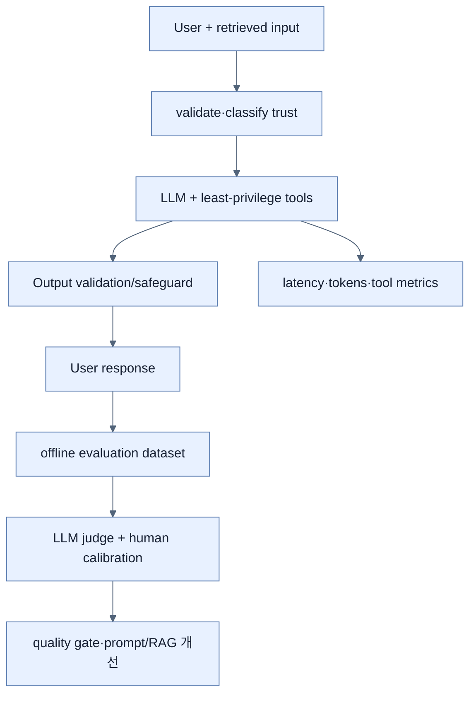

# LLM 애플리케이션 운영: 평가·관측·비용·보안

## 한눈에 보기

Production LLM system은 exact string test 대신 semantic evaluation, token·latency·tool·vector-store telemetry, prompt cache·local model routing, direct/indirect prompt injection 방어와 secret·content privacy가 필요하다. Model output을 신뢰 경계 밖의 untrusted data로 취급한다.

## 1. 왜 이게 필요한가

문법적으로 좋은 답도 질문과 무관하거나 retrieved context에 없는 내용을 만들 수 있다. 호출마다 output이 달라 traditional assertion만으로 품질 regression을 잡기 어렵고, 긴 prompt와 반복 tool loop는 비용을 급증시킨다. Prompt·response를 무심코 trace에 넣으면 PII와 business secret이 observability backend로 복제된다.

## 2. 어떻게 동작하는가

**평가:** RAG가 사용한 original question, retrieved documents, generated answer를 `EvaluationRequest`로 만들고 `RelevancyEvaluator`나 `FactCheckingEvaluator`가 다른 model로 relevance·grounding을 판정한다. Judge도 오류·편향이 있으므로 고정 dataset, human review, threshold calibration과 함께 쓴다.

**관측:** Actuator가 있으면 `ChatClient`, `ChatModel`, `EmbeddingModel`, `VectorStore`, tool call에 Micrometer Observation이 적용된다. 책은 LLM latency, input/output token usage, vector operation, tool invocation signal을 비용·성능 분석에 사용한다.

**비용:** `ChatResponse` usage에서 input/output과 cache read/create token을 보고, 반복되는 stable prompt prefix는 provider prompt cache를 활용한다. Classification 같은 단순 작업은 Ollama·Docker Model Runner의 local model로 routing할 수 있지만 hardware·quality·운영 비용까지 비교한다.

**보안:** System prompt만으로 injection을 막을 수 없다. Input·retrieved document를 untrusted로 표시·filter하고 tool permission을 최소화하며 output policy를 적용한다. Compromised RAG document가 instruction을 주입하는 indirect injection도 ingestion 단계에서 검사한다. API key는 source에 넣지 않고 environment별 secret manager·rotation·spend limit을 사용한다. Prompt/completion/query/tool content logging은 production에서 꺼 두고 count metric만 노출한다.

## 3. 그림으로 보기

## 4. 이 노트에 나온 용어

- **LLM-as-a-Judge**: 별도 model이 generated answer의 relevance·factual grounding 등 semantic quality를 평가하는 방식.
- **RelevancyEvaluator**: question·context·answer의 relevance를 판정하는 Spring AI evaluator.
- **prompt caching**: 반복되는 prompt prefix의 provider-side 계산 결과를 재사용해 latency·비용을 줄이는 기능.
- **prompt injection**: attacker input이 상위 instruction을 무시시키거나 model behavior·tool action을 탈취하려는 공격.
- **sensitive-content logging**: prompt, completion, retrieved document, tool argument처럼 민감할 수 있는 원문을 telemetry에 기록하는 행위.

## 7. 연결

- [[05-implementing-rag-with-vector-stores-and-advisors]] — judge가 평가할 retrieved context와 RAG answer를 만든다.
- [[06-building-chatbots-and-mcp-integration]] — remote tool의 권한·audit 범위를 운영한다.
- [[chapter-13-observing-spring-boot-4-applications/06-correlating-logs-metrics-and-traces|관측성 correlation]] — AI operation도 기존 telemetry workflow에 포함한다.

## 8. 스스로 확인

- 전체 1차 정리 후: 품질·관측·비용·보안 각각의 production control을 하나 이상 설계하고 상호 영향을 설명한다.

<!-- ==== 아래는 내 영역 · 스킬 수정 금지 ==== -->

## 내 설명 시도

## 막혔던 지점

## 리뷰 이력

