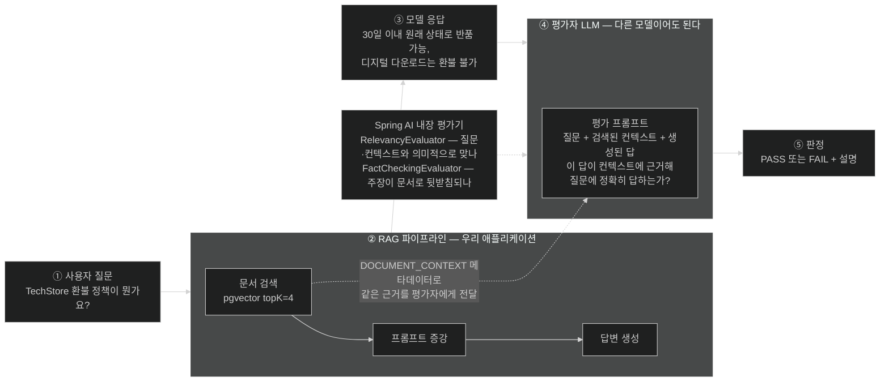

# LLM-as-a-Judge — 문자열 비교가 무력한 곳에서 품질을 재기

## 한눈에 보기

| 평가기 | 무엇을 보나 | 잡아내는 실패 |
|---|---|---|
| `RelevancyEvaluator` | 답이 질문·context와 **의미적으로 정렬**됐나 | 동문서답, 엉뚱한 청크 검색 |
| `FactCheckingEvaluator` | 답의 주장이 문서로 **뒷받침**되나 | 환각, 근거 없는 진술 |

둘 다 `EvaluationResponse.isPass()`로 통과 여부를 낸다. 즉 **테스트로 만들 수 있다.**

## 1. 왜 이게 필요한가

RAG 챗봇에 회귀 테스트를 붙이려고 이렇게 썼다고 하자.

```java
assertThat(answer).isEqualTo("Customers may return any item within 30 days of purchase for a full refund.");
```

이 테스트는 **거의 항상 실패한다.** model이 이렇게 답할 수 있기 때문이다.

- "You can return items within 30 days for a full refund."
- "환불은 구매 후 30일 이내에 가능합니다."
- "Our return window is 30 days from purchase, provided the item is unused."

셋 다 **맞는 답**이다. 문자열은 전부 다르다.

`contains("30 days")`로 완화하면? 이번엔 반대 문제가 생긴다.

- "Unlike our competitors who offer 30 days, we do not accept returns." — `contains`는 통과, 내용은 정반대.

전통적 software에서는 정확성이 대체로 **이진적**이다. `add(2, 3)`은 5거나 5가 아니다. LLM 응답은 **스펙트럼** 위에 있다 — 문법은 완벽한데 사실이 틀렸을 수도, 사실은 맞는데 질문과 무관할 수도, 아예 **[[환각]]**(= 근거 없이 사실처럼 제시되는 잘못된 응답)일 수도 있다.

그래서 필요한 것은 **의미적 품질**을 재는 방법이고, 가장 실효적인 방법이 **다른 model에게 채점을 맡기는 것**이다. 이것이 **[[LLM-as-a-Judge]]**(= 한 model의 응답을 다른 model이 평가하게 하는 방식)다.

## 2. 어떻게 동작하는가

### 2.1 평가 흐름 5단계

Figure 14.5가 그리는 순서다.

1. 사용자가 애플리케이션에 질문을 제출한다.
2. 질문이 RAG pipeline을 통과한다 — 벡터 스토어에서 문서를 검색해 prompt에 주입한다.
3. model이 그 근거에 기반한 응답을 만든다.
4. **원래 질문 + 검색된 context + 생성된 답** 세 가지를 두 번째 model(평가자)에게 보낸다.
5. 평가자가 답이 관련성 있고 정확하며 근거에 기반했는지 판정을 돌려준다.

4번이 핵심이다. 평가자는 답만 보고 판단하지 않는다. **model이 실제로 본 근거를 함께** 받는다. 그래야 "이 답이 그 근거로부터 나올 수 있는가"를 물을 수 있다. 근거 없이 답만 보면 평가자도 자기 학습 지식으로 판단하게 되어, 우리 회사 정책 같은 private 지식은 평가할 수 없다.

### 2.2 두 개의 내장 평가기

- **[[RelevancyEvaluator]]**(= 응답이 질문·검색 context와 의미적으로 맞는지 판정하는 평가기): "이 답이 그 질문에 대한 답인가"를 본다. 검색이 엉뚱한 청크를 집어 model이 배송 정책으로 환불 질문에 답한 경우를 잡는다.
- **[[FactCheckingEvaluator]]**(= 응답의 주장이 제공된 문서로 뒷받침되는지 확인하는 평가기): "이 문장들이 근거 문서에 실제로 있는가"를 본다. **[[그라운딩]]**(= 응답이 근거 문서에 실제로 기반하게 만드는 것)이 무너진 지점, 즉 환각을 잡는다.

둘을 나눈 이유는 실패 유형이 다르기 때문이다. 관련은 있는데 지어낸 답, 사실인데 동문서답 — 한 지표로는 구분되지 않는다.

### 2.3 테스트로 만들기

```java
@SpringBootTest
@TestPropertySource(properties = "spring.ai.openai.api-key=${OPENAI_API_KEY}")
class RagEvaluationTest {

    @Autowired
    ChatModel chatModel;

    @Autowired
    VectorStore vectorStore;

    @Test
    void ragAnswerShouldBeRelevantToQuestion() {

        String question = "What is the TechStore return policy?";

        ChatResponse ragResponse = ChatClient.builder(chatModel).build()
                .prompt(question)
                .advisors(RetrievalAugmentationAdvisor.builder()
                        .documentRetriever(
                            VectorStoreDocumentRetriever.builder()
                                .vectorStore(vectorStore)
                                .topK(4)
                                .build())
                        .build())
                .call()
                .chatResponse();

        String answer = ragResponse.getResult().getOutput().getText();

        List<Document> context = (List<Document>)
                ragResponse.getMetadata()
                        .get(RetrievalAugmentationAdvisor.DOCUMENT_CONTEXT);

        EvaluationRequest evalRequest = new EvaluationRequest(question, context, answer);

        EvaluationResponse verdict = new RelevancyEvaluator(
                ChatClient.builder(chatModel))
                .evaluate(evalRequest);

        assertThat(verdict.isPass())
                .as("RAG answer should be relevant to the question and grounded in the context")
                .isTrue();
    }
}
```

단계별로 읽는다.

| 요소 | 하는 일 | 왜 |
|---|---|---|
| `@SpringBootTest` | 전체 컨텍스트를 띄운다 | 실제 벡터 스토어와 model이 필요하다. 이건 통합 테스트다 |
| `@Autowired ChatModel` | **[[ChatModel]]**(= provider 중립 저수준 chat abstraction)을 직접 주입 | `ChatClient`를 테스트 안에서 새로 조립하기 위해 |
| `.call().chatResponse()` | text가 아니라 **전체 응답**을 받는다 | metadata가 필요하기 때문이다 |
| `getResult().getOutput().getText()` | 생성된 답 추출 | 평가 대상 |
| **[[DOCUMENT_CONTEXT]]**(= advisor가 응답 metadata에 채워 두는 검색 문서 key) | 이번 요청에서 **실제로 검색된 청크**를 꺼낸다 | 평가자가 같은 근거로 판정하게 하려고. 이 값 없이는 "근거에 기반했는가"를 물을 수 없다 |
| **[[EvaluationRequest]]**(= 질문·context·답을 묶어 평가기에 넘기는 요청 객체) | 세 가지를 하나로 | 평가 입력의 표준 형태 |
| `new RelevancyEvaluator(ChatClient.builder(chatModel))` | 평가자 model을 감싼 평가기 생성 | 평가에도 model 호출이 필요하다 |
| **[[EvaluationResponse]]**(= 평가기의 판정 결과) `.isPass()` | 통과 여부 | JUnit assertion으로 이어진다 |

`assertThat(verdict.isPass()).isTrue()`가 실패하면 두 가지 중 하나다 — **RAG pipeline이 잘못된 청크를 가져왔거나, 지식 베이스에 답이 없거나.** 즉 이 테스트는 model 품질만이 아니라 **색인·검색 설정의 회귀**를 잡는다. [[05b-ingesting-documents-with-the-etl-pipeline]]의 청크 크기를 바꿨을 때 좋아졌는지 나빠졌는지를 이걸로 판단한다.

### 2.4 평가자는 싸게 만들 수 있다

평가 model이 애플리케이션 model과 **같을 필요가 없다.** 특히 `FactCheckingEvaluator`는 경량 model과 잘 맞는다.

**[[Bespoke-Minicheck]]**(= 사실 확인에 특화된 경량 model)를 **[[Ollama]]**(= 로컬 model을 실행하고 API로 노출하는 런타임)로 돌리면, 사실 확인에 특화된 model이 `YES`/`NO` 수준의 짧은 출력만 내므로 **최소 token으로, 외부 API 비용 0으로** 평가한다.

이 조합이 실용적인 이유는 평가가 **호출 수를 두 배로 늘리기** 때문이다. 응답 한 번마다 평가 한 번이면 비용이 두 배다. 평가 쪽을 로컬 경량 model로 돌리면 그 증가분이 사라진다 — [[07c-reducing-api-costs]]가 같은 아이디어를 비용 관점에서 다룬다.

### 2.5 비유와 그 한계

논문 심사에 빗댈 수 있다. 저자(생성 model)가 원고를 내면, 심사위원(평가 model)이 **원고와 참고문헌을 함께** 받아 "이 주장이 저 문헌으로 뒷받침되는가"를 본다. 심사위원은 저자와 다른 사람이어야 하고, 문헌을 안 주면 자기 지식으로만 판단해 엉뚱한 심사가 된다.

**깨지는 지점 셋.** 첫째, 심사위원은 **책임을 진다.** 평가 model은 틀려도 아무 대가가 없고, 실제로 틀린다 — 평가기 자체가 확률적이라 같은 답을 두 번 채점하면 다르게 나올 수 있다. 둘째, 심사위원은 "이 분야는 제 전문이 아닙니다"라고 사퇴할 수 있지만 model은 모르는 분야도 판정을 낸다. 셋째, 저자와 심사위원이 **같은 편향을 공유**할 수 있다 — 같은 계열 model을 쓰면 같은 종류의 실수를 서로 못 알아본다. 그래서 평가자를 다른 model로 두는 편이 낫다.

## 3. 그림으로 보기

Figure 14.5(책 p.457)의 재현이다. 참고로 이 그림의 캡션만 "Illustrates the…"처럼 동사로 시작해, 명사구인 다른 캡션들과 형태가 다르다.



## 4. 이 노트에 나온 용어

- **[[LLM-as-a-Judge]]**: 한 model의 응답을 다른 model이 평가하게 하는 방식.
- **[[RelevancyEvaluator]]**: 응답이 질문·context와 의미적으로 맞는지 판정하는 평가기.
- **[[FactCheckingEvaluator]]**: 응답의 주장이 문서로 뒷받침되는지 확인하는 평가기.
- **[[EvaluationRequest]]**: 질문·context·답을 묶어 평가기에 넘기는 요청 객체.
- **[[EvaluationResponse]]**: 평가기의 판정 결과. `isPass()`로 읽는다.
- **[[DOCUMENT_CONTEXT]]**: advisor가 응답 metadata에 채워 두는 검색 문서 key.
- **[[Bespoke-Minicheck]]**: 사실 확인에 특화된 경량 model.
- **[[Ollama]]**: 로컬 model을 실행하고 API로 노출하는 런타임.
- **[[환각]]**: 근거 없이 사실처럼 제시되는 잘못된 응답.
- **[[그라운딩]]**: 응답이 주어진 근거 문서에 실제로 기반하게 만드는 것.
- **[[ChatModel]]**: provider 중립 저수준 chat abstraction.

## 5. 자주 헷갈리는 것

**"평가 테스트는 단위 테스트다"** — 아니다. `@SpringBootTest`로 컨텍스트를 띄우고, 실제 벡터 스토어를 읽고, model API를 **두 번** 호출한다(생성 1 + 평가 1). 느리고 돈이 들고 네트워크에 의존한다. CI에서 매 커밋 돌릴 성질의 것이 아니라, 릴리스 전이나 nightly에 도는 통합 테스트다.

**"PASS가 나오면 답이 맞다"** — 평가자도 model이다. 위양성·위음성이 있다. 이 테스트의 가치는 개별 판정의 정확성이 아니라 **회귀 감지**에 있다 — 어제 통과하던 질문 세트가 오늘 절반 실패하면 뭔가 바뀐 것이다.

**`DOCUMENT_CONTEXT`를 빼먹으면** — `EvaluationRequest`에 빈 context가 들어가고, 평가자는 자기 학습 지식으로 판단한다. TechStore 같은 가상 회사의 정책은 평가할 방법이 없으므로 판정이 무의미해진다.

**평가와 생성에 같은 model을 쓰는 것** — 편하지만 편향을 공유한다. 가능하면 다른 계열 model을 평가자로 둔다.

## 6. 언제 안 쓰나 / 경계

- **결정적 출력에는 필요 없다.** 구조화 응답의 필드 존재 여부, 숫자 범위 같은 것은 평범한 assertion으로 검사한다. LLM 평가는 **자연어 품질**에만 쓴다.
- **모든 요청을 실시간 평가하지 않는다.** 응답 지연이 두 배가 되고 비용도 두 배다. 표본 추출이나 오프라인 배치가 현실적이다.
- **평가 결과를 그대로 사용자에게 보여 주지 않는다.** 평가자의 판정도 틀릴 수 있다.
- **평가 데이터에 민감 정보가 담긴다.** 질문·검색 문서·답이 모두 평가 model로 전송된다. 외부 API를 평가자로 쓰면 그 데이터가 나간다는 뜻이다 — 로컬 model을 쓰는 또 하나의 이유이며 [[07d-security-best-practices-for-ai-applications]]와 이어진다.

## 7. 연결

- [[07-operating-llm-applications]] — 이 노트가 답하는 "질문 ①"의 자리.
- [[05c-building-the-rag-pipeline-with-advisors]] — 평가 대상이 되는 RAG pipeline과 `DOCUMENT_CONTEXT`의 출처.
- [[05b-ingesting-documents-with-the-etl-pipeline]] — 청크 크기 같은 색인 설정을 바꿨을 때 이 테스트로 채점한다.
- [[07c-reducing-api-costs]] — 평가가 호출을 두 배로 늘리는 문제를 로컬 model로 푸는 방법.

## 8. 스스로 확인

- `assertEquals`와 `contains` 둘 다 LLM 응답 테스트에 부적합한 이유를 각각 예시로 들어 보라.
- 평가자에게 `DOCUMENT_CONTEXT`를 넘기지 않으면 판정이 왜 무의미해지는가?
- `RelevancyEvaluator`와 `FactCheckingEvaluator`가 각각 잡는 실패를 하나씩 만들어 보라.
- 이 테스트를 CI의 매 커밋마다 돌리면 안 되는 이유를 세 가지 들어 보라.


> 네 문항을 스스로 답한 **뒤에** [[_07a-evaluating-llm-response-quality]]에서 모범답안과 대조한다. 먼저 열면 이 문항들은 다시 인출 문제로 쓸 수 없다.

<!-- ==== 아래는 내 영역 · 스킬 수정 금지 ==== -->

## 내 설명 시도


## 막혔던 지점


## 리뷰 이력
