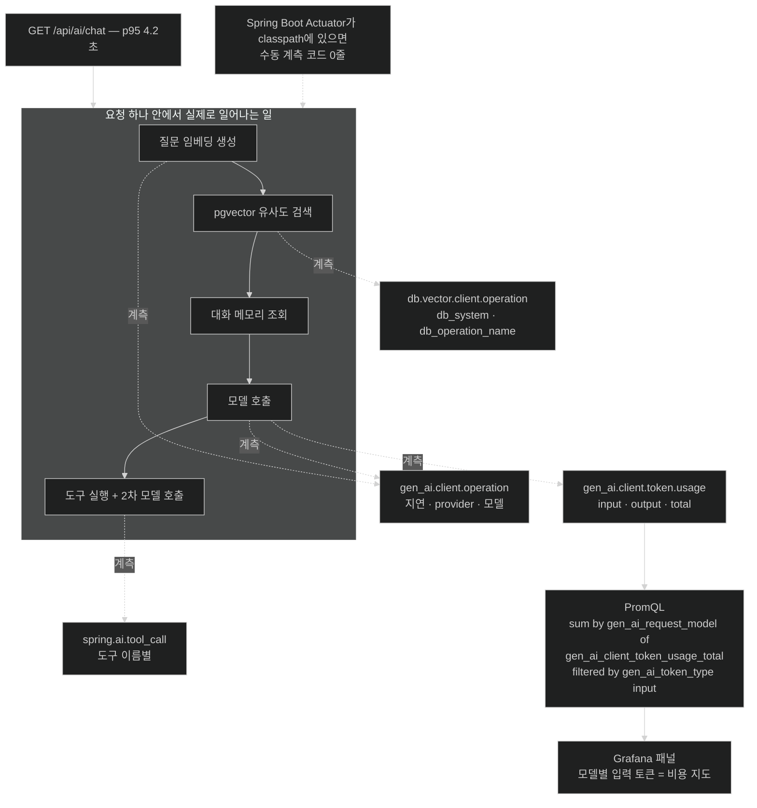

# AI 관측 — 계측 코드 없이 얻는 네 개의 metric

## 한눈에 보기

| metric | 재는 것 | 주요 label |
|---|---|---|
| `gen_ai.client.operation` | 모든 model 호출의 지연 | `gen_ai.system`, `gen_ai.request.model`, `gen_ai.response.model` |
| `gen_ai.client.token.usage` | token 소비량 | `gen_ai_token_type` = `input` / `output` / `total` |
| `db.vector.client.operation` | 벡터 스토어 add·delete·query | `db_system`, `db_operation_name` |
| `spring.ai.tool_call` | 도구 호출 하나하나 | 도구 이름 |

Actuator를 classpath에 올리는 것 말고 우리가 쓰는 코드는 **없다.**

## 1. 왜 이게 필요한가

[[05d-conversation-memory-with-chat-memory-advisor]]의 챗봇이 느려졌다는 제보가 온다. APM 대시보드에는 이렇게 찍힌다.

```text
GET /api/ai/chat    p95: 4.2s
```

4.2초 안에서 무슨 일이 있었는지는 아무것도 모른다. 이 한 요청에는 최소 다섯 가지가 들어 있는데 말이다.

1. 질문을 임베딩으로 변환 (임베딩 API 호출)
2. pgvector 유사도 검색
3. 대화 메모리 조회
4. model 호출
5. 도구가 있었다면 도구 실행 + 두 번째 model 호출

어디가 느린지에 따라 대응이 완전히 다르다 — 벡터 검색이면 인덱스, model 호출이면 모델 교체나 prompt 축소, 도구면 그 외부 API 문제다. **한 덩어리 4.2초로는 아무 결정도 못 한다.**

비용 쪽은 더 심하다. 요청 수는 어제와 같은데 청구서가 늘었다면, 원인은 요청당 **[[토큰-사용량]]**(= 요청이 소비한 입력·출력 token 수)의 증가다. 이력이 쌓이고 RAG 청크가 붙기 때문인데, HTTP metric에는 그런 축이 없다.

## 2. 어떻게 동작하는가

### 2.1 자동 계측

Spring AI는 AI 연산을 **[[Micrometer-Observation]]**(= 한 번의 계측 선언으로 metric과 trace를 함께 만드는 Spring의 관측 추상)으로 계측한다. Chapter 13에서 본 그 추상이다 — AI 전용 관측 스택을 새로 배우지 않아도 된다는 뜻이다.

Spring Boot Actuator가 classpath에 있으면 다음이 **자동으로** metric과 분산 trace로 잡힌다.

- `ChatClient` 호출
- `ChatModel` 호출
- `EmbeddingModel` 호출
- `VectorStore` 연산
- 도구 실행

수동 계측 코드가 필요 없다. 이게 가능한 이유는 [[05c-building-the-rag-pipeline-with-advisors]]에서 본 **[[어드바이저]]**(= 요청·응답 주위를 감싸는 구성 요소) 구조와 같다 — 호출 경로에 이미 가로챌 자리가 있으므로 그 자리에서 관측을 시작하고 끝낸다.

### 2.2 네 개의 metric

**`gen_ai.client.operation`** — 모든 `ChatClient`·`ChatModel` 호출의 **지연**을 기록한다. label로 `gen_ai.system`(어느 provider인지), `gen_ai.request.model`(요청한 model), `gen_ai.response.model`(실제 응답한 model)이 붙는다. 요청 model과 응답 model이 갈라지는 것이 유용하다 — `gpt-4o-mini`를 요청했는데 provider가 `gpt-4o-mini-2024-07-18`로 응답하면 그 버전 차이가 보인다.

**`gen_ai.client.token.usage`** — token 소비량을 기록한다. `gen_ai_token_type` label이 `input`·`output`·`total`을 나눈다. **이 metric이 API 사용량과 운영 비용 추적의 토대**다. input과 output을 나눈 이유는 단가가 다르기 때문이다.

**`db.vector.client.operation`** — 벡터 스토어의 add·delete·query 연산을 기록한다. `db_system`(pgvector인지 다른 것인지), `db_operation_name`(어떤 연산인지) label이 붙는다. [[05b-ingesting-documents-with-the-etl-pipeline]]의 색인과 [[05c-building-the-rag-pipeline-with-advisors]]의 검색이 여기서 갈린다.

**`spring.ai.tool_call`** — `@Tool` 호출 하나하나를 도구 이름 label과 함께 기록한다. 어떤 도구가 실제로 얼마나 불리는지 보인다. [[04b-tool-calling]]에서 "model이 도구를 고른다"고 했는데, **정말로 고르고 있는지**를 확인할 유일한 방법이다. 만들어 놓고 한 번도 안 불린 도구가 여기서 드러난다.

### 2.3 비용 대시보드 한 줄

Grafana 패널에 이 **[[PromQL]]**(= Prometheus의 질의 언어) 쿼리를 넣으면 model별 입력 token 누적이 보인다.

```text
sum by (gen_ai_request_model) (gen_ai_client_token_usage_total{gen_ai_token_type='input'})
```

읽는 법은 안쪽부터다.

1. `gen_ai_client_token_usage_total` — token 사용량 카운터.
2. `{gen_ai_token_type='input'}` — 입력 token만 남긴다.
3. `sum by (gen_ai_request_model)` — model별로 합친다.

결과는 **어느 model과 어느 endpoint가 비용을 만들고 있는지**의 실시간 그림이다. 여기서 비싼 경로가 드러나면 [[07c-reducing-api-costs]]의 수단으로 넘어간다.

metric 이름의 점(`gen_ai.client.token.usage`)이 Prometheus에서는 밑줄(`gen_ai_client_token_usage_total`)이 되고 `_total` 접미가 붙는 것에 주의한다. Micrometer가 Prometheus 명명 규칙으로 변환하기 때문이다.

### 2.4 비유와 그 한계

자동차 계기판에 빗댈 수 있다. Actuator를 올리는 것은 계기판을 켜는 일이고, 네 metric은 속도계·연료계·엔진 회전수·주행 거리에 해당한다. 특히 token metric은 **연료계**다 — 요청 수(주행 횟수)가 아니라 실제 소모량을 보여 준다.

**깨지는 지점 둘.** 첫째, 계기판은 **연료가 왜 빨리 주는지**를 말해 주지 않는다. token이 늘었다는 사실은 보이지만, 그게 대화 이력 때문인지 RAG 청크 때문인지는 trace를 봐야 안다 — 그래서 metric만이 아니라 분산 trace가 함께 필요하다. 둘째, 계기판을 본다고 **연비가 좋아지지는 않는다.** 관측은 문제를 드러낼 뿐이고, 줄이는 것은 다음 노트의 일이다.

## 3. 그림으로 보기



## 4. 이 노트에 나온 용어

- **[[Micrometer-Observation]]**: 한 번의 계측 선언으로 metric과 trace를 함께 만드는 관측 추상.
- **[[gen_ai.client.operation]]**: 모든 model 호출의 지연을 기록하는 metric.
- **[[gen_ai.client.token.usage]]**: token 소비량을 기록하는 metric. 비용 추적의 토대.
- **[[db.vector.client.operation]]**: 벡터 스토어 연산을 기록하는 metric.
- **[[spring.ai.tool_call]]**: 도구 호출을 도구 이름별로 기록하는 metric.
- **[[PromQL]]**: Prometheus의 질의 언어.
- **[[토큰-사용량]]**: 요청이 소비한 입력·출력 token 수.
- **[[어드바이저]]**: 요청·응답 주위에 횡단 관심사를 끼워 넣는 구성 요소.

## 5. 자주 헷갈리는 것

**원문의 metric 이름 불일치** — 책 p.460은 token metric을 `gen_ai.client.token.usage`(label `gen_ai_token_type`)로 소개하는데, p.465 마지막 문장은 같은 대상을 `gen_ai.usage.input_tokens`·`gen_ai.usage.output_tokens`로 부른다. 같은 것을 두 이름으로 가리키는 셈이다. 앞의 것이 Spring AI가 실제로 방출하는 이름이고, 뒤의 것은 OpenTelemetry GenAI 규약의 속성 이름 쪽에 가깝다. **쓰는 버전에서 실제로 나오는 이름을 `/actuator/metrics`로 확인**하는 편이 안전하다.

**metric 이름이 Prometheus에서 바뀐다** — 점이 밑줄이 되고 카운터에는 `_total`이 붙는다. 대시보드를 짤 때 Spring 쪽 이름을 그대로 쓰면 결과가 비어 나온다.

**"자동 계측이니 설정이 필요 없다"** — 계측은 자동이지만 **내보내기**는 아니다. Prometheus로 노출하려면 Actuator endpoint를 열고 registry 의존성을 넣어야 한다. Chapter 13이 다룬 그 설정이다.

**metric과 trace는 다른 질문에 답한다** — metric은 "얼마나·몇 번", trace는 "이 한 요청에서 무슨 순서로". 4.2초의 내역을 보려면 trace가 필요하다.

## 6. 언제 안 쓰나 / 경계

- **prompt·응답 본문을 로그와 trace에 담지 않는다.** 기본적으로 꺼져 있고, 켜면 사용자 질문과 생성 응답이 관측 백엔드에 남는다 — [[07d-security-best-practices-for-ai-applications]]가 그 property를 다룬다. **count만 담는 token metric은 안전하다.**
- **카디널리티를 주의한다.** `conversationId`나 사용자 ID를 label로 붙이면 시계열이 폭발한다.
- **평가 결과는 metric이 아니다.** "답이 맞았는가"는 관측 스택이 아니라 [[07a-evaluating-llm-response-quality]]의 평가로 얻는다.

## 7. 연결

- [[07-operating-llm-applications]] — 이 노트가 답하는 "질문 ②"의 자리.
- [[07c-reducing-api-costs]] — 여기서 측정한 token을 근거로 비용을 줄인다.
- [[04b-tool-calling]] — `spring.ai.tool_call` metric이 확인해 주는 도구 선택 동작.
- [[05c-building-the-rag-pipeline-with-advisors]] — `db.vector.client.operation`이 잡는 검색 경로.
- [[../../part-5-observing-spring-boot-4-applications/chapter-13-observing-spring-boot-4-applications/04-metrics-with-micrometer-prometheus-and-grafana]] — Micrometer·Prometheus·Grafana 스택 자체.

## 8. 스스로 확인

- p95 4.2초를 네 metric으로 분해하면 각각 어느 구간을 설명하는가?
- `gen_ai.request.model`과 `gen_ai.response.model`을 따로 두는 이득은?
- Grafana에서 PromQL 쿼리가 빈 결과를 낼 때 가장 먼저 의심할 것은?
- 요청 수는 그대로인데 token이 늘었다면, 어느 metric의 어느 label을 먼저 보겠는가?


> 네 문항을 스스로 답한 **뒤에** [[_07b-ai-and-observability]]에서 모범답안과 대조한다. 먼저 열면 이 문항들은 다시 인출 문제로 쓸 수 없다.

<!-- ==== 아래는 내 영역 · 스킬 수정 금지 ==== -->

## 내 설명 시도


## 막혔던 지점


## 리뷰 이력
