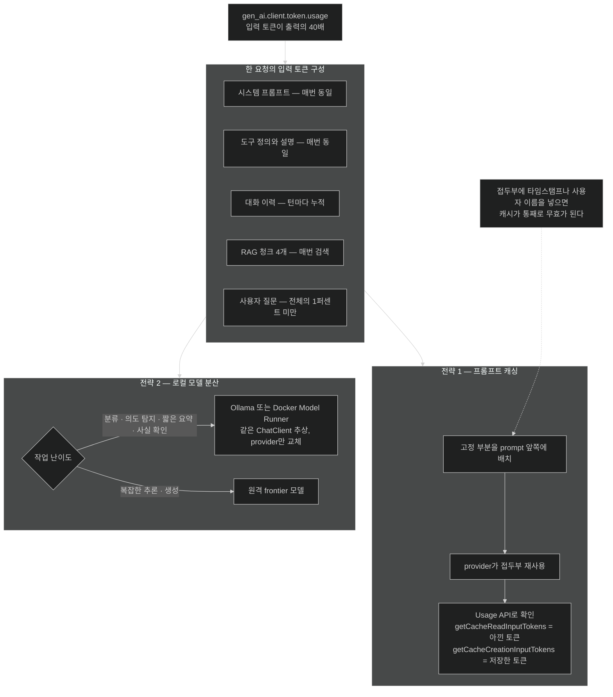

# 비용 줄이기 — prompt 접두부 재사용과 로컬 모델 분산

## 한눈에 보기

| 전략 | 무엇을 줄이나 | 어떻게 |
|---|---|---|
| 프롬프트 캐싱 | **입력** token 비용과 지연 | 여러 요청이 공유하는 prompt 접두부를 provider가 재사용 |
| 로컬 모델 | 외부 API 호출 자체 | 분류·의도 탐지·짧은 요약을 자기 장비로 돌린다 |

둘 다 **같은 `ChatClient` 코드**를 그대로 쓴다. 바뀌는 것은 설정과 라우팅 결정이다.

## 1. 왜 이게 필요한가

[[07b-ai-and-observability]]의 대시보드를 켜니 이런 그림이 나왔다고 하자.

```text
gpt-4o-mini  input tokens/일:  8,400,000
gpt-4o-mini  output tokens/일:   210,000
```

입력이 출력의 40배다. 처음 보면 이상하지만 이유는 분명하다. 우리가 만든 챗봇의 **한 요청**에 이런 것들이 실려 있기 때문이다.

- 시스템 프롬프트 (매번 동일, 200 token)
- 대화 이력 (턴마다 누적)
- RAG 청크 4개 (매번 검색, 수백~수천 token)
- 도구 정의와 설명 (매번 동일)
- 실제 사용자 질문 (수십 token)

**사용자가 쓴 문장은 전체의 1%도 안 된다.** 나머지 99%는 우리가 붙인 것이고, 그중 상당 부분은 **요청마다 똑같다.**

여기에 두 가지 낭비가 보인다. 첫째, 매번 똑같은 접두부를 다시 보내고 다시 계산시킨다. 둘째, "이 질문이 환불 문의인가 배송 문의인가"를 판정하는 것 같은 사소한 작업까지 frontier model에 보낸다.

**[[토큰-사용량]]**(= 요청이 소비한 입력·출력 token 수)이 곧 비용이므로, 관측은 비용 운영의 일부다. 이제 줄이는 쪽으로 넘어간다.

## 2. 어떻게 동작하는가

### 2.1 프롬프트 캐싱

많은 LLM 플랫폼이 서버 쪽 **[[프롬프트-캐싱]]**(= 여러 요청이 같은 prompt 접두부를 공유할 때 이미 처리한 token을 재사용하는 provider 기능)을 지원한다. 여러 요청이 **같은 접두부**로 시작하면, 이전에 처리한 token을 재사용해 지연과 비용을 함께 줄인다.

핵심 단어는 **접두부(prefix)**다. prompt의 앞부분이 글자 단위로 같아야 한다. 그래서 prompt를 조립하는 순서가 비용에 영향을 준다 — 고정된 것(시스템 프롬프트, 도구 정의)을 앞에, 변하는 것(검색 청크, 사용자 질문)을 뒤에 두면 캐시가 걸릴 여지가 커진다.

Spring AI는 캐시 통계를 **[[Usage-API]]**(= `ChatResponse` metadata에서 token 수와 캐시 통계를 읽는 API)로 노출한다.

```java
ChatResponse response = chatClient.prompt()
        .user(question)
        .call()
        .chatResponse();

Usage usage = response.getMetadata().getUsage();
long inputTokens     = usage.getPromptTokens();
long outputTokens    = usage.getGenerationTokens();
long cacheHitTokens  = usage.getCacheReadInputTokens();      // 아낀 토큰
long cacheMissTokens = usage.getCacheCreationInputTokens();  // 앞으로 쓰려고 저장한 토큰

System.out.printf("Cache hit: %d tokens saved, miss: %d tokens stored%n",
        cacheHitTokens, cacheMissTokens);
```

네 값을 함께 읽어야 그림이 나온다.

| 값 | 의미 |
|---|---|
| `getPromptTokens()` | 이번 요청의 입력 token |
| `getGenerationTokens()` | 생성된 출력 token |
| `getCacheReadInputTokens()` | **캐시에서 재사용된** 입력 token = 실제로 아낀 양 |
| `getCacheCreationInputTokens()` | 나중에 재사용하려고 **저장한** token |

[[02-building-llm-integrations-with-chatclient]]에서 본 `ChatResponse` JSON의 `cacheReadInputTokens: 0`이 바로 이 값이다. 첫 요청이라 아직 캐시가 없어 0이었다.

OpenAI의 prompt caching은 **자동으로** 동작한다 — 같은 접두부를 여러 요청이 재사용하면 별도 API 호출 없이 걸린다. 우리가 할 일은 prompt 구조를 캐시 친화적으로 짜고, 이 수치로 효과를 확인하는 것이다.

### 2.2 로컬 모델로 분산

두 번째 전략은 **작업의 난이도에 model을 맞추는 것**이다.

분류, 의도 탐지, 가벼운 요약 같은 작업은 **비싼 원격 추론이 필요 없다.** "이 문의는 환불/배송/기술지원 중 무엇인가"를 판정하는 데 frontier model을 쓰는 것은 계산기로 될 일에 슈퍼컴퓨터를 쓰는 격이다.

**[[로컬-모델]]**(= 원격 API 대신 자기 장비에서 돌리는 model)이 그 자리를 맡는다. Spring AI는 두 로컬 추론 엔진과 통합된다.

- **[[Ollama]]**(= 로컬 model을 내려받아 실행하고 API로 노출하는 런타임)
- **[[Docker-Model-Runner]]**(= Docker Desktop에 통합된 GPU 가속 로컬 추론): Ollama 기반 Spring AI 설정과 호환되면서 GPU 가속을 더한다.

여기서 [[01-introducing-llms-and-spring-ai]]의 추상화가 값을 한다. **같은 `ChatClient` abstraction**을 쓰므로 구현 방식이 사실상 동일하다 — 달라지는 것은 설정된 provider뿐이다. 그래서 애플리케이션이 여러 model을 조합하고, 작업 복잡도·지연 요구·운영 비용에 따라 적절한 것을 고를 수 있다.

[[07a-evaluating-llm-response-quality]]의 `FactCheckingEvaluator`를 Bespoke-Minicheck로 돌리라는 권고가 정확히 이 전략의 사례다 — 평가는 YES/NO만 내면 되므로 로컬 경량 model로 충분하고, 그러면 평가 비용이 0이 된다.

### 2.3 비유와 그 한계

프롬프트 캐싱은 **택배 정기 배송**에 가깝다. 매번 같은 주소·같은 포장을 다시 입력하는 대신 저장된 정보를 재사용한다. 로컬 모델은 **가까운 편의점과 대형마트를 나눠 쓰는 것**이다 — 우유 하나 사러 차 몰고 마트에 가지 않는다.

**깨지는 지점 둘.** 첫째, 정기 배송은 **주소가 한 글자만 달라도** 새로 입력해야 한다. prompt 캐싱도 접두부가 글자 단위로 일치해야 하므로, 시스템 프롬프트에 타임스탬프나 사용자 이름 같은 변하는 값을 앞쪽에 넣으면 **캐시가 통째로 무효**가 된다. 둘째, 편의점은 물건이 마트보다 비싸지만 로컬 model은 **품질이 다르다.** 비용이 싼 대신 어려운 작업에서 정확도가 떨어지므로, 어디까지 넘길지는 [[07a-evaluating-llm-response-quality]]로 확인해야 한다. "싸니까 다 로컬로"는 품질 사고로 돌아온다.

## 3. 그림으로 보기



## 4. 이 노트에 나온 용어

- **[[프롬프트-캐싱]]**: 같은 prompt 접두부를 공유하는 요청 사이에서 처리된 token을 재사용하는 provider 기능.
- **[[Usage-API]]**: `ChatResponse` metadata에서 token 수와 캐시 통계를 읽는 API.
- **[[로컬-모델]]**: 원격 API 대신 자기 장비에서 돌리는 model.
- **[[Ollama]]**: 로컬 model을 실행하고 API로 노출하는 런타임.
- **[[Docker-Model-Runner]]**: Docker Desktop에 통합된 GPU 가속 로컬 추론.
- **[[토큰-사용량]]**: 요청이 소비한 입력·출력 token 수.
- **[[gen_ai.client.token.usage]]**: token 소비량을 기록하는 metric.
- **[[ChatClient]]**: prompt 조립부터 응답 소비까지의 fluent 고수준 client.

## 5. 자주 헷갈리는 것

**캐시 히트가 출력 token도 줄여 주는가** — 아니다. 캐싱은 **입력 접두부**에만 걸린다. 생성은 매번 새로 일어나므로 출력 token은 그대로다.

**`getCacheCreationInputTokens()`가 크면 손해인가** — 아니다. 그건 **다음 요청을 위해 저장한 양**이다. 첫 요청에서 크고 이후 요청에서 `getCacheReadInputTokens()`가 커지는 것이 정상 패턴이다. 한 번만 쓰이고 마는 prompt라면 이득이 없다.

**"로컬 모델은 공짜"** — API 비용이 0일 뿐 GPU·전기·운영 부담은 남는다. 그리고 로컬 추론이 느리면 사용자 대기 시간으로 비용이 옮겨 간다.

**RAG 청크를 캐시로 줄일 수 있는가** — 어렵다. 검색 결과는 질문마다 달라지므로 접두부가 아니다. 그래서 청크 비용은 캐싱이 아니라 top-K 조정으로 줄인다 — [[05c-building-the-rag-pipeline-with-advisors]].

## 6. 언제 안 쓰나 / 경계

- **캐시를 전제로 prompt를 억지로 고정하지 않는다.** 응답 품질에 필요한 동적 context를 빼면서까지 캐시를 노리면 본말이 뒤집힌다.
- **개인정보가 든 prompt 접두부를 공유 캐시에 태우는 것을 확인 없이 하지 않는다.** provider의 캐시 격리 정책을 확인한다.
- **로컬 model로 넘긴 작업은 반드시 평가한다.** 품질 저하가 조용히 진행된다.
- **비용 절감을 측정 없이 판단하지 않는다.** [[07b-ai-and-observability]]의 metric 없이는 무엇이 얼마나 줄었는지 알 수 없다.

## 7. 연결

- [[07-operating-llm-applications]] — 이 노트가 답하는 "질문 ③"의 자리.
- [[07b-ai-and-observability]] — 여기서 줄일 대상을 찾아 주는 측정.
- [[07a-evaluating-llm-response-quality]] — 로컬 model로 넘겨도 되는지 판정하는 도구이자, 그 자신이 비용 절감의 사례.
- [[05d-conversation-memory-with-chat-memory-advisor]] — 입력 token이 누적되는 주된 원인 중 하나.
- [[02-building-llm-integrations-with-chatclient]] — `ChatResponse.usage`가 처음 등장한 자리.

## 8. 스스로 확인

- 입력 token이 출력의 40배가 되는 구조를 이 장에서 만든 기능들로 분해해 보라.
- 시스템 프롬프트 맨 앞에 `현재 시각: {now}`를 넣으면 캐싱에 무슨 일이 생기는가?
- `getCacheReadInputTokens()`와 `getCacheCreationInputTokens()`가 각각 커지는 시점은 언제인가?
- 어떤 작업을 로컬 model로 넘길지 정하는 기준을 두 가지 이상 들어 보라.


> 네 문항을 스스로 답한 **뒤에** [[_07c-reducing-api-costs]]에서 모범답안과 대조한다. 먼저 열면 이 문항들은 다시 인출 문제로 쓸 수 없다.

<!-- ==== 아래는 내 영역 · 스킬 수정 금지 ==== -->

## 내 설명 시도


## 막혔던 지점


## 리뷰 이력
