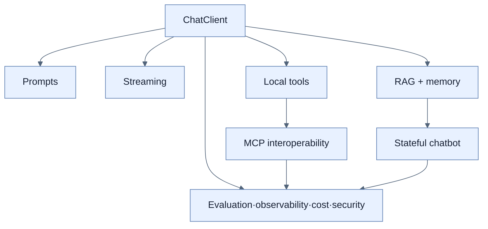

# Chapter 14 — Building Intelligent Applications with Spring AI

## 학습 경로

1. [[01-introducing-llms-and-spring-ai|LLM과 Spring AI abstraction]]
2. [[02-building-llm-integrations-with-chatclient|ChatClient response 유형]]
3. [[03-reactive-streaming-with-chatclient|Reactive streaming]]
4. [[04-designing-prompts-and-tool-calling|Prompt와 tool calling]]
5. [[05-implementing-rag-with-vector-stores-and-advisors|RAG·vector store·memory]]
6. [[06-building-chatbots-and-mcp-integration|Chatbot과 MCP]]
7. [[07-operating-llm-applications|평가·관측·비용·보안]]

## 책의 범위

- 본문: pp. 401–465
- PDF: pp. 426–490
- 핵심 pipeline: prompt/model → tool·RAG·memory → MCP → production controls

