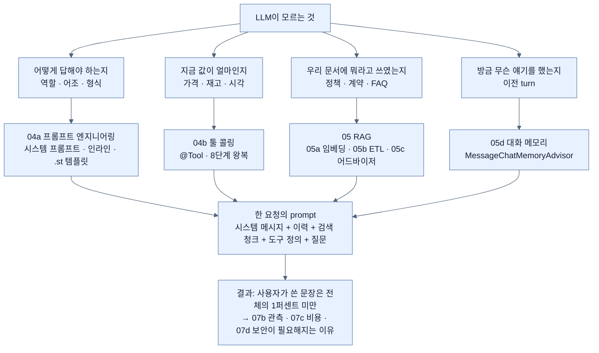

# Chapter 14 개념 지도 — Building Intelligent Applications with Spring AI

> *Learning Spring Boot 4*, Ch. 14 (책 pp. 401–465 / PDF pp. 426–490). 노트 19개를 세 축으로 엮는다. 축 1은 **"model이 모르는 것을 어떻게 알려 주는가"**, 축 2는 **"경계가 어디까지 열리는가"**, 축 3은 **"무엇을 언제 결정하는가"**다.

## 축 1 — model의 무지를 메우는 네 층

이 장 전체를 관통하는 문제는 하나다. **LLM은 우리 DB도, 오늘 날짜도, 사내 문서도, 방금 나눈 대화도 모른다.** 각 절은 그 무지의 서로 다른 조각을 메운다.

네 층이 **같은 prompt를 나눠 채운다**는 것이 이 축의 요점이다. 그래서 하나를 늘리면 다른 것이 밀려나고([[01-introducing-llms-and-spring-ai]]의 컨텍스트 윈도), 전체가 커지면 비용이 오른다([[07c-reducing-api-costs]]).

## 축 2 — 능력이 열리는 경계

같은 "도구"라도 어디까지 보이느냐에 따라 다른 기계가 필요하다.

| 경계 | 무엇이 보이나 | 노트 | 대가 |
|---|---|---|---|
| 한 요청 안 | `.tools(bean)`으로 등록한 이번 요청의 도구 | [[04b-tool-calling]] | 없음 |
| 한 `ChatClient` | `defaultSystem`·`defaultTools`·`defaultAdvisors` | [[02-building-llm-integrations-with-chatclient]] · [[05d-conversation-memory-with-chat-memory-advisor]] | 예외 경로를 만들기 어렵다 |
| 한 프로세스 | `@Tool`이 붙은 모든 bean | [[04b-tool-calling]] | 다른 앱이 못 쓴다 |
| 네트워크 너머 | `@McpTool`로 노출한 것 | [[06a-exposing-application-tools-as-an-mcp-server]] | 인증·부수효과·네트워크 실패를 직접 다뤄야 한다 |
| 남의 능력 가져오기 | `SyncMcpToolCallbackProvider`가 발견한 원격 도구 | [[06b-consuming-mcp-tools-as-a-client]] | 원격 응답이 prompt가 되어 [[07d-security-best-practices-for-ai-applications]]의 공격면이 된다 |

경계가 넓어질수록 **얻는 것은 재사용, 잃는 것은 통제**다. [[06-building-chatbots-and-mcp-integration]]이 그 교환을 정리한다.

## 축 3 — 결정이 일어나는 시점

같은 pipeline이라도 어느 시점에 무엇이 정해지는지가 성능과 비용을 가른다.

```mermaid
%%{init: {'theme': 'base', 'themeVariables': {'background': '#ffffff', 'primaryColor': '#e8f1ff', 'primaryTextColor': '#172033', 'primaryBorderColor': '#5b7db1', 'lineColor': '#52647a', 'secondaryColor': '#f7fbff', 'tertiaryColor': '#fff7df'}}}%%
flowchart LR
    subgraph T1["빌드·설정 시점"]
        B1["어떤 starter를 넣을까<br/>= 어떤 provider를 쓸까"]
        B2["임베딩 모델과 차원<br/>거리 척도"]
        B3["시스템 프롬프트 · 방어 문구"]
    end

    subgraph T2["기동 시점 — offline"]
        S1["auto-configuration이<br/>ChatModel · VectorStore bean 생성"]
        S2["@PostConstruct ETL<br/>문서 읽기 · 청킹 · 임베딩 · 저장"]
        S3["MCP 도구 스캔과 노출<br/>MCP 서버 도구 목록 발견"]
    end

    subgraph T3["요청 시점 — online"]
        R1["질문 임베딩 · 유사도 검색 topK"]
        R2["어드바이저 체인 — 메모리 · RAG · 로깅"]
        R3["모델이 도구를 고르고 인자를 만든다"]
        R4["응답 생성 · 스트리밍 여부"]
    end

    subgraph T4["운영 시점"]
        O1["평가 — 표본 채점"]
        O2["관측 — 전수 메트릭과 추적"]
        O3["비용 — 캐시 히트율 · 로컬 모델 분산"]
    end

    T1 --> T2 --> T3 --> T4
    T4 -.->|"청크 크기 · topK · 모델 선택을 되돌려 조정"| T1
```

핵심은 **되돌아오는 화살표**다. [[07a-evaluating-llm-response-quality]]와 [[07b-ai-and-observability]]가 낸 수치가 [[05b-ingesting-documents-with-the-etl-pipeline]]의 청크 크기와 [[05c-building-the-rag-pipeline-with-advisors]]의 top-K를 다시 정한다. 관측 없이 그 값들을 고르는 것은 추측이다.

## 축 4 — 대체가 아니라 분업인 쌍들

이 장에서 가장 자주 오해되는 지점을 모았다.

| 쌍 | 대체 관계로 보이지만 | 실제 분업 |
|---|---|---|
| 툴 콜링 ↔ RAG | 둘 다 "외부 정보 가져오기" | 구조화·실시간 값 ↔ 대량 비정형 지식. [[05-implementing-rag-with-vector-stores-and-advisors]] |
| 대화 메모리 ↔ RAG | 둘 다 prompt에 text 주입 | "방금 한 말" ↔ "회사가 가진 문서". [[05d-conversation-memory-with-chat-memory-advisor]] |
| `@Tool` ↔ `@McpTool` | 문법이 거의 같다 | 프로세스 안 ↔ 프로토콜 너머. [[06a-exposing-application-tools-as-an-mcp-server]] |
| `.call()` ↔ `.stream()` | "동기 vs 비동기" | 총 시간은 같다. 바뀌는 것은 첫 바이트까지의 시간과 **후처리 가능 여부**. [[03-reactive-streaming-with-chatclient]] |
| 인라인 파라미터 ↔ `.st` 템플릿 | "짧은 것 vs 긴 것" | 판단 기준은 길이가 아니라 **누가 얼마나 자주 고치는가**. [[04a-prompt-engineering-in-spring-ai]] |
| 평가 ↔ 관측 | 둘 다 "품질을 본다" | 표본의 의미 판정 ↔ 전수의 수치. [[07-operating-llm-applications]] |

## 노트 목록

| # | 노트 | 한 줄 |
|---|---|---|
| 01 | [[01-introducing-llms-and-spring-ai]] | LLM의 세 제약과 Spring AI의 네 추상 |
| 02 | [[02-building-llm-integrations-with-chatclient]] | 첫 호출과 세 가지 응답 형태 |
| 03 | [[03-reactive-streaming-with-chatclient]] | `.stream()`과 SSE, 그 트레이드오프 |
| 04 | [[04-designing-prompts-and-tool-calling]] | 동적 값과 동적 지식, 두 축의 갈림길 |
| 04a | [[04a-prompt-engineering-in-spring-ai]] | 자리표시자와 `.st` 템플릿 |
| 04b | [[04b-tool-calling]] | `@Tool`과 8단계 왕복 |
| 05 | [[05-implementing-rag-with-vector-stores-and-advisors]] | 검색·증강·생성 3단계 |
| 05a | [[05a-embeddings-and-vector-stores]] | 임베딩·시맨틱 검색·pgvector |
| 05b | [[05b-ingesting-documents-with-the-etl-pipeline]] | Read → Transform → Load |
| 05c | [[05c-building-the-rag-pipeline-with-advisors]] | `RetrievalAugmentationAdvisor` |
| 05d | [[05d-conversation-memory-with-chat-memory-advisor]] | 메모리 3층과 advisor 체인 |
| 06 | [[06-building-chatbots-and-mcp-integration]] | MCP가 표준화하는 것 |
| 06a | [[06a-exposing-application-tools-as-an-mcp-server]] | `@McpTool`로 서버 되기 |
| 06b | [[06b-consuming-mcp-tools-as-a-client]] | 원격 도구를 로컬처럼 쓰기 |
| 07 | [[07-operating-llm-applications]] | production 전 네 가지 질문 |
| 07a | [[07a-evaluating-llm-response-quality]] | LLM-as-a-Judge |
| 07b | [[07b-ai-and-observability]] | 자동 계측된 네 metric |
| 07c | [[07c-reducing-api-costs]] | 프롬프트 캐싱과 로컬 모델 |
| 07d | [[07d-security-best-practices-for-ai-applications]] | 프롬프트 인젝션·키 관리·프라이버시 |

## 다른 Chapter와의 연결

- **Ch. 13 관측** — [[07b-ai-and-observability]]의 `gen_ai.*` metric은 Chapter 13에서 세운 Micrometer·Prometheus·Grafana 스택 위에 그대로 얹힌다. AI 전용 관측 스택을 따로 배우지 않는다. 대응 노트는 `part-5-observing-spring-boot-4-applications/chapter-13-observing-spring-boot-4-applications/04-metrics-with-micrometer-prometheus-and-grafana`와 같은 폴더의 `06-correlating-logs-metrics-and-traces`다.
- **Ch. 9 리액티브** — [[03-reactive-streaming-with-chatclient]]의 `Flux`·WebFlux·SSE는 `part-4-scaling-an-application-with-spring-boot/chapter-9-writing-reactive-web-controllers/01-reactive-programming-and-backpressure`에서 다룬 개념을 AI 응답에 적용한 것이다.
- **Ch. 5 테스트** — [[07a-evaluating-llm-response-quality]]의 `@SpringBootTest` 기반 평가 테스트는 `part-2-creating-an-application-with-spring-boot/chapter-5-testing-with-spring-boot/06-adding-testcontainers`의 통합 테스트 감각을 잇는다. [[05a-embeddings-and-vector-stores]]의 pgvector Testcontainer 권고도 같은 계보다.
- **Ch. 6 설정** — provider·model·차원·관측 프라이버시가 전부 property로 결정된다. `part-3-releasing-an-application-with-spring-boot/chapter-6-configuring-an-application-with-spring-boot/02-creating-profile-based-property-files`의 프로파일 분리가 [[06b-consuming-mcp-tools-as-a-client]]의 `application-mcp-client.properties`에 그대로 쓰인다.
- **Ch. 3 데이터** — [[05a-embeddings-and-vector-stores]]가 PostgreSQL을 벡터 스토어로 재사용하는 것은 `part-2-creating-an-application-with-spring-boot/chapter-3-querying-for-data-with-spring-boot/01b-adding-spring-data-jpa-to-our-project`에서 세운 데이터 계층 위에 확장 하나를 얹는 일이다.
- **다음 장** — Ch. 15가 Spring Boot 4의 변경점을 정리하며 책을 마무리한다. `part-7-whats-new-in-spring-boot-4/chapter-15-whats-new-in-spring-boot-4/01-whats-new-in-spring-boot-4`.
