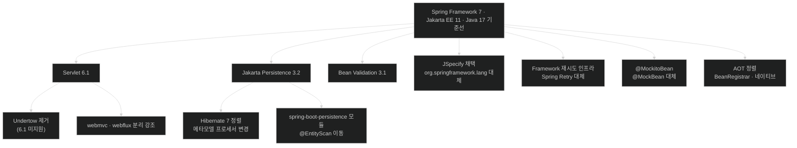

# Spring Boot 4의 변화 — 아홉 영역과 그것을 관통하는 다섯 방향

## 한눈에 보기

| 질문 | 핵심 답 |
|---|---|
| 토대가 무엇으로 바뀌었나 | **Spring Framework 7 + Jakarta EE 11 + Java 17 기준선** |
| 변경이 몇 영역인가 | 9개 — 코어·웹/API·데이터·보안·테스트·메시징/배치/재시도·관측·네이티브/성능·기타 |
| 항목 수 | 34개 하위 절, Note 40개. **코드 리스팅은 하나도 없다** |
| 이 장을 하나로 묶는 것 | 변경들이 **같은 다섯 방향**을 가리킨다 (§2.10) |
| 가장 위험한 변경 유형 | **컴파일도 되고 시작도 되는데 동작만 달라지는** 것들 |
| 업그레이드 첫 수 | `spring-boot-properties-migrator`를 잠깐 넣고 돌려 본다 |
| 임시 탈출구 | classic starter. **임시**라는 것이 중요하다 |

## 1. 왜 이게 필요한가

### 출발 장면: `mvn clean package`가 스무 곳에서 깨진다

Boot 3.5로 잘 돌던 애플리케이션의 부모 버전을 4.0으로 올리고 빌드한다. 결과는 이렇다.

```text
[ERROR] package org.springframework.lang does not exist
[ERROR] cannot find symbol: class MockBean
[ERROR] Could not resolve dependencies: org.springframework.boot:spring-boot-starter-web:jar:4.0.0
[ERROR] package com.fasterxml.jackson.databind does not exist
[ERROR] cannot find symbol: class StreamsBuilderFactoryBeanCustomizer
```

컴파일 오류 다섯 개는 그나마 낫다. 진짜 문제는 이것들을 고쳐 빌드가 통과한 **뒤에** 나타난다.

- `@SpringBootTest`를 쓰는 통합 테스트에서 `MockMvc`가 주입되지 않는다.
- 배치 작업이 돌긴 하는데, 재시작하면 이전 실행 이력이 없다.
- 개발 중 브라우저 자동 새로고침이 안 된다.
- Elasticsearch 클라이언트 커스터마이저가 호출되지 않는다.

### 여기서 뭐가 무너지나

이 상황에서 무너지는 것은 코드가 아니라 **대응 전략**이다. 위 목록을 한 덩어리로 보면 손댈 곳을 정할 수 없다. 실제로는 **성격이 다른 네 종류**가 섞여 있다.

| 성격 | 예 | 언제 드러나나 | 대응 |
|---|---|---|---|
| **이름이 바뀜** | `starter-web`→`starter-webmvc`, `@MockBean`→`@MockitoBean` | 빌드 시점 | 기계적 치환 |
| **기능이 제거됨** | Undertow, Spock 통합, 실행 스크립트 | 빌드 또는 시작 시점 | 대체재로 이전 |
| **기본값이 바뀜** | `@SpringBootTest`의 웹 테스트 자동 구성, Batch 인메모리, DevTools LiveReload | **런타임에 조용히** | 명시적으로 켠다 |
| **새 기능이 생김** | `BeanRegistrar`, `JmsClient`, OTel starter, AOT Cache | 안 써도 무방 | 필요할 때 도입 |

세 번째가 위험하다. **컴파일도 되고 시작도 되는데 동작만 다르다.** 테스트가 통과하는데 운영에서 다르게 도는 경로가 여기서 생긴다.

### 그래서 나온 생각

**변경을 성격으로 분류하고, 그 위에서 "왜 이 방향으로 바꿨는가"를 읽는다.** 34개 항목을 따로 외우는 대신 다섯 방향을 알면 처음 보는 변경도 예측할 수 있다.

비유하자면 Boot 3 → 4 업그레이드는 **집 전체 배선 교체**다. 스위치 위치가 바뀌고(이름 변경), 안 쓰는 회선은 철거되고(제거), 어떤 콘센트는 기본이 꺼진 채로 나오고(기본값 변경), 새 규격 단자가 생긴다(신규 기능).

→ 비유가 깨지는 지점: 배선 공사는 **끝나면 눈으로 확인할 수 있다.** 스위치를 눌러 보면 된다. 하지만 Boot 4의 변경 상당수는 위 표의 세 번째 줄 — **살아 보고 나서야 아는** 것들이다. 배치를 재시작해 봐야 메타데이터가 없다는 걸 알고, 통합 테스트를 돌려 봐야 `MockMvc`가 없다는 걸 안다. 벽을 뜯어 확인할 방법이 없다는 점에서 배선 비유는 여기서 멈춘다. 그래서 §2.10의 도구가 필요해진다.

## 2. 어떻게 동작하는가

### 2.0 토대 — 무엇 위에 서 있는가

책의 첫 문단이 전제를 깐다. Spring Boot 4는 **Spring Framework 7 위에 세워졌고, Jakarta EE 11에 정렬하며, Java 17을 최소 Java [[기준선]]**(= 프레임워크가 요구하는 최소 버전)**으로 쓴다.** 이 책은 예제에서 Java 25를 쓰는데, GraalVM 25 지원과 JVM AOT Cache 같은 새 JVM 기능을 활용하기 위해서다.

**[[Jakarta-EE]]**(= Java EE가 Eclipse 재단으로 이관되며 바뀐 이름과 그 사양 모음) 11로 올라가면 런타임 스택이 함께 움직인다 — **[[서블릿-명세]]**(= HTTP 요청 처리 객체 모델과 컨테이너 동작을 정의한 Java 표준) 6.1, Jakarta Persistence 3.2, Bean Validation 3.1 등이다.

책이 정리하는 체감은 이렇다 — 애플리케이션 개발자에게 이 변화는 대개 **의존성 업그레이드, 이름이 바뀐 API, 갱신된 import, 그리고 현대 Java 도구와의 더 강한 통합**을 통해 드러난다.

이 한 줄이 §1 표의 "이름이 바뀜" 항목 대부분의 근원이다. **토대가 움직였기 때문에 그 위의 이름들이 따라 움직인 것**이지, Spring 팀이 이름을 바꾸고 싶어서 바꾼 것이 아니다.

### 2.1 코어 프레임워크 — 네 가지 변화

**① JSpecify 널 안전성 애노테이션**

Spring Boot 4는 **[[JSpecify]]**(= Java nullness 애노테이션에 표준 의미를 부여하는 벤더 중립 명세)를 널 안전성의 표준 애노테이션 모델로 채택하고, 기존의 Spring 전용 애노테이션(`org.springframework.lang`)에서 물러난다.

책이 드는 이유가 명확하다 — JSpecify는 **벤더 중립적이고 도구 친화적인** 방식으로 Java API의 **[[널-계약]]**(= 어떤 값이 `null`일 수 있는지를 타입 수준에서 선언한 약속)을 표현한다. 이 계약은 IDE와 NullAway 같은 **[[정적-분석]]**(= 실행하지 않고 소스만 읽어 문제를 찾는 검사) 도구가 해석할 수 있다.

그리고 업그레이드에서 실제로 겪을 일을 짚는다 — **이전에는 경고 없이 컴파일되던 코드가 이제 nullability 위반을 보고할 수 있다.** 자기 코드에서 `org.springframework.lang`의 애노테이션을 쓰고 있었다면 `org.jspecify.annotations`의 대응 애노테이션(특히 `@Nullable`, `@NonNull`, `@NullMarked`)으로 옮겨야 한다.

**② `BeanRegistrar`로 프로그래밍 방식 빈 등록**

Spring Framework 7이 도입한 **[[BeanRegistrar]]**(= 프로그래밍 방식으로 빈을 등록하는 가벼운 API)는 `BeanRegistry`와 `Environment` API를 써서 컨텍스트 초기화 중 빈을 등록한다.

언제 쓰는지가 중요하다 — 빈 등록이 **환경 프로퍼티, 조건 로직, 반복문**처럼 `@Bean` 메서드만으로 표현하기 어색한 프로그래밍적 판단에 의존할 때다. 애플리케이션 수준의 여러 상황에서, `BeanDefinitionRegistryPostProcessor` 같은 저수준 확장점보다 더 깔끔하고 초점이 분명한 API를 제공한다.

그리고 이것이 **AOT·네이티브 이미지 방향과 정렬**된다는 점을 책이 덧붙인다 — 빈 정의를 컨텍스트 초기화 중 **명시적으로** 등록하므로 애플리케이션 구조를 빌드 시점에 분석하기 쉬워진다.

다만 범위를 분명히 한다 — **대부분의 애플리케이션 개발자에게 이 변화는 코드 변경이 거의 또는 전혀 필요 없다.** 직접 구현하는 것은 주로 커스텀 인프라, 재사용 가능한 구성 모듈, 프레임워크 성격의 확장을 쓸 때 유용하다.

**③ Jackson 3 통합**

책은 이것을 **"이번 릴리스에서 가장 중요한 의존성 업그레이드 중 하나"**라고 부른다. **[[Jackson-3]]**(= Spring Boot 4가 선호 JSON 라이브러리로 채택한 Jackson의 새 메이저 버전)이 Jackson 2 대비 breaking change를 도입하기 때문이다.

| 무엇이 | 이전 | Boot 4 |
|---|---|---|
| Maven 그룹·패키지 | `com.fasterxml.jackson` | **`tools.jackson`** |
| 단, `jackson-annotations`는 | — | **그대로 `com.fasterxml.jackson.core` / `...jackson.annotation`** |
| 애노테이션 | `@JsonComponent`, `@JsonMixin` | `@JacksonComponent`, `@JacksonMixin` |
| 관련 지원 클래스 | `Json…` | `Jackson…` |
| JSON 전용 프로퍼티 | `spring.jackson.read.*`, `.write.*` | `spring.jackson.json.read.*`, `.json.write.*` |
| ObjectMapper 커스터마이저 | `Jackson2ObjectMapperBuilderCustomizer` | `JsonMapperBuilderCustomizer` |

**[[사용-중단]]**(= 아직 동작하지만 앞으로 제거될 예정이라는 표시)된 Jackson 2 지원도 함께 들어 있어, 아직 옮기지 못한 라이브러리를 위해 Jackson 2 `ObjectMapper`를 Boot의 Jackson 3 자동 구성과 나란히 쓸 수 있다. 그리고 마이그레이션 중에는 `spring.jackson.use-jackson2-defaults` 프로퍼티로 **Jackson 3을 Boot 3.x의 Jackson 2 기본값에 가깝게** 맞출 수 있다.

책이 짚는 경계 — 대부분의 애플리케이션은 Boot의 의존성 관리가 알아서 처리한다. 하지만 **Jackson 의존성을 직접 선언하거나, 커스텀 serializer/deserializer를 쓰거나, mixin을 등록하거나, `ObjectMapper`를 커스터마이즈하거나, 특정 Jackson 2 기본값에 의존하는** 애플리케이션은 마이그레이션 중 검토해야 한다.

**④ 이름이 바뀌고 재구성된 스타터**

Boot 4는 **[[스타터]]**(= 기능 하나를 시작하는 데 필요한 의존성 묶음 아티팩트)를 재구성해 애플리케이션 의존성을 더 명시적으로 만든다. 여러 기술을 한꺼번에 지원하는 넓은 스타터에 기대는 대신, 애플리케이션이 **실제로 쓰는 기술 스택을 선언**하도록 유도한다. 이것이 **[[집중형-스타터]]**(= 애플리케이션이 실제로 쓰는 기술 하나에 대응하는 좁은 스타터)다.

| 이전 | Boot 4 |
|---|---|
| `spring-boot-starter-web` | **`spring-boot-starter-webmvc`** (서블릿 기반 MVC) |
| `spring-boot-starter-webflux` | 그대로 (리액티브) |
| `spring-boot-starter-web-services` | `spring-boot-starter-webservices` |
| `spring-boot-starter-aop` | `spring-boot-starter-aspectj` |
| 테스트는 `starter-test` 하나 | 기술별 — `starter-webmvc-test`, `starter-webflux-test`, `starter-security-test` |
| 라이브러리만 있으면 자동 구성 | 전용 스타터 필요 (예: Flyway → `spring-boot-starter-flyway`) |

마지막 줄이 **[[전이-의존성]]**(= 내가 선언하지 않았지만 딸려 오는 라이브러리) 문제에 대한 답이다. 예전에는 어떤 라이브러리가 클래스패스에 있다는 이유만으로 기능이 켜졌다. 이제는 **의도를 선언해야 켜진다.**

업그레이드를 돕기 위해 **[[클래식-스타터]]**(= Boot 3.x에 가까운 넓은 구성을 제공하는 임시 스타터)도 제공한다 — `spring-boot-starter-classic`과 `spring-boot-starter-test-classic`이다. 다만 책이 못 박는다 — 이것들은 **임시 마이그레이션 보조 수단**으로 유용하지만, 새 애플리케이션과 장기 유지보수에는 실제로 쓰는 기술에 맞는 집중형 스타터를 선호하라.

### 2.2 웹과 API — 세 가지 테마

책이 이 영역의 테마를 셋으로 정리한다 — **서블릿과 리액티브 웹의 더 분명한 분리, API 진화에 대한 내장 지원, 더 선언적인 클라이언트 측 HTTP 통신**이다.

**① API 버전 관리**

Spring Framework 7이 Spring MVC와 WebFlux 양쪽에 **[[API-버전-관리]]**(= 호환되지 않는 여러 계약을 동시에 제공하며 요청마다 명시하게 하는 방식) 지원을 내장했고, Boot 4가 그것을 자동 구성한다.

- 버전은 **URL 경로 세그먼트, 쿼리 파라미터, 헤더, 미디어 타입 파라미터**에서 해석할 수 있다.
- 중심 추상화는 `ApiVersionStrategy`로, 버전이 어떻게 해석·파싱·검증되고 클라이언트에 보고되는지를 조율한다.
- `ApiVersionDeprecationHandler`로 **사용 중단 힌트**를 제공해, 응답 헤더를 통해 버전 폐기와 종료 예정을 알릴 수 있다.
- 프로퍼티는 서블릿 스택이 `spring.mvc.apiversion.*`, 리액티브가 `spring.webflux.apiversion.*`다.
- `ApiVersionResolver`·`ApiVersionParser`·`ApiVersionDeprecationHandler`를 등록해 동작을 바꿀 수 있다.

**② HTTP 서비스 클라이언트 (인터페이스 프록시)**

**[[HTTP-서비스-클라이언트]]**(= 원격 HTTP 호출을 Java 인터페이스 선언으로 표현하는 모델)는 `@HttpExchange`·`@GetExchange`·`@PostExchange` 같은 애노테이션을 인터페이스 메서드에 붙이면, Spring이 애플리케이션 대신 HTTP 요청을 수행하는 **[[프록시]]**(= 타입인 척하며 호출을 가로채 대신 수행하는 객체) 구현을 만들어 준다.

Boot 4가 더한 것은 **이 클라이언트들을 만드는 데 필요한 인프라의 자동 구성**이다. 생성된 프록시는 클라이언트 구성에 따라 `RestClient` 또는 `WebClient`를 아래에 쓴다.

책이 드는 효용 — 외부 REST API나 마이크로서비스와 통신할 때, `RestClient`·`WebClient` 호출을 서비스 클래스 곳곳에 흩뿌리는 대신 **원격 API 계약을 Java 인터페이스로 표현해** 필요한 곳에 주입한다.

**③ 정적 리소스 위치에 `/fonts/**` 추가**

Boot 4는 공통 **[[정적-리소스]]**(= 서버가 가공 없이 그대로 내보내는 파일) 위치에 `/fonts/**`를 더한다.

이 사소해 보이는 변경이 **보안 설정에 닿는다.** Spring Security의 `PathRequest#toStaticResources().atCommonLocations()`를 쓰는 애플리케이션에서는 이제 `/fonts/**`도 다른 공통 정적 경로와 **같은 보안 구성을 받는다.** WOFF·WOFF2·TTF 같은 웹 폰트를 `src/main/resources/static/fonts/`에 두면 정적 리소스로 서빙된다. 원치 않으면 `StaticResourceLocation.FONTS`를 `PathRequest`와 함께 써서 명시적으로 제외한다.

**④ Undertow 제거**

Boot 4가 서블릿 명세 기준선을 **6.1**로 올렸는데, **Undertow가 현재 Servlet 6.1을 지원하지 않는다.** 그래서 Boot 4는 Undertow 지원을 제거했다 — 스타터도, 내장 서블릿 컨테이너로 쓰는 것도 함께다.

Undertow를 쓰던 애플리케이션은 Servlet 6.1을 만족하는 컨테이너(Tomcat 또는 Jetty)로 옮겨야 한다. Tomcat을 명시적으로 제외하고 Undertow로 바꿔 둔 프로젝트라면, Undertow 의존성을 지우고 기본 Tomcat 구성을 쓰거나 Jetty 스타터를 더한다.

**이 제거는 Spring 팀의 선택이 아니라 기준선 상승의 결과**라는 점이 §2.0과 이어진다.

### 2.3 데이터 계층 — 다섯 가지 변화

책이 먼저 안심시킨다 — 대부분의 리포지토리 기반 애플리케이션은 **사소한 변경만** 필요하다. 리포지토리 인터페이스, 쿼리 메서드, 엔티티 매핑은 대체로 그대로다. 바뀌는 것은 **import, 애노테이션 프로세서, 구성 프로퍼티, 저수준 클라이언트 커스터마이저**다.

**① `spring-boot-persistence` 모듈**

일반 영속성 관련 코드와 구성 프로퍼티를 위한 새 모듈이다. 이 **[[모듈-세분화]]**(= 큰 자동 구성 묶음을 기술별 작은 모듈로 나누는 것)의 결과로 두 가지가 바뀐다.

| | 이전 | Boot 4 |
|---|---|---|
| `@EntityScan` 패키지 | `org.springframework.boot.autoconfigure.domain` | `org.springframework.boot.persistence.autoconfigure` |
| 예외 변환 프로퍼티 | `spring.dao.exceptiontranslation.enabled` | `spring.persistence.exceptiontranslation.enabled` |

**② Hibernate 7과 Jakarta Persistence 3.2**

프로그래밍 모델은 대체로 그대로다. 검토가 필요한 것은 **Hibernate 동작을 커스터마이즈하거나, Criteria API를 많이 쓰거나, 생성된 메타모델 클래스에 의존하거나, Hibernate 전용 프로퍼티를 설정하는** 경우다. 특히 정적 메타모델 생성기를 쓴다면 **Hibernate 7에서 애노테이션 프로세서 아티팩트가 바뀌었으므로** 빌드 설정을 갱신해야 할 수 있다.

**③ Elasticsearch 클라이언트 교체**

사용 중단된 저수준 Elasticsearch `RestClient` 자동 구성이 새 `Rest5Client` 자동 구성으로 대체됐다. `Rest5Client`는 Apache HttpClient 5 기반이며 최신 Elasticsearch Java 클라이언트 스택의 기본 클라이언트다.

- `RestClientBuilderCustomizer` → **`Rest5ClientBuilderCustomizer`**
- 옛 `org.elasticsearch.client:elasticsearch-rest-client`·`-sniffer` 의존성은 더 이상 필요 없다. 그 기능이 `co.elastic.clients:elasticsearch-java`를 통해 제공된다.
- **Spring Data Elasticsearch 리포지토리를 쓰는 애플리케이션은 대개 인터페이스를 바꾸지 않아도 된다** — 이 변경은 리포지토리 프로그래밍 모델이 아니라 그 아래 클라이언트 인프라에 관한 것이기 때문이다.

**④ MongoDB 구성 프로퍼티 재편**

Boot 4는 MongoDB 프로퍼티 이름을 **"Spring Data MongoDB가 필요한가, MongoDB Java 드라이버만 있으면 되는가"**가 드러나도록 재편했다.

| 구분 | 접두어 | 예 |
|---|---|---|
| 드라이버만 있으면 되는 연결 설정 | `spring.data.mongodb.*` → **`spring.mongodb.*`** | `host`, `port`, `uri`, `username`, `password`, `database`, `ssl.enabled`, `representation.uuid` |
| 관리·모니터링 | `mongo` → **`mongodb`** | `management.health.mongodb.enabled`, `management.metrics.mongodb.command.enabled`, `management.metrics.mongodb.connectionpool.enabled` |
| Spring Data MongoDB 전용으로 **남는** 것 | `spring.data.mongodb.*` 유지 | `auto-index-creation`, `field-naming-strategy`, `gridfs.bucket`, `gridfs.database`, `repositories.type` |

그리고 **기본값이 사라진 것**이 하나 있다 — Spring Data MongoDB가 더 이상 UUID와 BigInteger/BigDecimal 값의 **기본 표현을 제공하지 않는다.** `spring.mongodb.representation.uuid`와 `spring.data.mongodb.representation.big-decimal`로 **명시적으로 설정해야 한다.**

**⑤ Redis 마스터/레플리카와 관측**

- Lettuce를 쓸 때 **정적 마스터/레플리카 토폴로지**를 자동 구성한다. `spring.data.redis.masterreplica.nodes`로 노드를 지정한다.
- Redis 관측이 `MicrometerCommandLatencyRecorder`에서 **`MicrometerTracing`**으로 바뀌었다. 그래서 Redis 연산이 **[[Observation-API]]**(= 한 번의 관측 알림이 메트릭과 트레이스로 동시에 흘러가게 하는 Micrometer 추상화)를 통해 **메트릭과 span 양쪽에 기여**한다.

### 2.4 보안

이 영역만 하위 절이 없다. Boot 4는 보안 스택을 **Spring Security 7**에 정렬한다. 프로그래밍 모델은 대체로 익숙하지만 검토할 것이 있다.

- 이미 `WebSecurityConfigurerAdapter` 대신 **명시적인 `SecurityFilterChain` 빈**을 쓰고 있어야 한다. 전자는 이전 Spring Security 버전에서 이미 제거됐다.
- **Spring Authorization Server가 Spring Security의 일부가 되었다.** 그래서 버전이 별도 `spring-authorization-server.version` 프로퍼티가 아니라 Spring Security를 통해 관리된다.
- 커스텀 OAuth 흐름, 인가 서버 구성, 다단계 인증, PKCE 동작, 옛 보안 의존성 이름을 쓰는 애플리케이션은 마이그레이션 중 신중히 검토해야 한다.

두 번째가 §2.10의 다섯 번째 방향(책임의 이전)과 반대 방향이라는 점이 흥미롭다 — **여기서는 밖에 있던 것이 안으로 들어왔다.**

### 2.5 테스트 — 네 가지 변화

Boot 4는 테스트 모델을 Framework 7과 새 모듈 구조에 맞춘다. 테스트 의존성이 더 좁아졌고, 애플리케이션은 **테스트 대상 기술에 맞는 test starter를 선언**해야 한다.

**① Mockito 빈 오버라이드**

Boot 4는 Boot 고유의 `@MockBean`과 `@SpyBean`을 **제거**했다. 대신 Spring Framework의 `@MockitoBean`·`@MockitoSpyBean`을 쓴다.

새 애노테이션은 `org.springframework.test.context.bean.override.mockito`에 있고 Framework의 **[[빈-오버라이드]]**(= 테스트에서 컨텍스트의 특정 빈을 가짜로 갈아 끼우는 기능) 모델에 정렬된다. 제약이 하나 붙는다 — **테스트 클래스의 필드에는 쓸 수 있지만 `@Configuration` 클래스에는 쓸 수 없다.** 공유 mock 구성 클래스를 두고 있었다면 이 지점을 검토해야 한다.

**② `RestTestClient` 지원**

Framework 6에서 도입된 HTTP 엔드포인트 테스트 클라이언트다. Spring의 `RestClient`를 감싸고 응답 검증에 맞춘 API를 제공한다. 실행 중인 서버를 상대로 종단 간 테스트를 할 수도 있고, **`MockMvc`에 바인딩해 서버 없이** Spring MVC 애플리케이션을 테스트할 수도 있다.

> 책은 여기서 솔직하게 밝힌다 — **이 주제는 이 책에서 자세히 다루지 않는다.** Chapter 5는 컨트롤러 테스트에 `MockMvc`를, 데이터베이스 통합 테스트에 Testcontainers를 쓴다.

**③ 웹 테스트 자동 구성이 명시적으로 바뀜**

**이것이 §1 표의 "기본값이 바뀜"의 대표 사례다.** Boot 4에서 `@SpringBootTest`는 **더 이상 웹 테스트 클라이언트를 자동으로 구성하지 않는다.**

| 필요한 것 | 붙여야 할 애노테이션 |
|---|---|
| `MockMvc` | `@AutoConfigureMockMvc` |
| `TestRestTemplate` | `@AutoConfigureTestRestTemplate` |
| `WebTestClient` | `@AutoConfigureWebTestClient` |

책이 밝히는 의도 — 전체 컨텍스트 테스트를 **더 의도적으로** 만들고, 필요 없을 때 웹 테스트 인프라를 구성하지 않기 위해서다. 이것은 **[[테스트-슬라이스]]**(= 특정 계층만 띄워 검증하는 테스트 구성)가 원래 갖고 있던 성질을 전체 컨텍스트 테스트에도 확장한 것으로 읽을 수 있다.

**④ Testcontainers 2.x**

Boot 4가 **[[Testcontainers]]**(= 테스트 중 도커 컨테이너로 실제 DB·브로커를 띄워 주는 라이브러리) 2.x를 의존성 관리로 다룬다. Testcontainers 2는 여러 모듈의 **artifact id를 바꿨지만 Java 클래스 이름은 대부분 그대로**다.

```text
  org.testcontainers:postgresql      →  org.testcontainers:testcontainers-postgresql
  org.testcontainers:junit-jupiter   →  org.testcontainers:testcontainers-junit-jupiter
```

그래서 대부분의 경우 마이그레이션은 **Java import가 아니라 Maven/Gradle 좌표를 고치는 일**이다.

### 2.6 메시징·배치·재시도 — 네 가지 변화

**① Spring Retry에서 Framework 재시도로**

Boot 4는 **[[재시도]]**(= 실패한 작업을 정책에 따라 다시 시도하는 장치) 지원을 Spring Framework 6에서 도입된 재시도 인프라에 정렬한다. 그 결과 이전에 별도 Spring Retry 라이브러리에 의존하던 여러 프로젝트(Spring AMQP, Spring Kafka, Spring Integration, Spring Batch)가 **Framework 내장 재시도**를 쓴다.

애플리케이션 코드에 미치는 영향은 사용 방식에 달렸다.

- 메시징 자동 구성을 통해 설정했다면 → 대부분 설정 기반으로 그대로 동작한다.
- **`@Retryable`처럼 Spring Retry를 직접 쓴다면** → `spring-retry` 의존성을 **명시적으로 선언해야 한다.** 더 이상 Boot BOM이 관리하지 않기 때문이다.

이름도 몇 개 바뀌었다 — Kafka의 `spring.kafka.retry.topic.backoff.random`이 **`.jitter`**로, AMQP는 `RabbitTemplateRetrySettingsCustomizer`·`RabbitListenerRetrySettingsCustomizer`로 커스터마이즈한다.

**② Kafka Streams 커스터마이저**

Boot의 `StreamBuilderFactoryBeanCustomizer`가 제거되고 Spring Kafka의 **`StreamsBuilderFactoryBeanConfigurer`**로 대체됐다. 새 타입은 `Ordered`를 구현하며 **기본 order 값이 0**이라, Kafka Streams 구성 컴포넌트를 여럿 정의한다면 순서에 영향이 있을 수 있다.

**③ Spring Batch 6 — 인메모리가 기본**

가장 조용하고 가장 위험한 변경이다. Spring Batch 6은 데이터베이스 기반 `JobRepository` **없이도** 동작할 수 있고, Boot 4의 `spring-boot-starter-batch`는 **이 단순한 인메모리 모드를 기본으로 쓴다.** 단순한 배치 작업에서 데이터베이스 요구를 없앤 것이다.

그런데 책이 곧바로 대가를 적는다 — 이 인메모리 인프라는 **애플리케이션 재시작 간에 지속되지 않는다.** 작업 인스턴스, 실행 메타데이터, 재시작 정보가 애플리케이션이 멈추면 사라진다.

| 필요한 것 | 무엇을 쓰나 |
|---|---|
| 단순 배치, 이력 불필요 | 기본 `spring-boot-starter-batch` (인메모리) |
| 영속적 **[[배치-메타데이터]]**(= 작업 인스턴스·실행 이력·재시작 정보 저장소), 재시작 가능성, 실행 이력, 스텝 단위 추적 | **`spring-boot-starter-batch-jdbc` + `DataSource`** (Batch 층에서는 `@EnableJdbcJobRepository`) |

Boot 3에서 올라온 애플리케이션은 **아무것도 안 바꾸면 조용히 인메모리로 내려앉는다.** §1에서 "배치를 재시작해 봐야 안다"고 한 것이 이 항목이다.

> **공식 문서로 확인한 메커니즘 (2026-08-29).** 이 항목은 실수 대가가 커서 상류 문서까지 추적했다. **Spring Batch 6.0 마이그레이션 가이드**가 변경의 실체를 명시한다 — *"`DefaultBatchConfiguration`이 이제 **'resourceless' 배치 인프라**를 구성한다(즉 **`ResourcelessJobRepository`**와 `ResourcelessTransactionManager`)."* 이유도 함께 적는다 — *"배치 메타데이터가 필요 없는 사람들에게 **인메모리 데이터베이스에 대한 추가 의존성을 요구하지 않기 위해서**다."*
>
> 즉 이것은 Boot의 결정이 아니라 **Spring Batch 6 자체의 기본값 변경**이고, Boot 4는 그 위에 올라탄 것이다. Boot 4 레퍼런스도 자동 구성 가능한 배치 저장소를 *"In-memory, JDBC, MongoDB"*로 나열하며 **인메모리를 정식 선택지로 문서화**한다(Boot 3에는 없던 항목이다).
>
> **"resourceless"라는 이름이 성격을 그대로 말한다** — 자원(데이터베이스)을 쓰지 않는다는 뜻이고, 그래서 남길 곳이 없으니 재시작하면 사라진다. 트랜잭션 매니저까지 함께 resourceless로 바뀐다는 점도 중요하다. 배치 메타데이터에 트랜잭션 보장이 걸려 있지 않다는 뜻이다.
>
> **JDBC를 되살리는 방법이 두 층에 있다.** 위 표의 `spring-boot-starter-batch-jdbc` + `DataSource`는 Boot 층의 방법이고, Spring Batch 층에서는 마이그레이션 가이드가 **`@EnableJdbcJobRepository`**를 명시하라고 안내한다(설정 클래스를 상속하는 경우에는 `DefaultBatchConfiguration` 대신 **`JdbcDefaultBatchConfiguration`**을 쓴다).
>
> **확인 방법.** 지금 도는 애플리케이션이 어느 쪽인지는 기동 로그의 `JobRepository` 구현 클래스나 `/actuator/conditions`의 배치 자동 구성 조건 평가로 확인한다. `Resourceless`가 보이면 **재시작 시 이력이 사라지는 상태**다.

**④ `JmsClient` 지원**

Framework 7이 도입한 새 fluent JMS API의 자동 구성이 추가됐다. `JdbcClient` 같은 API가 도입한 것과 같은 fluent 스타일을 따르며, 흔한 송수신 연산에서는 `JmsTemplate` 위에 얹히되 연산별 커스터마이즈를 허용한다. 기존 `JmsTemplate`·`JmsMessagingTemplate`은 **계속 지원되고 자동 구성된다.**

### 2.7 관측 — 네 가지 변화

책이 이 영역을 Chapter 13의 모델과 연결한다 — **메트릭은 시간에 따라 무슨 일이 일어나는지 설명하고, 트레이스는 요청이 시스템을 어떻게 지나가는지 보여 주며, 로그는 사건 단위의 세부를 제공한다.**

**① 전용 OpenTelemetry 스타터**

`spring-boot-starter-opentelemetry`가 생겼다. **[[OTLP]]**(= OpenTelemetry가 정의한 텔레메트리 전송 프로토콜) 기반으로 메트릭과 트레이스를 내보내는 데 필요한 의존성을 제공하고, **[[OpenTelemetry]]**(= 텔레메트리 수집·전송을 벤더 중립으로 표준화한 명세와 SDK) SDK도 자동 구성한다. 여러 OpenTelemetry 의존성을 손으로 조립할 필요가 줄었다.

Boot의 관측 지원은 Micrometer의 Observation API와도 통합되어, 애플리케이션의 관측이 메트릭과 트레이스에 함께 기여한다. 다만 책이 경계를 긋는다 — **로그 상관관계와 OTLP 로그 내보내기는 OpenTelemetry 아키텍처의 일부일 수 있지만, 로깅 설정은 애플리케이션이 쓰는 로깅 시스템과 appender에 달렸다.**

**② Actuator 상태 프로브가 기본 활성**

Boot 4에서 Actuator의 liveness·readiness **[[상태-프로브]]**(= 오케스트레이터가 애플리케이션의 생존과 준비 상태를 확인하는 엔드포인트)가 **모든 애플리케이션에서 기본으로 켜진다.** 이전처럼 Kubernetes에서 도는 것이 감지될 때만이 아니다.

그래서 actuator health 엔드포인트가 노출되어 있으면 `/actuator/health/liveness`와 `/actuator/health/readiness`가 항상 있다. 원치 않으면 `management.endpoint.health.probes.enabled=false`로 끈다.

두 프로브가 따로 있는 이유는 **묻는 질문이 다르기** 때문이다 — liveness는 "이 프로세스를 재시작해야 하는가", readiness는 "지금 트래픽을 보내도 되는가"다. 기동 중이거나 잠시 과부하인 인스턴스는 살아 있지만 준비되지 않았을 수 있다.

**③ 여러 개의 `TaskDecorator` 빈**

**[[작업-데코레이터]]**(= 비동기·스케줄 작업을 감싸 부가 처리를 넣는 장치)는 일반적인 작업 실행 기능이지만, 책이 관측 영역에 둔 이유가 있다 — **추적·로깅·보안 컨텍스트를 비동기 및 스케줄 작업 너머로 전파**하는 데 쓰이기 때문이다.

Boot 4는 `ApplicationContext`에 `TaskDecorator` 빈이 여럿 있으면 **`CompositeTaskDecorator`를 만들어 그들에게 위임**한다. 적용 순서는 `@Order` 애노테이션이나 `Ordered` 인터페이스로 정한다. 덕분에 추적 컨텍스트 전파, 보안 컨텍스트 전파, MDC 로깅 같은 횡단 관심사를 **손으로 조합하지 않고** 결합할 수 있다.

**④ SSL 인증서 만료 보고 방식 변경**

만료 임박 인증서 체인이 SSL health 응답의 **`expiringChains` 항목**에 나열되도록 바뀌었다. 이전의 **`WILL_EXPIRE_SOON` 상태는 더 이상 쓰이지 않고**, 만료 임박 인증서도 상태는 **`VALID`로 남은 채** 만료 정보만 health 세부에 노출된다.

Actuator health 엔드포인트로 인증서 유효성을 감시하던 애플리케이션은 **상태 값이 아니라 세부 항목을 봐야 한다.** 상태만 보고 경보를 걸어 뒀다면 그 경보가 영영 울리지 않는다.

### 2.8 네이티브 이미지와 성능 — 두 가지 AOT

**① GraalVM 네이티브 이미지와 AOT 개선**

Boot 4는 **[[AOT]]**(= 실행 전 빌드 시점에 미리 처리하는 방식) 처리 인프라와 Framework 7 정렬을 통해 **[[네이티브-이미지]]**(= JVM 없이 바로 실행되는 기계어 실행 파일) 지원을 계속 개선한다. **네이티브 이미지 컴파일에는 GraalVM Native Image 25 이상이 필요하다.**

Spring의 AOT 엔진은 빌드 시점에 애플리케이션을 분석해 GraalVM이 필요로 하는 메타데이터를 만든다 — 리플렉션·리소스·프록시·직렬화를 위한 **[[런타임-힌트]]**(= 실행 중 동적으로 결정되는 요소를 빌드 시점에 미리 알려 주는 메타데이터)다.

책이 경계를 남긴다 — 이 개선으로 수동 설정이 줄었지만, **동적 리플렉션, 커스텀 직렬화, 서드파티 라이브러리를 쓰는 애플리케이션은 여전히 추가 힌트가 필요할 수 있다.**

**② Java AOT 캐시**

**[[AOT-캐시]]**(= JVM이 학습 실행에서 시작 데이터를 기록해 이후 실행에서 재사용하는 Java 24 도입 기능)는 Java 24에서 도입되어 Java 25에서 쓸 수 있고, 이 책이 주로 쓰는 Java 버전이 25다.

**GraalVM 네이티브 이미지와 결정적으로 다른 점**을 책이 짚는다 — AOT Cache는 애플리케이션을 **계속 표준 JVM 위에서 돌게 한다.** 시작 시간과 메모리 사용량을 줄이면서도 일반 JVM 배포의 유연성을 유지한다.

| | GraalVM 네이티브 이미지 | Java AOT Cache |
|---|---|---|
| 실행 환경 | JVM 없음 (기계어 실행 파일) | **표준 JVM** |
| 빌드 산출물 | 플랫폼별 바이너리 | JAR + 캐시 파일 |
| 동적 기능 | 런타임 힌트로 미리 선언해야 함 | **제약 없음** |
| 필요 버전 | GraalVM Native Image 25+ | Java 24+ (buildpack 지원은 25+) |
| 개선 폭 | 크다 | **애플리케이션·환경·학습 실행의 대표성에 달렸다** |

마지막 줄이 중요하다. 책이 "실제 개선은 애플리케이션, 런타임 환경, 그리고 **학습 실행이 얼마나 대표적인가**에 달렸다"고 적는다. 학습 실행이 실제 사용 패턴과 다르면 캐시가 별 도움이 안 된다.

### 2.9 그 밖의 마이그레이션 변경 — 열한 가지

책이 나머지를 짧게 나열한다. 성격별로 묶으면 이렇다.

**새로 생긴 것**

- **외부 타입의 [[구성-메타데이터]]**(= 어떤 구성 프로퍼티가 존재하고 무엇을 뜻하는지 담은 기계 판독용 정보): `@ConfigurationProperties` 타입이 **다른 모듈**의 타입을 참조할 수 있게 되고, `@ConfigurationPropertiesSource`로 그 모듈에서 메타데이터를 가져올 수 있다. 주로 라이브러리 작성자와 구성 타입을 여러 모듈로 나눈 애플리케이션에 해당한다.
- **클래식 스타터**: `spring-boot-starter-classic`·`spring-boot-starter-test-classic`. **임시 마이그레이션 보조 수단**이며 결국 집중형 스타터로 대체해야 한다.

**기본값이 바뀐 것**

- **DevTools LiveReload가 기본 비활성**: 개발 시점 기본 설치 크기를 줄이기 위해서다. 브라우저 자동 새로고침이 필요하면 `spring.devtools.livereload.enabled=true`로 켠다. **hot restart 동작은 그대로다.**

**이름이 바뀐 것**

- **Spring Session 프로퍼티**: Spring Data 명명 관례에 맞춰 `spring.session.redis` → `spring.session.data.redis`, `spring.session.mongodb` → `spring.session.data.mongodb`.

**제거된 것**

| 무엇 | 이유 | 대응 |
|---|---|---|
| Spock 프레임워크 통합 | Spock이 아직 Groovy 5를 지원하지 않음 | Spock·Groovy 의존성을 직접 관리하면 테스트는 가능. **JUnit 5가 권장 기본** |
| Pulsar 리액티브 지원 | Spring Pulsar 자체가 Reactor 지원을 제거함 | 명령형 Pulsar 클라이언트로 이전하거나 다른 메시징 선택지 검토 |
| 내장 실행 스크립트 (fully executable jar) | Unix 계열 전용이고 배포 제약이 있었음 | `java -jar`는 그대로. Gradle application plugin이나 배포별 서비스 설정 사용 |
| Spring Session Hazelcast | **주도권이 Hazelcast 팀으로 이전** | Hazelcast 문서를 보고 의존성을 직접 관리 |
| Spring Session MongoDB | **주도권이 MongoDB 팀으로 이전** | MongoDB 문서를 보고 의존성을 직접 관리 |

**제약이 생긴 것**

- **Jersey 4.0과 Jackson 3 비호환**: Boot 4는 Jersey 4.0을 지원하지만 **Jersey 4.0이 아직 Jackson 3을 지원하지 않는다.** Jersey로 JAX-RS 엔드포인트를 쓰면서 Jackson 기반 JSON 처리가 필요하면, 필요한 Jackson 버전에 맞는 Boot 모듈을 쓴다 — Jackson 3은 `spring-boot-jackson`, 레거시 Jackson 2 호환은 **사용 중단된** `spring-boot-jackson2`다.
- **Kotlin 2.2 이상 요구**: Java 전용 애플리케이션은 영향이 없다. Kotlin 코드가 섞여 있으면 Kotlin 버전과 빌드 플러그인 설정을 검토해야 한다.

### 2.10 이 34개를 관통하는 다섯 방향 — 그리고 업그레이드의 첫 수

**다섯 방향**

항목을 따로 외우는 대신 방향을 보면 처음 보는 변경도 예측할 수 있다.

| 방향 | 무슨 뜻인가 | 이 장의 예 |
|---|---|---|
| **① 명시성** | 넓은 기본값 → 좁은 선언 | 집중형 스타터, `@SpringBootTest`의 웹 테스트 opt-in, Flyway 전용 스타터, MongoDB UUID·BigDecimal 표현 |
| **② 모듈 세분화** | 큰 묶음 → 기술별 모듈 | `spring-boot-persistence`, 기술별 test starter, OTel 전용 스타터 |
| **③ 벤더 중립 표준 채택** | Spring 고유 → 업계 표준 | JSpecify, Framework 재시도, `@MockitoBean`, Observation API, OpenTelemetry |
| **④ 빌드 시점으로 이동** | 런타임 결정 → 빌드 시점 분석 | `BeanRegistrar`의 명시적 등록, AOT 처리, AOT Cache, 네이티브 이미지 |
| **⑤ 책임의 이전** | Spring Boot가 쥐던 것을 놓음 | Spring Session Hazelcast·MongoDB, Kafka Streams 커스터마이저, Spring Retry |

⑤에는 **반대 방향의 예외가 하나** 있다 — Spring Authorization Server는 밖에 있다가 Spring Security **안으로** 들어왔다(§2.4). 방향은 "덜어낸다"가 아니라 **"각 기능이 있어야 할 자리로 보낸다"**에 가깝다.

**업그레이드의 첫 수**

> **Note (책 p.470)**: 완전한 Spring Boot 4.0 마이그레이션 가이드는 `https://github.com/spring-projects/spring-boot/wiki/Spring-Boot-4.0-Migration-Guide`에, 릴리스 노트는 `.../Spring-Boot-4.0-Release-Notes`에 있다.
>
> **기존 Spring Boot 3.x 프로젝트를 업그레이드한다면, `spring-boot-properties-migrator` 도구를 실행해 사용 중단되었거나 위치가 바뀐 구성 프로퍼티를 찾아내라.**

**[[프로퍼티-마이그레이터]]**(= 사용 중단·개명된 구성 프로퍼티를 찾아 알려 주는 Spring Boot 모듈)를 첫 수로 두는 이유가 §1의 진단과 정확히 맞물린다. 이 장에서 본 프로퍼티 이름 변경만 21개다 — MongoDB 8개, Jackson 2개, Session 2개, 영속성 1개, Kafka 1개, Redis 1개, DevTools 1개, health probes 1개 등이다. **이것들은 전부 §1 표의 "기본값이 바뀜"과 같은 방식으로, 조용히 무시되고 조용히 기본값으로 떨어진다.**

마이그레이터는 빌드에 잠시 넣어 두면 시작할 때 그런 프로퍼티를 보고해 준다. **벽을 뜯어 보는 대신 배선도를 받아 보는 것**에 해당하며, §1의 비유가 깨지던 지점을 도구로 메운다.

## 3. 그림으로 보기

### 토대 하나가 아홉 영역으로 퍼진다



**대부분의 이름 변경이 이 그림의 화살표를 따라간다.** Spring 팀이 이름을 바꾸고 싶어서가 아니라 토대가 움직였기 때문이다.

### 네 가지 변경 성격과 발견 시점

```text
                    빌드 시점                    시작 시점              운영 중
                        │                          │                     │
  이름이 바뀜  ────────▶ ● 컴파일 오류              │                     │
                        │  → 기계적으로 고친다      │                     │

  기능이 제거됨 ───────▶ ● 의존성 해석 실패 ───────▶ ● 빈 없음 오류       │
                        │  → 대체재로 이전          │                     │

  기본값이 바뀜 ────────┼──────────────────────────┼────────────────────▶ ● 동작만 다르다
                        │  (아무 오류 없음)         │  (아무 오류 없음)     │  ← 가장 위험
                        │                          │                     │
  새 기능      ────────┼──────────────────────────┼─────────────────────┼─▶ 안 써도 무방

  이 장의 예:
    이름 변경  : starter-web→webmvc · @MockBean→@MockitoBean · Jackson 패키지
    제거       : Undertow · Spock · 실행 스크립트 · Session Hazelcast/MongoDB
    기본값 변경: @SpringBootTest 웹 테스트 · Batch 인메모리 · LiveReload · health probes
                 · MongoDB UUID/BigDecimal 표현 · SSL WILL_EXPIRE_SOON 폐지
    새 기능    : BeanRegistrar · JmsClient · OTel starter · AOT Cache · RestTestClient

  ▶ 세 번째 줄에 그은 선이 §1에서 "살아 보고 나서야 안다"고 한 그것이다.
  ▶ spring-boot-properties-migrator 는 그중 프로퍼티 관련 항목을 시작 시점으로 끌어올린다.
```

### 두 가지 AOT는 다른 것이다

```text
  [GraalVM 네이티브 이미지]                    [Java AOT Cache]

   소스 ──빌드──▶ AOT 분석 ──▶ 네이티브 빌드     소스 ──빌드──▶ JAR
                    │                                        │
                    ▼                                   학습 실행 1회
              런타임 힌트 생성                                │
              (리플렉션·리소스·프록시·직렬화)                  ▼
                    │                                   시작 데이터 캐시
                    ▼                                        │
              기계어 실행 파일                                 ▼
                    │                                   이후 실행에서 재사용
                    ▼                                        │
              JVM 없이 실행                                    ▼
                                                        표준 JVM 위에서 실행

   ▶ 왼쪽은 실행 환경 자체를 바꾼다 → 동적 기능을 미리 선언해야 한다
   ▶ 오른쪽은 실행 환경을 유지한다 → 제약이 없고, 대신 개선 폭이 상황에 달렸다
   ▶ Chapter 3에서 본 "Spring Data AOT repository"는 또 다른 층이다 —
     리포지토리 구현을 빌드 시점에 생성하는 것으로, 위 둘과 목적이 겹치되 범위가 좁다
```

### 아홉 영역과 다섯 방향

| 영역 | 항목 수 | 주로 나타난 방향 |
|---|---:|---|
| 코어 프레임워크 | 4 | ③ 표준 채택, ① 명시성, ④ 빌드 시점 |
| 웹과 API | 4 | ① 명시성, ② 모듈 세분화 |
| 데이터 계층 | 5 | ② 모듈 세분화, ① 명시성 |
| 보안 | 1 | ⑤ 책임 이전(**역방향** — 안으로 편입) |
| 테스트 | 4 | ① 명시성, ③ 표준 채택, ② 모듈 세분화 |
| 메시징·배치·재시도 | 4 | ③ 표준 채택, ⑤ 책임 이전, ① 명시성 |
| 관측 | 4 | ③ 표준 채택, ② 모듈 세분화 |
| 네이티브·성능 | 2 | ④ 빌드 시점 |
| 기타 마이그레이션 | 11 | ⑤ 책임 이전, ① 명시성 |

## 4. 이 노트에 나온 용어

| 용어 | 한 줄 풀이 | 자세히 |
|---|---|---|
| 기준선 | 프레임워크가 요구하는 최소 버전 | [[_glossary#기준선]] |
| Jakarta EE | Java EE가 Eclipse로 이관되며 바뀐 이름과 사양 | [[_glossary#Jakarta-EE]] |
| 서블릿 명세 | HTTP 요청 처리 모델을 정의한 Java 표준 | [[_glossary#서블릿-명세]] |
| JSpecify | nullness 애노테이션의 벤더 중립 표준 명세 | [[_glossary#JSpecify]] |
| 널 계약 | 어떤 값이 `null`일 수 있는지의 타입 수준 선언 | [[_glossary#널-계약]] |
| 정적 분석 | 실행하지 않고 소스만 읽어 문제를 찾는 검사 | [[_glossary#정적-분석]] |
| BeanRegistrar | 프로그래밍 방식 빈 등록 API | [[_glossary#BeanRegistrar]] |
| Jackson 3 | Boot 4가 채택한 새 JSON 라이브러리 메이저 버전 | [[_glossary#Jackson-3]] |
| 스타터 | 기능 하나를 시작하는 데 필요한 의존성 묶음 | [[_glossary#스타터]] |
| 집중형 스타터 | 기술 하나에 대응하는 좁은 스타터 | [[_glossary#집중형-스타터]] |
| 클래식 스타터 | Boot 3.x에 가까운 구성을 주는 임시 스타터 | [[_glossary#클래식-스타터]] |
| 전이 의존성 | 선언하지 않았는데 딸려 오는 라이브러리 | [[_glossary#전이-의존성]] |
| API 버전 관리 | 여러 계약을 동시 제공하며 요청마다 명시하는 방식 | [[_glossary#API-버전-관리]] |
| HTTP 서비스 클라이언트 | 원격 호출을 Java 인터페이스로 표현하는 모델 | [[_glossary#HTTP-서비스-클라이언트]] |
| 프록시 | 타입인 척하며 호출을 가로채 대신 수행하는 객체 | [[_glossary#프록시]] |
| 정적 리소스 | 서버가 가공 없이 그대로 내보내는 파일 | [[_glossary#정적-리소스]] |
| 모듈 세분화 | 큰 자동 구성 묶음을 기술별로 나누는 것 | [[_glossary#모듈-세분화]] |
| 빈 오버라이드 | 테스트에서 빈을 가짜로 갈아 끼우는 기능 | [[_glossary#빈-오버라이드]] |
| 테스트 슬라이스 | 특정 계층만 띄워 검증하는 테스트 구성 | [[_glossary#테스트-슬라이스]] |
| Testcontainers | 테스트 중 실제 DB·브로커를 컨테이너로 띄우는 도구 | [[_glossary#Testcontainers]] |
| 재시도 | 실패한 작업을 정책에 따라 다시 시도하는 장치 | [[_glossary#재시도]] |
| 배치 메타데이터 | 작업 인스턴스·실행 이력·재시작 정보 저장소 | [[_glossary#배치-메타데이터]] |
| OpenTelemetry | 텔레메트리 수집·전송의 벤더 중립 표준 | [[_glossary#OpenTelemetry]] |
| OTLP | OpenTelemetry가 정의한 전송 프로토콜 | [[_glossary#OTLP]] |
| Observation API | 한 번의 알림이 메트릭과 트레이스로 흐르게 하는 추상화 | [[_glossary#Observation-API]] |
| 상태 프로브 | 생존·준비 상태를 확인하는 엔드포인트 | [[_glossary#상태-프로브]] |
| 작업 데코레이터 | 비동기·스케줄 작업을 감싸 부가 처리를 넣는 장치 | [[_glossary#작업-데코레이터]] |
| 네이티브 이미지 | JVM 없이 실행되는 기계어 실행 파일 | [[_glossary#네이티브-이미지]] |
| AOT | 빌드 시점에 미리 처리해 두는 방식 | [[_glossary#AOT]] |
| AOT 캐시 | 학습 실행의 시작 데이터를 재사용하는 JVM 기능 | [[_glossary#AOT-캐시]] |
| 런타임 힌트 | 동적 요소를 빌드 시점에 알려 주는 메타데이터 | [[_glossary#런타임-힌트]] |
| 구성 메타데이터 | 프로퍼티의 존재·타입·의미를 담은 기계 판독 정보 | [[_glossary#구성-메타데이터]] |
| 프로퍼티 마이그레이터 | 사용 중단·개명된 프로퍼티를 찾아 주는 모듈 | [[_glossary#프로퍼티-마이그레이터]] |
| 사용 중단 | 아직 동작하지만 제거 예정이라는 표시 | [[_glossary#사용-중단]] |

## 5. 자주 헷갈리는 것

### 사용 중단(deprecated)과 제거(removed)

**옮길 시간이 있는가**가 다르다. Jackson 2 지원과 `spring-boot-jackson2`는 사용 중단이라 아직 쓸 수 있다. Undertow와 Spock 통합은 **제거**라 대체재를 찾아야 한다. 클래식 스타터는 사용 중단이 아니라 **의도적 임시 수단**이라는 제3의 범주다.

### 두 가지 AOT

**GraalVM 네이티브 이미지**는 JVM을 버리고, **Java AOT Cache**는 JVM을 유지한다. 여기에 Chapter 3에서 본 **Spring Data AOT repository**(리포지토리 구현을 빌드 시점 생성)까지 세 가지가 "AOT"라는 말을 공유한다. 판별 질문 — "무엇을 미리 만드는가?" 실행 파일이면 네이티브, 시작 데이터면 캐시, 리포지토리 구현이면 Spring Data AOT다.

### `spring.mongodb.*`와 `spring.data.mongodb.*`

Boot 4에서 둘 다 존재한다. 기준은 **"Spring Data MongoDB가 필요한가"**다. 드라이버만으로 되는 연결 설정은 `spring.mongodb.*`, Spring Data 기능(인덱스 자동 생성, 필드 명명 전략, GridFS, 리포지토리)은 `spring.data.mongodb.*`에 남는다.

### liveness와 readiness

**"재시작해야 하는가"**와 **"트래픽을 보내도 되는가"**는 다른 질문이다. 기동 중인 인스턴스는 살아 있지만(liveness OK) 준비되지 않았다(readiness NG). 둘을 하나로 합치면 기동 중에 재시작을 반복하는 상태가 된다.

### `@SpringBootTest`가 웹 테스트를 자동 구성한다

**Boot 4에서는 아니다.** `@AutoConfigureMockMvc` 등을 명시해야 한다. 컴파일도 되고 컨텍스트도 뜨는데 주입만 안 되므로, 오류 메시지가 원인을 바로 가리키지 않는다.

### Batch가 데이터베이스 없이 돈다 = 좋아졌다

단순 작업에는 그렇다. 하지만 **재시작 시 이력이 사라진다.** 영속 메타데이터가 필요하면 `spring-boot-starter-batch-jdbc`를 명시해야 하며, 아무것도 안 하면 조용히 인메모리로 내려앉는다.

## 6. 언제 안 쓰나 / 경계

- **이 장은 목록이지 안내서가 아니다.** 각 항목의 실제 마이그레이션 절차는 공식 Migration Guide에 있고, 책도 항목마다 그쪽을 가리킨다. 이 노트도 마찬가지로 "무엇이 바뀌었고 왜 그 방향인가"까지만 담는다.
- **클래식 스타터로 업그레이드를 끝내면 안 된다.** 빌드는 통과하지만 Boot 4가 만든 명시성을 하나도 얻지 못한 채 넓은 클래스패스를 유지하게 된다. 책이 "임시"라고 두 번 강조한다.
- **`RestTestClient`는 이 책에서 다루지 않는다.** 책이 명시하며, Chapter 5는 `MockMvc`와 Testcontainers를 쓴다.
- 이 장에는 **실행 가능한 코드 예제가 하나도 없다.** 각 변경을 실제로 적용해 보려면 해당 Chapter나 공식 문서로 가야 한다.
- 버전과 지원 범위는 시점에 묶인다. "Testcontainers 2.x", "GraalVM 25 이상", "Kotlin 2.2 이상"은 집필 시점 기준이며 이후 달라질 수 있다.
- Java 25는 **이 책의 선택**이지 요구사항이 아니다. 기준선은 Java 17이고, AOT Cache 같은 일부 기능만 더 높은 버전을 요구한다.

## 7. 연결

- [[../../part-1-the-basics-of-spring-boot/chapter-1-core-features-of-spring-boot/02-adding-portfolio-components-using-spring-boot-starters]] — 스타터 재구성(§2.1 ④)이 그 Chapter의 스타터 개념을 어떻게 바꾸는지 대조할 수 있다.
- [[../../part-2-creating-an-application-with-spring-boot/chapter-2-creating-web-and-api-applications-with-spring-boot/10-writing-null-safe-applications-with-jspecify]] — JSpecify 채택(§2.1 ①)을 애플리케이션 코드에 실제로 적용하는 절이다.
- [[../../part-2-creating-an-application-with-spring-boot/chapter-2-creating-web-and-api-applications-with-spring-boot/08-versioning-apis-with-spring-boot-4]] — API 버전 관리(§2.2 ①)의 실습이며, `ApiVersionStrategy`가 그 절의 프로퍼티들 뒤에 있는 추상화다.
- [[../../part-2-creating-an-application-with-spring-boot/chapter-2-creating-web-and-api-applications-with-spring-boot/02-creating-a-spring-mvc-web-controller]] — `spring-boot-starter-webmvc`가 무엇을 묶는지 확인한 곳이다. Undertow 제거(§2.2 ④)의 배경인 Servlet 기준선도 여기서 이어진다.
- [[../../part-2-creating-an-application-with-spring-boot/chapter-3-querying-for-data-with-spring-boot/01b-adding-spring-data-jpa-to-our-project]] — `spring-boot-persistence` 모듈(§2.3 ①)의 구체적 내용물과 H2 모듈 분리를 다룬다.
- [[../../part-2-creating-an-application-with-spring-boot/chapter-3-querying-for-data-with-spring-boot/06-writing-custom-jpa-queries]] — Spring Data AOT repository가 §2.8의 두 AOT와 어떻게 다른지 대조할 수 있다.

## 8. 스스로 확인

1. 업그레이드에서 마주치는 변경을 네 가지 성격으로 나눌 수 있는가? 그중 가장 위험한 것과 이유는?
2. 배선 공사 비유가 깨지는 지점은 어디인가? 그 빈자리를 무엇으로 메우는가?
3. Undertow 제거가 Spring 팀의 선택이 아니라고 말할 수 있는 근거는?
4. Jackson 3에서 `jackson-annotations`만 그룹 ID가 그대로인 것이 실무에서 어떤 혼란을 만드는가?
5. 집중형 스타터가 전이 의존성 문제에 대한 답인 이유는?
6. `@SpringBootTest`의 웹 테스트 자동 구성 제거가 왜 "테스트 슬라이스의 성질을 확장한 것"인가?
7. Batch 6의 인메모리 기본값이 조용히 위험한 이유를 재시작 시나리오로 설명할 수 있는가?
8. liveness와 readiness가 따로 있어야 하는 이유는?
9. SSL 인증서 만료 보고 방식 변경이 기존 경보를 어떻게 무력화하는가?
10. GraalVM 네이티브 이미지와 Java AOT Cache의 결정적 차이는? 세 번째 "AOT"는 무엇인가?
11. 다섯 방향을 각각 이 장의 예와 함께 말할 수 있는가? 그중 예외가 하나 있다면?
12. 업그레이드의 첫 수로 `spring-boot-properties-migrator`를 두는 이유를 §1의 진단과 연결해 설명할 수 있는가?


> 열두 문항을 스스로 답한 **뒤에** [[_01-whats-new-in-spring-boot-4]]에서 모범답안과 대조한다. 먼저 열면 이 문항들은 다시 인출 문제로 쓸 수 없다.

<!-- ==== 아래는 내 영역 · 스킬 수정 금지 ==== -->

## 내 설명 시도


## 막혔던 지점


## 리뷰 이력
