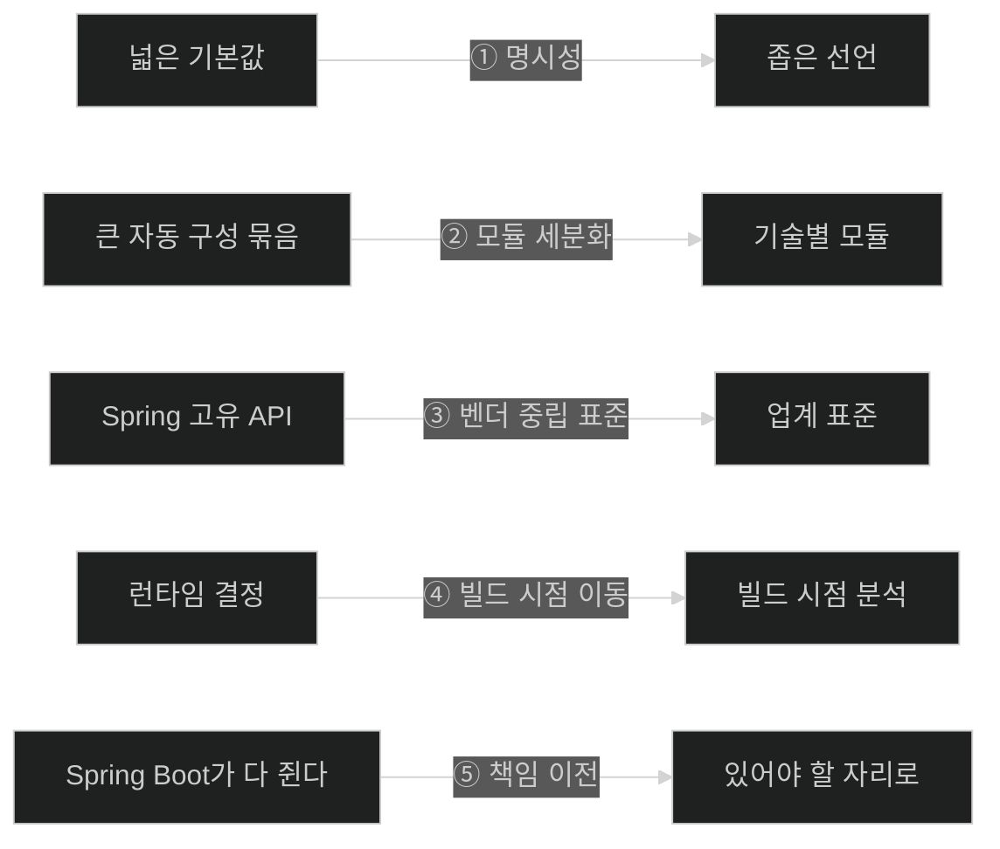

# Chapter 15 개념 지도 — What's New in Spring Boot 4

> 이 Chapter는 책의 마지막 장이며 성격이 다른 장이다. 개념을 전개하지 않고 **변경 사항을 카탈로그로 나열**한다. 그래서 이 폴더에는 노트가 **하나뿐**이다 — 절 단위로 쪼개면 34개 항목을 관통하는 방향이 오히려 안 보이기 때문이다. 원문 누락 여부는 [[_coverage]]에서 추적한다.

## 이 Chapter를 읽는 법

| | 내용 |
|---|---|
| 유일한 노트 | [[01-whats-new-in-spring-boot-4]] |
| 원문 범위 | 책 pp. 469–492 / PDF pp. 494–517 |
| 원문 구조 | 9개 영역 · 34개 하위 절 · Note 40개 · **코드 리스팅 0개 · 이미지 0개** |
| 읽는 순서 | 처음에는 §1(변경의 네 성격)과 §2.10(다섯 방향)만 읽어도 된다. §2.1–2.9는 **필요할 때 찾아보는 참조 구간**이다. |
| 이 장만 읽으면 되나 | 아니다. 각 항목의 실습은 해당 Chapter에 있다 (축 3) |

## 축 1: 34개 변경을 관통하는 다섯 방향

이 축의 질문은 **"Spring Boot 4는 어느 쪽으로 움직였는가?"**다. 항목을 외우는 대신 방향을 알면 처음 보는 변경도 예측할 수 있다.



| 방향 | 대표 예 |
|---|---|
| ① 명시성 | `starter-web`→`starter-webmvc`, `@SpringBootTest`의 웹 테스트 opt-in, Flyway 전용 스타터, MongoDB UUID·BigDecimal 표현 |
| ② 모듈 세분화 | `spring-boot-persistence`, 기술별 test starter, OTel 전용 스타터, `spring-boot-h2console` |
| ③ 벤더 중립 표준 | JSpecify, Framework 재시도, `@MockitoBean`, Observation API, OpenTelemetry |
| ④ 빌드 시점 이동 | `BeanRegistrar`, AOT 처리, AOT Cache, 네이티브 이미지 |
| ⑤ 책임 이전 | Session Hazelcast·MongoDB → 각 벤더, Kafka Streams 커스터마이저 → Spring Kafka |

⑤에는 **역방향 예외가 하나** 있다 — Spring Authorization Server는 밖에서 Spring Security **안으로** 들어왔다. 그래서 ⑤의 정확한 이름은 "덜어낸다"가 아니라 **"있어야 할 자리로 보낸다"**다.

## 축 2: 변경 성격 × 발견 시점 — 업그레이드 위험도

이 축의 질문은 **"이 변경은 언제 나를 물어뜯는가?"**다. 대응 전략이 여기서 갈린다.

| 성격 | 발견 시점 | 대응 | 이 장의 예 |
|---|---|---|---|
| 이름이 바뀜 | 빌드 | 기계적 치환 | `starter-web`, `@MockBean`, Jackson 패키지, Testcontainers 좌표 |
| 기능이 제거됨 | 빌드 또는 시작 | 대체재로 이전 | Undertow, Spock, 실행 스크립트, Session Hazelcast·MongoDB, Pulsar reactive |
| **기본값이 바뀜** | **운영 중** | **명시적으로 켠다** | `@SpringBootTest` 웹 테스트, Batch 인메모리, LiveReload, health probes, SSL 만료 상태 |
| 새 기능 | 안 써도 무방 | 필요할 때 도입 | `BeanRegistrar`, `JmsClient`, OTel starter, AOT Cache, `RestTestClient` |

**세 번째 줄이 이 Chapter를 읽는 이유다.** 나머지 셋은 도구가 알려 주지만 이것만은 알려 주지 않는다. 그래서 책이 `spring-boot-properties-migrator`를 첫 수로 제시하고, 이 노트가 §1에서 그 위험을 먼저 진단한다.

## 축 3: 어느 변경이 이 책의 어느 Chapter와 짝인가

이 축의 질문은 **"이 변경을 실제로 써 보려면 어디로 가야 하는가?"**다. 원문 Note 15개가 밝히는 대응이며, 상세 표는 [[_coverage]] §4에 있다.

| 영역 | 이 책에서 실습하는 곳 |
|---|---|
| 스타터 재구성 | Chapter 1 · 포트폴리오 컴포넌트 |
| JSpecify · API 버전 관리 | Chapter 2 · 웹과 API |
| 영속성 모듈 · Hibernate 7 | Chapter 3 · 데이터 조회 |
| 보안 (OAuth 2.1) | Chapter 4 |
| Mockito 오버라이드 · 웹 테스트 · Testcontainers | Chapter 5 |
| GraalVM · AOT Cache | Chapter 8 |
| HTTP 서비스 클라이언트 · TaskDecorator | Chapter 11 |
| 재시도 · Kafka Streams | Chapter 12 |
| OpenTelemetry · health probes | Chapter 13 |
| RestTestClient | **없음 — 책이 다루지 않는다고 명시** |

**이 표를 노트로 쪼개지 않은 이유**가 여기 있다. 대응은 1:1이 아니다 — 한 Chapter가 여러 영역과 얽히고(Chapter 2가 코어와 웹 양쪽), 어떤 항목은 대응하는 Chapter가 아예 없다. 표 하나로 두는 편이 정확하다.

## 축 4: 실제로 업그레이드한다면 어떤 순서인가

이 축의 질문은 **"무엇부터 하는가?"**다. 축 2의 위험도 순서를 실행 순서로 뒤집은 것이다.

```text
  ① 준비          spring-boot-properties-migrator 를 빌드에 넣고 한 번 띄운다
                   → 프로퍼티 관련 "조용한 변경"을 시작 시점으로 끌어올린다

  ② 빌드 통과      좌표·패키지·애노테이션 이름을 기계적으로 치환한다
                   starter-web→webmvc · Jackson 패키지 · @MockBean→@MockitoBean
                   Testcontainers 좌표 · @EntityScan import

  ③ 제거 대응      Undertow · Spock · Session Hazelcast/MongoDB · Pulsar reactive
                   → 대체재를 고르거나 의존성을 직접 관리한다

  ④ 조용한 변경    축 2의 세 번째 줄을 목록으로 만들어 하나씩 확인한다
     확인          Batch 메타데이터 영속성 · 통합 테스트의 MockMvc
                   health probes 노출 · SSL 만료 경보 · LiveReload

  ⑤ 정리          classic starter 를 썼다면 집중형 스타터로 되돌린다
                   → 여기까지 해야 Boot 4 가 만든 명시성을 실제로 얻는다

  ▶ ⑤를 건너뛰면 "빌드는 통과했지만 Boot 3 처럼 쓰는" 상태로 굳는다.
  ▶ 책이 classic starter 를 "임시"라고 두 번 강조하는 이유다.
```

## 이름으로 원리를 기억하기

| 이름 | 이름이 붙은 이유 | 기억할 경계 |
|---|---|---|
| Jakarta EE | Java EE가 Eclipse로 이관되며 상표 문제로 개명 | 그래서 `javax.*` → `jakarta.*`가 통째로 바뀐다 |
| JSpecify | Java + specify — **명세한다** | 애노테이션은 정보일 뿐, 강제는 검사 도구의 몫 |
| webmvc / webflux | 이름에 **어느 스택인지** 박았다 | `web`이 사라진 것은 모호했기 때문이다 |
| classic starter | "예전 방식" | 사용 중단이 아니라 **의도된 임시 수단** |
| liveness / readiness | "살아 있는가" / "받을 준비가 됐는가" | 두 질문의 답이 다를 수 있어 따로 있다 |
| AOT | Ahead-of-Time — **미리** | 이 책에 세 종류가 나온다 (네이티브·캐시·Spring Data repository) |
| AOT Cache | 캐시 — **다시 쓰려고 적어 둔 것** | 학습 실행이 대표적이지 않으면 효과가 없다 |
| Observation | 관측 — **한 번 알리면 여러 곳으로** | 메트릭과 트레이스를 따로 계측하지 않게 한다 |
| properties-migrator | 프로퍼티를 **옮겨 준다**기보다 **찾아 준다** | 자동으로 고쳐 주지 않는다 — 보고할 뿐이다 |

## 이 Chapter의 성격이 다른 점

| | Chapter 1–3 | Chapter 15 |
|---|---|---|
| 원문의 목적 | 개념을 전개한다 | **변경을 나열한다** |
| 코드 리스팅 | 많다 | **없다** |
| Tip/Note의 성격 | 개념 보충·함정 경고 | **교차 참조와 공식 문서 링크** |
| 노트 분할 | 하위 절 단위 | **챕터 단위 하나** |
| 읽는 방식 | 순서대로 | §1·§2.10 먼저, 나머지는 참조 |
| 유효기간 | 개념은 오래간다 | **버전에 묶인다** |

마지막 줄이 이 Chapter를 읽을 때 가장 중요한 태도다. "Testcontainers 2.x", "GraalVM 25 이상", "Kotlin 2.2 이상"은 **집필 시점의 사실**이며, 실제 업그레이드 때는 공식 Migration Guide를 1차 근거로 삼아야 한다.

## 나의 취약 엣지

- 아직 Chapter 15 인출 연습을 시작하지 않았으므로 실제 stall 기반 취약 엣지는 기록하지 않았다.
- 이후 막힘은 [[../../_global/gaps|전역 gaps]]에 `chapter-15-whats-new-in-spring-boot-4` 카테고리로 추가한다.
- 우선 확인 후보(현재 "약점"이 아니라 읽을 때 구분해야 할 경계): 사용 중단 vs 제거, 세 가지 AOT, `spring.mongodb.*` vs `spring.data.mongodb.*`, liveness vs readiness, 집중형 스타터 vs 클래식 스타터, 이름 변경 vs 기본값 변경.

## 관련 Chapter

- [[../../part-1-the-basics-of-spring-boot/chapter-1-core-features-of-spring-boot/_map|Chapter 1 · Core Features]] — 스타터·자동 구성·의존성 관리가 이 장의 ①②⑤ 방향으로 어떻게 재편됐는지 대조한다.
- [[../../part-2-creating-an-application-with-spring-boot/chapter-2-creating-web-and-api-applications-with-spring-boot/_map|Chapter 2 · Web and API]] — JSpecify와 API 버전 관리, `starter-webmvc`의 실습이 전부 그쪽에 있다.
- [[../../part-2-creating-an-application-with-spring-boot/chapter-3-querying-for-data-with-spring-boot/_map|Chapter 3 · Querying for Data]] — `spring-boot-persistence`, H2 모듈 분리, Spring Data AOT repository가 그쪽에서 다뤄진다.
