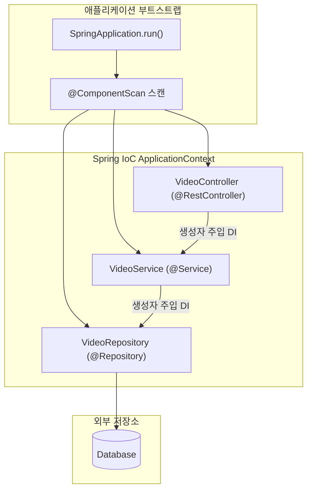

# Spring Boot 아키텍처와 IoC 컨테이너

## 한눈에 보기
| 개념 | 핵심 정의 | 해결하는 문제 |
|------|-----------|---------------|
| ApplicationContext | 빈의 생성과 의존관계를 관리하는 중앙 컨테이너 | 객체 간 결합도를 낮추고 환경별 교체를 단순화 |
| IoC (제어의 역전) | 객체 생성의 주도권이 개발자 코드에서 프레임워크로 역전됨 | `new` 연산자로 인한 하드코딩 및 테스트 불가능성 해결 |
| DI (의존성 주입) | 컨테이너가 완성된 협력 객체를 생성자를 통해 꽂아줌 | 코드 수정 없이 Mock/대체 구현체로 교체 가능 |

## 1. 왜 이게 필요한가

### 이런 상황을 상상해 보자
도서 관리 시스템에서 책 정보를 조회하는 `BookService`를 만든다고 하자. 데이터베이스와 통신하여 책 데이터를 가져와야 하므로, 흔히 아래와 같이 작성한다.

```java
public class BookService {
    private BookRepository bookRepository = new DatabaseBookRepository();

    public Book findBook(Long id) {
        return bookRepository.findById(id);
    }
}
```

`BookService`가 제 역할을 하려면 `BookRepository`라는 협력자가 반드시 존재해야 한다. 이처럼 내가 일하기 위해 꼭 필요한 다른 객체를 **[[의존성]]**(= 어떤 객체가 동작하기 위해 반드시 필요한 협력 대상 객체)이라 부른다. 지금 코드에서는 `BookService`가 자기 의존성인 `DatabaseBookRepository`를 코드 내부에서 직접 `new` 연산자로 찍어내고 있다.

### 여기서 뭐가 무너지나
첫째, **테스트가 불가능해진다.** `BookService`의 비즈니스 로직만 빠르게 검증하고 싶은데, `new DatabaseBookRepository()`가 코드 안에 단단히 박혀 있어 실제 DB 서버가 켜져 있지 않으면 단위 테스트를 실행할 수 없다. 가짜 테스트용 객체(Mock)로 교체할 틈새가 아예 없다.

둘째, **환경 전환의 비용이 커진다.** 로컬 개발 환경에서는 가벼운 인메모리 저장소를 쓰고, 운영 클라우드 환경에서는 고성능 커넥션 풀을 써야 한다고 하자. `new`를 직접 호출하면 구현 클래스를 바꿀 때마다 `BookService` 소스 코드를 열어 수정하고 다시 컴파일해야 한다. 클래스가 수백 개로 늘어나면 이 작업은 재앙이 된다.

### 그래서 나온 생각
객체가 자기 의존성을 직접 만들지 말고, "누군가 밖에서 완성된 부품을 만들어서 건네주게 하자"는 발상이 나왔다. 객체 생성과 조립의 주도권을 개발자의 `new` 호출에서 외부 프레임워크로 넘기는 원칙을 **[[제어의-역전]]**(= 객체 제어 권한이 호출자 코드에서 외부 프레임워크로 뒤집히는 설계 원칙)이라 하고, 그 외부 관리 주체를 **[[컨테이너]]**(= 빈들을 생성하고 생명주기를 관장하는 프레임워크 엔진, Spring의 `ApplicationContext`)라 부른다.

그리고 컨테이너가 관리하는 객체를 **[[빈]]**(= 컨테이너가 생성·조립·보관하는 자바 객체)이라 하며, 완성된 빈을 생성자를 통해 객체에 전달해 주는 구체적인 행위를 **[[의존성-주입]]**(= 필요한 객체를 직접 생성하지 않고 외부 컨테이너로부터 주입받는 기법)이라 한다.

쉽게 비유하자면, 자동차를 조립할 때 엔진 기사가 엔진 부품 공장까지 직접 찾아가서 쇳물을 붓고 깎는 것이 아니라, 완성된 엔진을 조립 라인에서 건네받아 차체에 볼트로 체결만 하는 것과 같다. `BookService`는 이제 부품을 조립하는 장소일 뿐, 부품을 생산하는 공장이 아니다.

→ 비유가 깨지는 지점: 실제 자동차 부품은 한 번 조립하고 나면 공장과의 연결이 완전히 끝나지만, 스프링 컨테이너가 관리하는 빈은 주입된 이후에도 초기화 콜백, 스코프 관리, 트랜잭션 프록시 적용, 애플리케이션 종료 시 소멸 콜백까지 생명주기 전체를 컨테이너가 지속적으로 제어한다. "체결 후 단절"이 아니라 "생애 주기 전반의 지속적 관리"라는 점에서 단순 부품 비유는 멈춘다.

## 2. 어떻게 동작하는가
1. **클래스패스 탐색 (스캔)**: 스프링 부트 애플리케이션이 기동되면 컨테이너는 패키지를 탐색하여 `@Component`, `@Service`, `@Repository`, `@Controller` 등이 붙은 클래스들을 찾아낸다. 이 자동 등록 체계를 **[[컴포넌트-스캔]]**(= 어노테이션이 붙은 클래스를 찾아 빈으로 자동 등록하는 메커니즘)이라 한다 — 개발자가 수백 개의 객체 목록을 XML이나 설정 코드로 일일이 타이핑하지 않기 위해서다.
2. **빈 인스턴스 생성 및 의존성 주입 (DI)**: 컨테이너는 의존성 그래프를 분석하여 먼저 필요한 하위 빈(`BookRepository`)을 인스턴스화한 뒤, 상위 빈(`BookService`)의 생성자를 호출하며 주입한다 — 비즈니스 코드에서 `new`를 완전히 없애고 결합도를 느슨하게 만들기 위해서다.
3. **초기화 및 생명주기 관리**: 빈이 생성되고 의존성이 모두 주입되면, 컨테이너는 `@PostConstruct`나 초기화 인터페이스를 호출해 준비를 마친다. 이 생성부터 소멸까지의 전 과정을 빈의 **[[생명주기]]**(= 객체가 생성되어 쓰이다가 소멸하기까지 거치는 단계)라 한다 — 리소스 연결과 해제를 개발자가 누락 없이 안전하게 처리하기 위해서다.

## 3. 그림으로 보기



## 4. 이 노트에 나온 용어
| 용어 | 한 줄 풀이 | 용어집 링크 |
|------|------------|-------------|
| 의존성 | 어떤 객체가 제 역할을 하기 위해 반드시 필요한 협력 대상 객체 | [[_glossary#의존성]] |
| 빈 | 스프링 컨테이너가 생성·조립·보관하는 자바 객체 | [[_glossary#빈]] |
| 컨테이너 | 빈을 생성하고 의존관계를 연결하며 생명주기를 관장하는 주체 (ApplicationContext) | [[_glossary#컨테이너]] |
| 제어의-역전 | 객체 생성 및 결합의 주도권이 개발자 코드에서 프레임워크로 넘어간 설계 원칙 | [[_glossary#제어의-역전]] |
| 의존성-주입 | 컨테이너가 객체 생성 시 필요한 의존 객체를 전달(주입)해주는 IoC 구현 기법 | [[_glossary#의존성-주입]] |
| 생명주기 | 객체가 생성되어 초기화되고 동작하다 소멸하기까지 거치는 전 단계 | [[_glossary#생명주기]] |
| 컴포넌트-스캔 | 어노테이션이 부여된 클래스를 컨테이너가 자동으로 찾아 빈으로 등록하는 방식 | [[_glossary#컴포넌트-스캔]] |

## 5. 자주 헷갈리는 것
- **IoC vs DI**: IoC는 "프레임워크가 흐름을 제어한다"는 상위 설계 철학/원칙(Principle)이고, DI는 그 철학을 바탕으로 "의존 객체를 외부에서 주입해 준다"는 구체적인 디자인 패턴(Pattern)이다.
- **BeanFactory vs ApplicationContext**: `BeanFactory`는 빈의 생성과 주입만 담당하는 가장 단순한 기본 컨테이너 인터페이스이며, `ApplicationContext`는 `BeanFactory`를 상속받아 이벤트 발행, 국제화(i18n), AOP 통합, 환경 프로필 지원 등을 추가한 실무 표준 엔터프라이즈 컨테이너다.

## 6. 언제 안 쓰나 / 경계
- **순수 유틸리티 함수나 상태가 없는 계산 로직**: `Math.max()`나 단순 문자열 파싱 유틸리티는 컨테이너에 빈으로 등록해 관리할 필요 없이 `static` 메서드로 호출하는 것이 메모리와 기동 속도 면에서 효율적이다.
- **순환 참조(Circular Dependency)**: 객체 A가 B를 필요로 하고 B가 다시 A를 필요로 하는 설계는 컨테이너 초기화 시 생성 순서 모호함(`BeanCurrentlyInCreationException`)을 유발하며, 이는 컨테이너의 문제가 아니라 객체 지향 설계가 잘못되었다는 신호다.

## 7. 연결
- [[02-autoconfiguration-and-conditionals]] — ApplicationContext가 빈을 등록할 때 클래스패스와 프로퍼티 조건을 평가하여 필요한 빈만 자동으로 적재하는 원리로 이어진다.
- [[03-starters-and-dependency-management]] — 컴포넌트 스캔 대상 라이브러리와 의존성 버전 조합을 스타터 단위로 묶어 컨테이너에 공급하는 기초가 된다.

## 8. 스스로 확인
1. `new DatabaseBookRepository()`를 `BookService` 내부에서 직접 호출했을 때, 단위 테스트 작성이 어려워지는 근본적인 이유는 무엇인가?
2. 제어의 역전(IoC)에서 "역전(Inversion)"되었다는 것은 구체적으로 무엇의 권한이 누구에게서 누구로 넘어갔음을 의미하는가?
3. 생성자 주입(Constructor Injection)이 필드 주입(`@Autowired` on field)보다 권장되는 객체 지향적 이유는 무엇인가?

<!-- ==== 아래는 내 영역 · 스킬 수정 금지 ==== -->

## 내 설명 시도

## 막혔던 지점

## 리뷰 이력
