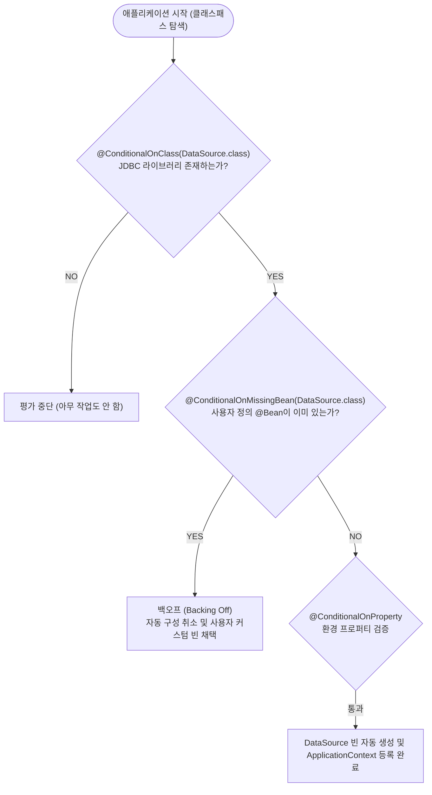

# 모듈화된 자동 구성과 조건부 등록 메커니즘

## 한눈에 보기
| 항목 | Spring Boot 3 이전 | Spring Boot 4 | 핵심 효과 |
|------|-------------------|---------------|-----------|
| 자동 구성 모듈 구조 | 단일 모놀리식 jar (~2.1MB) | 기술별 분리된 경량 모듈 (~369KB 코어) | 불필요한 전이 의존성 및 설정 간섭 원천 차단 |
| 조건부 평가 (`@Conditional`) | 전역적인 조건 평가 | 사용자가 명시한 기술 스택 중심의 조건 평가 | 클래스패스 의도가 명확해지고 기동 속도 최적화 |
| 백오프 (Backing Off) | 사용자 정의 빈 발견 시 자동 빈 철회 | 사용자 정의 빈 발견 시 자동 빈 철회 (동일) | 커스터마이징 시 추가 설정 없이 완벽한 제어권 유지 |

## 1. 왜 이게 필요한가

### 이런 상황을 상상해 보자
새로운 웹 프로젝트를 시작하면서 `build.gradle`에 인메모리 데이터베이스인 `h2` 라이브러리 한 줄만 의존성으로 추가했다.

```groovy
dependencies {
    implementation 'com.h2database:h2'
}
```

그리고 자바 소스 코드에는 데이터베이스 접속 URL(`jdbc:h2:mem:testdb`), 드라이버 클래스 이름, 커넥션 풀을 설정하는 코드를 단 한 줄도 작성하지 않고 애플리케이션을 실행했다. 놀랍게도 스프링 부트는 이미 완벽히 동작하는 `DataSource` 객체를 만들어 메모리에 띄워둔다.

이처럼 라이브러리만 추가하면 프레임워크가 알아서 필요한 인프라 빈을 세팅해 주는 기술을 **[[자동-구성]]**(= 클래스패스의 라이브러리와 설정을 감지하여 기본 빈을 자동 등록해 주는 스프링 부트의 엔진)이라 한다.

### 여기서 뭐가 무너지나
과거 순수 스프링 프레임워크 시절에는 이 간단한 DB 연결 하나를 위해 수십 줄의 XML이나 `@Bean` 설정 클래스를 개발자가 손수 타이핑해야 했다. 프로젝트가 커지면 웹 서버(Tomcat), 뷰 템플릿 엔진, 직렬화기(Jackson), 트랜잭션 관리자 등 수백 개의 보일러플레이트(Boilerplate) 설정 코드가 비즈니스 로직보다 많아지는 역전 현상이 발생했다.

또한 기존 스프링 부트 3까지는 모든 기술의 자동 구성 정책이 `spring-boot-autoconfigure`라는 하나의 거대한 단일 파일(2.1MB)에 통째로 묶여 있었다. 이로 인해 내가 쓰지도 않는 무관한 기술의 설정 로직까지 항상 클래스패스에 로드되어 메모리와 분석 시간을 낭비하는 한계가 있었다.

### 그래서 나온 생각
스프링 부트는 개발자가 빌드 파일에 포함시킨 **[[클래스패스]]**(= 자바 실행 시 클래스와 라이브러리를 탐색하는 경로 목록)를 스캔하여, "특정 라이브러리가 존재할 때만 특정 빈을 만든다"는 **[[조건부-등록]]**(= 라이브러리나 프로퍼티 등 조건이 충족될 때만 선택적으로 빈을 생성하는 메커니즘) 방식을 전면 도입했다.

더 나아가 Spring Boot 4에서는 이 자동 구성 아티팩트를 단일 덩어리가 아니라 기술별로 세분화된 초경량 모듈(`spring-boot-autoconfigure-4.0.0.jar`, 369KB)로 재구성했다.

그리고 개발자가 나중에 "내 입맛에 맞춘 커스텀 DB 커넥션 풀을 직접 만들겠다"며 `@Bean`을 선언하면, 스프링 부트는 자신이 준비했던 기본 빈 생성을 즉시 취소하고 조용히 물러난다. 이 겸손한 양보 정책을 **[[백오프]]**(= 사용자 정의 빈이 존재하면 자동 구성을 철회하고 물러서는 정책)라 부른다.

쉽게 비유하자면, 새로 이사 온 풀옵션 원룸과 같다. 방에 들어가면 세탁기와 냉장고가 이미 기본으로 설치되어 있어서(자동 구성) 바로 생활할 수 있다. 하지만 내가 더 좋은 최신형 냉장고를 직접 사서 들여놓으면(사용자 정의 빈 선언), 건물주는 원래 있던 기본 냉장고를 군말 없이 빼서 창고로 치워준다(백오프).

→ 비유가 깨지는 지점: 원룸 가전제품은 방에 넣고 빼는 데 물리적 운반 비용과 시간이 들지만, 스프링 부트의 백오프는 애플리케이션 기동 시점의 컨텍스트 분석 단계에서 조건부 어노테이션(`@ConditionalOnMissingBean`)을 평가해 밀리초 단위로 생성 자체를 생략하므로 런타임 낭비가 전혀 없다.

## 2. 어떻게 동작하는가
1. **스타터 및 모듈 로딩**: 애플리케이션 시작 시 Spring Boot 4는 기술별 자동 구성 모듈의 메타데이터(`AutoConfiguration.imports`)를 읽어 대상 후보들을 식별한다 — 불필요한 전체 라이브러리 탐색 비용을 줄이고 의도한 기술만 로드하기 위해서다.
2. **클래스패스 조건 검사 (`@ConditionalOnClass`)**: 예를 들어 `DataSourceAutoConfiguration`은 클래스패스에 `javax.sql.DataSource` 인터페이스가 존재하는지 먼저 확인한다 — JDBC 드라이버가 빌드 파일에 없을 때 DB 관련 빈 생성을 시도하다가 에러가 발생하는 것을 방지하기 위해서다.
3. **기존 빈 존재 여부 검사 (`@ConditionalOnMissingBean`)**: 컨테이너 안에 이미 개발자가 정의한 `DataSource` 타입의 **[[빈]]**(= 컨테이너가 관리하는 객체)이 등록되어 있는지 확인한다 — 사용자의 명시적 커스터마이징을 최우선으로 존중하고 프레임워크 빈을 **[[백오프]]**하기 위해서다.
4. **프로퍼티 조건 검사 (`@ConditionalOnProperty`)**: `application.properties`에 특정 설정(예: `spring.datasource.url`)이 있거나 활성화되어 있는지 확인한다 — 환경 설정에 따라 특정 기능(예: 캐시, 메시징)을 켜고 끄기 위해서다.
5. **최종 빈 생성 및 컨테이너 등록**: 모든 조건문이 참(True)으로 평가되면, 내장된 팩토리 메서드가 실행되어 최적화된 빈 인스턴스를 **[[컨테이너]]**(= ApplicationContext)에 등록한다 — 개발자가 인프라 세팅에 신경 쓰지 않고 즉시 비즈니스 개발에 집중하게 만들기 위해서다.

## 3. 그림으로 보기



## 4. 이 노트에 나온 용어
| 용어 | 한 줄 풀이 | 용어집 링크 |
|------|------------|-------------|
| 자동-구성 | 클래스패스와 설정을 감지해 필수 빈을 자동으로 등록해 주는 스프링 부트의 엔진 | [[_glossary#자동-구성]] |
| 조건부-등록 | 클래스패스 유무, 기존 빈 유무 등 조건이 충족될 때만 빈을 생성하는 메커니즘 | [[_glossary#조건부-등록]] |
| 백오프 | 개발자가 직접 정의한 빈이 있으면 자동 구성을 양보하고 물러서는 정책 | [[_glossary#백오프]] |
| 클래스패스 | 자바 런타임이 클래스와 라이브러리 jar 파일을 읽어들이는 탐색 경로 목록 | [[_glossary#클래스패스]] |
| 빈 | 컨테이너가 생성하고 생명주기를 관장하는 자바 객체 | [[_glossary#빈]] |
| 컨테이너 | 빈들의 의존관계를 연결하고 런타임을 관리하는 ApplicationContext | [[_glossary#컨테이너]] |

## 5. 자주 헷갈리는 것
- **컴포넌트 스캔 vs 자동 구성**: 컴포넌트 스캔(`@ComponentScan`)은 내 프로젝트 패키지 안에서 내가 작성한 어노테이션(`@Service`, `@Controller`)을 찾는 것이고, 자동 구성(`@EnableAutoConfiguration`)은 외부 라이브러리(Jar) 안의 인프라 설정 파일들을 분석해 프레임워크 수준의 빈을 조립해 주는 것이다.
- **`@ConditionalOnClass` vs `@ConditionalOnBean`**: `@ConditionalOnClass`는 클래스패스에 특정 바이트코드(`.class` 파일)가 물리적으로 존재하는가를 검사하고, `@ConditionalOnBean`은 스프링 컨테이너 안에 특정 객체 인스턴스가 이미 빈으로 등록되어 있는가를 검사한다.

## 6. 언제 안 쓰나 / 경계
- **자동 구성 제외(Exclude)**: 특수한 환경에서 특정 자동 구성이 원치 않게 동작할 경우(예: DB 연결 없는 테스트에서 DataSourceAutoConfiguration 실행 방지), `@SpringBootApplication(exclude = {DataSourceAutoConfiguration.class})`로 명시적 비활성화해야 한다.
- **순서 의존성 주의**: 자동 구성 클래스 간에 로딩 순서가 중요한 경우 `@AutoConfigureAfter` 또는 `@AutoConfigureBefore`를 명시하지 않으면 빈 미생성 버그가 발생할 수 있다.

## 7. 연결
- [[01-spring-boot-architecture-and-context]] — ApplicationContext 컨테이너가 빈을 조립할 때 자동 구성 정책이 주입 파이프라인의 핵심 공급원이 된다.
- [[03-starters-and-dependency-management]] — 스타터 의존성을 추가함으로써 클래스패스에 특정 라이브러리가 배치되어 자동 구성의 조건부 어노테이션이 활성화된다.

## 8. 스스로 확인
1. Spring Boot 4에서 자동 구성 jar 아티팩트를 단일 파일에서 기술별 경량 모듈로 쪼갠 아키텍처적 이유는 무엇인가?
2. `@ConditionalOnMissingBean`이 스프링 부트 커스터마이징의 핵심인 이유는 무엇이며, 만약 이 어노테이션이 없다면 어떤 문제가 발생하는가?
3. 라이브러리 Jar 파일만 빌드에 넣었을 뿐인데 웹 서버(Tomcat)가 뜨고 DataSource가 잡히는 메커니즘을 30초로 설명할 수 있는가?

<!-- ==== 아래는 내 영역 · 스킬 수정 금지 ==== -->

## 내 설명 시도

## 막혔던 지점

## 리뷰 이력
