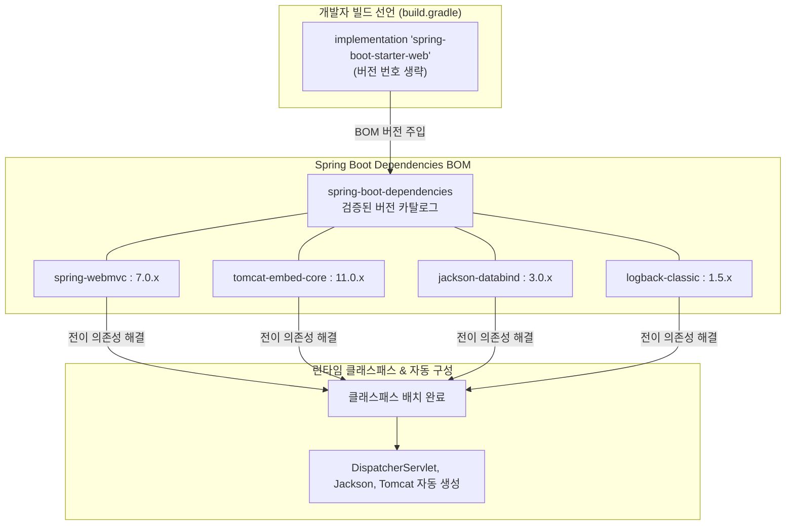

# 스타터 아키텍처와 BOM 의존성 관리

## 한눈에 보기
| 개념 | 역할 | 해결하는 문제 |
|------|------|---------------|
| Spring Boot Starter | 목적별 라이브러리 조합 묶음 (예: `spring-boot-starter-web`) | 수십 개의 연관 jar 라이브러리를 개별 탐색/추가하는 수고 제거 |
| BOM (`spring-boot-dependencies`) | 스프링 생태계 및 서드파티 라이브러리의 검증된 버전 카탈로그 | 라이브러리 간 버전 불일치로 인한 `NoSuchMethodError` 방지 |
| 버전 생략 의존성 선언 | `<version>` 태그 없이 `groupId`와 `artifactId`만 선언 | 스프링 부트 업그레이드 시 전체 하위 라이브러리가 일괄 최적화 |

## 1. 왜 이게 필요한가

### 이런 상황을 상상해 보자
JSON API를 서비스하는 자바 웹 애플리케이션을 새로 만든다고 하자. `build.gradle`이나 `pom.xml`에 아래와 같이 단 한 줄만 선언한다.

```groovy
dependencies {
    implementation 'org.springframework.boot:spring-boot-starter-web'
}
```

빌드를 실행하면 내 프로젝트에 Spring Web, Spring MVC, 내장 톰캣(Tomcat), JSON 변환기(Jackson), 유효성 검증(Hibernate Validator), 로깅(Logback/SLF4J) 등 30개가 넘는 jar 파일이 일사불란하게 다운로드되어 연결된다.

이처럼 특정 목적을 달성하는 데 필요한 모든 라이브러리를 하나로 묶어 제공하는 디펜던시 묶음을 **[[스타터]]**(= 목적별 라이브러리 의존성을 하나로 패키징한 스프링 부트의 의존성 조합)라 부른다.

### 여기서 뭐가 무너지나
과거 스프링 프로젝트에서는 웹 앱 하나를 띄우기 위해 `spring-web`, `spring-webmvc`, `tomcat-embed-core`, `jackson-databind`, `logback-classic` 등을 일일이 찾아 버전 번호를 붙여가며 선언해야 했다.

이때 가장 큰 악몽은 "버전 지옥(Jar Hell)"이었다. 내가 고른 Spring Framework 6.2 버전과 Jackson 2.18 버전, 그리고 Hibernate 6.6 버전이 서로 호환되는지 일일이 릴리스 노트를 뒤져가며 수작업으로 테스트해야 했다. 라이브러리 하나를 업데이트했다가 런타임에 불특정 시점에 `NoSuchMethodError`나 `ClassNotFoundException`이 터지며 서버가 뻗는 일이 비일비재했다.

### 그래서 나온 생각
스프링 팀은 스프링 코어 프레임워크뿐만 아니라 Jackson, Hibernate, Kafka, Netty 등 수백 개의 주요 오픈소스 라이브러리를 전수 테스트하여 완벽히 호환되는 "골든 버전 조합 표"를 미리 만들었다. 이 중앙 집중식 버전 명세서를 **[[빌-오브-머티리얼]]**(= 스프링 부트가 호환성을 사전 검증한 표준 라이브러리 버전 명세서)이라 부른다.

그리고 개발자가 스타터를 가져오면 빌드 도구가 이 BOM을 참조하여 **[[전이-의존성]]**(= 직접 선언한 라이브러리가 내부적으로 필요로 하여 함께 딸려오는 하위 라이브러리)의 버전 번호를 자동으로 통제하는 **[[의존성-관리]]**(= 라이브러리 간 호환 버전을 중앙에서 일관되게 제어하는 빌드 체계)를 수행한다.

쉽게 비유하자면, 밀키트(Meal-kit) 세트와 같다. 된장찌개를 끓이기 위해 마트에서 두부, 호박, 된장, 고춧가루, 멸치육수를 하나하나 유통기한과 궁합을 따져가며 고르는 대신, 검증된 셰프가 최적의 비율로 포장해 둔 "된장찌개 스타터 밀키트"를 장바구니에 담기만 하면 된다.

→ 비유가 깨지는 지점: 밀키트는 내용물을 부분 교체하기 어렵지만, 스프링 부트 스타터는 `exclude` 선언을 통해 특정 전이 의존성(예: Tomcat을 빼고 Jetty나 Undertow로 교체)을 손쉽게 갈아 끼울 수 있는 유연성을 제공한다.

## 2. 어떻게 동작하는가
1. **BOM 부모 상속/플러그인 적용**: 빌드 도구(Gradle의 `io.spring.dependency-management` 또는 Maven의 `spring-boot-starter-parent`)가 스프링 부트의 BOM 메타데이터를 로드한다 — 하위 라이브러리들의 버전 결정권을 프레임워크에 위임하기 위해서다.
2. **스타터 선언 판독**: 개발자가 `spring-boot-starter-*`를 선언하면 빌드 도구는 해당 스타터 내부의 의존성 트리를 펼친다 — 필요한 모든 인프라 jar를 한 번에 가져오기 위해서다.
3. **버전 자동 주입**: 각 하위 라이브러리에 명시적 버전 태그가 없더라도, BOM에 기록된 검증된 버전 숫자를 찾아 자동으로 주입한다 — 개발자가 버전 충돌 위험을 신경 쓰지 않게 하기 위해서다.
4. **클래스패스 배치 및 자동 구성 트리거**: 다운로드된 모든 jar가 **[[클래스패스]]**(= 자바 실행 탐색 경로)에 배치되면, 스프링 부트의 **[[자동-구성]]**(= 클래스패스를 감지해 빈을 자동 등록하는 엔진)이 이를 인식하고 관련된 빈들을 컨테이너에 올린다 — 별도의 XML/Java 설정 없이 즉시 기능이 활성화되도록 하기 위해서다.

## 3. 그림으로 보기



## 4. 이 노트에 나온 용어
| 용어 | 한 줄 풀이 | 용어집 링크 |
|------|------------|-------------|
| 스타터 | 특정 기술 스택에 필요한 라이브러리들을 하나로 묶은 의존성 패키지 | [[_glossary#스타터]] |
| 의존성-관리 | 라이브러리 간 호환 버전을 중앙에서 일관되게 제어하는 빌드 체계 | [[_glossary#의존성-관리]] |
| 빌-오브-머티리얼 | 호환성이 검증된 수백 개 라이브러리의 표준 버전 카탈로그 (BOM) | [[_glossary#빌-오브-머티리얼]] |
| 전이-의존성 | 내가 선언한 라이브러리가 내부적으로 필요로 하여 함께 딸려오는 하위 라이브러리 | [[_glossary#전이-의존성]] |
| 클래스패스 | JVM이 클래스와 jar 라이브러리를 탐색하는 경로 목록 | [[_glossary#클래스패스]] |
| 자동-구성 | 클래스패스에 놓인 라이브러리를 감지해 빈을 자동 조립하는 엔진 | [[_glossary#자동-구성]] |

## 5. 자주 헷갈리는 것
- **스타터 Jar 자체의 실체**: `spring-boot-starter-web` 같은 스타터 jar 파일 내부에는 실제 자바 실행 코드(`.class`)가 거의 없다. 단지 다른 수많은 실제 라이브러리들을 엮어주는 의존성 기술 명세서(pom.xml 메타데이터) 역할을 주로 한다.
- **버전 오버라이드 방법**: 특정 보안 패치 등으로 인해 BOM이 정한 라이브러리 버전을 긴급 변경해야 할 때는, Gradle의 `ext['tomcat.version'] = '11.0.5'`처럼 프로퍼티만 재정의하면 된다.

## 6. 언제 안 쓰나 / 경계
- **불필요한 무거운 스타터 남용**: 단순 CLI 스크립트나 배치 작업에 습관적으로 `spring-boot-starter-web`을 넣으면 톰캣 내장 서버가 함께 기동되어 자원을 낭비하므로, 목적에 맞는 최소한의 스타터(`spring-boot-starter`)만 선택해야 한다.

## 7. 연결
- [[01-spring-boot-architecture-and-context]] — 스타터가 가져온 수많은 클래스들이 컨테이너의 빈으로 등록되는 기반을 형성한다.
- [[02-autoconfiguration-and-conditionals]] — 스타터에 의해 클래스패스에 배치된 클래스들을 감지하여 자동 구성 조건 어노테이션이 활성화된다.

## 8. 스스로 확인
1. `build.gradle`에서 라이브러리를 추가할 때 버전 번호를 명시하지 않는 것이 오히려 더 안전한 이유는 무엇인가?
2. 스타터(Starter)와 BOM(Bill of Materials)은 각각 의존성 해결 과정에서 어떤 역할을 분담하는가?
3. 내가 선언하지 않은 Jackson 라이브러리가 내 프로젝트에서 동작하는 전이 의존성 원리를 설명할 수 있는가?

<!-- ==== 아래는 내 영역 · 스킬 수정 금지 ==== -->

## 내 설명 시도

## 막혔던 지점

## 리뷰 이력
