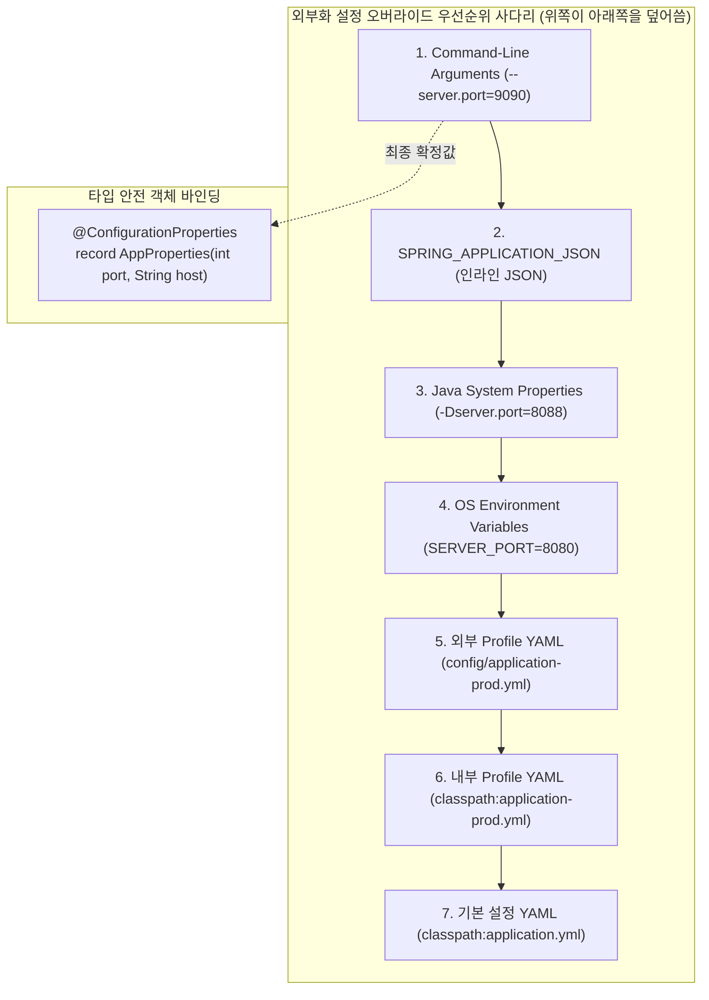

# 외부화 설정과 프로필 및 프로퍼티 우선순위

## 한눈에 보기
| 설정 계층 | 선언 위치 / 방식 | 적용 시점 / 우선순위 |
|-----------|-----------------|---------------------|
| CLI Arguments | `java -jar app.jar --server.port=9090` | 최상위 우선순위 (운영 시 긴급 오버라이드) |
| OS Environment Variables | `export SERVER_PORT=8081` | 컨테이너/클라우드 환경 표준 설정 |
| Profile YAML/Properties | `application-prod.yml` | 프로필 활성화(`spring.profiles.active=prod`) 시 적용 |
| Default YAML/Properties | `application.yml` (Jar 내부) | 기본 기본값 (Fallback) |

## 1. 왜 이게 필요한가

### 이런 상황을 상상해 보자
동영상 스트리밍 서비스에서 결제 게이트웨이의 API URL과 타임아웃 설정을 관리한다고 하자. 결제 서비스 클래스를 아래와 같이 작성했다.

```java
@Service
public class PaymentService {
    private String apiUrl = "https://sandbox.payment.com/api";
    private int timeoutSeconds = 30;
}
```

개발 단계에서는 문제없이 잘 돌아갔다. 하지만 실제 고객의 돈이 결제되는 운영(Production) 환경에 배포하려면 `https://api.payment.com`으로 URL을 바꿔야 한다.

### 여기서 뭐가 무너지나
첫째, **환경이 바뀔 때마다 재컴파일 및 재빌드가 필요하다.** 로컬 개발, QA 테스트, 스테이징, 운영 환경마다 주소가 다른데, URL 하나를 바꾸려고 자바 코드를 고치고 단위 테스트를 다시 돌려 새 Jar 파일을 구워야 한다. "빌드는 한 번만 하고 동일한 산출물을 모든 환경에 배포한다"는 현대 소프트웨어 배포 원칙(12-Factor App)이 완전히 무너진다.

둘째, **보안 사고 위험이 극대화된다.** DB 비밀번호나 API 시크릿 키가 자바 소스 코드에 하드코딩되어 Git 저장소에 커밋되는 순간, 회사 전체의 보안 자산이 유출된다.

셋째, **타입 안전성이 없다.** `@Value("${payment.timeout}")` 문자열 주입 방식을 쓰면, 오타가 나거나 숫자가 아닌 문자가 들어왔을 때 컴파일 타임에 잡지 못하고 런타임에 에러가 터진다.

### 그래서 나온 생각
설정값을 코드 밖으로 분리하는 **[[외부화-설정]]**(= DB 주소나 API 키 등의 설정값을 소스 코드 외부에서 관리하여 재컴파일 없이 환경을 전환하는 메커니즘) 체계를 도입했다.

스프링 부트는 계층형 구조인 YAML이나 프로퍼티 파일의 값들을 타입 세이프한 자바 객체(POJO 또는 Java Record)에 구조적으로 바인딩해 주는 **[[설정-프로퍼티]]**(= 외부 설정값을 타입 세이프한 자바 객체에 자동 주입하는 `@ConfigurationProperties` 체계) 기능을 제공한다.

또한 개발(`dev`), 테스트(`test`), 운영(`prod`) 등 상황별로 다른 설정 묶음을 선택할 수 있는 **[[프로필]]**(= 실행 환경에 따라 서로 다른 설정 파일과 빈을 그룹화하여 활성화하는 체계)을 지원하며, 여러 출처에서 같은 설정이 충돌할 때 명확하게 교통정리를 해주는 **[[오버라이드-우선순위]]**(= CLI, 환경변수, 파일 등 여러 출처의 설정값 중 최종 값을 결정하는 계층적 우선순위)를 정의했다.

쉽게 비유하자면, 스마트폰의 사용자 설정 화면과 같다. 볼륨이나 화면 밝기를 바꾸기 위해 스마트폰 운영체제 코드를 수정하고 롬을 새로 플래싱(재컴파일)하지 않는다. 스마트폰 하드웨어와 앱(Jar)은 그대로 두고, 설정 메뉴(외부 설정 파일)나 볼륨 물리 버튼(CLI 인자)을 눌러 즉시 동작을 바꾼다.

→ 비유가 깨지는 지점: 스마트폰 볼륨은 누르는 즉시 실시간으로 소리가 바뀌지만, 스프링 부트의 기본 프로퍼티 바인딩은 애플리케이션 기동 시점(컨텍스트 로딩 시)에 평가되어 빈에 주입되므로 실행 중인 Jar의 설정을 바꾸려면 원칙적으로 프로세스를 재시작해야 한다(Spring Cloud Config 갱신 제외).

## 2. 어떻게 동작하는가
1. **외부 설정 소스 수집**: 애플리케이션 시작 시 스프링 부트는 시스템 프로퍼티, OS 환경 변수, `application.yml`, 프로필별 설정 등 모든 출처의 프로퍼티 소스를 하나의 `Environment` 객체로 취합한다 — 모든 설정값을 단일 조회 창구로 통합하기 위해서다.
2. **우선순위 기반 병합**: 동일한 키(예: `server.port`)가 여러 곳에 존재하면 정의된 **[[오버라이드-우선순위]]** 규칙에 따라 더 높은 계층의 값(CLI > 환경변수 > 파일)으로 덮어쓴다 — 운영 환경에서 긴급하게 설정을 덮어씌울 수 있는 통제권을 제공하기 위해서다.
3. **타입 변환 및 유효성 검증 바인딩**: 취합된 문자열 값들을 `@ConfigurationProperties`가 선언된 클래스/레코드의 타입(`int`, `Duration`, `URL` 등)에 맞게 변환하고 `@Validated` 규칙(예: `@Min(1)`, `@NotNull`)을 검증한다 — 잘못된 설정값으로 인한 런타임 장애를 기동 시점에 원천 차단하기 위해서다.
4. **컨테이너 빈 주입**: 검증이 완료된 불변 설정 객체를 **[[컨테이너]]**(= ApplicationContext)에 **[[빈]]**(= 컨테이너가 관리하는 객체)으로 등록하여 비즈니스 서비스에 주입한다 — 개발자가 안전하게 타입 세이프한 메서드로 설정값에 접근할 수 있게 하기 위해서다.

## 3. 그림으로 보기



## 4. 이 노트에 나온 용어
| 용어 | 한 줄 풀이 | 용어집 링크 |
|------|------------|-------------|
| 설정-프로퍼티 | 외부 설정을 타입 세이프한 자바 객체에 바인딩하는 스프링 부트의 설정 주입 체계 | [[_glossary#설정-프로퍼티]] |
| 외부화-설정 | 설정값을 코드 외부로 분리하여 재빌드 없이 환경을 전환하는 메커니즘 | [[_glossary#외부화-설정]] |
| 프로필 | dev, test, prod 등 실행 환경에 따라 설정과 빈을 분기하는 환경 격리 체계 | [[_glossary#프로필]] |
| 오버라이드-우선순위 | 동일한 설정 키가 충돌할 때 어떤 출처의 값을 최종 채택할지 결정하는 순서 | [[_glossary#오버라이드-우선순위]] |
| 빈 | 스프링 컨테이너가 생성하고 주입해 주는 관리 객체 | [[_glossary#빈]] |
| 컨테이너 | 애플리케이션 컴포넌트와 설정을 총괄하는 ApplicationContext | [[_glossary#컨테이너]] |

## 5. 자주 헷갈리는 것
- **`@Value` vs `@ConfigurationProperties`**: `@Value`는 단일 문자열을 SpEL(Spring Expression Language)과 함께 주입할 때 유용하지만 메타데이터 자동완성이나 유효성 검증이 어렵다. 반면 `@ConfigurationProperties`는 계층적 프로퍼티를 타입 세이프한 객체/레코드로 묶어서 IDE 자동완성과 프로덕션 검증을 완벽히 지원한다.
- **Relayed Naming (느슨한 바인딩, Relaxed Binding)**: `my.app.database-url`, `my.app.databaseUrl`, `MY_APP_DATABASEURL`은 표기법(kebab-case, camelCase, UPPER_CASE)이 달라도 스프링 부트가 동일한 프로퍼티로 인식하여 매핑해 준다.

## 6. 언제 안 쓰나 / 경계
- **빈번하게 변경되는 런타임 동적 파라미터**: 사용자의 실시간 요청에 따라 초 단위로 바뀌는 값(예: 특정 유저의 세션 상태)은 외부화 설정 프로퍼티의 대상이 아니며, DB나 캐시(Redis)에 저장해야 한다.

## 7. 연결
- [[01-spring-boot-architecture-and-context]] — 설정 프로퍼티 객체 역시 컨테이너의 빈으로 등록되어 다른 비즈니스 서비스에 DI 주입된다.
- [[02-autoconfiguration-and-conditionals]] — `@ConditionalOnProperty` 어노테이션이 외부화 설정값을 평가하여 특정 빈의 활성화 여부를 결정한다.

## 8. 스스로 확인
1. 동일한 Jar 파일을 수정 없이 로컬 개발 머신과 운영 쿠버네티스 클러스터에서 서로 다른 DB로 실행할 수 있는 원리는 무엇인가?
2. `application.yml`에 적힌 포트 번호보다 커맨드라인 `--server.port=9090` 인자가 우선 적용되는 이유는 무엇인가?
3. Java Record와 `@ConfigurationProperties`를 결합했을 때 얻을 수 있는 불변성(Immutability)과 타입 안전성(Type Safety)의 이점은 무엇인가?

<!-- ==== 아래는 내 영역 · 스킬 수정 금지 ==== -->

## 내 설명 시도

## 막혔던 지점

## 리뷰 이력
