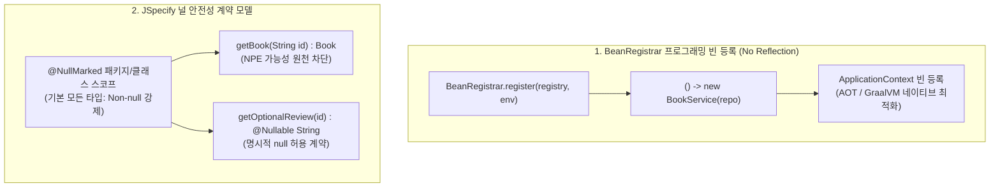

# BeanRegistrar 프로그래밍 빈 등록과 JSpecify 널 안전성

## 한눈에 보기
| 항목 | 기존 방식 (Spring Boot 3 이전) | Spring Boot 4 방식 | 핵심 효과 |
|------|--------------------------------|-------------------|-----------|
| 빈 등록 패러다임 | 리플렉션 기반 `@Configuration` + `@Bean` | 함수형 `BeanRegistrar` 인터페이스 구현 | AOT 사전 컴파일 최적화, 밀리초 단위 빠른 기동 |
| 널 안전성 표준 | 벤더별 제각각 어노테이션 (`javax.annotation`, Spring `@NonNullApi`) | 표준 JSpecify (`@NullMarked`, `@Nullable`) 전면 도입 | IDE 및 컴파일 타임 NPE 완벽 예방, 코틀린 100% 호환 |

## 1. 왜 이게 필요한가

### 이런 상황을 상상해 보자
고성능 서버리스(Serverless) 함수나 클라우드 네이티브 마이크로서비스를 구축하면서 수백 개의 컴포넌트를 등록하고 있다. 또한 메서드 간 호출에서 `null` 값으로 인한 예기치 못한 장애를 방어하려 한다.

```java
public class UserService {
    public User findUser(String id) {
        // id가 null로 들어오면? 반환값이 null일 수 있나?
        return userRepository.findById(id).orElse(null);
    }
}
```

기존 스프링에서는 `@Configuration` 클래스에 수십 개의 `@Bean` 메서드를 선언하거나, 패키지 수준의 어노테이션이 제각각 흩어져 있어 컴파일러가 `NullPointerException` 위험을 사전에 잡아주지 못했다.

### 여기서 뭐가 무너지나
첫째, **런타임 리플렉션 오버헤드와 AOT 변환의 복잡성이다.** 전통적인 `@Bean`이나 `@Component` 방식은 애플리케이션 시작 시점에 JVM 리플렉션을 통해 모든 클래스의 어노테이션과 메서드 시그니처를 스캔한다. 이는 기동 시간을 지연시키며, GraalVM 네이티브 이미지 빌드 시 수많은 리플렉션 힌트 메타데이터를 수작업으로 등록해야 하는 원인이 된다.

둘째, **런타임 `NullPointerException` (NPE)의 공포다.** 자바는 기본적으로 모든 참조 타입에 `null`이 들어갈 수 있다. 팀원마다 `javax.annotation.Nullable`, `org.springframework.lang.Nullable`, `jakarta.annotation.Nullable` 등 서로 다른 라이브러리의 어노테이션을 혼용하여 정적 분석 도구와 IDE가 널 가능성을 일관되게 검사하지 못했다.

### 그래서 나온 생각
Spring Boot 4에서는 리플렉션 없이 람다와 순수 자바 코드로 빈을 직접 컨테이너에 등록하는 **[[프로그래밍-빈-등록]]**(= 어노테이션 리플렉션 없이 함수형 코드로 직접 빈을 등록하는 고성능 방식, `BeanRegistrar`)을 1급 시민으로 지원하기 시작했다. 이 방식은 **[[사전-컴파일]]**(= 기동 전에 코드를 미리 분석해 네이티브 머신 코드로 굽는 AOT 컴파일) 시점에 정적으로 완벽히 분석되어 기동 속도를 극대화한다.

동시에 자바 표준 진영이 통합 합의한 차세대 표준 **[[제이스펙]]**(= 자바 업계가 합의한 표준 널 안전성 어노테이션 규격, `org.jspecify.annotations`)을 프레임워크 전반에 전면 채택하여, 컴파일 타임에 완벽한 **[[널-안전성]]**(= 런타임 NPE를 방지하기 위해 널 허용 여부를 컴파일 타임에 강제하는 체계)을 달성했다.

쉽게 비유하자면, 서류 심사(리플렉션)를 거쳐서 매번 자격증을 확인하는 대신, 이미 지문 등록(프로그래밍 빈 등록)이 끝난 고속 통과 게이트를 지나는 것과 같다. 그리고 도로의 차선 규격이 동네마다 달랐던 것을 전 세계 표준 규격 신호등(JSpecify)으로 통일하여 사각지대 사고(NPE)를 없앤 것이다.

→ 비유가 깨지는 지점: 지문 등록은 초기에 사용자가 손수 지문을 스캐너에 등록해야 하는 물리적 단계가 있지만, 스프링의 `BeanRegistrar`는 한 번 자바 코드로 작성해 두면 컴파일러가 바이트코드 수준에서 완전히 인지하여 무비용으로 영구 작동한다.

## 2. 어떻게 동작하는가
1. **BeanRegistrar 인터페이스 구현**: 개발자는 `BeanRegistrar`를 구현하여 `register(BeanRegistry registry, Environment env)` 메서드 안에서 람다 공급자(Supplier)로 빈을 등록한다 — 리플렉션 탐색 비용 없이 컨테이너에 직접 객체를 주입하기 위해서다.
2. **AOT 정적 분석 및 컨테이너 적재**: 프레임워크는 런타임 어노테이션 해석을 생략하고, 등록된 람다 코드를 다이렉트로 실행하여 **[[컨테이너]]**(= ApplicationContext)에 **[[빈]]**(= 컨테이너 관리 객체)을 생성한다 — 서버 기동 시간과 메모리 풋프린트를 최소화하기 위해서다.
3. **`@NullMarked` 스코프 선언**: 패키지(`package-info.java`)나 클래스 상단에 `@NullMarked`를 선언하면, 그 범위 안의 모든 파라미터와 반환값은 기본적으로 "절대 null이 될 수 없음(Non-null)"으로 선언된다 — 불필요한 `null` 방어 코드를 수백 번 반복 작성하지 않기 위해서다.
4. **`@Nullable` 예외 명시 및 IDE 검증**: 오직 null이 반환될 수 있는 특정 지점에만 명시적으로 `@Nullable`을 선언한다 — 개발 툴과 컴파일러가 잠재적 NPE 가능 지점을 실시간 경고로 잡아내게 하기 위해서다.

## 3. 그림으로 보기



## 4. 이 노트에 나온 용어
| 용어 | 한 줄 풀이 | 용어집 링크 |
|------|------------|-------------|
| 프로그래밍-빈-등록 | 리플렉션 없이 함수형 람다 코드로 직접 빈을 등록하는 고성능 방식 | [[_glossary#프로그래밍-빈-등록]] |
| 널-안전성 | 런타임 NPE를 방지하기 위해 널 허용 여부를 컴파일 타임에 강제하는 체계 | [[_glossary#널-안전성]] |
| 제이스펙 | 자바 진영 표준 널 어노테이션 규격 (`org.jspecify.annotations`) | [[_glossary#제이스펙]] |
| 사전-컴파일 | 기동 전 코드를 미리 분석해 네이티브 머신 코드로 빌드하는 AOT 컴파일 | [[_glossary#사전-컴파일]] |
| 빈 | 스프링 컨테이너에 등록되어 생명주기가 관리되는 객체 | [[_glossary#빈]] |
| 컨테이너 | 애플리케이션 빈들을 총괄하는 ApplicationContext | [[_glossary#컨테이너]] |

## 5. 자주 헷갈리는 것
- **`@NullMarked` vs 기존 `@NonNullApi`**: `@NonNullApi`는 스프링 프레임워크 자체 패키지 전용 비표준 어노테이션이었으나, `@NullMarked`는 구글, 오라클, 젯브레인, 스프링이 공동 합의한 공식 자바 진영 표준(JSpecify) 규격이다.
- **Java `Optional`과의 관계**: `Optional`은 메서드 반환값에서 결과가 없을 수 있음을 표현하는 래퍼 객체이고, JSpecify 어노테이션은 필드, 매개변수, 반환값 전반의 메모리 레퍼런스 자체의 null 허용 여부를 타입 시스템에 알려주는 정적 메타데이터다.

## 6. 언제 안 쓰나 / 경계
- **서드파티 레거시 라이브러리와의 연동**: JSpecify 어노테이션이 적용되지 않은 구형 서드파티 라이브러리(Unannotated code)의 반환값을 다룰 때는 컴파일러가 널 안전성을 보장하지 못하므로 명시적인 `Objects.requireNonNull()` 또는 방어 코드가 여전히 필요하다.

## 7. 연결
- [[01-spring-boot-architecture-and-context]] — 컨테이너가 컴포넌트 스캔 어노테이션 방식과 프로그래밍 방식을 결합하여 빈 팩토리를 완성한다.
- [[02-autoconfiguration-and-conditionals]] — 자동 구성 정책 내부에서도 고성능 AOT 컴파일을 위해 BeanRegistrar 기반 등록 패턴을 점진적으로 확장하고 있다.

## 8. 스스로 확인
1. Spring Boot 4에서 `BeanRegistrar`를 도입하여 얻는 GraalVM AOT 및 기동 성능상의 이점은 무엇인가?
2. `@NullMarked`가 선언된 클래스에서 파라미터로 `null`을 넘기려 할 때 IDE와 컴파일러가 어떻게 반응하는가?
3. 과거 난립하던 널 어노테이션 대신 JSpecify 표준을 전면 채택함으로써 얻는 개발 생태계의 이점은 무엇인가?

<!-- ==== 아래는 내 영역 · 스킬 수정 금지 ==== -->

## 내 설명 시도

## 막혔던 지점

## 리뷰 이력
