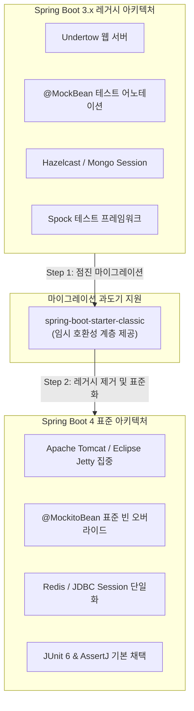

## 한눈에 보기
- Spring Boot 4는 Jakarta EE 11 및 Java 25 시대를 대비하여 과거 레거시 컴포넌트들을 과감히 정리하고 코어를 경량화했다.
- Undertow 웹 서버 지원 제거, Spock 프레임워크 지원 중단, Session 백엔드 정비(Hazelcast/MongoDB 제거 후 Redis 집중), DevTools LiveReload 기본 비활성화 등 주요 파괴적 변경(Breaking Changes)이 단행되었다.
- 기존 Spring Boot 3.x 프로젝트의 중단 없는 전환을 위해 **[[클래식-스타터]]**(`spring-boot-starter-classic`)를 제공하여 단계적 **[[마이그레이션]]** 경로를 지원한다.

## 1. 왜 이게 필요한가

### 여기서 뭐가 무너지나
프레임워크가 10년 넘게 진화하면서 쌓인 수많은 구형 라이브러리(Undertow, 구형 세션 어댑터, 구버전 테스트 브릿지)를 계속 안고 가면, 부팅 시간 지연, 메모리 낭비, GraalVM AOT 네이티브 컴파일 복잡도 증가라는 심각한 기술 부채가 발생한다.

또한 개발자가 무심코 업그레이드했을 때 구형 프로퍼티나 라이브러리 호환성 문제로 런타임에 원인 불명의 ClassNotFoundException이나 부팅 실패를 겪게 된다.

### 그래서 나온 생각
Spring Boot 4는 비표준이거나 유지보수가 중단된 서브시스템을 공식 제거(Deprecation & Removal)하고, 톰캣(Tomcat)과 제티(Jetty) 중심의 웹 계층과 순수 Redis/JDBC 중심의 세션 계층으로 아키텍처를 단일화했다.

동시에 기존 엔터프라이즈 프로젝트가 하루아침에 모든 코드를 바꾸지 못하는 현실을 고려하여, 레거시 호환 레이어를 담은 `spring-boot-starter-classic` **[[스타터]]**를 제공함으로써 안정적인 단계적 전환을 가능하게 만들었다.

쉽게 비유하자면, 노후된 구형 기차 레일을 KTX 고속철도 전용 궤도로 교체하는 것과 같다. 안전상 문제가 있고 유지비가 많이 드는 구형 디젤 엔진(Undertow, 구형 세션 어댑터) 지원을 중단하고 최신 전동 열차(Tomcat/Jetty, Java 25 가상 스레드)에 집중하되, 교체 공사 기간 동안 임시 우회 선로(클래식 스타터)를 깔아 승객(기존 서비스)이 끊김 없이 목적지에 도달할 수 있게 하는 것과 같다.

→ 비유가 깨지는 지점: 우회 선로는 영구적일 수 있지만, `spring-boot-starter-classic`은 차기 메이저 버전에서 제거될 과도기적 도구이므로 반드시 정해진 기간 내에 네이티브 Spring Boot 4 표준 코드로 전환을 완료해야 한다.

## 2. 어떻게 동작하는가
1. **의존성 업그레이드 및 점진적 클래식 스타터 적용**: `pom.xml`의 부모 버전을 `4.1.0`으로 올리고, 전환 초기에는 `spring-boot-starter-classic`을 추가하여 기존 **[[자동-구성]]** 규칙을 보존한다 — 대규모 레거시 코드의 부팅 실패를 방지하기 위해서다.
2. **Undertow 의존성 제거 및 Tomcat/Jetty 전환**: `spring-boot-starter-undertow`를 프로젝트에서 완전히 제거하고, 기본 `spring-boot-starter-tomcat` 또는 `spring-boot-starter-jetty`로 교체한다 — Spring Boot 4에서 Undertow 지원이 완전 삭제되었기 때문이다.
3. **세션 저장소 및 프로퍼티 정리**: Hazelcast나 MongoDB 세션 설정을 제거하고 `spring-session-data-redis` 또는 JDBC로 이전하며, 바뀐 **[[외부화-설정]]** 네임스페이스를 재정의한다 — 유지보수가 중단된 세션 모듈을 정리하기 위해서다.
4. **DevTools 및 테스트 어노테이션 정비**: `@MockBean`을 `@MockitoBean`으로 전면 치환하고, 기본 비활성화된 DevTools LiveReload가 필요한 경우 명시적 프로퍼티(`spring.devtools.livereload.enabled=true`)를 켠다 — 프레임워크 표준 테스트/개발 도구 규격을 준수하기 위해서다.
5. **클래식 스타터 제거 및 최종 4.x 완성**: 점진적 코드 수정이 완료되면 `spring-boot-starter-classic` 의존성을 제거하여 순수 Spring Boot 4 네이티브 경량 런타임을 완성한다 — 최상의 AOT 성능과 메모리 효율을 얻기 위해서다.

## 3. 그림으로 보기

## 4. 이 노트에 나온 용어
| 용어 | 한 줄 풀이 | 용어집 링크 |
|------|------------|-------------|
| 마이그레이션 | 구버전에서 신버전 Spring Boot 4로 시스템을 점진 전환하는 프로세스 | [[_glossary#마이그레이션]] |
| 클래식-스타터 | 구형 자동 구성 동작을 임시 보존하여 안전한 전환을 돕는 마이그레이션 패키지 | [[_glossary#클래식-스타터]] |
| 스타터 | 필요한 라이브러리와 자동 구성을 묶어 제공하는 스프링 부트 의존성 묶음 | [[_glossary#스타터]] |
| 자동-구성 | 라이브러리와 설정을 감지하여 기본 빈을 자동 등록하는 코어 엔진 | [[_glossary#자동-구성]] |
| 외부화-설정 | 환경별 설정값을 코드 외부 파일이나 환경변수로 분리하는 메커니즘 | [[_glossary#외부화-설정]] |

## 5. 자주 헷갈리는 것
- **Undertow 제거 이유**: Undertow는 서블릿 6+ 및 가상 스레드 최적화 지원 속도가 Tomcat/Jetty에 비해 지연되었고, Spring 팀의 메인테넌스 리소스를 집중하기 위해 과감히 제거되었다.
- **`@MockBean` vs `@MockitoBean`**: Spring Boot 4에서는 스프링 프레임워크 자체에 Mockito Bean Override 기능이 공식 편입되면서 `org.springframework.boot.test.mock.mockito.MockBean`이 폐기(Deprecated/Removed)되고 `org.springframework.test.context.bean.override.mockito.MockitoBean`으로 완전히 통일되었다.

## 6. 언제 안 쓰나 / 경계
- **신규 그린필드(Greenfield) 프로젝트 시작 시**: 새로 시작하는 Spring Boot 4 프로젝트에서는 `spring-boot-starter-classic`을 절대 의존성에 추가하지 말아야 하며, 오직 3.x에서 업그레이드하는 대규모 레거시 프로젝트의 단계적 전환용으로만 사용해야 한다.

## 7. 연결
- [[02-autoconfiguration-and-conditionals]] — 자동 구성 엔진의 변경사항과 백오프 메커니즘이 마이그레이션 시 그대로 적용된다.
- [[03-starters-and-dependency-management]] — 스타터 의존성 구조의 변경과 클래식 스타터의 동작 원리를 이해하는 기반이 된다.

## 8. 스스로 확인
1. Spring Boot 4에서 Undertow 웹 서버가 제거된 배경과 권장 대체재는 무엇인가?
2. 기존 테스트 코드의 `@MockBean`을 Spring Boot 4의 `@MockitoBean`으로 전환해야 하는 이유는 무엇인가?
3. `spring-boot-starter-classic`의 역할과 사용 시 주의사항은 무엇인가?

<!-- ==== 아래는 내 영역 · 스킬 수정 금지 ==== -->

## 내 설명 시도

## 막혔던 지점

## 리뷰 이력
