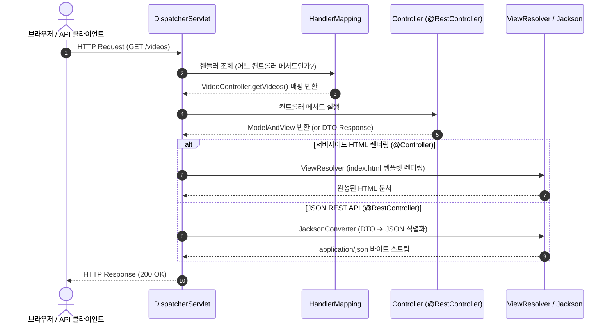

# Spring MVC 요청 수명주기와 프론트 컨트롤러 아키텍처

## 한눈에 보기
| 컴포넌트 | 핵심 역할 | 입출력 흐름 |
|----------|-----------|-------------|
| DispatcherServlet | 중앙 진입점 (프론트 컨트롤러) | HTTP Request 수신 ──▶ 적절한 컨트롤러로 라우팅 |
| HandlerMapping | 요청 URL/메서드 분석 및 매핑 | URL 경로/헤더 ──▶ 실행할 컨트롤러 메서드 반환 |
| ViewResolver / MessageConverter | 응답 포맷 변환 및 렌더링 | 컨트롤러 결과 ──▶ HTML 렌더링 또는 JSON 직렬화 |

## 1. 왜 이게 필요한가

### 이런 상황을 상상해 보자
동영상 공유 웹 사이트에서 사용자가 브라우저 주소창에 `GET /videos`를 입력하여 동영상 목록 화면을 요청했다고 하자. 

전통적인 자바 서블릿(Servlet) 방식에서는 URL 경로마다 별도의 서블릿 클래스를 만들고 `doGet()`, `doPost()` 메서드 안에서 요청 파라미터 파싱, 문자열 인코딩, 세션 검증, 예외 처리 코드를 클래스마다 중복해서 작성해야 했다.

### 여기서 뭐가 무너지나
서블릿이 50개, 100개로 늘어나면 공통 처리 로직(보안 검증, 로깅, 인코딩 변환, 공통 에러 페이지 처리)이 모든 서블릿 파일에 중복 복사되어 유지보수가 불가능해진다. 또한 요청을 처리하는 웹 계층 로직이 순수 자바 객체(POJO)가 아니라 `HttpServletRequest`, `HttpServletResponse` 같은 저수준 서블릿 API와 강하게 결합되어 단위 테스트 작성이 극도로 어려워진다.

### 그래서 나온 생각
모든 HTTP 요청을 단 하나의 중앙 관문에서 먼저 수신하고, 공통 작업을 일괄 처리한 뒤 각 비즈니스 컨트롤러로 교통정리를 해주는 "프론트 컨트롤러 패턴(Front Controller Pattern)"을 도입했다.

Spring MVC에서는 **[[디스패처-서블릿]]**(= HTTP 요청을 가장 앞에서 수신하여 컨트롤러로 분배하는 프론트 컨트롤러)이 이 역할을 전담한다. 디스패처 서블릿은 **[[핸들러-매핑]]**(= 요청 URL과 일치하는 컨트롤러 메서드를 찾아주는 라우팅 컴포넌트)을 조회하여 대상 컨트롤러를 찾아 실행하고, 컨트롤러가 반환한 데이터를 **[[뷰-리졸버]]**(= 논리적 뷰 이름을 실제 템플릿 파일로 연결하는 컴포넌트)나 HTTP 메시지 컨버터로 넘겨 최종 응답을 완성한다.

쉽게 비유하자면, 대형 종합병원의 중앙 안내 데스크와 같다. 환자(클라이언트)가 병원 건물에 들어서면 모든 과의 진료실 문을 직접 찾아 헤매는 것이 아니라, 중앙 접수처(디스패처 서블릿)에 증상을 말한다. 접수처는 컴퓨터 시스템(핸들러 매핑)을 조회하여 가장 적합한 내과 전문의(컨트롤러)에게 안내하고, 진료가 끝나면 처방전(모델)을 약국(뷰 리졸버/메시지 컨버터)으로 전달해 환자에게 약(HTML/JSON 응답)을 건넨다.

→ 비유가 깨지는 지점: 병원 안내 데스크는 환자가 물리적으로 이동해야 하지만, 디스패처 서블릿은 같은 톰캣 서블릿 컨테이너 스레드 내부에서 객체 간 메서드 호출을 통해 마이크로초(µs) 단위로 초고속 라우팅 및 렌더링을 완료한다.

## 2. 어떻게 동작하는가
1. **HTTP 요청 수신**: 클라이언트의 HTTP 요청이 들어오면 내장 서블릿 컨테이너(Tomcat)가 요청을 가로채 **[[디스패처-서블릿]]**으로 전달한다 — 모든 웹 요청의 공통 전처리를 단일 창구에서 수행하기 위해서다.
2. **핸들러 탐색 (HandlerMapping)**: 디스패처 서블릿은 등록된 **[[핸들러-매핑]]** 목록을 순회하여 `@GetMapping("/videos")` 등이 선언된 컨트롤러 메서드를 찾아낸다 — URL 경로와 HTTP 메서드에 맞는 실행 대상을 결정하기 위해서다.
3. **인터셉터 및 파라미터 바인딩**: 핸들러 어댑터가 실행 전 공통 인터셉터를 거치고, HTTP 요청 본문/쿼리 파라미터를 자바 DTO 객체로 변환하여 컨트롤러 메서드 인자로 주입한다 — 컨트롤러가 저수준 서블릿 API 없이 순수 자바 파라미터만으로 동작할 수 있게 하기 위해서다.
4. **컨트롤러 비즈니스 실행**: 컨트롤러 메서드가 실행되어 서비스 계층을 호출하고 결과를 **[[모델]]**(= 뷰에 전달할 데이터를 담는 Key-Value 바구니)에 담거나 객체 자체를 반환한다 — 화면 렌더링 또는 API 응답에 필요한 데이터를 준비하기 위해서다.
5. **응답 렌더링 및 반환**: `@Controller`인 경우 **[[뷰-리졸버]]**를 통해 HTML을 렌더링하고, **[[레스트-컨트롤러]]**(`@RestController`)인 경우 HTTP 메시지 컨버터(Jackson)를 통해 JSON으로 직렬화하여 클라이언트에 전송한다 — 클라이언트가 요구하는 응답 포맷으로 데이터를 내려주기 위해서다.

## 3. 그림으로 보기

## 4. 이 노트에 나온 용어
| 용어 | 한 줄 풀이 | 용어집 링크 |
|------|------------|-------------|
| 디스패처-서블릿 | 모든 HTTP 요청을 중앙에서 수신하여 컨트롤러로 분배하는 프론트 컨트롤러 | [[_glossary#디스패처-서블릿]] |
| 핸들러-매핑 | 요청 URL/메서드를 분석해 실행할 컨트롤러 메서드를 찾아주는 라우팅 컴포넌트 | [[_glossary#핸들러-매핑]] |
| 뷰-리졸버 | 컨트롤러가 반환한 뷰 이름을 실제 HTML 템플릿 파일로 연결하는 컴포넌트 | [[_glossary#뷰-리졸버]] |
| 모델 | 컨트롤러가 뷰 템플릿에 전달할 데이터를 담아두는 Key-Value 바구니 객체 | [[_glossary#모델]] |
| 레스트-컨트롤러 | 뷰 대신 JSON/XML 데이터 자체를 HTTP 본문으로 응답하는 컨트롤러 | [[_glossary#레스트-컨트롤러]] |

## 5. 자주 헷갈리는 것
- **`@Controller` vs `@RestController`**: `@Controller`는 반환 문자열을 뷰 이름으로 해석하여 뷰 템플릿(HTML)을 렌더링하고, `@RestController`는 `@Controller` + `@ResponseBody`의 합성어로 반환 객체를 JSON 데이터로 직렬화하여 HTTP 본문에 직접 쓴다.
- **Filter vs Interceptor**: Filter는 서블릿 컨테이너(Tomcat) 수준에서 디스패처 서블릿 앞뒤로 동작하며, Interceptor는 Spring MVC 내부 컨텍스트에서 컨트롤러 호출 직전/직후에 동작하여 스프링 빈들을 직접 활용할 수 있다.

## 6. 언제 안 쓰나 / 경계
- **대규모 비동기 논블로킹 스트리밍**: Spring MVC는 기본적으로 요청당 1개의 스레드를 할당하는 서블릿 모델(Thread-per-request)이므로, 수만 개의 동시 웹소켓 연결이나 리액티브 백프레셔 스트리밍이 필요할 때는 Spring WebFlux(`05-async-reactive`)를 검토해야 한다.

## 7. 연결
- [[02-server-side-templates-thymeleaf]] — `@Controller`가 반환한 논리적 뷰 이름을 Thymeleaf 템플릿 엔진이 렌더링하는 과정으로 이어진다.
- [[03-json-rest-api-jackson3]] — `@RestController`가 반환한 자바 객체를 Jackson 3 라이브러리가 JSON 포맷으로 직렬화하는 과정으로 이어진다.

## 8. 스스로 확인
1. 수십 개의 서블릿 대신 단 하나의 DispatcherServlet을 전면에 두는 프론트 컨트롤러 패턴의 핵심 이점은 무엇인가?
2. 클라이언트가 보낸 HTTP URL이 실제 컨트롤러의 자바 메서드와 연결되는 라우팅 메커니즘을 설명할 수 있는가?
3. `@Controller`와 `@RestController`의 반환값 처리 방식 차이는 무엇인가?

<!-- ==== 아래는 내 영역 · 스킬 수정 금지 ==== -->

## 내 설명 시도

## 막혔던 지점

## 리뷰 이력
