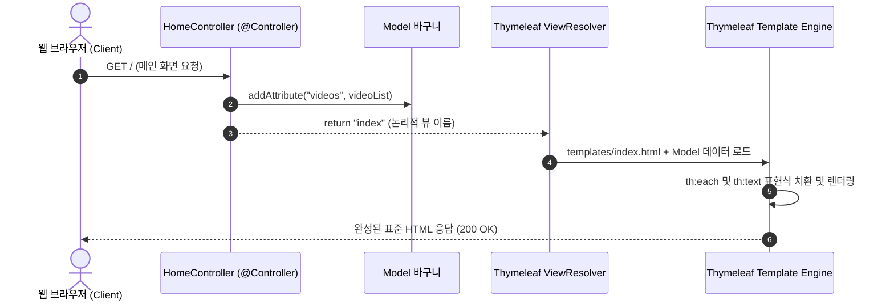

# Thymeleaf 서버사이드 템플릿과 폼 처리

## 한눈에 보기
| 개념 | 역할 | 특징 |
|------|------|------|
| Thymeleaf | HTML 기반 서버사이드 템플릿 엔진 | 내추럴 템플릿 (브라우저에서 직접 열어도 디자인 깨짐 없음) |
| Model (`org.springframework.ui.Model`) | 컨트롤러에서 뷰로 데이터 전달 | Key-Value 맵 형태로 템플릿 변수에 데이터 바인딩 |
| HTML Form Data Binding | `<form>` 입력을 자바 DTO/Record로 수신 | `@ModelAttribute`를 통해 HTTP POST 폼 필드 자동 매핑 |

## 1. 왜 이게 필요한가

### 이런 상황을 상상해 보자
동영상 관리 웹 애플리케이션에서 사용자가 등록한 동영상 목록을 화면에 보여주고, 새 동영상을 추가하는 웹 페이지를 만든다고 하자. 컨트롤러 코드를 아래와 같이 작성했다.

```java
@Controller
public class HomeController {
    private final VideoService videoService;

    public HomeController(VideoService videoService) {
        this.videoService = videoService;
    }

    @GetMapping("/")
    public String index(Model model) {
        model.addAttribute("videos", videoService.getVideos());
        return "index";
    }
}
```

그리고 서버의 `src/main/resources/templates/index.html` 파일 안에서 동적으로 데이터를 치환하여 사용자에게 HTML을 전달하려 한다.

### 여기서 뭐가 무너지나
과거 JSP(JavaServer Pages) 시절에는 HTML 코드 중간중간에 `<% for(Video v : list) { %>` 같은 자바 스크립틀릿 코드를 마구 섞어 작성했다. 이로 인해 디자이너나 프론트엔드 개발자가 HTML 파일을 브라우저로 더블 클릭해 열면 자바 태그 때문에 화면이 완전히 깨져서 디자인을 검수할 수 없었다. 또한 화면 렌더링 로직과 비즈니스 코드가 뒤섞여 스파게티 코드가 되었다.

### 그래서 나온 생각
순수 HTML 문법을 100% 준수하면서도, 서버가 실행될 때만 `th:each`, `th:text` 같은 특수 속성을 가로채어 데이터를 동적으로 꽂아 넣는 "내추럴 템플릿(Natural Template)" 방식의 **[[서버사이드-템플릿]]**(= 서버에서 HTML 표현식을 데이터로 치환하여 정적 HTML을 생성하는 템플릿 기술) 엔진 Thymeleaf를 채택했다.

컨트롤러는 비즈니스 서비스에서 꺼내온 데이터를 **[[모델]]**(= 컨트롤러가 뷰에 전달할 데이터를 담는 객체)에 담고 논리적 뷰 이름(`"index"`)만 반환하면, **[[디스패처-서블릿]]**(= 프론트 컨트롤러)과 **[[뷰-리졸버]]**(= 논리적 뷰 이름을 실제 템플릿 파일로 연결하는 컴포넌트)가 알아서 해당 HTML 파일을 찾아 완전한 웹 페이지로 변환한다.

쉽게 비유하자면, 신문사 인쇄기의 활자 판형과 같다. 기자가 작성한 기사 내용(모델 데이터)을 정해진 신문 템플릿 틀(HTML 판형)에 끼워 넣고 인쇄기를 한 번 돌려 완성된 신문지(완성된 HTML)를 독자(브라우저)의 집으로 배달하는 것이다.

→ 비유가 깨지는 지점: 신문은 인쇄되고 나면 내용이 고정되지만, Thymeleaf 템플릿은 사용자가 폼(Form)을 통해 새 데이터를 전송(POST)하면 컨트롤러가 이를 받아 DB를 갱신하고 즉시 새로운 최신 데이터를 반영한 다음 페이지를 실시간으로 다시 찍어낸다.

## 2. 어떻게 동작하는가
1. **GET 요청 수신 및 모델 적재**: 사용자가 브라우저로 페이지를 요청하면 컨트롤러 메서드가 실행되어 비즈니스 서비스로부터 데이터를 조회하고, `model.addAttribute("videos", videoList)`로 **[[모델]]**에 담는다 — 뷰 엔진이 참조할 변수 테이블을 구성하기 위해서다.
2. **논리적 뷰 이름 반환**: 컨트롤러는 `"index"` 문자열을 반환한다 — 화면을 그릴 대상 템플릿 파일의 이름을 지정하기 위해서다.
3. **뷰 리졸버의 템플릿 탐색**: **[[뷰-리졸버]]**(`ThymeleafViewResolver`)가 `src/main/resources/templates/index.html` 파일을 찾아 렌더링 파이프라인을 준비한다 — 정해진 템플릿 경로 규칙에 따라 뷰 파일을 로드하기 위해서다.
4. **HTML 동적 렌더링**: Thymeleaf 엔진은 HTML 태그의 `th:each="video : ${videos}"`와 `th:text="${video.name}"` 표현식을 평가하여 모델의 실제 데이터로 치환한다 — 클라이언트 브라우저가 표준 HTML로 해석할 수 있도록 만들기 위해서다.
5. **폼 제출 및 데이터 바인딩 (POST)**: 사용자가 `<form th:action="@{/new-video}" method="post">`로 입력값을 제출하면, 컨트롤러가 `@PostMapping` 메서드의 DTO 파라미터로 데이터를 자동 바인딩하여 비즈니스 저장을 수행한다 — 웹 브라우저의 폼 입력을 자바 객체로 손쉽게 수신하기 위해서다.

## 3. 그림으로 보기



## 4. 이 노트에 나온 용어
| 용어 | 한 줄 풀이 | 용어집 링크 |
|------|------------|-------------|
| 서버사이드-템플릿 | 서버에서 HTML 안의 표현식을 데이터로 치환해 웹 문서를 완성하는 기술 | [[_glossary#서버사이드-템플릿]] |
| 모델 | 컨트롤러가 뷰 템플릿에 넘겨줄 데이터를 담는 Key-Value 바구니 객체 | [[_glossary#모델]] |
| 뷰-리졸버 | 컨트롤러의 반환 문자열을 실제 물리적 HTML 템플릿 파일로 연결해 주는 컴포넌트 | [[_glossary#뷰-리졸버]] |
| 디스패처-서블릿 | 웹 요청을 수신해 컨트롤러와 뷰 리졸버로 조율하는 프론트 컨트롤러 | [[_glossary#디스패처-서블릿]] |
| 레스트-컨트롤러 | 뷰 템플릿을 거치지 않고 JSON 데이터를 직접 응답하는 API 전용 컨트롤러 | [[_glossary#레스트-컨트롤러]] |

## 5. 자주 헷갈리는 것
- **내추럴 템플릿(Natural Template)의 장점**: Thymeleaf는 `<span th:text="${user.name}">홍길동(미리보기)</span>`처럼 작성할 수 있어, 서버 없이 로컬 파일로 열었을 때는 디폴트 텍스트("홍길동(미리보기)")가 보이고, 서버를 띄워 렌더링하면 실제 모델 데이터로 교체된다.
- **CSRF 토큰 자동 주입**: Thymeleaf의 `th:action` 속성을 사용하여 폼을 작성하면 스프링 시큐리티의 CSRF 방어용 히든 토큰(`<input type="hidden" name="_csrf" ...>`)이 자동으로 폼 내부에 삽입된다.

## 6. 언제 안 쓰나 / 경계
- **모바일 앱이나 SPA 프론트엔드 연동**: 리액트(React)나 모바일 앱 클라이언트는 HTML 페이지 전체가 아니라 순수 JSON 데이터만 필요로 하므로, 이때는 Thymeleaf 대신 **[[레스트-컨트롤러]]**(`@RestController`)를 써야 한다.

## 7. 연결
- [[01-spring-mvc-architecture-and-controllers]] — DispatcherServlet이 컨트롤러의 모델과 뷰 이름을 받아 ThymeleafViewResolver로 넘기는 전체 흐름의 핵심 단계다.
- [[03-json-rest-api-jackson3]] — 서버사이드 HTML 렌더링 방식과 대비되는 현대적인 JSON REST API 아키텍처로 이어진다.

## 8. 스스로 확인
1. JSP와 비교할 때 Thymeleaf가 내추럴 템플릿(Natural Template)으로서 가지는 협업적 강점은 무엇인가?
2. `Model` 객체에 데이터를 담아 전달하는 메커니즘을 30초로 설명할 수 있는가?
3. 폼 데이터를 제출(POST)할 때 자바 DTO로 자동 바인딩되는 원리는 무엇인가?

<!-- ==== 아래는 내 영역 · 스킬 수정 금지 ==== -->

## 내 설명 시도

## 막혔던 지점

## 리뷰 이력
