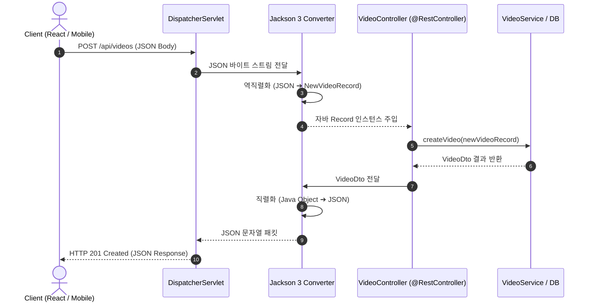

# Jackson 3 기반 JSON REST API와 응답 처리

## 한눈에 보기
| 항목 | Spring Boot 3 이전 (Jackson 2.x) | Spring Boot 4 (Jackson 3.x) | 핵심 이점 |
|------|-----------------------------------|----------------------------|-----------|
| 패키지 네임스페이스 | `com.fasterxml.jackson.databind` | `tools.jackson.databind` | 모듈화 및 차세대 Java 25 최적화 |
| Java Record 직렬화 | 기본 생성자 부재 시 커스텀 모듈 필요 | Record 및 불변 객체 1급 시민 지원 | 무설정으로 불변 DTO 직렬화/역직렬화 완벽 지원 |
| 널 안전성 지원 | 라이브러리 간 널 검증 호환성 한계 | JSpecify 표준 어노테이션 네이티브 통합 | JSON 파싱 시 누락된 필드의 널 가능성 정적 보장 |

## 1. 왜 이게 필요한가

### 이런 상황을 상상해 보자
현대적인 모바일 앱과 프론트엔드(React, Vue, iOS, Android)를 위한 동영상 API 백엔드를 구축하고 있다. 클라이언트가 `POST /api/videos`로 동영상 등록 요청을 보내면, 자바 서버가 JSON을 수신하여 저장하고 새로 생성된 동영상 정보를 반환한다.

```java
@RestController
public class ApiVideoController {
    private final VideoService videoService;

    public ApiVideoController(VideoService videoService) {
        this.videoService = videoService;
    }

    @PostMapping("/api/videos")
    public ResponseEntity<Video> createVideo(@RequestBody NewVideoRecord newVideo) {
        Video created = videoService.create(newVideo);
        return ResponseEntity.status(HttpStatus.CREATED).body(created);
    }
}
```

이때 `@RequestBody`가 자바 객체로 변환되고 반환 객체가 다시 JSON 문자열로 바뀌어 네트워크로 나가는 과정이 매끄럽게 이루어져야 한다.

### 여기서 뭐가 무너지나
서버와 클라이언트 간의 데이터 통신 규약은 서로 다른 프로그래밍 언어(Java 백엔드 vs JavaScript/TypeScript/Swift 클라이언트) 사이에서 이루어진다. 만약 자바 객체의 필드명, 날짜 형식(ISO-8601), 널(null) 필드 처리 방식이 클라이언트와 어긋나면, 런타임에 클라이언트 앱이 강제 종료되는 장애가 발생한다.

또한 과거 Jackson 2.x 체계에서는 자바 14+의 표준 불변 객체인 Record를 다룰 때나, 새로운 널 안전성(JSpecify) 규격을 적용할 때 추가적인 플러그인을 덕지덕지 붙여야 했으며 네이티브 이미지 빌드 시 리플렉션 오류가 잦았다.

### 그래서 나온 생각
Spring Boot 4에서는 자바 진영의 표준 직렬화 라이브러리의 최신 메이저 버전인 **[[잭슨]]**(= 자바 객체와 JSON 포맷 간 상호 변환을 담당하는 라이브러리, Jackson 3)을 전면 통합했다.

이를 통해 개발자는 HTML 뷰를 렌더링하지 않고 JSON 데이터 자체를 전문적으로 서빙하는 **[[레스트-컨트롤러]]**(= 뷰 대신 JSON/XML 데이터를 직접 HTTP 본문으로 응답하는 컨트롤러)를 손쉽게 구축할 수 있게 되었다.

쉽게 비유하자면, 서로 다른 언어를 쓰는 국가 간의 동시통역사와 같다. 한국어를 쓰는 한국 대표(자바 백엔드 객체)가 말한 내용을 국제 표준 공용어인 영어(JSON 데이터 포맷)로 실시간 번역하여 외국 대표(모바일/웹 클라이언트)에게 전달하고, 외국 대표가 건넨 영어를 다시 한국어로 완벽히 번역해 건네주는 것이 잭슨의 역할이다.

→ 비유가 깨지는 지점: 인간 통역사는 문맥에 따라 단어를 다르게 해석할 수 있지만, 잭슨은 자바 타입 시스템(숫자, 문자열, 불리언, 리스트, 레코드)의 필드 구조를 엄격하게 1:1로 매핑하며 데이터 타입이 맞지 않으면 즉시 `HttpMessageNotReadableException` 예외를 던져 데이터 오염을 차단한다.

## 2. 어떻게 동작하는가
1. **HTTP JSON 요청 수신**: 클라이언트가 `Content-Type: application/json` 헤더와 함께 JSON 본문을 전송하면 **[[디스패처-서블릿]]**(= 프론트 컨트롤러)이 요청을 받는다 — 올바른 REST 엔드포인트로 라우팅하기 위해서다.
2. **JSON 역직렬화 (Deserialization)**: `MappingJackson3HttpMessageConverter`가 작동하여 들어온 JSON 문자열을 바이트 단위로 읽고 자바 DTO(Record) 인스턴스로 변환한다 — 컨트롤러가 순수 자바 객체로 비즈니스 로직을 수행할 수 있게 하기 위해서다.
3. **컨트롤러 비즈니스 처리**: `@RestController` 내부의 비즈니스 메서드가 실행되어 서비스 계층을 호출하고 결과 엔티티/DTO를 생성한다 — 실제 데이터베이스 저장 및 가공을 완료하기 위해서다.
4. **JSON 직렬화 (Serialization)**: 컨트롤러가 반환한 자바 객체를 **[[잭슨]]** 3 엔진이 다시 표준 JSON 문자열(`{"id": 1, "name": "스프링 부트 4"}`)로 변환한다 — 클라이언트가 파싱할 수 있는 표준 포맷으로 인코딩하기 위해서다.
5. **HTTP 상태 코드 및 헤더 응답**: `ResponseEntity.status(HttpStatus.CREATED)`에 지정된 `201 Created` 상태 코드 및 `Content-Type: application/json` 헤더와 함께 최종 응답 패킷을 클라이언트에 전송한다 — 클라이언트가 요청 성공 여부와 데이터 형식을 정확히 인지하게 만들기 위해서다.

## 3. 그림으로 보기



## 4. 이 노트에 나온 용어
| 용어 | 한 줄 풀이 | 용어집 링크 |
|------|------------|-------------|
| 레스트-컨트롤러 | 뷰 대신 JSON/XML 데이터를 HTTP 응답 본문으로 직접 반환하는 API 컨트롤러 | [[_glossary#레스트-컨트롤러]] |
| 잭슨 | 자바 객체와 JSON 문자열 간의 직렬화/역직렬화를 담당하는 핵심 라이브러리 | [[_glossary#잭슨]] |
| 디스패처-서블릿 | 모든 HTTP 요청을 수신하여 메시지 컨버터와 컨트롤러로 연결하는 프론트 관문 | [[_glossary#디스패처-서블릿]] |
| 에이피아이-버전관리 | 클라이언트 호환성을 위해 엔드포인트를 버전별로 매핑하는 체계 | [[_glossary#에이피아이-버전관리]] |

## 5. 자주 헷갈리는 것
- **`@ResponseBody`의 생략**: `@Controller` 클래스에서는 메서드에 `@ResponseBody`를 붙여야 JSON으로 변환되지만, `@RestController`를 클래스 레벨에 붙이면 모든 메서드에 `@ResponseBody`가 기본 내장되어 생략할 수 있다.
- **`ResponseEntity`의 필요성**: 객체만 직접 반환해도 200 OK와 함께 JSON으로 나가지만, `ResponseEntity`를 사용하면 HTTP 상태 코드(201 Created, 204 No Content, 404 Not Found)와 커스텀 HTTP 헤더를 명시적으로 제어할 수 있어 실무 REST API 표준에 부합한다.

## 6. 언제 안 쓰나 / 경계
- **대용량 바이너리 파일 스트리밍**: 수 기가바이트(GB) 크기의 동영상 파일이나 고해상도 이미지를 전송할 때는 JSON으로 직렬화(Base64 인코딩)하면 용량이 33% 증가하므로, `Resource` 스트리밍이나 멀티파트(Multipart) 응답을 사용해야 한다.

## 7. 연결
- [[01-spring-mvc-architecture-and-controllers]] — DispatcherServlet이 컨트롤러의 반환 객체를 감지하여 Jackson HTTP Message Converter로 라우팅하는 흐름을 구성한다.
- [[04-native-api-versioning]] — REST API가 진화함에 따라 클라이언트 버전별로 엔드포인트를 분기하는 프레임워크 기능으로 이어진다.

## 8. 스스로 확인
1. `@RestController`에서 자바 객체가 JSON 문자열로 변환되어 클라이언트로 전송되는 구체적인 단계를 설명할 수 있는가?
2. Spring Boot 4에서 Jackson 3를 통합함으로써 얻는 Java Record 및 널 안전성 지원의 이점은 무엇인가?
3. RESTful API 설계 시 단순 객체 반환 대신 `ResponseEntity`를 사용하는 이유는 무엇인가?

<!-- ==== 아래는 내 영역 · 스킬 수정 금지 ==== -->

## 내 설명 시도

## 막혔던 지점

## 리뷰 이력
