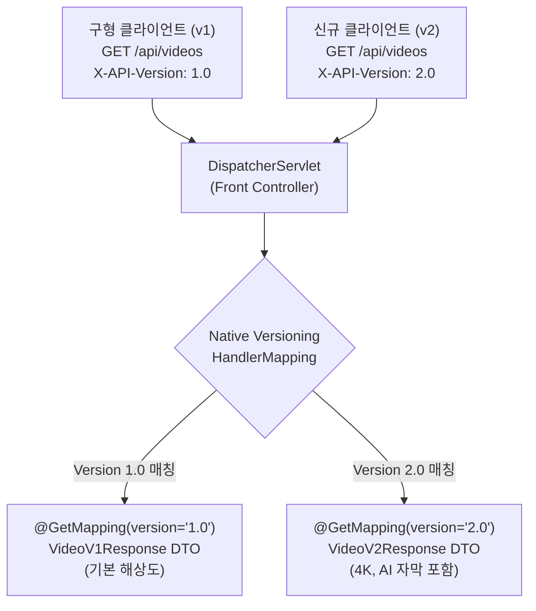

# Spring Boot 4의 네이티브 API 버전 관리

## 한눈에 보기
| 버전 관리 전략 | 예시 형식 | 장단점 및 특징 |
|----------------|-----------|----------------|
| URI Path 기반 | `GET /api/v1/videos`, `GET /api/v2/videos` | 가장 직관적이고 브라우저 캐싱이 용이하지만 URI 오염 가능 |
| Header 기반 | `X-API-Version: 2` 또는 `Accept-Version: 2.0` | 깔끔한 단일 URI 유지, RESTful 원칙에 부합하지만 테스트 도구 필요 |
| Media Type (Vendor) 기반 | `Accept: application/vnd.company.v2+json` | 콘텐츠 협상(Content Negotiation) 표준을 준수하는 고급 방식 |

## 1. 왜 이게 필요한가

### 이런 상황을 상상해 보자
출시된 지 2년 된 동영상 서비스의 백엔드 API를 운영하고 있다. 수만 명의 사용자가 구형 스마트폰 앱(v1 클라이언트)을 여전히 사용 중인데, 이번 업데이트에서 동영상 응답 포맷에 새로운 필수 필드(예: 4K 해상도 정보, AI 자막 목록)를 추가하고 기존 구조를 개선한 v2 API를 배포해야 한다.

```java
// 구형 앱을 위해 v1도 살려두고, 신규 앱을 위해 v2도 함께 제공해야 한다!
```

### 여기서 뭐가 무너지나
과거 스프링 부트 3까지는 프레임워크 차원의 내장 버전 관리 기능이 없었다. 개발자가 직접 `@RequestMapping("/api/v1/videos")`, `@RequestMapping("/api/v2/videos")`처럼 URL 문자열마다 하드코딩으로 버전 프리픽스를 덕지덕지 붙이거나, 복잡한 커스텀 인터셉터와 조건부 `RequestCondition` 클래스를 수십 줄씩 손수 구현해야 했다.

이로 인해 프로젝트 전체의 엔드포인트 URL 네이밍이 중구난방이 되고, 버전별 공통 파라미터 처리나 구버전 폐기(Deprecation) 관리가 극도로 복잡해졌다.

### 그래서 나온 생각
Spring Boot 4에서는 프레임워크 수준에서 네이티브로 엔드포인트 버전을 선언하고 라우팅할 수 있는 **[[에이피아이-버전관리]]**(= 클라이언트 하위 호환성을 유지하며 URL, 헤더 등을 기준으로 버전별 엔드포인트를 매핑하는 체계) 기능을 공식 도입했다.

개발자는 이제 `@RequestMapping`이나 `@GetMapping`에 `version` 속성을 지정하기만 하면, **[[디스패처-서블릿]]**(= 프론트 컨트롤러)과 **[[핸들러-매핑]]**(= 컨트롤러 매핑 라우터)이 들어온 요청의 버전 메타데이터를 분석하여 정확한 컨트롤러 메서드로 요청을 자동 분기해 준다.

쉽게 비유하자면, 도시의 상수도 및 전기 규격 전환과 같다. 전압을 110V에서 220V로 바꾼다고 해서 기존 110V 가전제품을 쓰는 구형 주택의 전기를 일제히 끊어버릴 수 없다. 변전소(디스패처 서블릿)에서 요청하는 전압 규격(API 버전 헤더/URL)에 맞춰 110V 라인(v1 컨트롤러)과 220V 라인(v2 컨트롤러)으로 전류를 각각 안전하게 공급하는 것이다.

→ 비유가 깨지는 지점: 전압 변환은 물리적 변압기 장비 비용이 들지만, 스프링 부트 4의 네이티브 API 버전 관리는 단일 애플리케이션 메모리 안에서 가벼운 어노테이션 속성 매핑만으로 수십 개의 버전을 무비용으로 동시 서빙한다.

## 2. 어떻게 동작하는가
1. **버전 관리 전략 설정**: `application.yml`에 `spring.mvc.api-versioning.strategy=header` 또는 `path`로 버전 파싱 방식을 지정한다 — 프로젝트 전체의 버전 식별 기준을 통일하기 위해서다.
2. **컨트롤러 메서드에 버전 명시**: 개발자는 `@GetMapping(path = "/api/videos", version = "1.0")`과 `@GetMapping(path = "/api/videos", version = "2.0")`으로 메서드를 분기 선언한다 — 버전별 비즈니스 DTO 반환 로직을 깔끔하게 격리하기 위해서다.
3. **요청 수신 및 버전 추출**: 클라이언트가 요청을 보내면 **[[디스패처-서블릿]]**이 헤더(`X-API-Version: 2.0`) 또는 URL 경로에서 버전 토큰을 추출한다 — 클라이언트가 의도한 API 버전을 파악하기 위해서다.
4. **핸들러 매핑 버전 매칭**: **[[핸들러-매핑]]**이 URL 경로와 함께 버전 조건을 교차 검증하여 `version = "2.0"`이 선언된 **[[레스트-컨트롤러]]** 메서드를 최종 호출한다 — 구형 클라이언트와 신형 클라이언트를 정확히 분리 실행하기 위해서다.
5. **폐기(Deprecation) 헤더 자동 반환**: 오래된 v1 엔드포인트로 요청이 들어온 경우, 프레임워크가 응답 헤더에 `Deprecation: @true` 및 `Sunset: 2027-01-01` 표준 헤더를 자동으로 실어 보낸다 — 클라이언트 개발자에게 점진적 업그레이드를 안내하기 위해서다.

## 3. 그림으로 보기



## 4. 이 노트에 나온 용어
| 용어 | 한 줄 풀이 | 용어집 링크 |
|------|------------|-------------|
| 에이피아이-버전관리 | 클라이언트 하위 호환성을 유지하며 버전별 엔드포인트를 분기하는 프레임워크 체계 | [[_glossary#에이피아이-버전관리]] |
| 레스트-컨트롤러 | JSON 데이터를 직접 응답하는 REST API 컨트롤러 | [[_glossary#레스트-컨트롤러]] |
| 디스패처-서블릿 | 요청을 가로채어 버전 정보와 매핑 조건을 조율하는 프론트 관문 | [[_glossary#디스패처-서블릿]] |
| 핸들러-매핑 | 요청의 URL과 버전 조건을 분석해 실행할 메서드를 찾아주는 컴포넌트 | [[_glossary#핸들러-매핑]] |

## 5. 자주 헷갈리는 것
- **시맨틱 버저닝(SemVer) 해석**: Spring Boot 4의 버전 매핑은 단순 문자열 비교뿐만 아니라 `version = "2.x"`처럼 범위 매칭을 지원하여, 마이너 버전 업데이트 시 클라이언트 요청을 유연하게 수용할 수 있다.
- **기본 버전(Default Version) Fallback**: 클라이언트가 명시적으로 버전 헤더를 보내지 않았을 때 어떤 버전으로 기본 라우팅할지(`default-version: "1.0"`) 설정하여 구형 시스템과의 완벽한 하위 호환을 보장할 수 있다.

## 6. 언제 안 쓰나 / 경계
- **GraphQL 또는 단일 스키마 시스템**: GraphQL처럼 클라이언트가 필요한 필드를 직접 쿼리로 명시하는 API 구조에서는 엔드포인트 버전 관리가 불필요하며, 스키마 레벨의 `@deprecated` 필드 디렉티브를 활용하는 것이 표준이다.

## 7. 연결
- [[01-spring-mvc-architecture-and-controllers]] — DispatcherServlet의 HandlerMapping이 URL 외에 Version 조건까지 함께 검사하는 고도화된 라우팅 체계다.
- [[03-json-rest-api-jackson3]] — 버전별로 서로 다른 Jackson 3 DTO 레코드를 독립적으로 설계하여 응답하는 기반이 된다.

## 8. 스스로 확인
1. Spring Boot 4에서 네이티브 API 버전 관리가 도입됨으로써 사라진 과거의 번거로운 보일러플레이트 코드는 무엇인가?
2. URI 경로 방식(Path)과 HTTP 헤더 방식(Header) API 버전 관리의 장단점을 비교 설명할 수 있는가?
3. 구형 클라이언트를 중단시키지 않고 신규 기능이 추가된 API를 안전하게 배포하는 라이프사이클 관리 전략은 무엇인가?

<!-- ==== 아래는 내 영역 · 스킬 수정 금지 ==== -->

## 내 설명 시도

## 막혔던 지점

## 리뷰 이력
